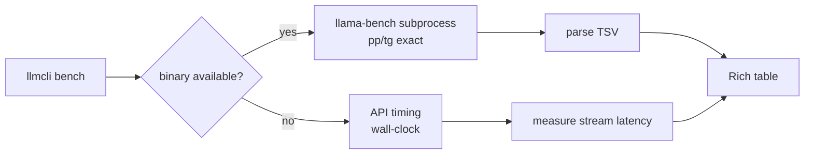

## Source

> "llmcli bench command — local benchmark for llamacpp + vllm engines. Metrics: pp t/s, tg t/s, TTFT, VRAM peak. Context sweep across KV depths."

## Problem

No built-in way to measure model/config performance in llmCLI. Manual correlation of llama-bench + nvidia-smi + vllm output is error-prone. No context sweep, no cross-engine comparison.

## Outcome

`llmcli bench [model] [options]` runs a benchmark and prints a Rich table with: pp t/s, tg t/s, TTFT (ms), VRAM peak (GiB), across N runs and optionally multiple context depths. Works without any additional binary installs beyond what's already present.

## Appetite

1 week cycle (F-full, new module + engine wrappers + tests).

## Key Findings (codebase exploration)

| Finding | Impact |
|---------|--------|
| `llama-bench` **NOT installed** in `~/.local/bin/` (only `llama-server`, `llama-server-tq3`) | Shape 2 requires extra install step |
| `vllm` **NOT on PATH** (requires `uv sync --group vllm` + `uv run vllm`) | Shape 2 vllm path needs activation guard |
| `gpu.py` has `probe_free_vram_gib()` via pynvml + nvidia-smi fallback | VRAM peak reusable directly |
| `LlamaCppEngine._gguf_path()` resolves HF hub cache | Reusable for bench binary/model path logic |
| `LlamaCppTQ3Engine` subclasses `LlamaCppEngine`, only overrides `binary` | Bench wrapper can mirror same pattern |
| CLI split into `cli/` subpackage (one file per command group) | `cli/bench.py` is the natural home |
| `engines/vllm.py` uses `shutil.which("vllm")` guard | Bench should mirror same guard |

## Shapes

### Shape 1: API-based (OpenAI endpoint timing)

Start engine via existing `Engine.start()`, send timed OpenAI streaming requests, measure TTFT + tok/s from wall-clock. Poll `probe_free_vram_gib()` in a background thread for VRAM peak. For context sweep: send prompts of known token count at each depth.

```
llmcli bench qwen3_6-35b-a3b-tq3 --pp 512 --tg 128 --depth 0,4096,8192 --runs 3
  → engine.start(spec)
  → for each depth: POST /v1/completions (stream=True), time first chunk = TTFT
  → thread: poll pynvml every 200ms → peak VRAM
  → engine.stop(instance)
  → Rich table
```

**Trade-offs:**
- Pro: zero new binary dependencies — works today with current install
- Pro: uniform path for llamacpp + vllm (both serve OpenAI API)
- Pro: reuses `Engine` protocol and `gpu.py` directly
- Pro: measures real-world client latency (matches lyra/claude-code consumer perspective)
- Con: wall-clock includes HTTP stack overhead (~1–5ms) — not engine-internal t/s
- Con: startup/shutdown overhead per bench run (mitigated: start once, run N prompts)
- Con: context sweep requires prompts of known token count — resolved via synthetic prompt: repeat `"a "` × depth (≈1 token/word for all tokenizers); no model tokenizer dependency

**Rough scope:** M

### Shape 2: Subprocess binary (llama-bench + vllm bench latency)

Call `llama-bench` binary directly with `-p`, `-n`, `-d`, `-ngl` flags. Parse TSV/markdown output. For vllm: call `vllm bench latency` subprocess.

```
llmcli bench qwen3_6-35b-a3b-tq3 --pp 512 --tg 128 --depth 0,4096
  → resolve llama-bench binary (sibling of llama-server, or $LLMCLI_BENCH_BINARY)
  → subprocess.run(["llama-bench", "-m", gguf_path, "-p", "512", "-n", "128", "-d", "0,4096"])
  → parse stdout TSV → extract pp t/s, tg t/s per depth
  → VRAM: poll pynvml during subprocess
```

**Trade-offs:**
- Pro: most accurate engine-internal metrics (no HTTP overhead)
- Pro: native context sweep via `-d` flag — exact semantics
- Pro: `llama-bench` output is structured (TSV/markdown), easy to parse
- Con: `llama-bench` **not currently installed** — requires separate build/install
- Con: TQ3 fork may or may not ship `llama-bench-tq3` (unknown — not on disk)
- Con: `vllm bench latency` requires vllm activated env + different output format to parse
- Con: two different output formats to maintain

**Rough scope:** L (+ prerequisite: document llama-bench install)

### Shape 3: Hybrid (Shape 2 primary, Shape 1 fallback)

Use `llama-bench` subprocess when available; fall back to API-based timing when binary absent. Best accuracy when binary is installed, still works otherwise.

**Trade-offs:**
- Pro: covers both scenarios
- Con: two code paths to maintain + test
- Con: inconsistent metrics between fallback and primary (user may not notice)

**Rough scope:** XL

## Fit Check



**Recommended: Shape 1 (API-based)**

Shape 2 is more accurate but blocked on `llama-bench` installation — a prerequisite that isn't documented and whose TQ3 availability is unknown. Shape 1 works immediately with the current install and measures the same latency that lyra and claude-code consumers actually experience.

Shape 2 can be added later as `--mode native` once llama-bench installation is sorted (separate issue). Shape 3 is premature complexity.

**Eliminated shapes:**
- Shape 2 as primary: blocked by missing binary, unknown TQ3 bench binary
- Shape 3: premature — introduce when Shape 2 is ready

## Open Questions Resolved

| Question | Resolution |
|----------|------------|
| Context sweep token count | Synthetic prompt: repeat `"a "` × depth — ≈1 token/word, no tokenizer dep |
| Daemon state on engine start/stop | Call engine directly (bypass daemon), mark bench as daemon-unregistered — no SHUTDOWN sent to daemon |
| pynvml polling thread-safety | VRAM sampler holds a single `nvmlInit()` open for its lifetime; does NOT reuse `probe_free_vram_gib()` — inline sampler loop with single handle |
| 3-file subpackage vs flat | Start flat: all bench logic in `cli/bench.py`; extract `bench/` subpackage only when Shape 2 (native binary) lands |

## Files Impacted

| File | Change |
|------|--------|
| `src/llmcli/cli/bench.py` | New — Typer command + BenchResult dataclass + VRAM sampler + Rich table (flat, no subpackage) |
| `src/llmcli/gpu.py` | Add `nvml_handle()` context manager for thread-safe polling |
| `src/llmcli/cli/__init__.py` | Import bench command |
| `tests/test_bench.py` | New — unit tests (mocked httpx + pynvml) |
