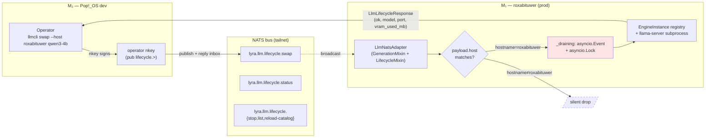

## Source

> Goal — Collapse llmCLI's two control planes — NATS for inference + AF_UNIX socket for lifecycle — into a single NATS-native worker per GPU host. Delete `src/llmcli/daemon.py` and the host socket; move `EngineInstance` registry and `llama-server` subprocess management into the existing quadlet worker as a `LifecycleMixin` next to `GenerationMixin`.
> — Issue #34, body (2026-05-09)

Frame: [`artifacts/frames/34-nats-lifecycle-fold-frame.mdx`](../frames/34-nats-lifecycle-fold-frame.mdx) approved 2026-05-21.
Consensus: [`artifacts/analyses/34-nats-lifecycle-fold-consensus.mdx`](34-nats-lifecycle-fold-consensus.mdx) — appetite 4-5d, defer `--fleet` to v2, inline NATS in CLI.

## Outcome

`LlmNatsAdapter` exposes 5 lifecycle ops via NATS (broadcast subjects + application-layer host filter — **Shape A**, mirrors clipool precedent). An operator on M₂ can target M₁ specifically (`swap --host roxabituwer X`). `daemon.py` + AF_UNIX socket no longer exist on disk after the cutover PR slice. No SDK breakage in `roxabi-nats`. Migration: one feature-flag env var → flip → delete.

`--fleet` reply aggregation is **deferred to a v2 child issue** (per consensus DP1 hybrid) to keep the cutover-PR critical path lean.

## Problem

→ See frame §Problem and §Constraints C1-C8.

Tl;dr — two control planes per host (NATS data + AF_UNIX lifecycle) → location asymmetry, two deploy patterns, two auth/observability surfaces. ADR-004 already locked Option C (fold). This analysis picks the NATS routing topology *inside* the fold.

## Appetite

**4-5 working days** (per consensus reconciliation — frame's 3d was optimistic; non-compressible serial frictions push to 4-5d):

| Slice | Effort | Files touched |
|---|---|---|
| 0 — Operator nkey provisioning (named deliverable per PL1) | 0.5 d | `~/projects/lyra/deploy/nats/auth.conf` regen via `lyra-acl genkeys` + `acl-matrix.json` audit; M₁ nats-server reload + M₂ nkey distribution |
| 1 — `roxabi-contracts.llm` (subjects + models + error codes) | 0.5-1 d | `subjects.py`, `models.py`, `errors.py`, `__init__.py` in `~/projects/lyra/packages/roxabi-contracts/`. PR merged on `Roxabi/lyra:staging` *first*; ordering enforced via merge-checklist (D3). |
| 2 — `LifecycleMixin` in `src/llmcli/nats/_lifecycle.py` | 1.0 d | new file (~250 LOC, fits 300-LOC quality gate) + `llm_adapter.py` MRO update + `nats/__init__.py` re-export. Drain pattern: `_draining: asyncio.Event` (per A2 review). MRO composition: `super()._extra_subjects()` + `super().heartbeat_payload()` (per A3 review). |
| 3 — CLI rewire (5 commands + `--host` flag) | 0.75 d | `cli/swap.py`, `cli/lifecycle.py` (status/stop/list/reload-catalog). **Inline NATS publish/reply** in each command (~20 LOC each, per consensus DP2). No new `cli/_nats_client.py`. |
| 4 — Quadlet update + `wait_ready=False` (C2 bundle) | 0.5 d | `deploy/quadlet/llmcli-nats-worker.container` — verify `Exec=llm` and `HealthCmd=pgrep -f "llmcli nats-serve"` align (D2 review); remove commented daemon-socket bind-mount. `worker.env` gains `LLMCLI_LIFECYCLE_VIA_NATS=1`. |
| 5 — Tests + docs | 0.75-1.0 d | New `tests/nats/test_lifecycle_*.py` (per-op + host filter + error codes) gated by **`@pytest.mark.nats` marker + `nats:latest` service container in `ci.yml`** (per D5 review). ADR-004 status → Accepted. `CLAUDE.md` Consumers + CLI tables refreshed. |
| 6 — **Cutover PR** (named deliverable per PL2) | 0.5 d | Flip `LLMCLI_LIFECYCLE_VIA_NATS=1` default; **delete `src/llmcli/daemon.py`** + tests + AF_UNIX socket constants + env var. ADR-004 status note. |

**v2 follow-up child issue** (filed at `/spec` time, separate appetite ~2d): `--fleet` flag + reply aggregation + extract `cli/_nats_client.py` when ≥2 use sites materialize.

## Shapes

Three mutually exclusive routing topologies for the in-fold lifecycle subjects. All assume Option C (fold into worker) is locked. **Shape A is the recommendation** (see Fit Check).

### Shape A — Broadcast + application-layer filter (clipool pattern) ← recommended

Single subject per op, broadcast to every worker via `_extra_subjects()`. Payload includes a `host` field. Each worker filters in `handle()`: matches → respond; else → silently ignore.

```python
# src/llmcli/nats/_lifecycle.py
LIFECYCLE_SUBJECTS = (
    "lyra.llm.lifecycle.swap",
    "lyra.llm.lifecycle.stop",
    "lyra.llm.lifecycle.status",
    "lyra.llm.lifecycle.list",
    "lyra.llm.lifecycle.reload-catalog",
)

class LifecycleMixin:
    # MRO-safe composition (per A3 review): always extend super's list.
    def _extra_subjects(self) -> list[str]:
        return [*LIFECYCLE_SUBJECTS, *super()._extra_subjects()]

    def heartbeat_payload(self) -> dict:
        base = super().heartbeat_payload()
        base["lifecycle_draining"] = self._draining.is_set()
        return base

    async def handle_lifecycle(self, msg, payload: dict) -> None:
        # Target filter: '*', missing, or matching hostname → act; else drop
        host = payload.get("host")
        if host not in (None, "*", socket.gethostname()):
            return
        op = msg.subject.rsplit(".", 1)[1]
        await self._dispatch_lifecycle_op(op, msg, payload)
```

**Drain semantics (per A2 review):** Single `asyncio.Event` named `_draining`. Cleared normally. On swap start: set → wait until `_sem._value == max_concurrent` (all slots free) or `drain_timeout` → execute swap → clear. New generations in `handle()` check `_draining.is_set()` *before* acquiring `_sem`; the check-then-acquire is atomic in the single-threaded asyncio loop (no `await` between them). Rejected generations return `worker.capacity` retryable.

| Pros | Cons |
|---|---|
| Mirrors `CliPoolNatsWorker` precedent in lyra (`clipool_worker.py:34, 145-152`) — same shape, proven | Every worker JSON-parses every lifecycle message (cost: sub-ms × ~10-100/day = negligible) |
| Zero SDK change to `roxabi-nats` | Target filter is application-layer (malformed `host` could match every worker) — mitigated by strict Pydantic validator on `LifecycleRequest.host` (NATS subject token charset) |
| Operator UX uses human hostname (`socket.gethostname()`) — no PID-bound `worker_id` leakage into the CLI surface | Atomicity is application-level (single worker process per host + `asyncio.Lock` in `LifecycleMixin` = same guarantee as today's AF_UNIX daemon) |
| One subject per op (5 subscriptions total) | — |
| `--fleet` ops (deferred to v2) trivially served by the same broadcast (caller aggregates inbox replies with timeout) | — |

**Rough scope:** **M** (~250 LOC mixin + 5 CLI cmds + 5 subjects + 2 contract models + tests).

### Shape B — Per-worker-targeted subjects (adapter_base docstring pattern)

Per-worker subjects via `_extra_subjects()`. Operator must know the `worker_id` (or a stable host-derived token). NATS routes natively; no application-layer filtering.

```python
class LifecycleMixin:
    def _extra_subjects(self) -> list[str]:
        wid = self._worker_id_token  # stable host-based token (no PID)
        return [
            f"lyra.llm.lifecycle.swap.{wid}",
            f"lyra.llm.lifecycle.stop.{wid}",
            f"lyra.llm.lifecycle.status.{wid}",
            f"lyra.llm.lifecycle.list.{wid}",
            f"lyra.llm.lifecycle.reload-catalog.{wid}",
        ]
```

| Pros | Cons |
|---|---|
| NATS-layer routing — zero parse cost on non-target workers | Two patterns to maintain: per-worker + (separately) wildcard subscription for fleet ops. Caller must know which to publish on. |
| — | `worker_id` exposure: default `_worker_id = f"{queue_group}-{hostname}-{pid}"` is PID-bound; needs a new stable derivation convention layered on `NatsAdapterBase` |
| — | ~10 subscriptions per worker if wildcard fleet support is added (5 + 5). Contract surface bloats. |
| — | **No precedent in lyra codebase** — docstring exists; no live consumer uses this pattern. `CliPoolNatsWorker` chose Shape A. |

**Rough scope:** **M+** (slightly more glue for the wildcard/fleet path).

### Shape C — Dedicated queue group of 1 via SDK extension

PR `roxabi-nats` to expose `_extra_subjects_with_queue()`. Subscribe lifecycle subject with a queue group named `f"llm-lifecycle-{worker_id}"` — unique per worker → effective queue-of-1 → NATS-level mutex on the lifecycle path.

| Pros | Cons |
|---|---|
| NATS-native atomicity; no application lock | Cross-repo PR required to `Roxabi/lyra:packages/roxabi-nats`; adds API surface to a shared SDK consumed by ≥4 other adapters |
| Cleanly separates inference queue (`llm-workers`) from lifecycle queue per worker | Solves a problem we don't have: one worker process per GPU host → in-process `asyncio.Lock` gives the same guarantee. "Queue-group-of-1" only matters with multi-worker-per-host racing on lifecycle ops, which the quadlet `Restart=on-failure` + single-replica deploy forbids. |
| — | Higher coordination cost (SDK version bump → llmCLI bump → hub-side compat test) |
| — | Future cost: new base-class extension point becomes load-bearing for every adapter that ever wants per-instance state-changing ops |

**Rough scope:** **L** (SDK PR + version bump + llmCLI + tests across both repos).

## Files Impacted (Shape A — post-consensus)

| Layer | File | Status | Δ LOC |
|---|---|---|---|
| Contracts | `~/projects/lyra/packages/roxabi-contracts/src/roxabi_contracts/llm/subjects.py` | Modify | +6 |
| Contracts | `~/projects/lyra/packages/roxabi-contracts/src/roxabi_contracts/llm/models.py` | Modify | +60 (LifecycleRequest/Response + per-op payloads) |
| Contracts | `~/projects/lyra/packages/roxabi-contracts/src/roxabi_contracts/llm/__init__.py` | Modify | +6 (re-exports) |
| Contracts | `~/projects/lyra/packages/roxabi-contracts/src/roxabi_contracts/errors.py` | Modify | +1 (`llm.lifecycle_rejected`) |
| Deploy/NATS | `~/projects/lyra/deploy/nats/auth.conf` (via `lyra-acl genkeys`) + `acl-matrix.json` audit | Modify | +1 operator nkey entry, +grants on worker nkey for `sub lyra.llm.lifecycle.>` |
| Worker | `src/llmcli/nats/_lifecycle.py` | **NEW** | +250 |
| Worker | `src/llmcli/nats/llm_adapter.py` | Modify | +20 / −10 (MRO change, `wait_ready=False`, `_extra_subjects` super-composition, route dispatch) |
| Worker | `src/llmcli/nats/__init__.py` | Modify | +2 (re-export) |
| CLI | `src/llmcli/cli/swap.py` | Modify | +30 / −5 (inline NATS publish/reply, `--host` flag) |
| CLI | `src/llmcli/cli/lifecycle.py` | Modify | +60 / −15 (inline NATS publish/reply for status/stop/list/reload-catalog, `--host` flag) |
| Deploy | `deploy/quadlet/llmcli-nats-worker.container` | Modify | −5 (remove commented daemon-socket mount) + verify Exec/HealthCmd alignment (D2) |
| CI | `.github/workflows/ci.yml` | Modify | +6 (add `nats:latest` service container for `pytest -m nats`) |
| CI | `tests/nats/conftest.py` | Modify | +10 (`nats` pytest marker registration + skipif-no-broker gate) |
| Cutover slice | `src/llmcli/daemon.py` | **DELETE (Slice 6)** | −265 |
| Cutover slice | `tests/test_daemon.py` and friends | **DELETE (Slice 6)** | −400 (est.) |
| Cutover slice | `LLMCLI_LIFECYCLE_VIA_NATS` env in `worker.env` | **DELETE (Slice 6)** | −1 |
| Docs | `docs/architecture/adr/004-lifecycle-control-plane-nats-over-af-unix.mdx` | Modify | status → Accepted |
| Docs | `CLAUDE.md` | Modify | Update Consumers + CLI Commands tables |
| Tests | `tests/nats/test_lifecycle_*.py` | **NEW** | +500 (per-op, host filter, error codes, drain timing — marker-gated) |

**v2 child issue (separate ticket, deferred per consensus):** `cli/_nats_client.py` (~120 LOC) + `--fleet` flag + reply aggregation across N workers with timeout.

## Open Questions resolution (carried from frame)

| ID | Question | Resolution | Why |
|---|---|---|---|
| O1 | Swap atomicity routing | **Shape A — broadcast + filter** | clipool precedent; no SDK change; operator UX uses hostname; per-host single worker process → `asyncio.Event` + `asyncio.Lock` suffices |
| O2 | Auth: separate operator nkey vs reuse worker | **Separate operator nkey** | NATS ACLs are subject-prefix based; grant `pub lyra.llm.lifecycle.>` to operator nkey only; worker nkey gets `sub lyra.llm.lifecycle.>`. Worker keeps existing `_inbox.hub.>` (per `acl-matrix.json:128-131`); operator nkey gets its own `_inbox.<operator>.>` prefix. Provisioned via `lyra-acl genkeys` (manual `auth.conf` forbidden). Slice 0. |
| O3 | Hot-swap mid-stream | **Drain via `asyncio.Event` with timeout** | `_draining: asyncio.Event` (per A2). On swap: set → wait until `_sem._value == max_concurrent` or `drain_timeout=30s` → execute swap → clear. New generations check flag pre-`_sem.acquire`; safe under single-threaded asyncio (no `await` between check and acquire). `asyncio.Lock` rejected: blocks the swap coroutine on itself. |
| O4 | Migration cutover | **Feature flag (single env var) + named cutover PR** | Two PRs: (1) ship both paths behind `LLMCLI_LIFECYCLE_VIA_NATS=1` in `worker.env`; (2) **Slice 6** named cutover PR flips default + deletes `daemon.py` + flag + tests. Cheap rollback during window 1. Cutover PR is a named deliverable per PL2, not a risk-table footnote. |
| O5 | reload-catalog scope | **Broadcast** | Catalog file is per-host; broadcast means "your TOML may have changed, re-read." No targeting overhead worth modeling. |

## Fit Check

**Recommended: Shape A.**

**Why A over B:**
- clipool sets the production precedent in lyra (`~/projects/lyra/src/lyra/adapters/clipool/clipool_worker.py:34, 145-152`) — same shape.
- B introduces two contract surfaces (per-worker + wildcard) where A has one.
- B's operator UX needs a stable `worker_id` derivation that doesn't exist in `NatsAdapterBase` today (PID is in the default). A uses `socket.gethostname()` which is stable + human.

**Why A over C:**
- C solves a problem we don't have (multi-worker-per-host race), pays for it with cross-repo coordination + API bloat on a shared SDK.
- `asyncio.Lock` in `LifecycleMixin` is sufficient because the quadlet deploys exactly one worker process per host.
- C remains a future option if multi-worker-per-host becomes a real requirement; nothing in A precludes adding queue-grouped extras later.

**Eliminations:**

| Shape | Rejected because |
|---|---|
| B | Production precedent (clipool) outweighs docstring alignment; two contract surfaces vs A's one; PID-bound `worker_id` leak |
| C | Cross-repo PR + new SDK surface for theoretical atomicity that the deploy topology already provides for free |

## Data flow (Shape A)



Inference plane (`lyra.llm.generate.request`) is unchanged; both subscribed by the same `LlmNatsAdapter` instance.

## Risks & Mitigations

| Risk | Likelihood | Impact | Mitigation |
|---|---|---|---|
| Worker nkey ACL drift — operator nkey missing `pub` grant on lifecycle.> | Medium | High (ops can't swap) | Slice 0 named deliverable: regenerate via `lyra-acl genkeys`; `nats-server.conf` PR co-merged. Verify with `nats sub` on M₂ before Slice 1 unblocks. |
| `wait_ready=True` (current default in llmCLI) still in adapter after merge | Medium | High (worker boot probes JetStream KV without grant → boot loop) | Hardcoded `wait_ready=False` in Slice 2 alongside `LifecycleMixin` integration; tested. |
| Drain pattern race — generation enters `_sem` after `_draining=True` set | Low | Medium (request hits dead engine) | `_draining.is_set()` check immediately precedes `_sem.acquire()` in `handle()`; safe under single-threaded asyncio (per A2). Unit-test with timing assertions. |
| Subject naming churn — `lifecycle.reload-catalog` uses hyphen; NATS allows but some tooling prefers underscores | Low | Low | Match issue body verbatim; comment in `subjects.py`. |
| Cross-repo PR ordering: contracts → llmCLI; `uv.lock` SHA mismatch breaks CI | Medium | High (CI red) | Merge-checklist in `/spec` (per D3): contracts PR merged on `Roxabi/lyra:staging` *before* llmCLI PR's `uv.lock` is bumped. Rollback: revert llmCLI PR (contracts PR is additive, harmless). |
| Quadlet `Exec=llm` and `HealthCmd=pgrep -f "llmcli nats-serve"` mismatch (D2) | Medium | High (M₁ restart loop after flag flip) | Slice 4 verifies + aligns. Cutover PR (Slice 6) gates on D2 being fixed. |
| CI lacks NATS broker; lifecycle integration tests use MagicMock today | Medium | Medium (false-green CI) | Slice 5: add `nats:latest` service container to `ci.yml`; `@pytest.mark.nats` marker + skipif-no-broker gate. |
| Cutover PR slips beyond 2-week SLA (failure mode F1) | Medium | High (premise invalidated) | Slice 6 named in this analysis; v2 follow-up child issue created at `/spec` time; cutover PR has P1 label + 2-week SLA tracked in issue body. |

## Adjacent / non-decisions captured

- `llmcli chat` keeps OpenAI-direct path; no NATS subject for one-shot chats.
- `llmcli register-proxy` still emits the `# --- llmCLI managed block ---` in `~/.litellm/config.yaml`. Unrelated to lifecycle.
- `llmcli` proxy quadlet (`:18091`) and `litellm` `:4000` supervisor both untouched.
- `wait_ready=False` migration bundled into Slice 2 (per C2).
- Per-host `worker.env` (`EnvironmentFile=%h/.roxabi/llmcli/worker.env`) gains `LLMCLI_LIFECYCLE_VIA_NATS=1` during Slice 4; removed in Slice 6.
- `--fleet` flag and `cli/_nats_client.py` extraction explicitly deferred to v2 follow-up child issue per consensus.

## Pre-`/spec` checklist

- [x] Frame approved
- [x] Drift recheck: confirmatory only
- [x] Roxabi SDK + lyra code surfaces mapped
- [x] 4-reviewer pass → critical fixes accepted (A2, A3, D1, D2, D5, PL1, PL2, DW1-5)
- [x] Consensus reached on DP1 (4-5d hybrid) + DP2 (inline)
- [x] v1 scope locked: 5 ops + flag + cutover PR slice; no `--fleet`, no `_nats_client.py`
- [ ] `/spec` writes acceptance criteria + slice breakdown
- [ ] `/spec` files v2 child issue via `/issue-triage`
