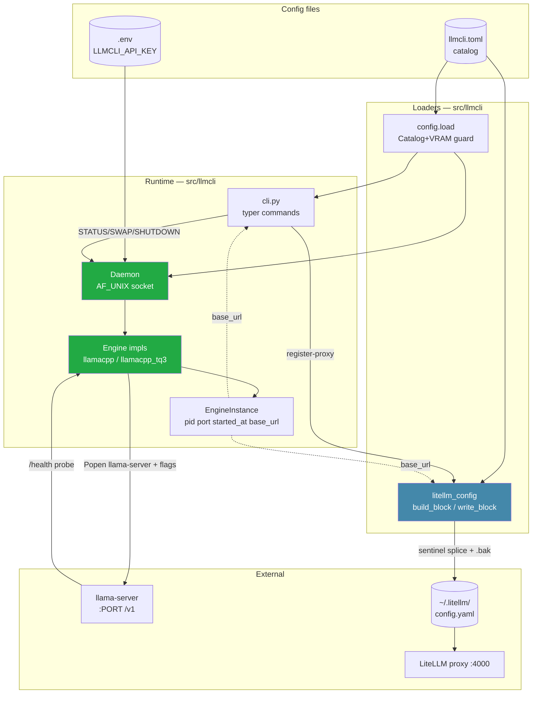
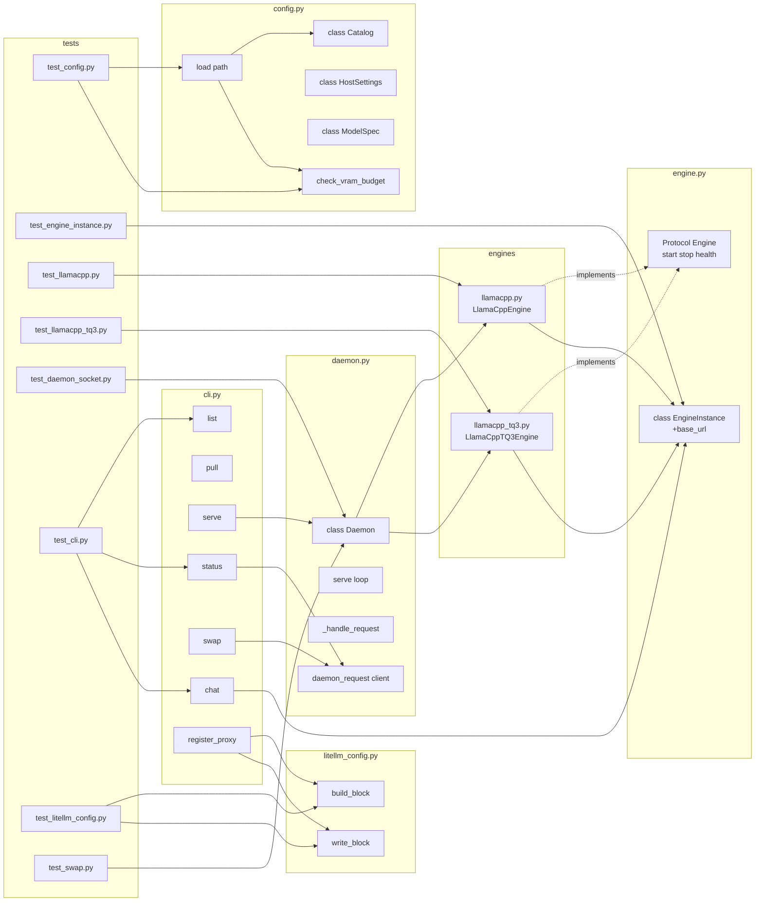

## Summary

Turn the P1 scaffold into a functioning llmCLI v1: implement the daemon, engines, CLI, LiteLLM proxy registration, claude-code aliases, prod deploy path, hot-swap, and lyra wire-up. Six vertical slices mapping 1:1 to analysis phases P2–P6 (+ P2.5). Total 35 micro-tasks across backend-dev, devops, doc-writer, tester, and security-auditor agents.

## Architecture

### Data flow



### File × Function map



## Bootstrap Context

**Reference patterns** (read before implementing):
- `~/projects/voiceCLI/src/voicecli/daemon.py` — AF_UNIX server + `daemon_request` client pattern (adapt: JSON-lines → simpler plaintext line protocol per spec S1).
- `~/projects/voiceCLI/supervisor/scripts/run_tts.sh` — supervisor wrapper; extend with `/health` readiness loop per **C4**.
- `~/projects/voiceCLI/tests/conftest.py` — pytest fixture + registry patch pattern for engine tests.
- `~/projects/lyra/scripts/deploy.sh` — existing voiceCLI sync block; V4 adds parallel llmCLI block per **C7**.

**Existing scaffold** (commit `ac346e2` + `585c362`):
- All modules exist as `NotImplementedError` stubs in `src/llmcli/{config,engine,daemon,cli,litellm_config}.py` and `engines/llamacpp*.py`.
- `supervisor/conf.d/llmcli_serve.conf` exists with `autostart=false`, `autorestart=true`, `startsecs=20`.
- `llmcli.example.toml` has host + two model entries.
- `Makefile` has `register`, `llm`, `install`, `lint`, `test` targets wired to hub.
- **C9** refactor pending: `engine.py:23-25` has `base_url` on `Engine` Protocol → move to `EngineInstance`.

**Constraints encoded as RED-GATE sentinels:**
- C1 (byte-identical outside block) → T2.1 RED test
- C4 (readiness probe) → T1.13 DEVOPS task
- C8 (pytest markers no_gpu/gpu, `SKIP_GPU_TESTS=1`) → T1.14
- C9 (base_url on EngineInstance) → T1.2 RED test, T1.7 refactor
- C10 (catalog port is canonical) → T1.1 test

## Agents

| Agent | Task count | Files owned |
|---|---|---|
| backend-dev | 13 | `src/llmcli/{config,engine,daemon,cli,litellm_config}.py`, `engines/*.py` |
| devops | 6 | `supervisor/scripts/run_serve.sh`, `pyproject.toml`, `Makefile`, `docs/guides/deployment.md` (with doc-writer) |
| doc-writer | 5 | `docs/guides/{claude-code-aliases,deployment,lyra-integration}.md` |
| tester | 8 | `tests/**` |
| security-auditor | 1 | reviews `litellm_config.py` write_block (T2.3) |
| Manual sentinels | 6 | RED-GATE demos on roxabitower + roxabituwer |

No architect needed (arch frozen in analysis §3–4). No frontend.

## Consistency Report

**Success criteria coverage: 16/16**

| SC | Covered by | Slice |
|---|---|---|
| SC-1 `make llm` serves, curl 200 | T1.16 (RED-GATE) | V1 |
| SC-2 `llmcli list` columns | T1.6 (RED), T1.12 (GREEN) | V1 |
| SC-3 `llmcli status` PID+uptime via socket | T1.5, T1.11, T1.12 | V1 |
| SC-4 `llmcli chat` exits 0 non-empty | T1.6, T1.12 | V1 |
| SC-5 `llmcli swap` stops/starts + started_at > | T5.1, T5.2, T5.5 | V5 |
| SC-6 `make llm swap` parity | T5.4, T5.5 | V5 |
| SC-7 byte-identical outside block | T2.1, T2.3 | V2 |
| SC-8 .bak + restore on reload fail | T2.1, T2.3 | V2 |
| SC-9 curl :4000 200 + llama-server logs match | T2.5 | V2 |
| SC-10 `ccl` exact env vars | T3.1, T3.3 | V3 |
| SC-11 `cccl` == `ccl` in v1 (name only) | T3.1 | V3 |
| SC-12 `ccp`/`cccp` prod | T3.1, T3.3 | V3 |
| SC-13 prod supervisor RUNNING <60s | T4.1, T4.4 | V4 |
| SC-14 VRAM guard blocks oversized model | T1.8, T4.3 | V1/V4 |
| SC-15 lyra agent returns non-empty | T6.1, T6.2 | V6 |
| SC-16 fallback when local off | T6.1, T6.2 | V6 |

**Constraint coverage: 10/10**

| Constraint | Enforced by |
|---|---|
| C1 line-based splicing | T2.1 RED test (diff byte-identical); T2.3 impl note |
| C2 local-catalog-only register-proxy | T2.2 impl (no SSH path); spec trace |
| C3 single-file supervisor conf | Pre-existing; no new task |
| C4 readiness probe | T1.13 |
| C5 llama-server binary prereq | T4.1 doc |
| C6 manual `make register` on prod | T4.1 doc |
| C7 deploy.sh cross-repo | T4.2 cross-repo note |
| C8 pytest markers, `SKIP_GPU_TESTS=1` | T1.14, T1.15 |
| C9 base_url on EngineInstance | T1.2 RED, T1.7 refactor |
| C10 catalog port canonical | T1.1 RED, T1.8 impl |

**Untraced tasks:** 0. **Exemptions:** V6 RED-GATE (T6.2) blocked on external lyra#665 — cannot complete within this issue; will remain open until upstream lands.

**Edge-case coverage:**
- Missing HF cache → T1.12 (serve auto-calls pull)
- VRAM overflow → T1.8 (guard)
- Port collision → T1.11 (Popen error surfaces via supervisor stderr)
- Non-llmCLI blocks preserved → T2.1
- `llama-server` crash → supervisor `autorestart=true` (scaffold)
- `LLMCLI_API_KEY` unset → T1.9 (warn + LAN fallback)
- Local off + lyra → T6.1 (fallback list doc)

---

## Slice V1 — First local serve (P2)

**Demo:** `make llm` on roxabitower → `curl :8091/v1/chat/completions` returns OpenAI JSON. **Deps:** none.

### RED Phase

#### T1.1 [P] Write config loader tests
- **File:** `tests/test_config.py`
- **Agent:** tester
- **Spec trace:** SC-2, SC-14, C10
- **Phase:** RED · **Difficulty:** 2 · **Time:** 5 min
- **Snippet:**
  ```python
  def test_load_minimal(tmp_path): ...
  def test_vram_guard_rejects_oversized(tmp_path): ...
  def test_default_model_from_host_section(tmp_path): ...
  def test_missing_config_friendly_error(): ...
  ```
- **Verify:** `uv run pytest tests/test_config.py -v`
- **Expected:** 4 failing tests (functions not yet implemented).

#### T1.2 [P] Write EngineInstance base_url tests
- **File:** `tests/test_engine_instance.py`
- **Agent:** tester
- **Spec trace:** C9
- **Phase:** RED · **Difficulty:** 1 · **Time:** 3 min
- **Snippet:**
  ```python
  def test_base_url_uses_instance_port():
      inst = EngineInstance(pid=1, port=8091, model="m", started_at=0.0)
      assert inst.base_url() == "http://localhost:8091/v1"
  ```
- **Verify:** `uv run pytest tests/test_engine_instance.py -v`
- **Expected:** fails — method absent on EngineInstance.

#### T1.3 [P] Write llamacpp engine tests (no_gpu)
- **File:** `tests/test_llamacpp.py`
- **Agent:** tester
- **Spec trace:** SC-1, C8
- **Phase:** RED · **Difficulty:** 3 · **Time:** 8 min
- **Snippet:**
  ```python
  @pytest.mark.no_gpu
  def test_build_cmd_line(monkeypatch): ...  # asserts flags composition
  @pytest.mark.no_gpu
  def test_health_probes_health_endpoint(respx_mock): ...
  @pytest.mark.no_gpu
  def test_stop_sends_sigterm(monkeypatch): ...
  ```
- **Verify:** `uv run pytest tests/test_llamacpp.py -v -m no_gpu`
- **Expected:** 3 failing tests.

#### T1.4 [P] Write llamacpp_tq3 engine tests (no_gpu)
- **File:** `tests/test_llamacpp_tq3.py`
- **Agent:** tester
- **Spec trace:** SC-1, C8
- **Phase:** RED · **Difficulty:** 2 · **Time:** 4 min
- **Snippet:**
  ```python
  @pytest.mark.no_gpu
  def test_binary_is_tq3_fork(): ...  # asserts binary == "llama-server-tq3"
  @pytest.mark.no_gpu
  def test_same_interface_as_llamacpp(): ...
  ```
- **Verify:** `uv run pytest tests/test_llamacpp_tq3.py -v`
- **Expected:** 2 failing tests.

#### T1.5 [P] Write daemon socket tests
- **File:** `tests/test_daemon_socket.py`
- **Agent:** tester
- **Spec trace:** SC-3, S1
- **Phase:** RED · **Difficulty:** 3 · **Time:** 10 min
- **Snippet:**
  ```python
  def test_status_roundtrip(tmp_path, monkeypatch): ...
  def test_shutdown_closes_socket(): ...
  def test_socket_file_cleaned_on_exit(): ...
  ```
- **Verify:** `uv run pytest tests/test_daemon_socket.py -v`
- **Expected:** 3 failing tests.

#### T1.6 [P] Write CLI command tests
- **File:** `tests/test_cli.py`
- **Agent:** tester
- **Spec trace:** SC-2, SC-3, SC-4
- **Phase:** RED · **Difficulty:** 3 · **Time:** 8 min
- **Snippet:**
  ```python
  def test_list_prints_catalog(runner, fake_catalog, mock_daemon): ...
  def test_status_calls_daemon_socket(runner, mock_daemon): ...
  def test_chat_posts_to_engine_base_url(runner, mock_openai): ...
  ```
- **Verify:** `uv run pytest tests/test_cli.py -v`
- **Expected:** 3 failing tests.

#### T1.RED-GATE All V1 tests written
- **File:** n/a (gate sentinel)
- **Agent:** tester
- **Spec trace:** V1
- **Phase:** RED-GATE · **Difficulty:** 1 · **Time:** 1 min
- **Verify:** `uv run pytest tests/ -v --co -q 2>&1 | grep -c test_`
- **Expected:** ≥15 collected tests. Blocks all GREEN until passed.

### GREEN Phase

#### T1.7 Refactor Engine Protocol — move base_url to EngineInstance
- **File:** `src/llmcli/engine.py`
- **Agent:** backend-dev
- **Spec trace:** C9
- **Phase:** GREEN · **Difficulty:** 2 · **Time:** 5 min
- **Blocked by:** T1.RED-GATE
- **Snippet:**
  ```python
  @dataclass
  class EngineInstance:
      pid: int; port: int; model: str; started_at: float
      def base_url(self) -> str: return f"http://localhost:{self.port}/v1"

  class Engine(Protocol):
      def start(self, spec: ModelSpec) -> EngineInstance: ...
      def stop(self, instance: EngineInstance) -> None: ...
      def health(self, instance: EngineInstance) -> bool: ...
  ```
- **Verify:** `uv run pytest tests/test_engine_instance.py -v`
- **Expected:** 1 passing test.

#### T1.8 Implement config: VRAM guard + default_model + friendly errors
- **File:** `src/llmcli/config.py`
- **Agent:** backend-dev
- **Spec trace:** SC-14, C10
- **Phase:** GREEN · **Difficulty:** 3 · **Time:** 8 min
- **Blocked by:** T1.RED-GATE
- **Snippet:**
  ```python
  @dataclass(frozen=True)
  class HostSettings:
      bind: str = "0.0.0.0"
      public_base_url: str = "http://localhost"
      api_key_env: str = "LLMCLI_API_KEY"
      default_model: str | None = None
      vram_budget_gib: float | None = None

  def check_vram_budget(spec: ModelSpec, host: HostSettings) -> None:
      if host.vram_budget_gib and spec.vram_gib > host.vram_budget_gib:
          raise ValueError(f"model {spec.name} vram {spec.vram_gib} > host budget {host.vram_budget_gib}")
  ```
- **Verify:** `uv run pytest tests/test_config.py -v`
- **Expected:** 4 passing tests.

#### T1.9 Implement LlamaCppEngine (vanilla)
- **File:** `src/llmcli/engines/llamacpp.py`
- **Agent:** backend-dev
- **Spec trace:** SC-1, C9
- **Phase:** GREEN · **Difficulty:** 4 · **Time:** 10 min
- **Blocked by:** T1.7, T1.RED-GATE
- **Snippet:**
  ```python
  class LlamaCppEngine:
      binary = "llama-server"
      def start(self, spec: ModelSpec) -> EngineInstance:
          cmd = [self.binary, "-m", hf_path(spec), "--port", str(spec.port), "--host", "0.0.0.0", *spec.flags]
          if spec.mmproj: cmd += ["--mmproj", hf_path(spec, file=spec.mmproj)]
          proc = subprocess.Popen(cmd, env=os.environ.copy())
          inst = EngineInstance(pid=proc.pid, port=spec.port, model=spec.name, started_at=time.time())
          _wait_ready(inst, timeout=120)
          return inst
      def stop(self, inst): os.kill(inst.pid, signal.SIGTERM); ...
      def health(self, inst): return httpx.get(f"{inst.base_url()}/../health", timeout=2).status_code == 200
  ```
- **Verify:** `uv run pytest tests/test_llamacpp.py -v`
- **Expected:** 3 passing tests.

#### T1.10 [P] Implement LlamaCppTQ3Engine
- **File:** `src/llmcli/engines/llamacpp_tq3.py`
- **Agent:** backend-dev
- **Spec trace:** SC-1
- **Phase:** GREEN · **Difficulty:** 2 · **Time:** 4 min
- **Blocked by:** T1.9 (shares helpers — factor `_base.py` if logic duplicates >10 lines; otherwise compose)
- **Snippet:**
  ```python
  class LlamaCppTQ3Engine(LlamaCppEngine):
      binary = "llama-server-tq3"
  ```
- **Verify:** `uv run pytest tests/test_llamacpp_tq3.py -v`
- **Expected:** 2 passing tests.

#### T1.11 Implement Daemon (AF_UNIX + line protocol)
- **File:** `src/llmcli/daemon.py`
- **Agent:** backend-dev
- **Spec trace:** SC-3, S1
- **Phase:** GREEN · **Difficulty:** 4 · **Time:** 12 min
- **Blocked by:** T1.9, T1.10
- **Snippet:**
  ```python
  class Daemon:
      def __init__(self, catalog): self.catalog = catalog; self.instances = {}
      def serve(self, initial: str | None = None) -> None:
          SOCKET_PATH.parent.mkdir(parents=True, exist_ok=True); SOCKET_PATH.unlink(missing_ok=True)
          if initial: self._start(initial)
          with socket.socket(socket.AF_UNIX, socket.SOCK_STREAM) as srv:
              srv.bind(str(SOCKET_PATH)); os.chmod(SOCKET_PATH, 0o600); srv.listen(5)
              while not self._shutdown:
                  conn, _ = srv.accept(); self._handle(conn)
      def _handle(self, conn):  # STATUS | SWAP <name> | SHUTDOWN
          ...

  def daemon_request(line: str) -> str: ...  # client helper
  ```
- **Verify:** `uv run pytest tests/test_daemon_socket.py -v`
- **Expected:** 3 passing tests.

#### T1.12 Implement CLI commands (list, pull, serve, stop, status, chat)
- **File:** `src/llmcli/cli.py`
- **Agent:** backend-dev
- **Spec trace:** U1-U5, U7, SC-2, SC-3, SC-4
- **Phase:** GREEN · **Difficulty:** 4 · **Time:** 15 min
- **Blocked by:** T1.11, T1.8
- **Snippet:**
  ```python
  @app.command("list")
  def list_cmd(): ...  # catalog + daemon_request("STATUS") → Rich table
  @app.command()
  def pull(name: str): hf_hub_download(spec.repo, spec.file); ...
  @app.command()
  def serve(name: str | None = None):
      cat = config.load(); spec = cat.models[name or cat.host.default_model]
      config.check_vram_budget(spec, cat.host)
      if not hf_cached(spec): pull(name)
      Daemon(cat).serve(initial=spec.name)
  @app.command()
  def chat(name, prompt):
      base_url = _resolve_base_url(name)  # from daemon STATUS
      openai.OpenAI(base_url=base_url).chat.completions.create(...)
  ```
- **Verify:** `uv run pytest tests/test_cli.py -v`
- **Expected:** 3 passing tests.

#### T1.13 Add readiness probe to run_serve.sh
- **File:** `supervisor/scripts/run_serve.sh`
- **Agent:** devops
- **Spec trace:** C4
- **Phase:** GREEN · **Difficulty:** 2 · **Time:** 5 min
- **Blocked by:** T1.11
- **Snippet:**
  ```bash
  set -a; [ -f "$HOME/projects/llmCLI/.env" ] && source "$HOME/projects/llmCLI/.env"; set +a
  PORT="${LLMCLI_PORT:-8091}"
  ( for i in $(seq 1 120); do
      curl -sf "http://localhost:$PORT/health" >/dev/null 2>&1 && break
      sleep 1
    done ) &
  exec llmcli serve
  ```
  _Alternative:_ raise `startsecs=90` in `supervisor/conf.d/llmcli_serve.conf`. Choose during implementation.
- **Verify:** `bash -n supervisor/scripts/run_serve.sh`
- **Expected:** exit 0.

#### T1.14 [P] pyproject.toml — pytest markers + openai dep
- **File:** `pyproject.toml`
- **Agent:** devops
- **Spec trace:** C8, U7
- **Phase:** GREEN · **Difficulty:** 1 · **Time:** 3 min
- **Snippet:**
  ```toml
  [project]
  dependencies = [..., "openai>=1.0", "rich>=13.0"]

  [tool.pytest.ini_options]
  markers = [
      "no_gpu: CI-safe tests, no GPU required",
      "gpu: integration tests requiring GPU; skipped when SKIP_GPU_TESTS=1",
  ]
  ```
- **Verify:** `uv sync && uv run pytest --markers`
- **Expected:** both markers listed.

#### T1.15 [P] conftest.py — skip_gpu fixture
- **File:** `tests/conftest.py`
- **Agent:** devops
- **Spec trace:** C8
- **Phase:** GREEN · **Difficulty:** 1 · **Time:** 3 min
- **Snippet:**
  ```python
  def pytest_collection_modifyitems(config, items):
      if os.environ.get("SKIP_GPU_TESTS") == "1":
          skip = pytest.mark.skip(reason="GPU tests disabled via SKIP_GPU_TESTS=1")
          for item in items:
              if "gpu" in item.keywords and "no_gpu" not in item.keywords:
                  item.add_marker(skip)
  ```
- **Verify:** `SKIP_GPU_TESTS=1 uv run pytest --co -q`
- **Expected:** gpu-marked tests shown as skipped.

#### T1.16 V1 end-to-end demo (sentinel)
- **File:** n/a (manual on roxabitower)
- **Agent:** Manual
- **Spec trace:** SC-1
- **Phase:** RED-GATE · **Difficulty:** 2 · **Time:** 5 min
- **Blocked by:** T1.9, T1.10, T1.11, T1.12, T1.13
- **Verify:**
  ```bash
  make llm
  sleep 60
  curl -sf http://localhost:8091/health
  curl -s http://localhost:8091/v1/chat/completions \
    -H "Content-Type: application/json" \
    -d '{"model":"qwen3.6-35b-a3b-tq3","messages":[{"role":"user","content":"ping"}]}'
  llmcli chat qwen3.6-35b-a3b-tq3 "ping"
  ```
- **Expected:** HTTP 200 + non-empty OpenAI response; `llmcli chat` exits 0 with stdout text.

---

## Slice V2 — LiteLLM proxy registration (P3)

**Demo:** `llmcli register-proxy` writes namespaced block; curl :4000 forwards to llama-server; Fireworks block untouched. **Deps:** V1.

#### T2.1 [P] Write litellm_config tests
- **File:** `tests/test_litellm_config.py`
- **Agent:** tester + security-auditor (review)
- **Spec trace:** SC-7, SC-8, C1, C2
- **Phase:** RED · **Difficulty:** 3 · **Time:** 10 min
- **Blocked by:** T1.RED-GATE (project-wide) — can start in parallel with V1 GREEN
- **Snippet:**
  ```python
  def test_build_block_contains_all_models(catalog): ...
  def test_write_block_byte_identical_outside_sentinels(tmp_path):
      orig = tmp_path/"config.yaml"
      orig.write_text(FIXTURE_WITH_FIREWORKS)  # has comments, blank lines, Fireworks block
      write_block(build_block(cat, "http://x.lan"), orig)
      ...  # diff lines outside sentinels → asserts byte-for-byte equal
  def test_backup_created_before_write(tmp_path): ...
  def test_reload_failure_restores_backup(tmp_path, monkeypatch): ...
  ```
- **Verify:** `uv run pytest tests/test_litellm_config.py -v`
- **Expected:** 4 failing tests.

#### T2.RED-GATE V2 tests written
- **Phase:** RED-GATE · **Blocked by:** T2.1

#### T2.2 Implement build_block
- **File:** `src/llmcli/litellm_config.py`
- **Agent:** backend-dev
- **Spec trace:** S5, C2
- **Phase:** GREEN · **Difficulty:** 2 · **Time:** 5 min
- **Blocked by:** T2.RED-GATE
- **Snippet:**
  ```python
  def build_block(catalog: Catalog, public_base_url: str) -> str:
      lines = [BLOCK_START]
      for m in catalog.models.values():
          lines += [
              f"  - model_name: {m.name}",
              "    litellm_params:",
              f"      model: openai/{m.name}",
              f"      api_base: {public_base_url}:{m.port}/v1",
              f"      api_key: os.environ/{catalog.host.api_key_env}",
          ]
      lines.append(BLOCK_END)
      return "\n".join(lines) + "\n"
  ```
- **Verify:** `uv run pytest tests/test_litellm_config.py::test_build_block_contains_all_models -v`
- **Expected:** 1 passing.

#### T2.3 Implement write_block (sentinel splice + .bak + reload)
- **File:** `src/llmcli/litellm_config.py`
- **Agent:** backend-dev (security-auditor review)
- **Spec trace:** SC-7, SC-8, C1
- **Phase:** GREEN · **Difficulty:** 4 · **Time:** 12 min
- **Blocked by:** T2.2
- **Snippet:**
  ```python
  def write_block(block: str, path: Path = LITELLM_CONFIG) -> None:
      original = path.read_text() if path.exists() else ""
      backup = path.with_suffix(path.suffix + ".bak")
      backup.write_text(original)
      if BLOCK_START in original and BLOCK_END in original:
          pre = original.split(BLOCK_START)[0]
          post = original.split(BLOCK_END, 1)[1]
          new = pre + block + post
      else:
          new = original.rstrip() + "\n\n" + block
      path.write_text(new)
      rc = subprocess.call(["make", "-C", str(Path.home()/"projects"/"lyra"), "litellm", "reload"])
      if rc != 0:
          path.write_text(original)
          raise RuntimeError("litellm reload failed — backup restored")
  ```
- **Verify:** `uv run pytest tests/test_litellm_config.py -v`
- **Expected:** 4 passing tests.

#### T2.4 Wire `register-proxy` CLI command
- **File:** `src/llmcli/cli.py`
- **Agent:** backend-dev
- **Spec trace:** U8
- **Phase:** GREEN · **Difficulty:** 1 · **Time:** 2 min
- **Blocked by:** T2.3
- **Snippet:**
  ```python
  @app.command("register-proxy")
  def register_proxy():
      cat = config.load()
      write_block(build_block(cat, cat.host.public_base_url))
  ```
- **Verify:** `uv run llmcli register-proxy --help`
- **Expected:** help text shows.

#### T2.5 V2 end-to-end demo (sentinel)
- **File:** n/a (manual on roxabitower, with LiteLLM proxy :4000 running)
- **Agent:** Manual
- **Spec trace:** SC-9, SC-7
- **Phase:** RED-GATE · **Difficulty:** 2 · **Time:** 5 min
- **Blocked by:** T2.4, T1.16
- **Verify:**
  ```bash
  cp ~/.litellm/config.yaml /tmp/pre.yaml
  llmcli register-proxy
  diff <(grep -v -A1000 'llmCLI managed block' /tmp/pre.yaml) <(grep -v -A1000 'llmCLI managed block' ~/.litellm/config.yaml)
  curl -s http://localhost:4000/v1/chat/completions -d '{"model":"qwen3.6-35b-a3b-tq3",...}'
  tail ~/.local/state/llmcli/logs/llmcli_serve.log
  ```
- **Expected:** diff empty; HTTP 200; llama-server log shows incoming request with matching prompt.

---

## Slice V3 — Claude-code aliases (P4)

**Demo:** `ccl` opens claude-code routed to local; `cccl`/`ccp`/`cccp` variants. **Deps:** V2.

#### T3.1 Write claude-code aliases guide
- **File:** `docs/guides/claude-code-aliases.md`
- **Agent:** doc-writer
- **Spec trace:** SC-10, SC-11, SC-12, S6
- **Phase:** GREEN · **Difficulty:** 2 · **Time:** 10 min
- **Snippet:** bash functions exporting `ANTHROPIC_BASE_URL=http://localhost:4000`, `ANTHROPIC_MODEL=qwen3.6-35b-a3b-tq3`, `ANTHROPIC_SMALL_FAST_MODEL=$ANTHROPIC_MODEL`, `ANTHROPIC_API_KEY` via `apiKeyHelper: cat ~/.config/llmcli/api_key`. Document `ccl`/`cccl` (local) and `ccp`/`cccp` (prod, swap base URL to `http://roxabituwer.lan:4000`).
- **Verify:** `ls docs/guides/claude-code-aliases.md && grep -c 'ANTHROPIC_BASE_URL' docs/guides/claude-code-aliases.md`
- **Expected:** file exists; grep count ≥4.

#### T3.2 [P] Add settings.json.local example
- **File:** `docs/guides/claude-code-aliases.md` (embedded example block) OR `examples/claude-code.settings.json.local`
- **Agent:** doc-writer
- **Spec trace:** S7
- **Phase:** GREEN · **Difficulty:** 1 · **Time:** 3 min
- **Snippet:**
  ```json
  {
    "env": {"ANTHROPIC_BASE_URL": "http://localhost:4000"},
    "model": "qwen3.6-35b-a3b-tq3",
    "apiKeyHelper": "cat ~/.config/llmcli/api_key"
  }
  ```
- **Verify:** `jq . examples/claude-code.settings.json.local` (if file) OR `grep -c apiKeyHelper docs/guides/claude-code-aliases.md`
- **Expected:** valid JSON / grep ≥1.

#### T3.3 V3 end-to-end demo (sentinel)
- **File:** n/a (manual)
- **Agent:** Manual
- **Spec trace:** SC-10, SC-11, SC-12
- **Phase:** RED-GATE · **Difficulty:** 2 · **Time:** 5 min
- **Blocked by:** T3.1, T2.5
- **Verify:**
  ```bash
  ccl -p "ping" # expect non-empty response
  env | grep ANTHROPIC_  # in ccl shell, inside the function
  ccp -p "ping"
  ```
- **Expected:** both return non-empty; env shows exact values per SC-10.

---

## Slice V4 — Prod catalog + deploy (P5)

**Demo:** `make deploy` ships llmCLI to roxabituwer; `make remote status` shows RUNNING. **Deps:** V1 (V2 optional).

#### T4.1 Prod deployment guide
- **File:** `docs/guides/deployment.md` (expand stub)
- **Agent:** doc-writer + devops (review)
- **Spec trace:** SC-13, C5, C6
- **Phase:** GREEN · **Difficulty:** 2 · **Time:** 10 min
- **Snippet sections:** (1) Prereqs — install vanilla `llama.cpp` on roxabituwer, verify `llama-server` on `$PATH`. (2) First-time wiring — `make register` once on prod (note: NOT in `make deploy`). (3) Prod catalog example — `qwen3-8b-q4` pinned, `vram_budget_gib = 9.5`, `autostart=true` applied via lyra linger. (4) Deploy cycle — `make deploy` → git pull → `uv sync` → `make llm reload`.
- **Verify:** `grep -c 'llama-server' docs/guides/deployment.md`
- **Expected:** ≥3.

#### T4.2 Cross-repo task spec — lyra deploy.sh extension
- **File:** `docs/guides/deployment.md` (appendix) — specifies the patch
- **Agent:** devops
- **Spec trace:** C7
- **Phase:** GREEN · **Difficulty:** 1 · **Time:** 3 min
- **Content:** Document the exact block to add to `~/projects/lyra/scripts/deploy.sh` (parallel to existing voiceCLI block). Actual edit lives in lyra worktree — flag as follow-up issue (lyra repo).
- **Verify:** `grep 'lyra/scripts/deploy.sh' docs/guides/deployment.md`
- **Expected:** section present.

#### T4.3 [P] Confirm VRAM guard error message
- **File:** `tests/test_config.py` — extend T1.1 or add test
- **Agent:** tester
- **Spec trace:** SC-14
- **Phase:** GREEN · **Difficulty:** 1 · **Time:** 2 min
- **Snippet:**
  ```python
  def test_vram_guard_error_names_model_and_budget():
      with pytest.raises(ValueError, match=r"vram .* > host budget"):
          check_vram_budget(spec_13gib, host_10gib)
  ```
- **Verify:** `uv run pytest tests/test_config.py::test_vram_guard_error_names_model_and_budget`
- **Expected:** pass.

#### T4.4 V4 end-to-end demo (sentinel)
- **File:** n/a (manual on roxabituwer)
- **Agent:** Manual
- **Spec trace:** SC-13
- **Phase:** RED-GATE · **Difficulty:** 3 · **Time:** 15 min
- **Blocked by:** T4.1, T1.16 (scaffold on prod); requires roxabituwer access
- **Verify:**
  ```bash
  # On roxabitower:
  cd ~/projects/lyra && ./scripts/deploy.sh  # with llmCLI block added
  make remote status    # shows RUNNING
  # On roxabituwer:
  sudo reboot
  # After 2 min:
  make remote status    # still RUNNING (within 60s of boot via linger)
  ```
- **Expected:** RUNNING in both observations.

---

## Slice V5 — Swap command (P2.5)

**Demo:** `llmcli swap` hot-switches model; port-change auto-triggers register-proxy. **Deps:** V1 (parallel with V2).

#### T5.1 [P] Write swap tests
- **File:** `tests/test_swap.py`
- **Agent:** tester
- **Spec trace:** SC-5, SC-6
- **Phase:** RED · **Difficulty:** 3 · **Time:** 10 min
- **Blocked by:** T1.RED-GATE (can run parallel with V1 GREEN)
- **Snippet:**
  ```python
  def test_swap_stops_old_starts_new(mock_engine): ...
  def test_swap_increments_started_at(mock_engine, monkeypatch_time): ...
  def test_port_change_triggers_register_proxy(mock_engine, mock_writeblock): ...
  def test_same_port_skips_register(mock_engine, mock_writeblock): ...
  ```
- **Verify:** `uv run pytest tests/test_swap.py -v`
- **Expected:** 4 failing tests.

#### T5.RED-GATE V5 tests written
- **Phase:** RED-GATE · **Blocked by:** T5.1

#### T5.2 Implement Daemon SWAP handler
- **File:** `src/llmcli/daemon.py`
- **Agent:** backend-dev
- **Spec trace:** SC-5, U6
- **Phase:** GREEN · **Difficulty:** 3 · **Time:** 10 min
- **Blocked by:** T5.RED-GATE, T1.11
- **Snippet:**
  ```python
  def _handle_swap(self, name: str) -> str:
      new_spec = self.catalog.models[name]
      old = next(iter(self.instances.values()), None)
      if old:
          self._engine_for(old).stop(old); del self.instances[old.model]
      inst = self._engine_for_spec(new_spec).start(new_spec)
      self.instances[name] = inst
      if old and old.port != inst.port:
          from . import litellm_config
          litellm_config.write_block(litellm_config.build_block(self.catalog, self.catalog.host.public_base_url))
      return f"OK {name} pid={inst.pid} port={inst.port}"
  ```
- **Verify:** `uv run pytest tests/test_swap.py -v`
- **Expected:** 4 passing tests.

#### T5.3 Implement CLI `swap` command
- **File:** `src/llmcli/cli.py`
- **Agent:** backend-dev
- **Spec trace:** U6, SC-5
- **Phase:** GREEN · **Difficulty:** 1 · **Time:** 2 min
- **Blocked by:** T5.2
- **Snippet:**
  ```python
  @app.command()
  def swap(name: str):
      resp = daemon_request(f"SWAP {name}")
      typer.echo(resp)
  ```
- **Verify:** `uv run llmcli swap --help`
- **Expected:** help text.

#### T5.4 [P] Add Makefile swap target
- **File:** `Makefile`
- **Agent:** devops
- **Spec trace:** SC-6, N2
- **Phase:** GREEN · **Difficulty:** 2 · **Time:** 4 min
- **Blocked by:** T5.RED-GATE (parallel with T5.2)
- **Snippet:**
  ```make
  # make llm swap <name>
  ifeq (swap,$(firstword $(filter swap,$(MAKECMDGOALS))))
    SWAP_ARGS := $(wordlist 2,$(words $(MAKECMDGOALS)),$(MAKECMDGOALS))
    $(eval $(SWAP_ARGS):;@:)
  endif

  swap:
  	uv run llmcli swap $(SWAP_ARGS)
  ```
- **Verify:** `make -n llm swap qwen3-14b-q5`
- **Expected:** prints `uv run llmcli swap qwen3-14b-q5`.

#### T5.5 V5 end-to-end demo (sentinel)
- **File:** n/a (manual on roxabitower)
- **Agent:** Manual
- **Spec trace:** SC-5, SC-6
- **Phase:** RED-GATE · **Difficulty:** 2 · **Time:** 5 min
- **Blocked by:** T5.2, T5.3, T5.4, T1.16, T2.5
- **Verify:**
  ```bash
  make llm                           # start with default (qwen3.6-35b)
  T0=$(llmcli status | jq .started_at)
  llmcli swap qwen3-14b-q5
  T1=$(llmcli status | jq .started_at)
  [ $(echo "$T1 > $T0" | bc) -eq 1 ]
  grep 'qwen3-14b-q5' ~/.litellm/config.yaml
  make llm swap qwen3.6-35b-a3b-tq3
  ```
- **Expected:** started_at strictly increases; proxy block reflects new model; make target works identically.

---

## Slice V6 — Lyra wire-up (P6)

**Demo:** lyra test agent returns completion via `ModelConfig(backend=litellm, base_url=http://roxabitower.lan:8091/v1)`; fallback to prod works. **Deps:** V2; blocked on lyra#665.

#### T6.1 Write lyra integration guide
- **File:** `docs/guides/lyra-integration.md`
- **Agent:** doc-writer
- **Spec trace:** SC-15, SC-16
- **Phase:** GREEN · **Difficulty:** 2 · **Time:** 8 min
- **Snippet:** Document per-agent `ModelConfig(backend="litellm", model="openai/<name>", base_url="http://roxabitower.lan:8091/v1", api_key=os.environ["LLMCLI_API_KEY"], fallbacks=[...])` pattern. Include blocked-on note referencing lyra#665. Show fallback list shape targeting prod small model.
- **Verify:** `grep -c ModelConfig docs/guides/lyra-integration.md`
- **Expected:** ≥2.

#### T6.2 V6 end-to-end demo (sentinel, blocked external)
- **File:** n/a (manual in lyra repo)
- **Agent:** Manual
- **Spec trace:** SC-15, SC-16
- **Phase:** RED-GATE · **Difficulty:** 3 · **Time:** 15 min
- **Blocked by:** T6.1, T2.5, **external: lyra#665**
- **Verify:**
  ```bash
  # After lyra#665 lands:
  cd ~/projects/lyra && uv run pytest tests/test_llmcli_agent.py
  # Kill roxabitower llama-server:
  make llm stop
  uv run pytest tests/test_llmcli_agent.py  # expect fallback path to prod
  ```
- **Expected:** both runs exit 0; ERROR-level logs empty.

---

## Dependency graph (slices)

```
V1 ──┬──► V2 ──┬──► V3
     │         │
     │         └──► V6 (+ external lyra#665)
     │
     ├──► V5  (parallel with V2)
     │
     └──► V4
```

## Parallel execution notes

- **F-full + 4+ RED tasks in V1:** T1.1–T1.6 are `[P]` parallel — spawn multiple tester agents on separate test files.
- **V2 + V5 after V1:** independent — spawn backend-dev × 2 on `litellm_config.py` and `daemon.py` (SWAP handler) in parallel.
- **V3 + V4 docs:** doc-writer sequentially (same agent, different files).

## Task IDs

<!-- Generated by /plan. Used by /implement to resume tasks on session restart. -->

**Slice V1 — First local serve**
- T1.1: 1 — Write config loader tests
- T1.2: 2 — Write EngineInstance base_url tests
- T1.3: 3 — Write llamacpp engine tests (no_gpu)
- T1.4: 4 — Write llamacpp_tq3 engine tests (no_gpu)
- T1.5: 5 — Write daemon socket tests
- T1.6: 6 — Write CLI command tests
- T1.RED-GATE: 7 — V1 tests written sentinel
- T1.7: 8 — Refactor Engine Protocol — move base_url to EngineInstance (C9)
- T1.8: 9 — Implement config — VRAM guard, default_model, friendly errors
- T1.9: 10 — Implement LlamaCppEngine (vanilla)
- T1.10: 11 — Implement LlamaCppTQ3Engine (subclass binary swap)
- T1.11: 12 — Implement Daemon (AF_UNIX server + line protocol)
- T1.12: 13 — Implement CLI commands (list, pull, serve, stop, status, chat)
- T1.13: 14 — Add readiness probe to run_serve.sh (C4)
- T1.14: 15 — pyproject.toml — pytest markers + openai + rich deps
- T1.15: 16 — tests/conftest.py — skip_gpu collection hook
- T1.16: 17 — V1 end-to-end demo sentinel (roxabitower)

**Slice V2 — LiteLLM proxy registration**
- T2.1: 18 — Write litellm_config tests
- T2.RED-GATE: 19 — V2 tests written sentinel
- T2.2: 20 — Implement litellm_config.build_block
- T2.3: 21 — Implement litellm_config.write_block (sentinel splice + .bak + reload)
- T2.4: 22 — Wire register-proxy CLI command
- T2.5: 23 — V2 end-to-end demo sentinel

**Slice V3 — Claude-code aliases**
- T3.1: 24 — Write claude-code aliases guide
- T3.2: 25 — Add settings.json.local example
- T3.3: 26 — V3 end-to-end demo sentinel (claude-code aliases)

**Slice V4 — Prod catalog + deploy**
- T4.1: 27 — Expand docs/guides/deployment.md (prod runbook)
- T4.2: 28 — Document cross-repo lyra deploy.sh extension
- T4.3: 29 — Confirm VRAM guard error message
- T4.4: 30 — V4 end-to-end demo sentinel (prod)

**Slice V5 — Swap command**
- T5.1: 31 — Write swap tests
- T5.RED-GATE: 32 — V5 tests written sentinel
- T5.2: 33 — Implement Daemon SWAP handler
- T5.3: 34 — Implement CLI swap command
- T5.4: 35 — Add Makefile swap target
- T5.5: 36 — V5 end-to-end demo sentinel (swap)

**Slice V6 — Lyra wire-up**
- T6.1: 37 — Write lyra integration guide
- T6.2: 38 — V6 end-to-end demo sentinel (blocked on lyra#665)
