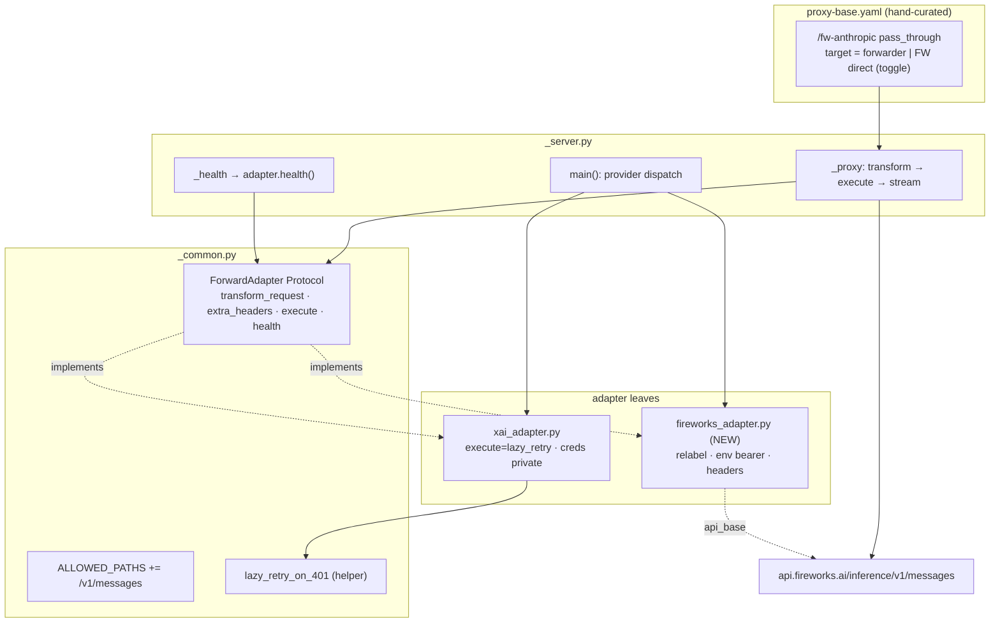
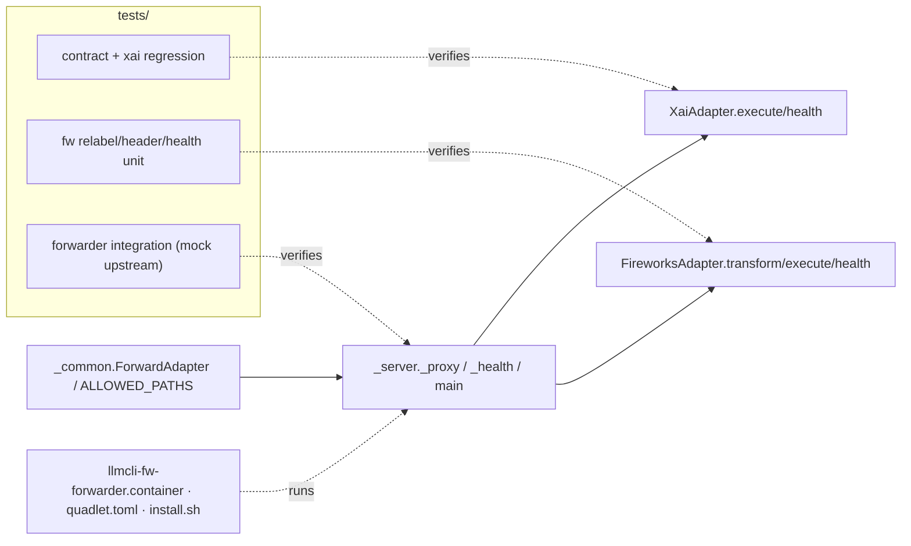

## Summary

Generalize the existing `proxy_forwarder` adapter contract (`OAuthAdapter`→`ForwardAdapter`: add `transform_request`, `extra_headers`, `execute→ClientResponse`, `health`; OAuth lifecycle becomes `XaiAdapter`-private) and add a thin `FireworksAdapter` leaf that relabels inline `role:"system"→"user"` + injects `FIREWORKS_API_KEY`, deployed as a new internal `llmcli-fw-forwarder` Quadlet behind the hand-curated `/fw-anthropic` passthrough (toggle = passthrough `target`).

## Architecture

## Agents

| Agent instance | Tasks | Files | Subjects |
|---|---|---|---|
| backend-dev-A | T2, T3 | `_common.py`, `_server.py` | contract, transport |
| backend-dev-B | T4 | `xai_adapter.py`, `__init__.py` | xai-adapter |
| backend-dev-C | T7 | `fireworks_adapter.py` (NEW) | fw-adapter |
| tester-A | T1, T5 | `tests/` | xai-regression |
| tester-B | T6, T8 | `tests/` | fw-adapter |
| tester-C | T13 | `tests/` | integration |
| devops-A | T9, T10, T11 | `deploy/quadlet/`, `quadlet.toml`, `install.sh` | deploy-wiring |
| devops-B | T12 | `proxy-base.yaml.example` | toggle-doc |
| doc-writer-A | T14 | `docs/` | docs |

## Wave Structure

5 waves, max 6 parallel agents. Critical path T2→T3→T7→T13 (+manual T15).

| Wave | Trigger | Agents | Tasks |
|------|---------|--------|-------|
| 1 | start | 6 ∥ | bd-A: T2 · t-A: T1 · t-B: T6 · dv-A: T9, T10 · dv-B: T12 |
| 2 | W1 done | 3 ∥ | bd-A: T3 · dv-A: T11 · dw-A: T14 |
| 3 | T2,T3 done | 2 ∥ | bd-B: T4 ∥ bd-C: T7 |
| 4 | T4/T7 done | 3 ∥ | t-A: T5 · t-B: T8 · t-C: T13 |
| 5 | all code merged + deployed | manual | human: T15 (M₁ live validation) |

### Budget — per task

| Task | Class | Est. ops |
|------|-------|----------|
| T1, T6, T13 | judgmental | 5 |
| T2, T3, T4, T7 | judgmental | 5–6 |
| T5, T8 | bounded | 2 |
| T9, T10, T11, T12, T14 | bounded | 3 |

**Total estimated ops: ~58 across 9 instances (≤7 per instance).**

### Budget — per agent instance

| Instance | Tasks | Σ ops | Subjects | Split? |
|----------|-------|-------|----------|--------|
| backend-dev-A | T2, T3 | 12 | contract, transport | — |
| backend-dev-B | T4 | 6 | xai-adapter | — |
| backend-dev-C | T7 | 6 | fw-adapter | — |
| tester-A | T1, T5 | 7 | xai-regression | — |
| tester-B | T6, T8 | 7 | fw-adapter | — |
| tester-C | T13 | 5 | integration | — |
| devops-A | T9, T10, T11 | 9 | deploy-wiring | — |
| devops-B | T12 | 3 | toggle-doc | — |
| doc-writer-A | T14 | 3 | docs | — |

No per-task (>50) or per-instance (>4 tasks / >2 subjects) cap breached.

## Consistency Report

Spec success criteria → tasks (15/15 covered):

| Spec criterion | Task |
|---|---|
| ForwardAdapter contract, creds off Protocol | T2, T4 |
| `_proxy` no direct lazy_retry; `_health` delegates | T3, T4 |
| XaiAdapter byte-identical | T4, T5 |
| `/v1/messages` in ALLOWED_PATHS | T2 |
| relabel multi/no-op/idempotent | T6, T7 |
| FW key from env only; Authorization stripped | T7, T13 |
| extra_headers anthropic-version + UA; 200 not 403 | T7, T15 |
| provider dispatch + error string + DEFAULT_PORT | T3 |
| Quadlet internal/port/env/health/security | T9 |
| install.sh installs unit | T11 |
| quadlet.toml component | T10 |
| proxy-base toggle + revert sequence doc | T12 |
| toggle config-only | T12, T15 |
| live thinking+stream 200 | T15 |
| toggle-off revert | T12, T15 |

Untraced tasks: none. Exemptions: T15 is a manual prod gate (CI cannot reach M₁/FW key).

## Micro-Tasks

### Slice 1 — generalize contract + conform xai

**T1 [RED] · tester-A · xai-regression · diff 3 · SC: byte-identical**
Contract tests for `ForwardAdapter` (transform_request/extra_headers/execute→ClientResponse/health) + regression asserting xai forwarder behavior unchanged.
- File: `tests/` (forwarder test module)
- Verify: `uv run pytest tests/ -k forwarder -q`
- Expected: new contract tests present (may fail RED until T2-T4)

**T2 [GREEN] · backend-dev-A · contract · diff 3 · SC: ForwardAdapter / ALLOWED_PATHS**
Define `ForwardAdapter` Protocol (supersede `OAuthAdapter`): `api_base`, `transform_request(body,path)→bytes`, `extra_headers()→dict`, `execute(session,method,url,body,headers)→aiohttp.ClientResponse`, `health()→dict`. Keep `lazy_retry_on_401` as module helper. `ALLOWED_PATHS |= {"/v1/messages"}`.
- File: `src/llmcli/proxy_forwarder/_common.py`
- Verify: `uv run python -c "from llmcli.proxy_forwarder._common import ForwardAdapter, ALLOWED_PATHS; assert '/v1/messages' in ALLOWED_PATHS"`
- Expected: import ok, path present

**T3 [GREEN] · backend-dev-A · transport · diff 4 · dep T2 · SC: proxy/health/dispatch**
`_proxy`: `body = adapter.transform_request(raw, path)` then `resp = await adapter.execute(...)`; keep `iter_any()` streaming loop; remove direct `lazy_retry_on_401` call. `_health` → `await adapter.health()`. `main()`: add `elif provider=="fireworks"`, update unsupported-provider error string to list `fireworks`; `DEFAULT_PORT` stays 18645.
- File: `src/llmcli/proxy_forwarder/_server.py`
- Verify: `uv run ruff check src/llmcli/proxy_forwarder/_server.py && uv run python -c "import llmcli.proxy_forwarder._server"`
- Expected: lint clean, imports

**T4 [GREEN] · backend-dev-B · xai-adapter · diff 4 · dep T2,T3 · SC: byte-identical**
Conform `XaiAdapter` to `ForwardAdapter`: `execute` wraps `lazy_retry_on_401` (OAuth) returning ClientResponse; `health()` = credential check (moved from `_server._health`); `transform_request`=identity; `extra_headers`={}; `credential_path`/`refresh` become private (not on Protocol). Update `__init__.py` to export `ForwardAdapter` (back-compat alias for `OAuthAdapter` if referenced).
- File: `src/llmcli/proxy_forwarder/xai_adapter.py`, `src/llmcli/proxy_forwarder/__init__.py`
- Verify: `uv run pytest tests/ -k xai -q`
- Expected: xai tests pass

**T5 [RED-GATE] · tester-A · xai-regression · diff 2 · dep T4,T1**
Run full xai forwarder suite; assert byte-identical behavior (no OAuth regression).
- Verify: `uv run pytest tests/ -k "forwarder or xai" -q`
- Expected: all green

### Slice 2 — FireworksAdapter

**T6 [RED] · tester-B · fw-adapter · diff 3 · dep T2 · SC: relabel/headers/health**
Unit tests: relabel single + multiple system roles → user; no-op on non-JSON body and absent `messages`; idempotent (double-apply stable); `extra_headers` includes anthropic-version + User-Agent; `health()` reports key_present; `main()` dispatch selects FireworksAdapter for `provider=fireworks`.
- File: `tests/` (fireworks adapter test module)
- Verify: `uv run pytest tests/ -k fireworks -q`
- Expected: tests present (RED until T7)

**T7 [GREEN] · backend-dev-C · fw-adapter · diff 4 · dep T2,T3 · SC: relabel/env-key/headers**
NEW `FireworksAdapter(ForwardAdapter)`: `api_base="https://api.fireworks.ai/inference"`; `transform_request` JSON-parses body, relabels `messages[*].role:"system"→"user"`, re-serializes, no-op if not JSON / no messages; `extra_headers()` returns module-constant `ANTHROPIC_VERSION` + `USER_AGENT` (tunable; defaults `2023-06-01` + Anthropic-SDK-like UA — confirm in T15); `execute` does single request with `Authorization: Bearer os.environ["FIREWORKS_API_KEY"]`, no retry; `health()` = `{"status":"ok","key_present":bool(os.environ.get("FIREWORKS_API_KEY"))}`.
- File: `src/llmcli/proxy_forwarder/fireworks_adapter.py` (NEW)
- Verify: `uv run pytest tests/ -k fireworks -q`
- Expected: green

**T8 [RED-GATE] · tester-B · fw-adapter · diff 2 · dep T6,T7**
- Verify: `uv run pytest tests/ -k fireworks -q && uv run ruff check src/llmcli/proxy_forwarder/`
- Expected: all green, lint clean

### Slice 3 — deploy + toggle

**T9 [GREEN] · devops-A · deploy-wiring · diff 3 · SC: Quadlet**
NEW Quadlet mirroring xai-forwarder: `LLMCLI_FORWARDER_PROVIDER=fireworks`, `LLMCLI_FORWARDER_PORT=18646`, `Network=roxabi.network`, NO `PublishPort`, `EnvironmentFile=%h/.roxabi/llmcli/env/proxy.env`, `Exec=forwarder`, HealthCmd on :18646, security flags (`UserNS=keep-id:uid=1502,gid=1502`, `NoNewPrivileges=true`, `DropCapability=all`).
- File: `deploy/quadlet/llmcli-fw-forwarder.container` (NEW)
- Verify: `grep -E 'PROVIDER=fireworks|PORT=18646|EnvironmentFile' deploy/quadlet/llmcli-fw-forwarder.container && ! grep -q PublishPort deploy/quadlet/llmcli-fw-forwarder.container`
- Expected: matches; no PublishPort

**T10 [GREEN] · devops-A · deploy-wiring · diff 2 · SC: manifest**
Add `[component.fw-forwarder]` to `quadlet.toml`: `container="llmcli-fw-forwarder.container"`, `required_secrets=[]`, `env_file="~/.roxabi/llmcli/env/proxy.env"`, `host_roles=["lyra-hub"]`.
- File: `deploy/quadlet.toml`
- Verify: `grep -A4 'component.fw-forwarder' deploy/quadlet.toml`
- Expected: block present, lyra-hub

**T11 [GREEN] · devops-A · deploy-wiring · diff 2 · dep T9 · SC: install.sh**
Add `llmcli-fw-forwarder.container` to the hardcoded unit loop in `install.sh`.
- File: `deploy/install.sh`
- Verify: `grep -q 'llmcli-fw-forwarder.container' deploy/install.sh`
- Expected: present

**T12 [REFACTOR] · devops-B · toggle-doc · diff 2 · SC: toggle/revert doc**
Document in `proxy-base.yaml.example`: toggle (`target`: `http://llmcli-fw-forwarder:18646` ⇄ `https://api.fireworks.ai/inference`); remove `headers.Authorization` block when target=forwarder (forwarder owns key); revert sequence (1) target→FW (restore headers), (2) `systemctl --user restart llmcli`, (3) stop forwarder, (4) only then drop `MAX_THINKING_TOKENS=0` from `ccfk`.
- File: `deploy/proxy-base.yaml.example`
- Verify: `grep -q 'llmcli-fw-forwarder:18646' deploy/proxy-base.yaml.example`
- Expected: documented

**T13 [GREEN] · tester-C · integration · diff 4 · dep T7,T3 · SC: routing/mutation/SSE**
Integration test (mock upstream): POST `/v1/messages` with inline system role → assert forwarded body has role=user, inbound Authorization stripped & env bearer set, SSE chunks streamed back verbatim.
- File: `tests/` (forwarder integration module)
- Verify: `uv run pytest tests/ -k "integration and forwarder" -q`
- Expected: green

### Slice 4 — docs + live gate

**T14 [GREEN] · doc-writer-A · docs · diff 2 · dep T9 · SC: docs**
Add `llmcli-fw-forwarder` section to `docs/QUADLET-DEPLOYMENT.md` (mirror xai-forwarder); note native FW thinking via `ccfk` in `docs/consumers.md`.
- File: `docs/QUADLET-DEPLOYMENT.md`, `docs/consumers.md`
- Verify: `grep -q 'llmcli-fw-forwarder' docs/QUADLET-DEPLOYMENT.md`
- Expected: present

**T15 [VALIDATE] · human (M₁) · manual · dep all**
On M₁: start `llmcli-fw-forwarder`, set passthrough target→forwarder, restart `llmcli`. Run `ccfk` (thinking forcing overridden) with `thinking:adaptive`+`stream:true` → confirm 200 + ≥1 thinking delta + correct answer + 200-not-403 (UA accepted); record working `anthropic-version`/UA values. Then verify toggle-off revert.
- Verify: live SSE/terminal output captured in PR.

## Task Seeding Blueprint

<!-- Used by /implement to seed TaskCreate calls. blockedBy refs T-numbers. -->

### Wave 1 — no deps, 6 ∥
| Task | Agent instance | blockedBy | Subject |
|------|---------------|-----------|---------|
| T1 | tester-A | — | xai-regression |
| T2 | backend-dev-A | — | contract |
| T6 | tester-B | — | fw-adapter |
| T9 | devops-A | — | deploy-wiring |
| T10 | devops-A | — | deploy-wiring |
| T12 | devops-B | — | toggle-doc |

### Wave 2 — after W1, 3 ∥
| Task | Agent instance | blockedBy | Subject |
|------|---------------|-----------|---------|
| T3 | backend-dev-A | T2 | transport |
| T11 | devops-A | T9 | deploy-wiring |
| T14 | doc-writer-A | T9 | docs |

### Wave 3 — after T2,T3, 2 ∥
| Task | Agent instance | blockedBy | Subject |
|------|---------------|-----------|---------|
| T4 | backend-dev-B | T2,T3 | xai-adapter |
| T7 | backend-dev-C | T2,T3 | fw-adapter |

### Wave 4 — after T4/T7, 3 ∥
| Task | Agent instance | blockedBy | Subject |
|------|---------------|-----------|---------|
| T5 | tester-A | T1,T4 | xai-regression |
| T8 | tester-B | T6,T7 | fw-adapter |
| T13 | tester-C | T3,T7 | integration |

### Wave 5 — manual
| Task | Agent instance | blockedBy | Subject |
|------|---------------|-----------|---------|
| T15 | human | T5,T8,T13,T11,T14 | live-validation |

## Task IDs

<!-- Generated by /plan. Used by /implement to resume tasks on session restart. -->
- T1: 13 — xai-regression (tester-A)
- T2: 14 — contract (backend-dev-A)
- T3: 15 — transport (backend-dev-A) [blockedBy T2]
- T4: 16 — xai-adapter (backend-dev-B) [blockedBy T2,T3]
- T5: 17 — xai-regression RED-GATE (tester-A) [blockedBy T1,T4]
- T6: 18 — fw-adapter (tester-B)
- T7: 19 — fw-adapter (backend-dev-C) [blockedBy T2,T3]
- T8: 20 — fw-adapter RED-GATE (tester-B) [blockedBy T6,T7]
- T9: 21 — deploy-wiring (devops-A)
- T10: 22 — deploy-wiring (devops-A)
- T11: 23 — deploy-wiring (devops-A) [blockedBy T9]
- T12: 24 — toggle-doc (devops-B)
- T13: 25 — integration (tester-C) [blockedBy T3,T7]
- T14: 26 — docs (doc-writer-A) [blockedBy T9]
- T15: (manual, human on M₁) — live-validation [blockedBy T5,T8,T13,T11,T14]
