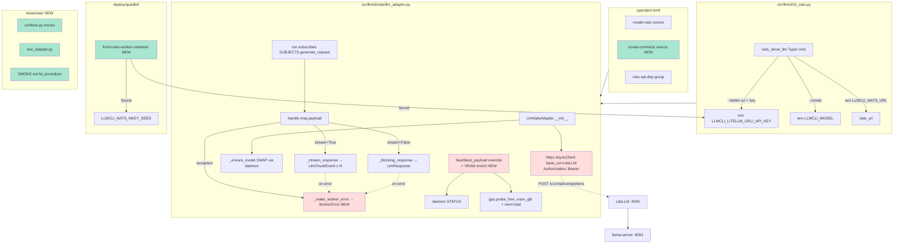
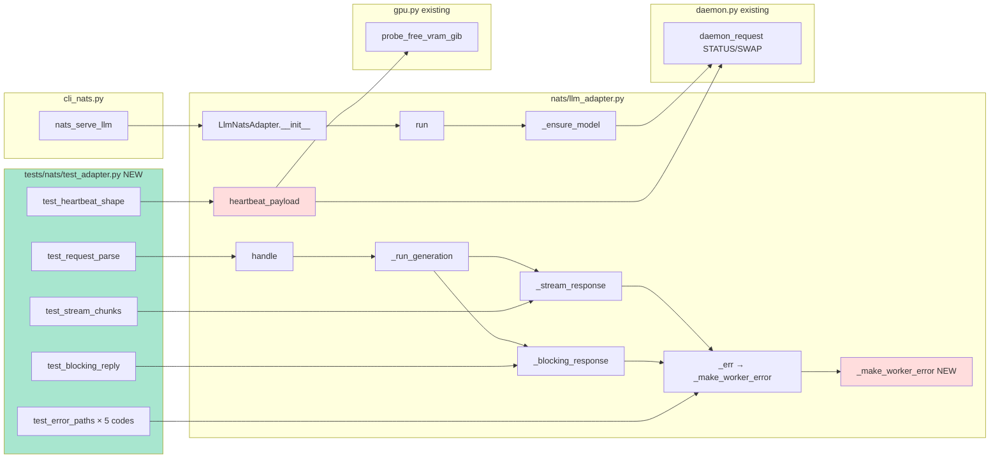

## Summary

Rectify the existing `src/llmcli/nats/llm_adapter.py` to (a) call **LiteLLM proxy** instead of local llama-server directly, (b) emit `WorkerError(code, message, retryable)` envelopes per ADR-066, (c) enrich heartbeats with VRAM, (d) ship deploy unit + tests. Bundled with Roxabi/lyra#1104 for full canonical ACL migration.

## Architecture

### Data flow



### File × Function map



## Bootstrap Context

**Reference patterns to inject into agent prompts:**

- `voicecli/src/voicecli/nats/tts_adapter.py:91-102` — `heartbeat_payload()` override with VRAM enrichment
- `imagecli/src/imagecli/nats/adapter.py:238-275` — `_reply_error` + `_active_request_count` patterns
- `voicecli/pyproject.toml` — uv git source for both `roxabi-nats` and `roxabi-contracts`
- `voicecli/deploy/quadlet/voicecli-tts.container` — quadlet template w/ Podman secrets, `roxabi.network`
- `roxabi_contracts.errors.WorkerError` (in lyra `packages/roxabi-contracts/src/roxabi_contracts/errors.py`) — error envelope shape
- `roxabi_contracts.llm.builders.{build_llm_chunk, build_llm_response}` — already in use; add `worker_error=` kwarg

**Existing code preserved:**
- Subject literals via `SUBJECTS.generate_request` / `SUBJECTS.heartbeat` / `SUBJECTS.llm_workers` (canonical, ADR-047 conformant — do not duplicate)
- `_ensure_model` SWAP-on-startup flow (still needed for `model_loaded` heartbeat)
- Streaming SSE parse loop in `_stream_response`
- Concurrency semaphore + `reject_when_full` flag

## Agents

| Agent | Tasks | Files |
|---|---|---|
| backend-dev-A | T2, T3, T5, T6 | `src/llmcli/nats/llm_adapter.py` (single file, sequential) |
| backend-dev-B | T4 | `src/llmcli/cli_nats.py` |
| devops-A | T1, T9 | `pyproject.toml`, `deploy/quadlet/llmcli-nats-worker.container` |
| tester-A | T7, T8, T10 | `tests/nats/*` |

## Wave Structure

5 waves, max 2 parallel agents at any moment. Elapsed ~2 days vs ~3 sequential.

| Wave | Trigger | Agents | Tasks |
|------|---------|--------|-------|
| 1 | start | 2 ∥ | devops-A: T1 → T9 · backend-dev-A: T2 |
| 2 | T2 done | 2 ∥ | backend-dev-A: T3 · backend-dev-B: T4 |
| 3 | T3 done | 1 | backend-dev-A: T5 → T6 |
| 4 | T6 done | 1 | tester-A: T7 → T8 |
| 5 | T8 done | 1 | tester-A: T10 |

Same-file sequential chains (T2→T3→T5→T6 on `llm_adapter.py`) are explicit; parallel waves split across files.

## Consistency Report

| Spec criterion | Covered by | Trace |
|---|---|---|
| SC-1 nats-serve llm boots, subscribes canonical | T2, T4 | C1 → S1 → N1 |
| SC-2 POSTs to LITELLM_URL with Bearer | T2, T3 | H1 (refactor) |
| SC-3 LlmRequest parsed; correct reply shapes | T3, T8 | N1 → N3 |
| SC-4 Heartbeat with VRAM | T6, T8 | N2 + D1 + D2 |
| SC-5 WorkerError with all 5 codes | T5, T8 | _make_worker_error |
| SC-6 Subject literals confined to SUBJECTS | T2 (no new literals) | (audit gate) |
| SC-7 Unit tests cover all paths | T7, T8 | T1 |
| SC-8 Quadlet with secrets + Network | T9 | Q1 |
| SC-9 M₁ smoke <5s for qwen3-8b | T10 | (manual) |
| SC-10 Coordinated merge with lyra#1104 | (PR phase, not code) | — |

10/10 covered. 0 untraced. No exemptions.

## Micro-Tasks

### Slice 1 — LiteLLM downstream switch + env wiring

#### T1 [P] — pyproject: add roxabi-contracts source + nats opt-dep
- **Agent:** devops-A · **Slice:** V1 · **Phase:** GREEN · **Difficulty:** 1 · **Estimate:** 3 min
- **File:** `pyproject.toml`
- **Spec trace:** SC-1, SC-7 (test imports work)
- **Change:**
  ```toml
  [project.optional-dependencies]
  nats = [
      "nats-py>=2.6,<3",
      "nkeys>=0.1",
      "roxabi-nats",
      "roxabi-contracts",
  ]

  [tool.uv.sources]
  roxabi-nats      = { git = "https://github.com/Roxabi/lyra.git", subdirectory = "packages/roxabi-nats",      tag = "roxabi-nats/v0.2.1" }
  roxabi-contracts = { git = "https://github.com/Roxabi/lyra.git", subdirectory = "packages/roxabi-contracts", branch = "staging" }
  ```
- **Verify:** `uv sync --extra nats && uv run python -c "from roxabi_contracts.llm import SUBJECTS; print(SUBJECTS.generate_request)"`
- **Expected:** prints `lyra.llm.generate.request`

#### T2 — adapter __init__ accepts LiteLLM URL/key, opens shared client
- **Agent:** backend-dev-A · **Slice:** V1 · **Phase:** GREEN · **Difficulty:** 3 · **Estimate:** 8 min · **Depends:** T1
- **File:** `src/llmcli/nats/llm_adapter.py`
- **Spec trace:** SC-1, SC-2
- **Change:**
  - Add params `litellm_url: str`, `litellm_key: str` to `__init__`
  - Open `self._client = httpx.AsyncClient(base_url=litellm_url, headers={"Authorization": f"Bearer {litellm_key}"}, timeout=httpx.Timeout(connect=5.0, read=120.0, write=10.0, pool=5.0))`
  - Override `_shutdown()` to also close `self._client` (call `super()._shutdown()` then `await self._client.aclose()`)
- **Verify:** `uv run python -c "from llmcli.nats.llm_adapter import LlmNatsAdapter; a = LlmNatsAdapter(model_name='x', litellm_url='http://localhost:4000/v1', litellm_key='k'); print(type(a._client).__name__)"`
- **Expected:** `AsyncClient`

#### T3 — _stream/_blocking_response use shared LiteLLM client
- **Agent:** backend-dev-A · **Slice:** V1 · **Phase:** GREEN · **Difficulty:** 3 · **Estimate:** 8 min · **Depends:** T2
- **File:** `src/llmcli/nats/llm_adapter.py`
- **Spec trace:** SC-2, SC-3
- **Change:**
  - Drop `base_url` parameter from `_stream_response` / `_blocking_response` signatures (use `self._client`)
  - Drop the per-call `async with httpx.AsyncClient(...)` blocks; use `self._client.post(...)` and `self._client.stream("POST", ...)` directly
  - In `_run_generation`, drop `base_url = f"http://localhost:{self._port}/v1"` and the `if self._port is None` early return for LiteLLM path (still keep model_loaded for heartbeat)
- **Verify:** `uv run ruff check src/llmcli/nats/llm_adapter.py && grep -c "localhost:" src/llmcli/nats/llm_adapter.py`
- **Expected:** `0`

#### T4 [P] — cli_nats.py adds LiteLLM flags + LLMCLI_NATS_URL rename
- **Agent:** backend-dev-B · **Slice:** V1 · **Phase:** GREEN · **Difficulty:** 2 · **Estimate:** 6 min · **Depends:** T1
- **File:** `src/llmcli/cli_nats.py`
- **Spec trace:** SC-1, SC-2
- **Change:**
  - Add Typer options:
    ```python
    litellm_url: Annotated[str, typer.Option("--litellm-url", envvar="LLMCLI_LITELLM_URL")] = "http://localhost:4000/v1",
    litellm_key: Annotated[str, typer.Option("--litellm-key", envvar="LLMCLI_LITELLM_API_KEY")],
    ```
  - Read `nats_url = os.environ.get("LLMCLI_NATS_URL") or os.environ.get("NATS_URL")` (back-compat for shared lyra deploy that sets `NATS_URL`)
  - Pass `litellm_url=litellm_url, litellm_key=litellm_key` to `LlmNatsAdapter(...)`
- **Verify:** `uv run llmcli nats-serve llm --help 2>&1 | grep -E "litellm|LLMCLI_"`
- **Expected:** prints `--litellm-url`, `--litellm-key`, `LLMCLI_LITELLM_URL`, `LLMCLI_LITELLM_API_KEY`

### Slice 2 — Canonical errors + heartbeat VRAM enrichment

#### T5 — WorkerError refactor across all error paths
- **Agent:** backend-dev-A · **Slice:** V2 · **Phase:** GREEN · **Difficulty:** 4 · **Estimate:** 10 min · **Depends:** T3
- **File:** `src/llmcli/nats/llm_adapter.py`
- **Spec trace:** SC-5
- **Change:**
  - Import `from roxabi_contracts.errors import WorkerError`
  - Add helper:
    ```python
    @staticmethod
    def _make_worker_error(code: str, msg: str, retryable: bool) -> WorkerError:
        return WorkerError(code=code, message=msg, retryable=retryable)
    ```
  - Map exceptions in `_run_generation`:
    - `httpx.TimeoutException` → `worker.timeout` retryable=True
    - `httpx.HTTPStatusError` (5xx) → `upstream.5xx` retryable=True
    - `httpx.ConnectError` → `upstream.unavailable` retryable=True
    - `json.JSONDecodeError` (in stream parse) → `transport.parse` retryable=False
    - generic `Exception` → `worker.internal` retryable=False
  - Pass `worker_error=we` into `build_llm_chunk(..., worker_error=we)` and `build_llm_response(..., worker_error=we)` calls (verify builders accept this kwarg; if not, extend or build envelope manually)
  - Refactor `_err` to take `code: str` instead of bare `error: str`
- **Verify:** `uv run ruff check src/llmcli/nats/llm_adapter.py && uv run python -c "from llmcli.nats.llm_adapter import LlmNatsAdapter; print(LlmNatsAdapter._make_worker_error('worker.timeout','x',True).model_dump())"`
- **Expected:** `{'code': 'worker.timeout', 'message': 'x', 'retryable': True}`

#### T6 — heartbeat_payload VRAM enrichment
- **Agent:** backend-dev-A · **Slice:** V2 · **Phase:** GREEN · **Difficulty:** 2 · **Estimate:** 6 min · **Depends:** T5
- **File:** `src/llmcli/nats/llm_adapter.py`
- **Spec trace:** SC-4
- **Change:** in `heartbeat_payload`:
  ```python
  from llmcli.gpu import probe_free_vram_gib
  free_gib = probe_free_vram_gib()
  payload["vram_free_mb"] = int(free_gib * 1024)
  try:
      import pynvml
      pynvml.nvmlInit()
      h = pynvml.nvmlDeviceGetHandleByIndex(0)
      total_mb = pynvml.nvmlDeviceGetMemoryInfo(h).total // (1024 * 1024)
      pynvml.nvmlShutdown()
      payload["vram_used_mb"] = int(total_mb - payload["vram_free_mb"])
  except Exception:
      payload["vram_used_mb"] = 0
  ```
- **Verify:** `uv run python -c "from llmcli.nats.llm_adapter import LlmNatsAdapter; a = LlmNatsAdapter(model_name='x', litellm_url='http://x', litellm_key='k'); p = a.heartbeat_payload(); print(sorted(p.keys()))"`
- **Expected:** keys include `active_requests`, `model_loaded`, `vram_free_mb`, `vram_used_mb`, `worker_id`

### Slice 3 — Tests + Quadlet + smoke

#### T7 — tests/nats/conftest.py + __init__.py
- **Agent:** tester-A · **Slice:** V3 · **Phase:** RED · **Difficulty:** 3 · **Estimate:** 8 min · **Depends:** T6
- **File:** `tests/nats/conftest.py`, `tests/nats/__init__.py`
- **Spec trace:** SC-7
- **Change:** create empty `__init__.py`; conftest with fixtures:
  - `mock_nats_msg` — a `types.SimpleNamespace` (or `unittest.mock.MagicMock`) with `.data: bytes` and `.reply: str`
  - `mock_litellm` — context manager using `respx` (preferred) or stdlib `monkeypatch` to intercept httpx calls and return preset SSE / JSON responses
  - `make_request_payload(stream: bool, **kwargs)` factory returning a JSON-serializable dict matching `LlmRequest`
- **Verify:** `uv run pytest tests/nats/ --collect-only`
- **Expected:** conftest collects without error

#### T8 — tests/nats/test_adapter.py — full unit coverage
- **Agent:** tester-A · **Slice:** V3 · **Phase:** GREEN · **Difficulty:** 4 · **Estimate:** 15 min · **Depends:** T7
- **File:** `tests/nats/test_adapter.py`
- **Spec trace:** SC-3, SC-4, SC-5, SC-7
- **Cases:**
  - `test_request_parse_invalid_request_id_replies_worker_internal_or_transport_parse`
  - `test_blocking_reply_shape` — payload→handle→assert reply is `LlmResponse(ok=True, text, duration_ms>0)`
  - `test_stream_chunks_and_terminator` — assert N>=1 chunks with `delta` then 1 terminator with `done=True`, `duration_ms>0`
  - `test_error_timeout_emits_worker_timeout` — patch `_client.post` to raise `httpx.TimeoutException`
  - `test_error_5xx_emits_upstream_5xx`
  - `test_error_connect_emits_upstream_unavailable`
  - `test_error_parse_emits_transport_parse` — invalid SSE JSON
  - `test_error_generic_emits_worker_internal`
  - `test_heartbeat_payload_has_vram_keys` — patch `probe_free_vram_gib` + nvml; assert keys `vram_free_mb`/`vram_used_mb`/`model_loaded`/`active_requests` present
- **Verify:** `uv run pytest tests/nats/ -v`
- **Expected:** all green, ≥9 tests pass

#### T9 [P] — deploy/quadlet/llmcli-nats-worker.container
- **Agent:** devops-A · **Slice:** V3 · **Phase:** GREEN · **Difficulty:** 2 · **Estimate:** 8 min · **Depends:** T1
- **File:** `deploy/quadlet/llmcli-nats-worker.container`
- **Spec trace:** SC-8
- **Change:** create file mirroring `voicecli/deploy/quadlet/voicecli-tts.container`:
  ```ini
  [Unit]
  Description=llmCLI NATS worker (canonical lyra.llm.generate.request)
  Wants=lyra-nats.service
  After=lyra-nats.service
  StartLimitIntervalSec=60
  StartLimitBurst=5

  [Container]
  Image=ghcr.io/roxabi/llmcli:staging
  Label=io.containers.autoupdate=registry
  ContainerName=llmcli-nats-worker
  Network=roxabi.network
  Volume=llmcli-models:/home/llmcli/.cache/huggingface
  Secret=llmcli-nats-nkey,type=mount,target=/home/llmcli/.config/llmcli/nkeys/seed.seed,mode=0400,uid=1502,gid=1502
  Secret=llmcli-litellm-key,type=env,name=LLMCLI_LITELLM_API_KEY
  AddDevice=nvidia.com/gpu=all
  UserNS=keep-id:uid=1502,gid=1502
  Environment=LLMCLI_NATS_URL=nats://lyra-nats:4222
  Environment=LLMCLI_NATS_NKEY_PATH=/home/llmcli/.config/llmcli/nkeys/seed.seed
  Environment=LLMCLI_LITELLM_URL=http://litellm:4000/v1
  Exec=llmcli nats-serve llm --model qwen3-8b
  HealthCmd=pgrep -f "llmcli nats-serve"
  HealthInterval=30s
  NoNewPrivileges=true
  DropCapability=all

  [Service]
  Restart=on-failure
  RestartSec=10
  RestartForceExitStatus=3 78

  [Install]
  WantedBy=default.target
  ```
- **Verify:** `test -f deploy/quadlet/llmcli-nats-worker.container && grep -c "Secret=" deploy/quadlet/llmcli-nats-worker.container`
- **Expected:** `2`

#### T10 — tests/nats/SMOKE.md — M₁ smoke procedure
- **Agent:** tester-A · **Slice:** V3 · **Phase:** REFACTOR · **Difficulty:** 1 · **Estimate:** 5 min · **Depends:** T8
- **File:** `tests/nats/SMOKE.md`
- **Spec trace:** SC-9
- **Content:** numbered procedure documenting:
  1. lyra#1104 ACL deployed (`auth.conf` regenerated, hub running canonical)
  2. M₁ has `llama-server` + LiteLLM + llmCLI worker running (via Quadlet)
  3. Hub publishes `LlmRequest(stream=True)` for `qwen3-8b` via test harness
  4. Assert N×`LlmChunkEvent` + terminator received <5 s
  5. Repeat with `stream=False` → single `LlmResponse(ok=True, text=..., duration_ms<5000)`
  6. Assert heartbeat received with `vram_used_mb > 0`
- **Verify:** `test -f tests/nats/SMOKE.md && wc -l tests/nats/SMOKE.md`
- **Expected:** ≥20 lines

## Task Seeding Blueprint

<!-- Used by /implement to seed TaskCreate calls on session start.
     Format: T{n} | agent-instance | blockedBy | subject
     blockedBy refs T-numbers within this list (not session task IDs).
     Agent instances are named (tester-A, backend-dev-A/B, devops-A)
     so parallel tasks map to distinct spawned agents.
     Seed in wave order; within a wave all rows are parallel (∥). -->

### Wave 1 — start, 2 agents ∥

| Task | Agent instance | blockedBy | Subject |
|------|---------------|-----------|---------|
| T1 | devops-A | — | pyproject: roxabi-contracts source + nats opt-dep |
| T2 | backend-dev-A | — | adapter __init__ accepts LiteLLM URL/key |

### Wave 2 — after T2 done, 2 agents ∥

| Task | Agent instance | blockedBy | Subject |
|------|---------------|-----------|---------|
| T3 | backend-dev-A | T2 | _stream/_blocking use shared LiteLLM client |
| T4 | backend-dev-B | T1 | cli_nats.py LiteLLM flags + LLMCLI_NATS_URL |
| T9 | devops-A | T1 | quadlet llmcli-nats-worker.container |

### Wave 3 — after T3 done, 1 agent

| Task | Agent instance | blockedBy | Subject |
|------|---------------|-----------|---------|
| T5 | backend-dev-A | T3 | WorkerError refactor across error paths |
| T6 | backend-dev-A | T5 | heartbeat_payload VRAM enrichment |

### Wave 4 — after T6 done, 1 agent

| Task | Agent instance | blockedBy | Subject |
|------|---------------|-----------|---------|
| T7 | tester-A | T6 | tests/nats/conftest.py fixtures |
| T8 | tester-A | T7 | tests/nats/test_adapter.py unit coverage |

### Wave 5 — after T8 done, 1 agent

| Task | Agent instance | blockedBy | Subject |
|------|---------------|-----------|---------|
| T10 | tester-A | T8 | tests/nats/SMOKE.md M₁ procedure |

## Task IDs

<!-- Generated by /plan. Used by /implement to resume tasks on session restart. -->
- T1: 12 — pyproject: roxabi-contracts source + nats opt-dep
- T2: 13 — adapter __init__ accepts LiteLLM URL/key
- T3: 14 — _stream/_blocking use shared LiteLLM client
- T4: 15 — cli_nats.py LiteLLM flags + LLMCLI_NATS_URL
- T5: 16 — WorkerError refactor across error paths
- T6: 17 — heartbeat_payload VRAM enrichment
- T7: 18 — tests/nats/conftest.py fixtures
- T8: 19 — tests/nats/test_adapter.py unit coverage
- T9: 20 — quadlet llmcli-nats-worker.container
- T10: 21 — tests/nats/SMOKE.md M₁ procedure
