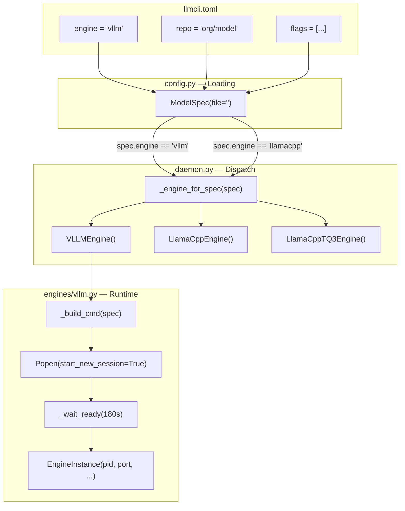
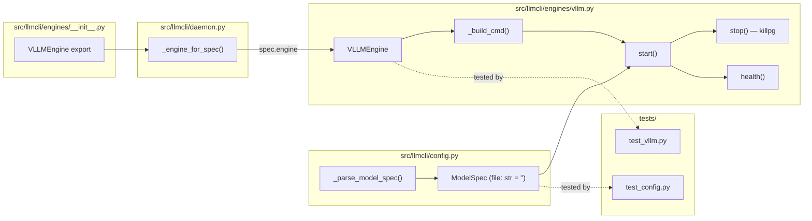

## Summary

Implement `VLLMEngine` conforming to the existing `Engine` protocol, patch `ModelSpec.file` to be optional, update daemon dispatch to use `spec.engine`, and add docs + tests. The `vllm` dep group already exists in `pyproject.toml` (`vllm>=0.6.0`) — no dep changes needed.

## Architecture

### Data Flow



### File × Function Map



## Agents

| Agent | Task count | Files |
|-------|-----------|-------|
| backend-dev-A | 5 | `config.py`, `engines/vllm.py`, `engines/__init__.py`, `daemon.py` |
| tester-A | 3 | `tests/test_config.py`, `tests/test_vllm.py` |
| devops-A | 1 | `llmcli.example.toml` |
| doc-writer-A | 1 | `CLAUDE.md` |

## Wave Structure

3 waves, max 3 parallel agents. Elapsed ~1h vs ~2.5h sequential.

| Wave | Trigger | Agents | Tasks |
|------|---------|--------|-------|
| 1 | start | 2 ∥ | backend-dev-A: T1 · tester-A: T2 |
| 2 | Wave 1 done | 2 ∥ | backend-dev-A: T3→T4→T5→T6 · tester-A: T7 |
| 3 | Wave 2 done | 3 ∥ | devops-A: T8 · doc-writer-A: T9 · tester-A: T10 |

## Consistency Report

- Criteria covered: 16/16
- Uncovered criteria: none
- Tasks without spec backing: T10 (quality gate — exempted as infra)
- Exemptions: 1

## Micro-Tasks

### Slice V1: Config schema fix

#### Task 1: Make `ModelSpec.file` default to `""` → backend-dev-A
- **File:** `src/llmcli/config.py`
- **Snippet:** Move `file` field after `vram_gib`, add default: `file: str = field(default="")` — or `file: str = ""` once positioned after all required fields. Field order becomes: `name, engine, repo, port, vram_gib, file="", flags=[], mmproj=None`.
- **Verify:** `grep -q 'file: str = ""' src/llmcli/config.py` (ready)
- **Expected:** exits 0
- **Time:** 5 min | **Difficulty:** 2
- **Traces:** SC config-1, U1 | **Phase:** GREEN

#### Task 2: Add test for ModelSpec without `file` key [P] → tester-A
- **File:** `tests/test_config.py`
- **Snippet:** Add `test_model_spec_file_defaults_to_empty_string` — construct `ModelSpec` via `_parse_model_spec("m", {"engine":"vllm","repo":"org/m","port":8093,"vram_gib":15.0})`, assert `spec.file == ""`.
- **Verify:** `uv run pytest tests/test_config.py -x -q` (ready)
- **Expected:** passes after T1 is applied; RED (TypeError) before
- **Time:** 5 min | **Difficulty:** 2
- **Traces:** SC config-1, U1 | **Phase:** RED

#### RED-GATE: RED complete V1 → tester-A
- **Verify:** T2 collected and running (even if failing before T1 lands)
- **Phase:** RED-GATE

### Slice V2: Engine plumbing + dispatch

#### Task 3: Implement `VLLMEngine` in `engines/vllm.py` → backend-dev-A
- **File:** `src/llmcli/engines/vllm.py` (new)
- **Snippet:**
```python
from __future__ import annotations
import os, signal, subprocess, time
import httpx
from ..config import ModelSpec
from ..engine import EngineInstance

_WAIT_TIMEOUT = 180
_WAIT_INTERVAL = 1.0
_STOP_GRACE = 5
_STDERR_TAIL = 20

class VLLMEngine:
    def _build_cmd(self, spec: ModelSpec) -> list[str]:
        cmd = ["vllm", "serve", spec.repo,
               "--port", str(spec.port), "--host", "0.0.0.0"]
        if spec.flags:
            cmd.extend(spec.flags)
        return cmd

    def start(self, spec: ModelSpec) -> EngineInstance:
        try:
            import vllm  # noqa: F401
        except ImportError:
            raise ImportError("vLLM not installed. Run: uv pip install vllm")
        cmd = self._build_cmd(spec)
        proc = subprocess.Popen(cmd, stderr=subprocess.PIPE, start_new_session=True)
        base_url = f"http://localhost:{spec.port}/v1"
        _wait_ready(base_url, proc, _WAIT_TIMEOUT)
        return EngineInstance(pid=proc.pid, port=spec.port,
                              model_name=spec.name, started_at=time.time())

    def health(self, instance: EngineInstance) -> bool:
        try:
            resp = httpx.get(f"{instance.base_url}/health", timeout=2.0)
            return resp.status_code < 300
        except Exception:
            return False

    def stop(self, instance: EngineInstance) -> None:
        try:
            pgid = os.getpgid(instance.pid)
            os.killpg(pgid, signal.SIGTERM)
        except ProcessLookupError:
            return
        time.sleep(_STOP_GRACE)
        try:
            os.killpg(os.getpgid(instance.pid), signal.SIGKILL)
        except ProcessLookupError:
            pass
```
- **Verify:** `uv run pytest tests/test_vllm.py -x -q` (deferred — needs T7)
- **Expected:** all VLLMEngine tests pass
- **Time:** 10 min | **Difficulty:** 3
- **Traces:** SC func-1 – func-6, N1–N5, S1 | **Phase:** GREEN

#### Task 4: Update `_engine_for_spec` dispatch → backend-dev-A
- **File:** `src/llmcli/daemon.py`
- **Snippet:** Replace heuristic with:
```python
from .engines.vllm import VLLMEngine
if spec.engine == "vllm":
    return VLLMEngine()
if spec.engine == "llamacpp_tq3":
    return LlamaCppTQ3Engine()
return LlamaCppEngine()
```
- **Verify:** `grep -q 'spec.engine == "vllm"' src/llmcli/daemon.py` (ready)
- **Expected:** exits 0
- **Time:** 5 min | **Difficulty:** 2
- **Traces:** SC func-7, U2 | **Phase:** GREEN

#### Task 5: Export `VLLMEngine` from `engines/__init__.py` → backend-dev-A
- **File:** `src/llmcli/engines/__init__.py`
- **Snippet:** `from .vllm import VLLMEngine` + add to `__all__`
- **Verify:** `python -c "from llmcli.engines import VLLMEngine; print('ok')"` (deferred — uv env)
- **Expected:** `ok`
- **Time:** 2 min | **Difficulty:** 1
- **Traces:** SC install-1 | **Phase:** GREEN

#### Task 6: Verify import guard — no vllm installed → backend-dev-A
- **File:** `src/llmcli/engines/vllm.py`
- **Snippet:** Confirm deferred import is inside `start()` body only (¬module-level). `from llmcli.engines.vllm import VLLMEngine` must not trigger vllm import.
- **Verify:** `python -c "from llmcli.engines.vllm import VLLMEngine; print('ok')"` in env without vllm
- **Expected:** `ok` (no ImportError at class import time)
- **Time:** 3 min | **Difficulty:** 2
- **Traces:** SC install-2, S1 | **Phase:** GREEN

#### Task 7: Write RED→GREEN tests for `VLLMEngine` → tester-A
- **File:** `tests/test_vllm.py` (new)
- **Snippet:** Test classes: `TestVLLMProtocolConformance`, `TestVLLMCommandBuild`, `TestVLLMStart` (happy path, 503-then-200 warmup, early exit), `TestVLLMStop` (SIGTERM to pgid, SIGKILL escalation), `TestVLLMHealth` (true/false), `TestVLLMImportGuard`, `TestDaemonDispatchVLLM`
- **Verify:** `uv run pytest tests/test_vllm.py -v -q` (ready)
- **Expected:** all pass
- **Time:** 15 min | **Difficulty:** 4
- **Traces:** SC func-1 – func-8, SC install-2, SC install-3 | **Phase:** RED→GREEN

#### RED-GATE: RED complete V2 → tester-A
- **Verify:** `uv run pytest tests/test_vllm.py tests/test_config.py -q` — all pass
- **Phase:** RED-GATE

### Slice V3: Docs + quality

#### Task 8: Add commented vLLM entry to `llmcli.example.toml` [P] → devops-A
- **File:** `llmcli.example.toml`
- **Snippet:**
```toml
# --- vLLM models (dev only — RTX 5070 Ti, 16 GiB) ----------------------------
# [models.qwen3-27b-nvfp4]
# engine   = "vllm"
# repo     = "kaitchup/Qwen3.6-27B-autoround-nvfp4-linearattn-BF16"
# port     = 8093
# vram_gib = 15
# flags    = ["--max-model-len", "32768", "--reasoning-parser", "qwen3"]
```
- **Verify:** `grep -q 'engine.*=.*"vllm"' llmcli.example.toml` (ready)
- **Expected:** exits 0
- **Time:** 3 min | **Difficulty:** 1
- **Traces:** SC docs-1 | **Phase:** REFACTOR

#### Task 9: Update CLAUDE.md engine table [P] → doc-writer-A
- **File:** `CLAUDE.md`
- **Snippet:** Change `vllm` row from `(future, optional extra) — Deferred to P7` to `vllm serve <repo>` / `Safetensors (NVFP4/GPTQ) — vLLM v0.19+`
- **Verify:** `grep -q 'vllm serve' CLAUDE.md` (ready)
- **Expected:** exits 0
- **Time:** 3 min | **Difficulty:** 1
- **Traces:** SC docs-2 | **Phase:** REFACTOR

#### Task 10: Run full quality gates → tester-A
- **File:** —
- **Verify:** `uv run ruff check . && uv run pytest -q` (ready)
- **Expected:** both exit 0
- **Time:** 5 min | **Difficulty:** 1
- **Traces:** SC quality-1, SC quality-2 | **Phase:** REFACTOR

## Task Seeding Blueprint

<!-- Used by /implement to seed TaskCreate calls on session start.
     Format: T{n} | agent-instance | blockedBy | subject
     blockedBy refs T-numbers within this list (not session task IDs).
     Agent instances are named (tester-A, backend-dev-A, devops-A, doc-writer-A)
     so parallel tasks map to distinct spawned agents.
     Seed in wave order; within a wave all rows are parallel (∥). -->

### Wave 1 — no deps, 2 agents ∥

| Task | Agent instance | blockedBy | Subject |
|------|---------------|-----------|---------|
| T1 | backend-dev-A | — | Make ModelSpec.file default to "" |
| T2 | tester-A | — | Write RED test for ModelSpec without file key |

### Wave 2 — after Wave 1, 2 agents ∥

| Task | Agent instance | blockedBy | Subject |
|------|---------------|-----------|---------|
| T3 | backend-dev-A | T1 | Implement VLLMEngine in engines/vllm.py |
| T4 | backend-dev-A | T3 | Update _engine_for_spec dispatch to use spec.engine |
| T5 | backend-dev-A | T3 | Export VLLMEngine from engines/__init__.py |
| T6 | backend-dev-A | T5 | Verify import guard — no vllm installed |
| T7 | tester-A | T2,T3 | Write RED→GREEN tests for VLLMEngine |

### Wave 3 — after Wave 2, 3 agents ∥

| Task | Agent instance | blockedBy | Subject |
|------|---------------|-----------|---------|
| T8 | devops-A | — | Add commented vLLM entry to llmcli.example.toml |
| T9 | doc-writer-A | — | Update CLAUDE.md engine table |
| T10 | tester-A | T7,T8,T9 | Run full quality gates (ruff + pytest) |

## Task IDs

<!-- Generated by /plan. Used by /implement to resume tasks on session restart. -->
- T1: 10 — Make ModelSpec.file default to ""
- T2: 11 — Write RED test for ModelSpec without file key
- T3: 12 — RED-GATE: V1 complete
- T4: 13 — Implement VLLMEngine in engines/vllm.py
- T5: 14 — Update _engine_for_spec dispatch to use spec.engine
- T6: 15 — Export VLLMEngine from engines/__init__.py
- T7: 16 — Verify import guard — VLLMEngine importable without vllm package
- T8: 17 — Write RED→GREEN tests for VLLMEngine
- T9: 18 — RED-GATE: V2 complete
- T10: 19 — Add commented vLLM entry to llmcli.example.toml
- T11: 20 — Update CLAUDE.md engine table — vllm no longer deferred
- T12: 21 — Run full quality gates — ruff + pytest
