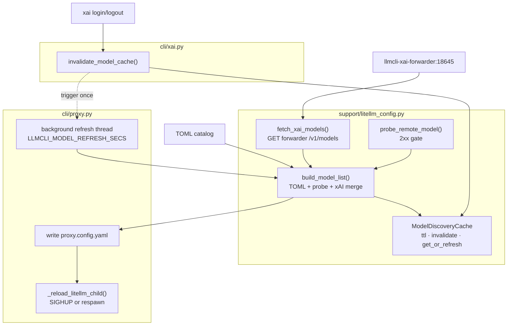
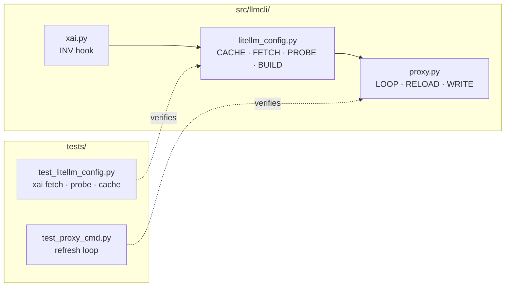

## Summary

Replace hardcoded `_XAI_OAUTH_MODELS` with live forwarder discovery in `build_model_list()`, add remote upstream health probes, thread-safe `ModelDiscoveryCache`, and a background refresh loop in `cli/proxy.py` that regen-writes `proxy.config.yaml` and reloads the litellm child — plus cache invalidation hooks on `xai login/logout`.

## Architecture

## Agents

| Agent instance | Tasks | Files | Subjects |
|---|---|---|---|
| backend-dev-A | T2, T3, T4 | `litellm_config.py` | discovery, probe |
| backend-dev-B | T7, T8 | `proxy.py` | refresh, reload |
| backend-dev-C | T10, T11 | `xai.py`, `litellm_config.py` | cache-inval |
| tester-A | T1, T5 | `test_litellm_config.py` | discovery-tests |
| tester-B | T6, T9 | `test_proxy_cmd.py` | refresh-tests |
| tester-C | T12 | `test_litellm_config.py` | integration |
| doc-writer-A | T13 | `docs/guides/deployment.md` | docs |

## Wave Structure

4 waves, max 5 parallel agents. Critical path T2→T4→T7→T9.

| Wave | Trigger | Agents | Tasks |
|------|---------|--------|-------|
| 1 | start | 4 ∥ | t-A: T1 · bd-A: T2 · t-B: T6 · dw-A: T13 |
| 2 | T2 done | 2 ∥ | bd-A: T3→T4 · bd-B: T7 |
| 3 | T4,T7 done | 3 ∥ | bd-B: T8 · bd-C: T10→T11 · t-C: T12 |
| 4 | T4,T6,T8 done | 2 ∥ | t-A: T5 · t-B: T9 |

### Budget — per task

| Task | Class | Est. ops |
|------|-------|----------|
| T1, T6, T12 | judgmental | 5 |
| T2, T3, T4, T7, T8, T10 | judgmental | 5–6 |
| T5, T9, T11, T13 | bounded | 2–3 |

**Total estimated ops: ~52 across 7 instances (≤12 per instance).**

### Budget — per agent instance

| Instance | Tasks | Σ ops | Subjects | Split? |
|----------|-------|-------|----------|--------|
| backend-dev-A | T2, T3, T4 | 17 | discovery, probe | — |
| backend-dev-B | T7, T8 | 11 | refresh, reload | — |
| backend-dev-C | T10, T11 | 8 | cache-inval | — |
| tester-A | T1, T5 | 7 | discovery-tests | — |
| tester-B | T6, T9 | 7 | refresh-tests | — |
| tester-C | T12 | 5 | integration | — |
| doc-writer-A | T13 | 3 | docs | — |

No per-task (>50) or per-instance cap breached.

## Consistency Report

Spec success criteria → tasks (10/10 covered):

| Spec criterion | Task |
|---|---|
| SC-1 merged TOML + live Grok | T4, T5 |
| SC-2 grok-imagine-* excluded | T1, T2, T4 |
| SC-3 unhealthy remote omitted | T1, T3, T4 |
| SC-4 machines filter parity | T1, T4, T5 |
| SC-5 no hardcoded list when ¬creds | T4, T5 |
| SC-6 background refresh ≤60s | T6, T7, T8, T9 |
| SC-7 login/logout invalidation | T10, T12 |
| SC-8 forwarder down → no crash | T2, T4, T5 |
| SC-9 register-proxy parity | T11 |
| SC-10 tests in test_litellm_config.py | T1, T5, T12 |

Untraced tasks: none.

## Micro-Tasks

### Slice 1 — discovery primitives (N1–N4)

**T1 [RED] · tester-A · discovery-tests · diff 3 · SC: SC-2,3,4,10**
Add failing tests: `fetch_xai_models` returns IDs and filters `grok-imagine-*`; `probe_remote_model` omits on 401; `build_model_list` respects `machines`; dedup TOML over forwarder ID; no `_XAI_OAUTH_MODELS` when creds absent.
- File: `tests/test_litellm_config.py`
- Verify: `uv run pytest tests/test_litellm_config.py -k "xai_models or probe_remote or machines" -q`
- Expected: tests collected (RED until T2–T4)

**T2 [GREEN] · backend-dev-A · discovery · diff 4 · SC: SC-2,8**
Implement `fetch_xai_models(forwarder_base: str) -> list[str]`: `httpx.get(..., timeout=3)`, parse `data[].id`, exclude `grok-imagine-*` prefix; log warning + return `[]` on any error.
- File: `src/llmcli/support/litellm_config.py`
- Verify: `uv run python -c "from llmcli.support.litellm_config import fetch_xai_models; print('ok')"`
- Expected: import ok

**T3 [GREEN] · backend-dev-A · probe · diff 4 · dep T2 · SC: SC-3**
Implement `probe_remote_model(spec, provider) -> bool`: skip `_OAUTH_MANAGED`; minimal probe (HEAD or GET) to provider `api_base`; healthy iff 2xx within 3s.
- File: `src/llmcli/support/litellm_config.py`
- Verify: `uv run ruff check src/llmcli/support/litellm_config.py`
- Expected: lint clean

**T4 [GREEN] · backend-dev-A · discovery · diff 5 · dep T2,T3 · SC: SC-1,4,5**
Add `ModelDiscoveryCache` (thread-safe, `ttl_secs`, `invalidate()`, `get_or_refresh(fn)`). Extend `build_model_list(..., *, cache=None)`: TOML loop with N3 probe; when `xai.json` exists merge N2 models as `openai/responses/{id}` entries; remove `_XAI_OAUTH_MODELS` constant + hardcoded injection; dedup by `model_name` (TOML wins).
- File: `src/llmcli/support/litellm_config.py`
- Verify: `uv run pytest tests/test_litellm_config.py -k "xai_models or probe_remote or machines" -q`
- Expected: green

**T5 [RED-GATE] · tester-A · discovery-tests · diff 2 · dep T1,T4 · SC: SC-1–5,10**
Full discovery slice gate.
- Verify: `uv run pytest tests/test_litellm_config.py -q && uv run ruff check src/llmcli/support/litellm_config.py`
- Expected: all green

### Slice 2 — background refresh (N5–N6)

**T6 [RED] · tester-B · refresh-tests · diff 3 · SC: SC-6**
Tests: mock `build_model_list` + file write; refresh thread fires within short TTL; litellm child reload called; parent survives reload failure.
- File: `tests/test_proxy_cmd.py`
- Verify: `uv run pytest tests/test_proxy_cmd.py -k model_refresh -q`
- Expected: tests present (RED until T7,T8)

**T7 [GREEN] · backend-dev-B · refresh · diff 5 · SC: SC-6**
Extract `_write_proxy_config(catalog, target) -> None` from `proxy()`; add `_start_model_refresh_loop(child, catalog, port, host, interval_secs)` daemon thread reading `LLMCLI_MODEL_REFRESH_SECS` (default 60, reject negative).
- File: `src/llmcli/cli/proxy.py`
- Verify: `uv run python -c "import llmcli.cli.proxy"`
- Expected: import ok

**T8 [GREEN] · backend-dev-B · reload · diff 4 · dep T7 · SC: SC-6**
Implement `_reload_litellm_child(child, config_path, port, host)`: try SIGHUP; on failure terminate + `_spawn_litellm` respawn; return new Popen handle to refresh loop.
- File: `src/llmcli/cli/proxy.py`
- Verify: `uv run pytest tests/test_proxy_cmd.py -k model_refresh -q`
- Expected: green

**T9 [RED-GATE] · tester-B · refresh-tests · diff 2 · dep T6,T8 · SC: SC-6**
- Verify: `uv run pytest tests/test_proxy_cmd.py -k model_refresh -q && uv run ruff check src/llmcli/cli/proxy.py`
- Expected: all green

### Slice 3 — auth invalidation + register-proxy parity (N7–N8)

**T10 [GREEN] · backend-dev-C · cache-inval · diff 3 · SC: SC-7**
Add module-level `invalidate_model_cache()` + optional `_refresh_callback` register; wire `login_cmd` / `logout_cmd` to call after credential change.
- Files: `src/llmcli/support/litellm_config.py`, `src/llmcli/cli/xai.py`
- Verify: `uv run python -c "from llmcli.support.litellm_config import invalidate_model_cache; invalidate_model_cache()"`
- Expected: no error

**T11 [GREEN] · backend-dev-C · cache-inval · diff 2 · dep T4 · SC: SC-9**
Test that `build_block()` output includes forwarder-fetched Grok IDs when mocked (register-proxy parity).
- File: `tests/test_litellm_config.py`
- Verify: `uv run pytest tests/test_litellm_config.py -k register_proxy_xai -q`
- Expected: green

**T12 [RED-GATE] · tester-C · integration · diff 3 · dep T10,T11 · SC: SC-7,10**
Integration: logout clears Grok from subsequent `build_model_list` call; login repopulates (mocked forwarder).
- Verify: `uv run pytest tests/test_litellm_config.py -k "invalidate or register_proxy_xai" -q`
- Expected: green

### Slice 4 — docs

**T13 [GREEN] · doc-writer-A · docs · diff 2 · SC: operator clarity**
Document unified `/v1/models` behaviour, `LLMCLI_MODEL_REFRESH_SECS`, health-filter semantics, login/logout immediate refresh in `docs/guides/deployment.md`.
- Verify: `grep -E 'LLMCLI_MODEL_REFRESH_SECS|unified.*v1/models' docs/guides/deployment.md`
- Expected: matches

## Task Seeding Blueprint

### Wave 1 — no deps, 4 agents ∥

| Task | Agent instance | blockedBy | Subject |
|------|---------------|-----------|---------|
| T1 | tester-A | — | discovery-tests |
| T2 | backend-dev-A | — | discovery |
| T6 | tester-B | — | refresh-tests |
| T13 | doc-writer-A | — | docs |

### Wave 2 — after T2, 2 agents ∥

| Task | Agent instance | blockedBy | Subject |
|------|---------------|-----------|---------|
| T3 | backend-dev-A | T2 | probe |
| T4 | backend-dev-A | T2,T3 | discovery |
| T7 | backend-dev-B | T2 | refresh |

### Wave 3 — after T4,T7, 3 agents ∥

| Task | Agent instance | blockedBy | Subject |
|------|---------------|-----------|---------|
| T8 | backend-dev-B | T7 | reload |
| T10 | backend-dev-C | T4 | cache-inval |
| T11 | backend-dev-C | T4 | cache-inval |
| T12 | tester-C | T10,T11 | integration |

### Wave 4 — gates, 2 agents ∥

| Task | Agent instance | blockedBy | Subject |
|------|---------------|-----------|---------|
| T5 | tester-A | T1,T4 | discovery-tests |
| T9 | tester-B | T6,T8 | refresh-tests |

## Task IDs

<!-- Generated by /plan. Used by /implement to resume tasks on session restart. -->
- T1: plan-130-t1 — discovery-tests (tester-A)
- T2: plan-130-t2 — discovery (backend-dev-A)
- T3: plan-130-t3 — probe (backend-dev-A) [blockedBy T2]
- T4: plan-130-t4 — discovery (backend-dev-A) [blockedBy T2,T3]
- T5: plan-130-t5 — discovery-tests RED-GATE (tester-A) [blockedBy T1,T4]
- T6: plan-130-t6 — refresh-tests (tester-B)
- T7: plan-130-t7 — refresh (backend-dev-B) [blockedBy T2]
- T8: plan-130-t8 — reload (backend-dev-B) [blockedBy T7]
- T9: plan-130-t9 — refresh-tests RED-GATE (tester-B) [blockedBy T6,T8]
- T10: plan-130-t10 — cache-inval (backend-dev-C) [blockedBy T4]
- T11: plan-130-t11 — cache-inval (backend-dev-C) [blockedBy T4]
- T12: plan-130-t12 — integration (tester-C) [blockedBy T10,T11]
- T13: plan-130-t13 — docs (doc-writer-A)