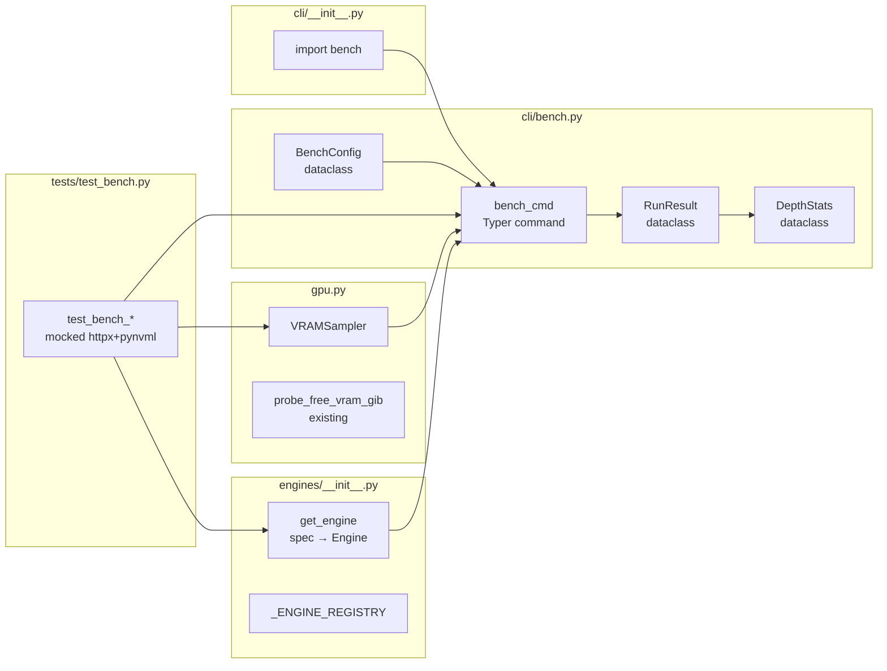

## Summary

Add `llmcli bench` command that starts an engine directly (bypassing daemon), sends timed OpenAI streaming requests across configurable context depths and runs, measures pp t/s (est.), tg t/s, TTFT, and VRAM peak, then renders a Rich table. 5 slices, 4 files touched/created.

## Architecture

```mermaid
flowchart TD
    subgraph cli/bench.py
        BC[BenchConfig] --> CMD[bench_cmd]
        CMD --> GE[get_engine spec]
        CMD --> ENG[engine.start/stop]
        CMD --> LOOP[depth × runs loop]
        LOOP --> REQ[httpx stream\n/v1/completions]
        LOOP --> RR[RunResult]
        RR --> AGG[aggregate → DepthStats]
        AGG --> TBL[Rich Table]
    end
    subgraph gpu.py
        VS[VRAMSampler\nthread]
        VS --> NVML[pynvml handle\nsingle init]
        VS --> SMI[nvidia-smi\nfallback]
        VS --> PEAK[peak_gib: float|None]
    end
    LOOP --> VS
    VS --> RR
    subgraph engines/__init__.py
        GE --> REG[_ENGINE_REGISTRY\ndispatch]
    end
```



## Bootstrap Context

- Ref pattern: `daemon._engine_for_spec()` → extract to `engines/__init__.get_engine()`
- Ref pattern: `cli/chat.py` → Typer command structure + catalog resolution
- Ref pattern: `engines/vllm.py` → `shutil.which("vllm")` guard
- Ref pattern: `gpu.py:probe_free_vram_gib()` → pynvml + nvidia-smi fallback logic

## Agents

| Agent | Tasks | Files |
|-------|-------|-------|
| backend-dev-A | T1, T3, T4, T8, T9, T10, T15 | `engines/__init__.py`, `cli/bench.py`, `cli/__init__.py` |
| backend-dev-B | T6 | `gpu.py` |
| tester-A | T2, T5, T7, T11, T12 | `tests/test_bench.py` |

## Wave Structure

5 waves, max 2 parallel agents. Estimated ~2 days vs ~4 days sequential.

| Wave | Trigger | Agents | Tasks |
|------|---------|--------|-------|
| 1 | start | 2 ∥ | backend-dev-A: T1 · tester-A: T2 |
| 2 | Wave 1 done | 1 | backend-dev-A: T3→T4 |
| 3 | Wave 2 done | 2 ∥ | backend-dev-B: T6 · tester-A: T5→T7 |
| 4 | Wave 3 done | 1 | backend-dev-A: T8→T9→T10 |
| 5 | Wave 4 done | 1 | tester-A: T11→T12 · backend-dev-A: T15 |

## Micro-Tasks

### V1 — Engine start/stop + port check

**T1** [P] backend-dev-A · Difficulty 2 · RED · SC-11,12
- Extract `get_engine(spec: ModelSpec) -> Engine` factory into `engines/__init__.py`
- File: `src/llmcli/engines/__init__.py`
- Skeleton: `_ENGINE_REGISTRY = {"llamacpp": LlamaCppEngine, "llamacpp_tq3": LlamaCppTQ3Engine, "vllm": VLLMEngine}; def get_engine(spec): ...`
- Verify: `uv run python -c "from llmcli.engines import get_engine"`
- Expected: no ImportError
- Time: 5 min

**T2** [P] tester-A · Difficulty 2 · RED · SC-11,12
- Write RED tests: `test_get_engine_dispatch_llamacpp`, `test_get_engine_dispatch_tq3`, `test_get_engine_unknown_raises`
- File: `tests/test_bench.py`
- Verify: `uv run pytest tests/test_bench.py::test_get_engine_dispatch_llamacpp -x 2>&1 | grep FAILED`
- Expected: FAILED (RED)
- Time: 5 min

**T3** backend-dev-A · Difficulty 2 · GREEN · SC-11,12
- Implement `get_engine()` body (blocked by T1+T2)
- File: `src/llmcli/engines/__init__.py`
- Verify: `uv run pytest tests/test_bench.py -k "get_engine" -x`
- Expected: all pass
- Time: 5 min

**T4** backend-dev-A · Difficulty 3 · RED · SC-1,9,10,11,12
- Write `bench_cmd()` Typer skeleton in `cli/bench.py`: catalog load, model resolution, port-in-use check, engine start/stop scaffold, `BenchConfig` dataclass
- File: `src/llmcli/cli/bench.py`
- Skeleton: `@app.command(); def bench(name, pp, tg, depth, runs): ...`
- Verify: `uv run llmcli bench --help`
- Expected: shows bench command help
- Time: 8 min

**--- RED-GATE V1: `uv run pytest tests/test_bench.py -k "v1 or get_engine or port"` → all pass ---**

### V2 — Single run measurement (depth=0)

**T5** [P] tester-A · Difficulty 3 · RED · SC-1,2,4,5,6,14
- Write RED tests: `test_run_single_ttft`, `test_run_single_tg_tok_per_s`, `test_run_single_pp_tok_per_s`, `test_vram_none_renders_dash` (mocked httpx streaming, VRAMSampler returns None)
- File: `tests/test_bench.py`
- Verify: `uv run pytest tests/test_bench.py -k "run_single" -x 2>&1 | grep FAILED`
- Expected: FAILED (RED)
- Time: 10 min

**T6** [P] backend-dev-B · Difficulty 3 · RED+GREEN · SC-7,8,13
- Implement `VRAMSampler` in `gpu.py`: thread, single `nvmlInit()`, 200 ms poll, peak tracking, `nvidia-smi` fallback, `stop()` → `nvmlShutdown()`, no GPU → `peak_gib = None`
- File: `src/llmcli/gpu.py`
- Skeleton: `class VRAMSampler: def start(self): ... def stop(self) -> float | None: ...`
- Verify: `uv run python -c "from llmcli.gpu import VRAMSampler; s = VRAMSampler(); s.start(); import time; time.sleep(0.5); print(s.stop())"`
- Expected: float or None (no crash)
- Time: 10 min

**T7** tester-A · Difficulty 3 · RED · SC-7,8,13
- Write RED tests: `test_vram_sampler_peak`, `test_vram_sampler_pynvml_fallback_smi`, `test_vram_sampler_no_gpu_returns_none` (pynvml mocked absent + smi mocked absent → None)
- File: `tests/test_bench.py`
- Verify: `uv run pytest tests/test_bench.py -k "vram_sampler" -x 2>&1 | grep FAILED`
- Expected: FAILED (RED) until T6 complete
- Time: 8 min

**T8** backend-dev-A · Difficulty 4 · GREEN · SC-1,4,5,6
- Implement `run_single(base_url, config, depth, sampler) -> RunResult` using httpx streaming: synthetic prefix `"a " × depth`, pp prompt `"x " × pp`, stream `/v1/completions`, time first chunk = TTFT, count tokens = tg t/s
- File: `src/llmcli/cli/bench.py`
- Verify: `uv run pytest tests/test_bench.py -k "run_single" -x`
- Expected: all pass
- Time: 10 min

**--- RED-GATE V2: `uv run pytest tests/test_bench.py -k "v1 or v2 or run_single or vram"` → all pass ---**

### V3 — VRAM sampler integrated

**--- RED-GATE V3: `uv run pytest tests/test_bench.py -k "vram"` → all pass (T6+T7 complete) ---**

### V4 — Context sweep (multi-depth)

**T9** backend-dev-A · Difficulty 3 · GREEN · SC-2
- Add depth loop in `bench_cmd()`: for each depth, call `run_single()` × runs, collect `RunResult` list
- File: `src/llmcli/cli/bench.py`
- Verify: `uv run pytest tests/test_bench.py -k "multi_depth" -x`
- Expected: pass
- Time: 5 min

**T10** backend-dev-A · Difficulty 3 · GREEN · SC-3,15,16
- Implement `DepthStats` aggregation (mean+stddev per depth) and `BenchReport.render_table()` Rich table: pp t/s (est.) with footnote for vLLM, stddev column, VRAM `—` when None, `N/A` when no GPU
- File: `src/llmcli/cli/bench.py`
- Verify: `uv run pytest tests/test_bench.py -k "table or aggregat" -x`
- Expected: pass
- Time: 8 min

**--- RED-GATE V4: `uv run pytest tests/test_bench.py -k "depth or table or aggregat"` → all pass ---**

### V5 — Multi-run aggregation + wiring

**T11** tester-A · Difficulty 3 · RED · SC-3,15,16,17
- Write RED tests: `test_aggregation_mean_stddev`, `test_table_vllm_footnote`, `test_table_no_gpu_na`, `test_unknown_model_error`, `test_port_in_use_error`
- File: `tests/test_bench.py`
- Verify: `uv run pytest tests/test_bench.py -k "aggregat or footnote or no_gpu or unknown or port_in_use" 2>&1 | grep FAILED`
- Expected: FAILED (RED)
- Time: 10 min

**T12** tester-A · Difficulty 2 · GREEN · SC-all
- Confirm all 17 AC covered by passing tests
- File: `tests/test_bench.py`
- Verify: `uv run pytest tests/test_bench.py -v`
- Expected: all pass, ≥17 test functions
- Time: 5 min

**T15** backend-dev-A · Difficulty 1 · GREEN · SC-14
- Add `from llmcli.cli import bench` import to `cli/__init__.py`
- File: `src/llmcli/cli/__init__.py`
- Verify: `uv run llmcli --help | grep bench`
- Expected: `bench` appears in command list
- Time: 3 min

**--- RED-GATE V5: `uv run pytest tests/test_bench.py` → all pass · `uv run llmcli --help | grep bench` → ✓ ---**

## Consistency Report

| Spec AC | Covered by | Status |
|---------|-----------|--------|
| SC-1 engine start/stop/table | T4, T8 | ✓ |
| SC-2 --depth sweep | T9 | ✓ |
| SC-3 --runs mean | T10 | ✓ |
| SC-4 TTFT | T8 | ✓ |
| SC-5 tg t/s | T8 | ✓ |
| SC-6 pp t/s | T8 | ✓ |
| SC-7 VRAM pynvml+smi | T6 | ✓ |
| SC-8 VRAM thread-safe | T6 | ✓ |
| SC-9 daemon bypass | T4 | ✓ |
| SC-10 port-in-use | T4 | ✓ |
| SC-11 vllm guard | T4 | ✓ |
| SC-12 unknown model | T4 | ✓ |
| SC-13 no-GPU → N/A | T6, T10 | ✓ |
| SC-14 vram_peak_gib None slice 2 | T5, T10 | ✓ |
| SC-15 pp t/s footnote vLLM | T10 | ✓ |
| SC-16 stddev | T10 | ✓ |
| SC-17 cli/__init__ import | T15 | ✓ |

Coverage: 17/17 ✓

## Task Seeding Blueprint

### Wave 1 — no deps, 2 agents ∥

| Task | Agent instance | blockedBy | Subject |
|------|---------------|-----------|---------|
| T1 | backend-dev-A | — | Extract get_engine() factory into engines/__init__.py |
| T2 | tester-A | — | Write RED tests for get_engine dispatch and unknown engine |

### Wave 2 — after Wave 1, 1 agent

| Task | Agent instance | blockedBy | Subject |
|------|---------------|-----------|---------|
| T3 | backend-dev-A | T1,T2 | Implement get_engine() body |
| T4 | backend-dev-A | T3 | bench_cmd() skeleton + BenchConfig + port-in-use check |

### Wave 3 — after Wave 2, 2 agents ∥

| Task | Agent instance | blockedBy | Subject |
|------|---------------|-----------|---------|
| T5 | tester-A | T4 | Write RED tests for run_single() and VRAMSampler=None |
| T6 | backend-dev-B | T4 | Implement VRAMSampler in gpu.py |
| T7 | tester-A | T6 | Write RED tests for VRAMSampler (pynvml, smi, no-GPU) |

### Wave 4 — after Wave 3, 1 agent

| Task | Agent instance | blockedBy | Subject |
|------|---------------|-----------|---------|
| T8 | backend-dev-A | T5,T6,T7 | Implement run_single() with httpx streaming timing |
| T9 | backend-dev-A | T8 | Add depth loop in bench_cmd() |
| T10 | backend-dev-A | T9 | DepthStats aggregation + Rich table render |

### Wave 5 — after Wave 4, 2 agents ∥

| Task | Agent instance | blockedBy | Subject |
|------|---------------|-----------|---------|
| T11 | tester-A | T10 | Write RED tests for aggregation, footnote, no-GPU, errors |
| T12 | tester-A | T11 | Confirm all 17 AC covered and passing |
| T15 | backend-dev-A | T10 | Register bench in cli/__init__.py imports |

## Task IDs

<!-- Populated by /plan Step 6b after TaskCreate calls -->
- T1: 11 — Extract get_engine() factory into engines/__init__.py
- T2: 12 — Write RED tests for get_engine dispatch and unknown engine
- T3: 13 — Implement get_engine() body
- T4: 14 — bench_cmd() skeleton + BenchConfig + port-in-use check
- T5: 15 — Write RED tests for run_single() and VRAMSampler=None
- T6: 16 — Implement VRAMSampler in gpu.py
- T7: 17 — Write RED tests for VRAMSampler (pynvml, smi, no-GPU)
- T8: 18 — Implement run_single() with httpx streaming timing
- T9: 19 — Add depth loop in bench_cmd()
- T10: 20 — DepthStats aggregation + Rich table render
- T11: 21 — Write RED tests for aggregation, footnote, no-GPU, errors
- T12: 22 — Confirm all 17 AC covered and passing
- T15: 23 — Register bench in cli/__init__.py imports
