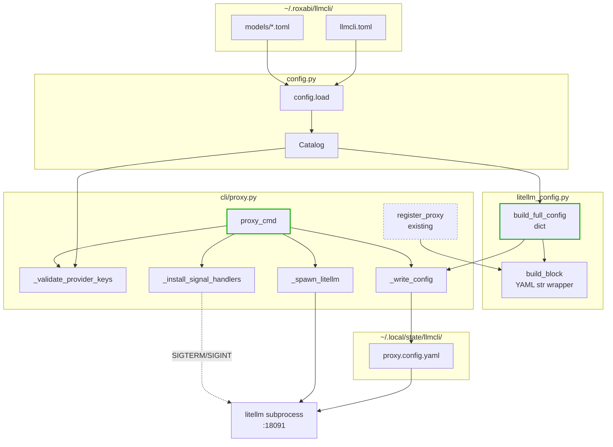

## Summary

Refactor `litellm_config.build_block` to expose a dict-returning `build_full_config`; add a new `proxy` Typer command in the existing `src/llmcli/cli/proxy.py` (sibling of `register-proxy`) that generates a complete LiteLLM YAML from the catalog, validates provider keys, and spawns `litellm` as a foreground subprocess on `:18091` with SIGTERM/SIGINT forwarding. Three vertical slices: refactor → dry-run (`--config-out`) → full lifecycle.

## Architecture

### Data flow



### File × function map

```mermaid
flowchart LR
    subgraph src_litellm_config["src/llmcli/litellm_config.py"]
        bfc[build_full_config]
        bb[build_block]
        wb[write_block]
        rp_helper[reload_proxy]
    end
    subgraph src_cli_proxy["src/llmcli/cli/proxy.py"]
        rp_cmd[register_proxy<br/>@app.command existing]
        proxy_cmd[proxy<br/>@app.command NEW]
        val_keys[_validate_provider_keys]
        write_cfg[_write_config]
        spawn[_spawn_litellm]
        signals[_install_signal_handlers]
    end
    subgraph tests_litellm["tests/test_litellm_config.py"]
        t_bfc[test_build_full_config_*]
        t_bb[test_build_block_*<br/>existing + new empty-list]
    end
    subgraph tests_proxy["tests/test_proxy_cmd.py NEW"]
        t_val[test_validate_provider_keys_*]
        t_write[test_write_config_*]
        t_dry[test_config_out_dry_run_*]
        t_spawn[test_spawn_litellm_*]
        t_sig[test_signal_forwarding_*]
        t_exit[test_exit_code_propagation_*]
    end

    bb --> bfc
    rp_cmd --> bb
    proxy_cmd --> val_keys
    proxy_cmd --> bfc
    proxy_cmd --> write_cfg
    proxy_cmd --> spawn
    proxy_cmd --> signals
    val_keys -.tested by.-> t_val
    write_cfg -.tested by.-> t_write
    proxy_cmd -.tested by.-> t_dry
    spawn -.tested by.-> t_spawn
    signals -.tested by.-> t_sig
    proxy_cmd -.tested by.-> t_exit
    bfc -.tested by.-> t_bfc
    bb -.tested by.-> t_bb
```

## Bootstrap Context

| Item | Path / value |
|---|---|
| Existing pattern: Typer command in same file | `src/llmcli/cli/proxy.py` (`register-proxy`) |
| Existing pattern: subprocess wrapper | `src/llmcli/engines/llamacpp.py` (`_common.py` helpers) |
| Existing pattern: catalog filter by machines | `src/llmcli/litellm_config.py:34-35` |
| Existing tests style | `tests/test_litellm_config.py` (block-builder), `tests/test_cli.py` (Typer runner) |
| Quality gates | `.claude/stack.yml`: file_length 300 LOC, folder_size 12 files, importlinter pre-push |
| stdout/stderr inheritance reference | LiteLLM logs are structured JSON — inherit directly; no Rich wrapping post-spawn |

## Agents

| Agent | Instances | Files touched | Task count |
|---|---|---|---|
| backend-dev | A (refactor), B (new cmd) | `src/llmcli/litellm_config.py`, `src/llmcli/cli/proxy.py` | 8 |
| tester | A (refactor), B (dry-run), C (lifecycle) | `tests/test_litellm_config.py`, `tests/test_proxy_cmd.py` (new) | 9 |
| doc-writer | — | `docs/guides/deployment.md` | 1 |
| devops | — | quality-gates verification | 1 |

## Wave Structure

5 waves, max 4 parallel agents. Elapsed ~3 sequential-equivalent units vs ~8 fully serial.

| Wave | Trigger | Agents | Tasks |
|------|---------|--------|-------|
| 1 | start | 3 ∥ | backend-dev-A: T1 · backend-dev-B: T6→T7 · tester-A: T3 |
| 2 | Wave 1 done | 4 ∥ | backend-dev-A: T2 · backend-dev-B: T8→T12 · tester-A: T4 · tester-B: T9 |
| 3 | Wave 2 done | 4 ∥ | backend-dev-B: T13→T14 · tester-A: T5 (RED-GATE) · tester-B: T10 · tester-C: T15 |
| 4 | Wave 3 done | 4 ∥ | tester-B: T11 (RED-GATE) · tester-C: T16→T17 · doc-writer: T19 · devops: T20 |
| 5 | Wave 4 done | 1 | tester-C: T18 (RED-GATE) |

### Budget

| Task | Items | Class | Est. ops | Split? |
|------|-------|-------|----------|--------|
| T1 build_full_config | 1 fn | bounded | 3 | — |
| T2 build_block wrapper | 1 fn | trivial | 2 | — |
| T3 test build_full_config | 4 cases | bounded | 4 | — |
| T4 test build_block empty-list | 1 case | trivial | 2 | — |
| T5 RED-GATE slice 1 | — | trivial | 1 | — |
| T6 proxy command shell | 1 fn | bounded | 3 | — |
| T7 _validate_provider_keys | 1 fn | bounded | 3 | — |
| T8 wire dry-run path | 1 control flow | judgmental | 5 | — |
| T9 test _validate_provider_keys | 3 cases | bounded | 3 | — |
| T10 test --config-out | 2 cases | bounded | 3 | — |
| T11 RED-GATE slice 2 | — | trivial | 1 | — |
| T12 _spawn_litellm | 1 fn | bounded | 3 | — |
| T13 _install_signal_handlers | 1 fn (poll-loop) | judgmental | 5 | — |
| T14 wire full lifecycle | 1 control flow | judgmental | 4 | — |
| T15 test _spawn_litellm | 2 cases | bounded | 3 | — |
| T16 test signal forwarding | 2 cases | judgmental | 4 | — |
| T17 test missing-binary | 2 cases | bounded | 3 | — |
| T18 RED-GATE slice 3 | — | trivial | 1 | — |
| T19 docs deployment.md | 1 section | bounded | 3 | — |
| T20 quality gates check | lint+importlinter | trivial | 2 | — |

**Total estimated ops: 58** — max per-task = 5 (T8, T13). None exceed 50/task threshold. No splits required.

## Consistency Report

| | |
|---|---|
| Spec success criteria | 8 automated + 3 manual smoke |
| Coverage (automated) | 8/8 — see Spec Trace column in micro-tasks |
| Untraced tasks | 0 |
| Uncovered criteria | 0 |
| Exemptions | Manual smokes (SC-9, SC-10, SC-11) → tested via mocks in T15/T16/T17; real-binary smoke deferred to `docs/guides/deployment.md` |

## Micro-Tasks

### Slice V1 — Refactor `build_block` → `build_full_config`

**T1 [P] · backend-dev-A · RED+GREEN · Difficulty 2**
- **Description:** Add `build_full_config(catalog, public_base_url, hostname=None) -> dict[str, Any]` to `litellm_config.py`. Returns `{"general_settings": {...}, "litellm_settings": {"drop_params": True}, "model_list": [...]}`. Empty model_list → empty list `[]`, NOT `None`.
- **File:** `src/llmcli/litellm_config.py`
- **Snippet:**
  ```python
  def build_full_config(
      catalog: Catalog, public_base_url: str, *, hostname: str | None = None
  ) -> dict[str, Any]:
      effective_hostname = hostname if hostname is not None else socket.gethostname()
      api_key_ref = f"os.environ/{catalog.host.api_key_env}"
      model_list = [_model_entry(name, spec, api_key_ref, public_base_url)
                    for name, spec in catalog.models.items()
                    if not spec.machines or effective_hostname in spec.machines]
      return {
          "general_settings": {"master_key": api_key_ref},
          "litellm_settings": {"drop_params": True},
          "model_list": model_list,
      }
  ```
- **Verify:** `uv run python -c "from llmcli.litellm_config import build_full_config; print(build_full_config.__doc__)"`
- **Expected:** No ImportError, function exists.
- **Spec trace:** SC-1 (build_full_config exists with exact keys)
- **Difficulty:** 2

**T2 · backend-dev-A · REFACTOR · Difficulty 2** (depends T1)
- **Description:** Refactor existing `build_block` to wrap `build_full_config`. Extract the same model_list, wrap in sentinel comments. Preserve `model_list: null` on empty (NOT `[]`) for register-proxy back-compat.
- **File:** `src/llmcli/litellm_config.py`
- **Snippet:**
  ```python
  def build_block(catalog, public_base_url, *, hostname=None) -> str:
      cfg = build_full_config(catalog, public_base_url, hostname=hostname)
      ml = cfg["model_list"]
      if ml:
          inner = yaml.safe_dump({"model_list": ml}, default_flow_style=False, sort_keys=False)
      else:
          inner = yaml.safe_dump({"model_list": None}, default_flow_style=False)
      return f"{BLOCK_START}\n{inner}{BLOCK_END}\n"
  ```
- **Verify:** `uv run pytest tests/test_litellm_config.py -k build_block -q`
- **Expected:** All existing build_block tests pass with no changes to assertions.
- **Spec trace:** SC-2 (build_block preserves YAML string sentinel form)
- **Difficulty:** 2

**T3 [P] · tester-A · RED · Difficulty 2** (depends T1)
- **Description:** Add tests covering `build_full_config`: (a) catalog with 1 remote + 1 local model returns dict with all 3 keys, (b) machines filter excludes models not matching hostname, (c) host.api_key_env propagates to general_settings.master_key, (d) empty filtered catalog → `model_list == []`.
- **File:** `tests/test_litellm_config.py`
- **Snippet:**
  ```python
  class TestBuildFullConfig:
      def test_returns_dict_with_required_keys(self, sample_catalog): ...
      def test_machines_filter_excludes_non_matching(self, sample_catalog): ...
      def test_master_key_from_api_key_env(self, sample_catalog): ...
      def test_empty_filter_yields_empty_list(self, sample_catalog): ...
  ```
- **Verify:** `uv run pytest tests/test_litellm_config.py::TestBuildFullConfig -v`
- **Expected:** 4 tests pass.
- **Spec trace:** SC-1
- **Difficulty:** 2

**T4 · tester-A · RED · Difficulty 1** (depends T2)
- **Description:** Add one regression test for `build_block` empty-list invariant: empty filtered catalog → output contains `model_list: null`, NOT `model_list: []`.
- **File:** `tests/test_litellm_config.py`
- **Verify:** `uv run pytest tests/test_litellm_config.py -k empty -v`
- **Expected:** Test passes; assertion: `"model_list: null" in build_block(catalog_with_no_matching, url)`.
- **Spec trace:** SC-2
- **Difficulty:** 1

**T5 · tester-A · RED-GATE · Difficulty 1** (depends T2, T3, T4)
- **Description:** Slice 1 RED-GATE — full `pytest tests/test_litellm_config.py` green.
- **Verify:** `uv run pytest tests/test_litellm_config.py -v`
- **Expected:** All tests (existing + new) pass.
- **Spec trace:** SC-1, SC-2
- **Difficulty:** 1

### Slice V2 — `llmcli proxy --config-out PATH` (dry-run)

**T6 [P] · backend-dev-B · GREEN · Difficulty 2** (no deps — same file as register-proxy but new function)
- **Description:** Add `proxy` Typer command shell in `src/llmcli/cli/proxy.py`. Accepts `--port` (default 18091, env `LLMCLI_PROXY_PORT`), `--host` (default `0.0.0.0`, env `LLMCLI_PROXY_HOST`), `--config-out` (Path | None). Body: TODO placeholder (filled in T8/T14).
- **File:** `src/llmcli/cli/proxy.py`
- **Snippet:**
  ```python
  @app.command()
  def proxy(
      port: int = typer.Option(18091, "--port", envvar="LLMCLI_PROXY_PORT"),
      host: str = typer.Option("0.0.0.0", "--host", envvar="LLMCLI_PROXY_HOST"),
      config_out: Optional[Path] = typer.Option(None, "--config-out"),
  ) -> None:
      """Run a managed LiteLLM proxy on :{port} from the catalog."""
      raise NotImplementedError  # filled in T8
  ```
- **Verify:** `uv run llmcli proxy --help`
- **Expected:** Help text lists the three options.
- **Spec trace:** U1, U2, U3, U4
- **Difficulty:** 2

**T7 [P] · backend-dev-B · GREEN · Difficulty 2** (no deps — pure helper)
- **Description:** Add `_validate_provider_keys(catalog) -> list[str]` helper in `cli/proxy.py`. Returns list of missing-key error strings; empty list = OK. For each `engine="remote"` spec on the effective host (machines filter applied), look up `providers.PROVIDERS[spec.provider].key_env`, check `os.environ.get(...)`; missing → append `f"Missing provider key for '{name}': set {key_env} (in environment or ~/.litellm/.env)"`.
- **File:** `src/llmcli/cli/proxy.py`
- **Snippet:**
  ```python
  def _validate_provider_keys(catalog: Catalog, hostname: str | None = None) -> list[str]:
      effective = hostname or socket.gethostname()
      errors: list[str] = []
      for name, spec in catalog.models.items():
          if spec.engine != "remote":
              continue
          if spec.machines and effective not in spec.machines:
              continue
          provider = PROVIDERS.get(spec.provider)
          if provider is None:
              continue  # surfaced as ValueError by build_full_config later
          if not os.environ.get(provider.key_env):
              errors.append(
                  f"Missing provider key for '{name}': set {provider.key_env} "
                  "(in environment or ~/.litellm/.env)"
              )
      return errors
  ```
- **Verify:** `uv run python -c "from llmcli.cli.proxy import _validate_provider_keys; print(_validate_provider_keys.__doc__)"`
- **Expected:** No ImportError.
- **Spec trace:** N2
- **Difficulty:** 2

**T8 · backend-dev-B · GREEN · Difficulty 3** (depends T6, T7, T2)
- **Description:** Wire `--config-out` dry-run path inside `proxy_cmd`: (1) `config.load()`, (2) `_validate_provider_keys` → if non-empty, print all errors to stderr and `raise typer.Exit(1)`, (3) `build_full_config(catalog, host.public_base_url)`, (4) write yaml.safe_dump to `config_out` (when set) OR to `~/.local/state/llmcli/proxy.config.yaml` (default state path). When `config_out` is set, `raise typer.Exit(0)` after write (dry-run). Spawn path stays NotImplementedError this slice — done in T14. State dir creation: `mkdir(parents=True, exist_ok=True, mode=0o700)`; file mode `0o600` via `os.umask` or `os.chmod` after write.
- **File:** `src/llmcli/cli/proxy.py`
- **Verify:** `LLMCLI_CONFIG=tests/fixtures/cloud-only.toml uv run llmcli proxy --config-out /tmp/out.yaml && yq .general_settings.master_key /tmp/out.yaml`
- **Expected:** Exits 0; file exists at `/tmp/out.yaml`; `master_key` resolves to `os.environ/LLMCLI_API_KEY`.
- **Spec trace:** U4, N3, N4
- **Difficulty:** 3

**T9 [P] · tester-B · RED · Difficulty 2** (depends T7)
- **Description:** Tests for `_validate_provider_keys`: (a) all keys set → returns `[]`, (b) one remote model with unset key → returns 1 error message containing the key_env name, (c) local models ignored (no validation).
- **File:** `tests/test_proxy_cmd.py` (new file)
- **Verify:** `uv run pytest tests/test_proxy_cmd.py::TestValidateProviderKeys -v`
- **Expected:** 3 tests pass.
- **Spec trace:** SC-4
- **Difficulty:** 2

**T10 · tester-B · RED · Difficulty 2** (depends T8)
- **Description:** Tests for `--config-out` dry-run: (a) writes a valid YAML to PATH and exits 0, (b) missing provider env → exit 1 + stderr contains key_env name, no file written.
- **File:** `tests/test_proxy_cmd.py`
- **Verify:** `uv run pytest tests/test_proxy_cmd.py -k config_out -v`
- **Expected:** 2 tests pass; uses Typer's `CliRunner` + monkeypatch for env vars.
- **Spec trace:** SC-3, SC-4
- **Difficulty:** 2

**T11 · tester-B · RED-GATE · Difficulty 1** (depends T5, T9, T10)
- **Description:** Slice 2 RED-GATE — slice-1 tests + slice-2 dry-run tests all green.
- **Verify:** `uv run pytest tests/test_litellm_config.py tests/test_proxy_cmd.py -v`
- **Expected:** Both files all green.
- **Spec trace:** SC-1..SC-4
- **Difficulty:** 1

### Slice V3 — Full lifecycle (spawn + signals + exit-code)

**T12 · backend-dev-B · GREEN · Difficulty 2** (depends T6)
- **Description:** Add `_spawn_litellm(config_path: Path, port: int, host: str) -> subprocess.Popen`. Locates `litellm` via `shutil.which("litellm")`; missing → typer.echo(error) + `raise typer.Exit(127)`. Spawns `Popen(["litellm", "--config", str(config_path), "--port", str(port), "--host", host])` with inherited stdout/stderr.
- **File:** `src/llmcli/cli/proxy.py`
- **Snippet:**
  ```python
  def _spawn_litellm(config_path: Path, port: int, host: str) -> subprocess.Popen:
      binary = shutil.which("litellm")
      if binary is None:
          err_console.print("litellm binary not found on PATH.")
          raise typer.Exit(127)
      return subprocess.Popen(
          [binary, "--config", str(config_path), "--port", str(port), "--host", host]
      )
  ```
- **Verify:** `uv run python -c "from llmcli.cli.proxy import _spawn_litellm"`
- **Expected:** No ImportError.
- **Spec trace:** N5, SC-8
- **Difficulty:** 2

**T13 · backend-dev-B · GREEN · Difficulty 3** (depends T12)
- **Description:** Add `_install_signal_handlers(child: subprocess.Popen, drain_timeout: float = 10.0)`. Installs SIGTERM + SIGINT handlers. Handler logic: call `child.terminate()`, then poll `child.poll()` in a loop sleeping 0.1s until either child exits OR drain_timeout elapses; if still alive after drain → `child.kill()`. Reentrant (second SIGINT during drain → immediate `child.kill()` + exit 130).
- **File:** `src/llmcli/cli/proxy.py`
- **Snippet:**
  ```python
  def _install_signal_handlers(child: subprocess.Popen, drain_timeout: float = 10.0) -> None:
      drain_state = {"active": False}
      def handler(signum, frame):
          if drain_state["active"] and signum == signal.SIGINT:
              child.kill()
              raise SystemExit(130)
          drain_state["active"] = True
          child.terminate()
          deadline = time.monotonic() + drain_timeout
          while time.monotonic() < deadline:
              if child.poll() is not None:
                  return
              time.sleep(0.1)
          child.kill()
      signal.signal(signal.SIGTERM, handler)
      signal.signal(signal.SIGINT, handler)
  ```
- **Verify:** `uv run python -c "from llmcli.cli.proxy import _install_signal_handlers"`
- **Expected:** No ImportError.
- **Spec trace:** N6, SC-6, SC-7
- **Difficulty:** 3

**T14 · backend-dev-B · GREEN · Difficulty 3** (depends T8, T13)
- **Description:** Wire full lifecycle in `proxy_cmd` (replace NotImplementedError): when `config_out is None`, write to default state path (`~/.local/state/llmcli/proxy.config.yaml`), spawn litellm via `_spawn_litellm`, install signal handlers, `child.wait()`, `raise typer.Exit(child.returncode)`. Edge: child OOM (`returncode == -9`) → `raise typer.Exit(137)` (POSIX convention).
- **File:** `src/llmcli/cli/proxy.py`
- **Verify:** `uv run llmcli proxy --help | grep -i "managed LiteLLM"`
- **Expected:** Command registered with the full docstring.
- **Spec trace:** U1, U5, SC-5, SC-7
- **Difficulty:** 3

**T15 [P] · tester-C · RED · Difficulty 2** (depends T12)
- **Description:** Tests for `_spawn_litellm` using `unittest.mock.patch`: (a) happy path → Popen called with `[litellm_path, "--config", str(p), "--port", "18091", "--host", "0.0.0.0"]`, (b) missing binary → typer.Exit(127) with "litellm binary not found" in stderr.
- **File:** `tests/test_proxy_cmd.py`
- **Verify:** `uv run pytest tests/test_proxy_cmd.py -k spawn -v`
- **Expected:** 2 tests pass.
- **Spec trace:** SC-5, SC-8
- **Difficulty:** 2

**T16 · tester-C · RED · Difficulty 3** (depends T13)
- **Description:** Tests for `_install_signal_handlers` using mock Popen: (a) SIGTERM → `child.terminate()` called, then `child.poll()` polled, no `kill()` if child exits within drain, (b) child still alive after drain_timeout (set to 0.05s for test speed) → `child.kill()` called. Use `monkeypatch.setattr(signal, "signal", ...)` to capture handler then invoke synthetically.
- **File:** `tests/test_proxy_cmd.py`
- **Verify:** `uv run pytest tests/test_proxy_cmd.py -k signal -v`
- **Expected:** 2 tests pass; no actual signals sent.
- **Spec trace:** SC-6
- **Difficulty:** 3

**T17 · tester-C · RED · Difficulty 2** (depends T14)
- **Description:** Test exit-code propagation: mock `_spawn_litellm` to return a fake Popen whose `wait()` returns 0 → command exits 0; returns 42 → command exits 42; returns -9 → command exits 137.
- **File:** `tests/test_proxy_cmd.py`
- **Verify:** `uv run pytest tests/test_proxy_cmd.py -k exit -v`
- **Expected:** 3 tests pass.
- **Spec trace:** SC-7
- **Difficulty:** 2

**T18 · tester-C · RED-GATE · Difficulty 1** (depends T11, T15, T16, T17)
- **Description:** Full Slice 3 RED-GATE — entire `pytest tests/` green; no regressions.
- **Verify:** `uv run pytest tests/ -q`
- **Expected:** All tests pass.
- **Spec trace:** SC-1..SC-8
- **Difficulty:** 1

### Slice V4 — Docs + lint (concurrent with V3)

**T19 [P] · doc-writer · GREEN · Difficulty 2** (depends T14)
- **Description:** Update `docs/guides/deployment.md` with a new section "Running `llmcli proxy` (managed LiteLLM portal)". Cover: command invocation, `--config-out` dry-run, expected health endpoint, manual smoke commands (curl liveliness, pgrep no-orphan), env vars (`LLMCLI_API_KEY`, `FIREWORKS_API_KEY`, etc.), expected exit codes.
- **File:** `docs/guides/deployment.md`
- **Verify:** `grep -c "llmcli proxy" docs/guides/deployment.md`
- **Expected:** ≥ 5 (heading + invocations + smoke).
- **Spec trace:** SC-9, SC-10, SC-11 (smoke documentation)
- **Difficulty:** 2

**T20 · devops · GREEN · Difficulty 1** (depends T14)
- **Description:** Run quality gates: `uv run ruff check .` + `uv run ruff format --check .` + `uv run lint-imports`. Verify file-length quality-gate: `wc -l src/llmcli/cli/proxy.py < 300`.
- **File:** (verification only)
- **Verify:** `uv run ruff check . && uv run ruff format --check . && uv run lint-imports && [ $(wc -l < src/llmcli/cli/proxy.py) -lt 300 ]`
- **Expected:** Exit 0 from each.
- **Spec trace:** SC-10, SC-11, SC-12
- **Difficulty:** 1

## Task Seeding Blueprint

<!-- Used by /implement to seed TaskCreate calls on session start.
     Format: T{n} | agent-instance | blockedBy | subject
     blockedBy refs T-numbers within this list (not session task IDs). -->

### Wave 1 — start, 3 ∥

| Task | Agent instance | blockedBy | Subject |
|------|---------------|-----------|---------|
| T1 | backend-dev-A | — | Add build_full_config returning dict |
| T6 | backend-dev-B | — | Add proxy Typer command shell |
| T7 | backend-dev-B | T6 | Add _validate_provider_keys helper |
| T3 | tester-A | T1 | Tests for build_full_config (4 cases) |

### Wave 2 — after T1, T7 land, 4 ∥

| Task | Agent instance | blockedBy | Subject |
|------|---------------|-----------|---------|
| T2 | backend-dev-A | T1 | Refactor build_block to wrap build_full_config |
| T8 | backend-dev-B | T2,T6,T7 | Wire --config-out dry-run path |
| T4 | tester-A | T2 | Test build_block empty-list invariant |
| T9 | tester-B | T7 | Tests for _validate_provider_keys |

### Wave 3 — after slice-1 tests pass + T8, 4 ∥

| Task | Agent instance | blockedBy | Subject |
|------|---------------|-----------|---------|
| T12 | backend-dev-B | T6 | Add _spawn_litellm helper |
| T5 | tester-A | T2,T3,T4 | RED-GATE Slice 1 |
| T10 | tester-B | T8 | Tests for --config-out dry-run |
| T15 | tester-C | T12 | Tests for _spawn_litellm |

### Wave 4 — after T12 + slice-1/2 gates, 4 ∥

| Task | Agent instance | blockedBy | Subject |
|------|---------------|-----------|---------|
| T13 | backend-dev-B | T12 | Add _install_signal_handlers (poll-loop) |
| T11 | tester-B | T5,T9,T10 | RED-GATE Slice 2 |
| T16 | tester-C | T13 | Tests for signal forwarding |
| T17 | tester-C | T14 | Tests for exit-code propagation |

### Wave 5 — after T13 + slice-2 gate, 4 ∥

| Task | Agent instance | blockedBy | Subject |
|------|---------------|-----------|---------|
| T14 | backend-dev-B | T8,T13 | Wire full lifecycle (spawn+signals+exit) |
| T19 | doc-writer | T14 | Update docs/guides/deployment.md |
| T20 | devops | T14 | Quality gates (ruff + importlinter + file-length) |
| T18 | tester-C | T11,T15,T16,T17 | RED-GATE Slice 3 (full pytest green) |

## Task IDs

<!-- Generated by /plan on Approve. Used by /implement to resume after restart. -->
- T1: #29 — Add build_full_config returning dict
- T2: #30 — Refactor build_block to wrap build_full_config
- T3: #31 — Tests for build_full_config (4 cases)
- T4: #32 — Test build_block empty-list invariant
- T5: #33 — RED-GATE Slice 1 (litellm_config tests green)
- T6: #34 — Add proxy Typer command shell
- T7: #35 — Add _validate_provider_keys helper
- T8: #36 — Wire --config-out dry-run path
- T9: #37 — Tests for _validate_provider_keys (3 cases)
- T10: #38 — Tests for --config-out dry-run (2 cases)
- T11: #39 — RED-GATE Slice 2 (slice 1 + dry-run tests green)
- T12: #40 — Add _spawn_litellm helper
- T13: #41 — Add _install_signal_handlers (poll-loop drain)
- T14: #42 — Wire full lifecycle (spawn+signals+exit)
- T15: #43 — Tests for _spawn_litellm (2 cases)
- T16: #44 — Tests for signal forwarding (2 cases)
- T17: #45 — Tests for exit-code propagation (3 cases)
- T18: #46 — RED-GATE Slice 3 (full pytest green)
- T19: #47 — Update docs/guides/deployment.md
- T20: #48 — Quality gates (ruff + importlinter + file-length)
