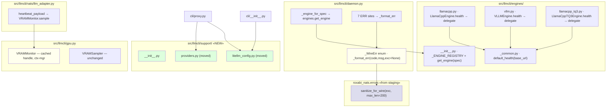
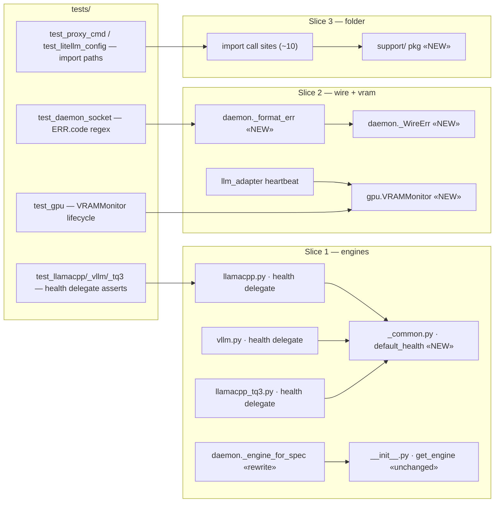

## Summary

Single PR with 3 sequential commits (one per slice). Slice 1 = engines hygiene (`default_health` + registry dedup). Slice 2 = wire protocol (`ERR.<code>` + `sanitize_for_wire`) + `VRAMMonitor`. Slice 3 = `src/llmcli/support/` folder reshape.

## Architecture

### Data flow



### File × Function map



## Bootstrap Context

- **Audit doc:** `artifacts/analyses/stage-axis-audit-2026-05-20.md` — concrete LOC counts and existing line refs.
- **Upstream:** lyra commit `acbd2b6e` adds `roxabi_nats.errors.sanitize_for_wire(exc, *, max_len=200) -> str`. Already on `staging` branch of lyra; requires `uv lock --upgrade-package roxabi-nats && uv sync` to pull into local `.venv`.
- **Existing tests:** `tests/test_llamacpp.py`, `test_vllm.py`, `test_llamacpp_tq3.py`, `test_daemon_socket.py`, `test_gpu.py`, `test_swap.py`, `test_proxy_cmd.py`, `test_litellm_config.py` — extend in place, no new test files.
- **ERR sites in `daemon.py`:** lines `105, 121, 136, 183, 187, 197, 215` (7 total; `197` + `215` have `{exc}` interpolation).
- **Import sites for Slice 3 reshape:** `src/llmcli/cli/proxy.py:17,18` · `src/llmcli/cli/__init__.py:21` · `tests/test_cli.py:615` · `tests/test_config.py:26` · `tests/test_proxy_cmd.py:16,647,658,671,683,693,703,719,730,741,764,775` · `tests/test_litellm_config.py:23-24,761,872,903,913` — bulk grep+sed safe.

## Agents

| Agent instance | Tasks | Files |
|---|---|---|
| backend-dev-A | T1, T2, T3, T4, T5, T7, T8, T9, T10, T11, T13, T14 | engines/, daemon.py, gpu.py, nats/llm_adapter.py, support/ |
| tester-A | T6, T12, T15, T16 | gates + final validation |

Total tasks: 16 (12 build + 4 gate/verify).

## Wave Structure

4 waves, 1 active agent at a time (single backend-dev session). Elapsed ~3–4 hours vs ~4–5 sequential.

| Wave | Trigger | Agents | Tasks |
|------|---------|--------|-------|
| 1 | start | backend-dev-A | T1→T2→T3→T4→T5 (Slice 1 build) |
| 2 | Wave 1 done | tester-A | T6 (RED-GATE 1: verify AC1+AC2, commit Slice 1) |
| 3 | Wave 2 done | backend-dev-A | T7→T8→T9→T10→T11 (Slice 2 build) |
| 4 | Wave 3 done | tester-A | T12 (RED-GATE 2: verify AC3+AC4, commit Slice 2) |
| 5 | Wave 4 done | backend-dev-A | T13→T14 (Slice 3 build) |
| 6 | Wave 5 done | tester-A | T15 (RED-GATE 3: verify AC5, commit Slice 3) |
| 7 | Wave 6 done | tester-A | T16 (final: AC6 pytest, AC7 gates, AC8 LOC) |

Slices are sequential (per spec) — no intra-slice parallelism since the engine consolidations have to land before the protocol changes; the protocol commit has to land before the folder move so import linter assesses a stable surface.

### Budget

| Task | Items | Class | Est. ops | Split? |
|------|-------|-------|----------|--------|
| T1 add default_health | 2 (impl+test) | bounded | 3 | — |
| T2-T4 delegate calls | 3 | trivial | 3 | — |
| T5 daemon dispatch | 1 | judgmental | 5 | — |
| T6 RED-GATE 1 | 1 | bounded | 3 | — |
| T7 uv lock + sync | 1 | bounded | 3 | — |
| T8 _WireErr + format_err | 1 | judgmental | 5 | — |
| T9 migrate 7 ERR sites | 7 | bounded | 5 | — |
| T10 VRAMMonitor ctx-mgr | 1 | judgmental | 5 | — |
| T11 adapter consume VRAMMonitor | 1 | judgmental | 5 | — |
| T12 RED-GATE 2 | 1 | bounded | 3 | — |
| T13 mv files to support/ | 3 | trivial | 3 | — |
| T14 update ~22 import sites | 22 | bounded | 5 | — |
| T15 RED-GATE 3 | 1 | bounded | 3 | — |
| T16 final validation | 4 (AC6-8 + LOC) | bounded | 5 | — |

**Total estimated ops: 56**

## Consistency Report

- AC1 → covered by T1, T2, T3, T4 (slice 1 build) + T6 (gate)
- AC2 → covered by T5 (daemon rewrite) + T6 (gate)
- AC3 → covered by T7, T8, T9 + T12 (gate)
- AC4 → covered by T10, T11 + T12 (gate)
- AC5 → covered by T13, T14 + T15 (gate)
- AC6 → covered by T16
- AC7 → covered by T16
- AC8 → covered by T16

Uncovered ACs: 0. Untraced tasks: 0.

## Micro-Tasks

### Slice 1 — Engines hygiene (Wave 1 + 2)

**T1 — Add `default_health(base_url)` to `engines/_common.py`** · backend-dev-A · `[P]` no · **GREEN** · 3 min · diff 2
- File: `src/llmcli/engines/_common.py`
- Add at module level:
  ```python
  def default_health(base_url: str) -> bool:
      """Return True iff <base_url>/health responds 2xx within 2s."""
      try:
          resp = httpx.get(f"{base_url}/health", timeout=2.0)
          return resp.status_code < 300
      except Exception:  # noqa: BLE001
          return False
  ```
- Verify: `uv run python -c "from llmcli.engines._common import default_health; print(default_health)"`
- Expected: function repr printed.
- Spec trace: SC-AC1 (N1)

**T2 — `LlamaCppEngine.health` delegates** · backend-dev-A · `[P]` no · **GREEN** · 2 min · diff 1
- File: `src/llmcli/engines/llamacpp.py:117-123`
- Replace 7-line body with: `return default_health(self.base_url(instance))` (import added top-of-file).
- Verify: `grep -A1 "def health" src/llmcli/engines/llamacpp.py | grep "default_health"`
- Spec trace: SC-AC1 (N2)

**T3 — `VLLMEngine.health` delegates** · backend-dev-A · `[P]` no · **GREEN** · 2 min · diff 1
- File: `src/llmcli/engines/vllm.py:79-85`
- Same delegation pattern as T2.
- Verify: `grep -A1 "def health" src/llmcli/engines/vllm.py | grep "default_health"`
- Spec trace: SC-AC1 (N3)

**T4 — Verify/migrate `LlamaCppTQ3Engine.health`** · backend-dev-A · `[P]` no · **GREEN** · 3 min · diff 2
- File: `src/llmcli/engines/llamacpp_tq3.py`
- Inspect: does it inherit `LlamaCppEngine.health` or override? If override duplicates body → migrate same as T2/T3. If inherits → no change (covered by T2).
- Verify: `python -c "from llmcli.engines.llamacpp_tq3 import LlamaCppTQ3Engine; import inspect; print(inspect.getsourcefile(LlamaCppTQ3Engine.health))"` resolves to `llamacpp.py` or `_common.py`, never `llamacpp_tq3.py`.
- Spec trace: SC-AC1 (N4)

**T5 — Rewrite `daemon._engine_for_spec`** · backend-dev-A · `[P]` no · **REFACTOR** · 5 min · diff 3
- File: `src/llmcli/daemon.py:152-178`
- New body (≤10 lines): remote-guard first, then `from llmcli.engines import get_engine; return get_engine(spec)`. Drop local imports (157-159) + local `_ENGINE_REGISTRY` (161-165).
- Verify: `grep -c "_ENGINE_REGISTRY" src/llmcli/daemon.py` returns 0; `grep "from .engines.llamacpp" src/llmcli/daemon.py` returns nothing.
- Spec trace: SC-AC2 (N5+N6)

**T6 — RED-GATE 1: verify AC1+AC2 + commit Slice 1** · tester-A · `[P]` no · **RED-GATE** · 3 min · diff 1
- Run:
  ```bash
  grep -rn '_ENGINE_REGISTRY: dict' src/ | wc -l    # expect: 1
  grep -rcE 'httpx\.get\(f"\{[^"]*\}/health"' src/llmcli/engines/ | grep -v '_common.py:0' | grep -v ':0$'  # expect: only _common.py
  uv run pytest tests/test_llamacpp.py tests/test_vllm.py tests/test_llamacpp_tq3.py tests/test_daemon_socket.py tests/test_swap.py -x
  ```
- Expected: 1, only `_common.py` matches, all tests green.
- On green: `git add src/llmcli/engines/ src/llmcli/daemon.py && git commit -m "refactor(engines): #53 consolidate health() + dedup _ENGINE_REGISTRY (slice 1/3)"`.
- Spec trace: SC-AC1, SC-AC2

### Slice 2 — Wire protocol + VRAM monitor (Wave 3 + 4)

**T7 — Refresh `roxabi-nats` to pull `sanitize_for_wire`** · backend-dev-A · `[P]` no · **GREEN** · 3 min · diff 1
- Cmd: `uv lock --upgrade-package roxabi-nats && uv sync`
- Verify: `uv run python -c "from roxabi_nats.errors import sanitize_for_wire; print(sanitize_for_wire(ValueError('x')))"`
- Expected: `x` printed (no error).
- Note: this updates `uv.lock` only — `pyproject.toml` pin stays `branch=staging`.
- Spec trace: SC-AC3 (prereq)

**T8 — Add `_WireErr` + `_format_err` helpers to `daemon.py`** · backend-dev-A · `[P]` no · **GREEN** · 5 min · diff 3
- File: `src/llmcli/daemon.py` (module-level, near other constants)
- Add:
  ```python
  from enum import StrEnum
  from roxabi_nats.errors import sanitize_for_wire

  class _WireErr(StrEnum):
      EMPTY = "EMPTY"
      UNKNOWN_CMD = "UNKNOWN_CMD"
      MISSING_ARG = "MISSING_ARG"
      UNKNOWN_MODEL = "UNKNOWN_MODEL"
      VRAM_BUDGET = "VRAM_BUDGET"
      SWAP_FAILED = "SWAP_FAILED"
      INTERNAL = "INTERNAL"

  def _format_err(code: _WireErr, msg: str = "", *, exc: BaseException | None = None) -> str:
      if exc is not None:
          msg = sanitize_for_wire(exc)
      return f"ERR.{code.value} {msg}".rstrip()
  ```
- Verify: `uv run python -c "from llmcli.daemon import _format_err, _WireErr; print(_format_err(_WireErr.INTERNAL))"`
- Expected: `ERR.INTERNAL`
- Spec trace: SC-AC3 (N7+N8)

**T9 — Migrate 7 ERR sites in `daemon.py` to `_format_err`** · backend-dev-A · `[P]` no · **GREEN** · 5 min · diff 3
- File: `src/llmcli/daemon.py` lines 105, 121, 136, 183, 187, 197, 215
- Map:
  - L105 `"ERR internal error"` → `_format_err(_WireErr.INTERNAL)`
  - L121 `"ERR empty command"` → `_format_err(_WireErr.EMPTY)`
  - L136 `f"ERR unknown command: {cmd}"` → `_format_err(_WireErr.UNKNOWN_CMD, cmd)`
  - L183 `"ERR swap requires model name"` → `_format_err(_WireErr.MISSING_ARG, "swap requires model name")`
  - L187 `f"ERR unknown model: {name}"` → `_format_err(_WireErr.UNKNOWN_MODEL, name)`
  - L197 `f"ERR vram budget exceeded: {exc}"` → `_format_err(_WireErr.VRAM_BUDGET, exc=exc)`
  - L215 `f"ERR swap failed: {exc}"` → `_format_err(_WireErr.SWAP_FAILED, exc=exc)`
- Verify: `grep -nE 'f"ERR [^.]' src/llmcli/daemon.py` returns 0 matches; `grep -nE '"ERR ' src/llmcli/daemon.py` only matches in docstrings (lines 10-11) — leave docstrings as-is or update them to reflect new format.
- Bonus: update daemon docstring (top of file) to document `ERR.<CODE> <msg>` format.
- Spec trace: SC-AC3 (N9)

**T10 — Add `VRAMMonitor` context manager to `gpu.py`** · backend-dev-A · `[P]` no · **GREEN** · 5 min · diff 3
- File: `src/llmcli/gpu.py` (after `VRAMSampler`, before `_QUANT_BITS`)
- Add:
  ```python
  class VRAMMonitor:
      """Context-managed nvml lifecycle with cached device handle.

      Usage:
          with VRAMMonitor() as vm:
              free_mb, used_mb = vm.sample()
      """
      def __init__(self, device_index: int = 0) -> None:
          self._index = device_index
          self._handle: object | None = None
          self._init_failed = False

      def __enter__(self) -> "VRAMMonitor":
          try:
              import pynvml  # type: ignore[import-untyped]
              pynvml.nvmlInit()
              self._handle = pynvml.nvmlDeviceGetHandleByIndex(self._index)
          except Exception:  # noqa: BLE001
              self._init_failed = True
          return self

      def __exit__(self, *exc_info) -> None:
          if self._handle is not None:
              try:
                  import pynvml  # type: ignore[import-untyped]
                  pynvml.nvmlShutdown()
              except Exception:  # noqa: BLE001
                  pass
              self._handle = None

      def sample(self) -> tuple[float, float]:
          """Return (free_mb, used_mb). (0.0, 0.0) on failure."""
          if self._handle is None:
              return (0.0, 0.0)
          try:
              import pynvml  # type: ignore[import-untyped]
              mem = pynvml.nvmlDeviceGetMemoryInfo(self._handle)
              return (mem.free / (1024**2), mem.used / (1024**2))
          except Exception:  # noqa: BLE001
              return (0.0, 0.0)
  ```
- Verify: `uv run python -c "from llmcli.gpu import VRAMMonitor; print(VRAMMonitor)"`
- Spec trace: SC-AC4 (N11+N12)

**T11 — Refactor `nats/llm_adapter.py` to use `VRAMMonitor`** · backend-dev-A · `[P]` no · **REFACTOR** · 5 min · diff 4
- File: `src/llmcli/nats/llm_adapter.py`
- Remove `self._nvml_handle`, `self._nvml_init_failed` from `__init__` (lines 76-77).
- Replace `_get_nvml_handle` (132-146) with: nothing (delete) or keep as thin wrapper around `VRAMMonitor` if other code depends on it (none does — verified via grep).
- Refactor `heartbeat_payload` (148-168) to instantiate a long-lived `VRAMMonitor` (entered once in `__init__` or `run`, exited in `_shutdown`) and call `vm.sample()` for fresh reads.
- Update `_shutdown` (173-185) to exit the monitor context.
- Verify: `grep -nE "pynvml\.nvmlInit|pynvml\.nvmlShutdown" src/llmcli/nats/llm_adapter.py` returns 0 matches; `grep -n "VRAMMonitor" src/llmcli/nats/llm_adapter.py` shows usage.
- Spec trace: SC-AC4 (N13)

**T12 — RED-GATE 2: verify AC3+AC4 + commit Slice 2** · tester-A · `[P]` no · **RED-GATE** · 3 min · diff 1
- Run:
  ```bash
  grep -nE '"ERR (?!\.)' src/llmcli/daemon.py | grep -v "^[0-9]*:.*#"  # expect: 0 (only docstring lines 10-11 if not yet updated)
  grep -nE 'pynvml\.nvmlInit' src/ -r  # expect: only gpu.py
  uv run pytest tests/test_daemon_socket.py tests/test_gpu.py tests/nats/ -x
  ```
- On green: `git add src/llmcli/daemon.py src/llmcli/gpu.py src/llmcli/nats/llm_adapter.py uv.lock && git commit -m "feat(daemon): #53 typed ERR.<code> wire frames + VRAMMonitor consolidation (slice 2/3)"`
- Spec trace: SC-AC3, SC-AC4

### Slice 3 — Folder reshape (Wave 5 + 6)

**T13 — Create `src/llmcli/support/` package + move files** · backend-dev-A · `[P]` no · **GREEN** · 3 min · diff 2
- Cmds:
  ```bash
  mkdir -p src/llmcli/support
  touch src/llmcli/support/__init__.py
  git mv src/llmcli/providers.py src/llmcli/support/providers.py
  git mv src/llmcli/litellm_config.py src/llmcli/support/litellm_config.py
  ```
- Verify: `ls src/llmcli/support/` shows 3 files; `find src/llmcli -maxdepth 1 -mindepth 1 -not -name __pycache__ | wc -l` ≤ 10.
- Spec trace: SC-AC5 (N14-N16)

**T14 — Update ~22 import sites** · backend-dev-A · `[P]` no · **GREEN** · 5 min · diff 4
- Map (rg-replace safe — exact prefix match):
  - `from llmcli.providers ` → `from llmcli.support.providers `
  - `from llmcli.litellm_config ` → `from llmcli.support.litellm_config `
- Files to update (validated by Step 1 grep):
  - `src/llmcli/cli/proxy.py:17,18`
  - `src/llmcli/cli/__init__.py:21`
  - `tests/test_cli.py:615`
  - `tests/test_config.py:26`
  - `tests/test_proxy_cmd.py:16` + 12 lazy-import sites (647,658,671,683,693,703,719,730,741,764,775)
  - `tests/test_litellm_config.py:23-24` + 4 lazy-import sites (761,872,903,913)
- Verify: `grep -rn "from llmcli\.providers\b\|from llmcli\.litellm_config\b" src/ tests/` returns 0 matches (the bare `llmcli.providers` and `llmcli.litellm_config` paths must be fully retired).
- Spec trace: SC-AC5 (N17)

**T15 — RED-GATE 3: verify AC5 + commit Slice 3** · tester-A · `[P]` no · **RED-GATE** · 3 min · diff 1
- Run:
  ```bash
  find src/llmcli -maxdepth 1 -mindepth 1 -not -name __pycache__ | wc -l    # expect ≤ 10
  uv run python -c "from llmcli.support.providers import PROVIDERS; from llmcli.support.litellm_config import build_block; print('ok')"
  uv run pytest tests/test_proxy_cmd.py tests/test_litellm_config.py tests/test_config.py tests/test_cli.py -x
  ```
- On green: `git add src/llmcli/support/ src/llmcli/cli/ tests/ && git commit -m "refactor(layout): #53 move providers + litellm_config to support/ subpackage (slice 3/3)"`
- Spec trace: SC-AC5

### Final validation (Wave 7)

**T16 — Full validation: AC6+AC7+AC8** · tester-A · `[P]` no · **REFACTOR** · 5 min · diff 1
- Run:
  ```bash
  uv run pytest -x                                                  # AC6
  uv run ruff check . && uv run ruff format --check .              # AC7
  bash tools/check_file_length.sh   # if exists, else manual: find src -name '*.py' | xargs awk 'END{print FILENAME, NR}' | awk '$2>300'
  uv run lint-imports                                               # AC7 (import linter)
  git diff --shortstat staging...HEAD -- src/llmcli                 # AC8: insertions ≤ deletions
  ```
- Expected: pytest 0 fails; ruff 0 issues; no file > 300 LOC; import linter 0 violations; net LOC ≤ 0.
- Spec trace: SC-AC6, SC-AC7, SC-AC8

## Task Seeding Blueprint

<!-- Used by /implement. blockedBy refs T-numbers, not session task IDs. -->

### Wave 1 — start, 1 agent

| Task | Agent instance | blockedBy | Subject |
|------|---------------|-----------|---------|
| T1 | backend-dev-A | — | Add default_health(base_url) to engines/_common.py |
| T2 | backend-dev-A | T1 | LlamaCppEngine.health delegates to default_health |
| T3 | backend-dev-A | T1 | VLLMEngine.health delegates to default_health |
| T4 | backend-dev-A | T1 | Verify/migrate LlamaCppTQ3Engine.health |
| T5 | backend-dev-A | T2,T3,T4 | Rewrite daemon._engine_for_spec to delegate to get_engine |

### Wave 2 — Wave 1 done, 1 agent (gate)

| Task | Agent instance | blockedBy | Subject |
|------|---------------|-----------|---------|
| T6 | tester-A | T5 | RED-GATE 1: verify AC1+AC2, commit Slice 1 |

### Wave 3 — Wave 2 done, 1 agent

| Task | Agent instance | blockedBy | Subject |
|------|---------------|-----------|---------|
| T7 | backend-dev-A | T6 | uv lock --upgrade-package roxabi-nats |
| T8 | backend-dev-A | T7 | Add _WireErr enum + _format_err helper to daemon.py |
| T9 | backend-dev-A | T8 | Migrate 7 daemon ERR sites to _format_err |
| T10 | backend-dev-A | T7 | Add VRAMMonitor context manager to gpu.py |
| T11 | backend-dev-A | T10 | Refactor nats/llm_adapter.py to consume VRAMMonitor |

### Wave 4 — Wave 3 done, 1 agent (gate)

| Task | Agent instance | blockedBy | Subject |
|------|---------------|-----------|---------|
| T12 | tester-A | T9,T11 | RED-GATE 2: verify AC3+AC4, commit Slice 2 |

### Wave 5 — Wave 4 done, 1 agent

| Task | Agent instance | blockedBy | Subject |
|------|---------------|-----------|---------|
| T13 | backend-dev-A | T12 | Create support/ package + git mv providers + litellm_config |
| T14 | backend-dev-A | T13 | Update ~22 import sites to llmcli.support.* |

### Wave 6 — Wave 5 done, 1 agent (gate)

| Task | Agent instance | blockedBy | Subject |
|------|---------------|-----------|---------|
| T15 | tester-A | T14 | RED-GATE 3: verify AC5, commit Slice 3 |

### Wave 7 — Wave 6 done, 1 agent (final)

| Task | Agent instance | blockedBy | Subject |
|------|---------------|-----------|---------|
| T16 | tester-A | T15 | Final validation: AC6 (pytest), AC7 (gates), AC8 (LOC) |

## Task IDs

<!-- Generated by /plan. Used by /implement to resume tasks on session restart. -->
- T1: 12 — Add default_health(base_url) to engines/_common.py
- T2: 13 — LlamaCppEngine.health delegates to default_health
- T3: 14 — VLLMEngine.health delegates to default_health
- T4: 15 — Verify/migrate LlamaCppTQ3Engine.health
- T5: 16 — Rewrite daemon._engine_for_spec to delegate to engines.get_engine
- T6: 17 — RED-GATE 1: verify AC1+AC2, commit Slice 1
- T7: 18 — uv lock --upgrade-package roxabi-nats + uv sync
- T8: 19 — Add _WireErr enum + _format_err helper to daemon.py
- T9: 20 — Migrate 7 daemon ERR sites to _format_err
- T10: 21 — Add VRAMMonitor context manager to gpu.py
- T11: 22 — Refactor nats/llm_adapter.py to consume VRAMMonitor
- T12: 23 — RED-GATE 2: verify AC3+AC4, commit Slice 2
- T13: 24 — Create support/ package + move providers + litellm_config
- T14: 25 — Update ~22 import sites to llmcli.support.*
- T15: 26 — RED-GATE 3: verify AC5, commit Slice 3
- T16: 27 — Final validation: AC6 (pytest) + AC7 (gates) + AC8 (LOC)
