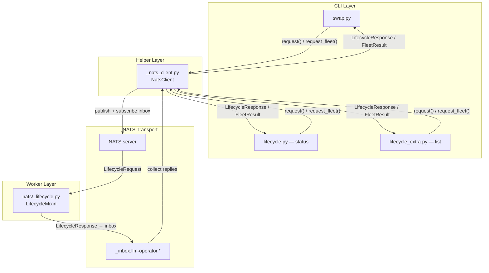
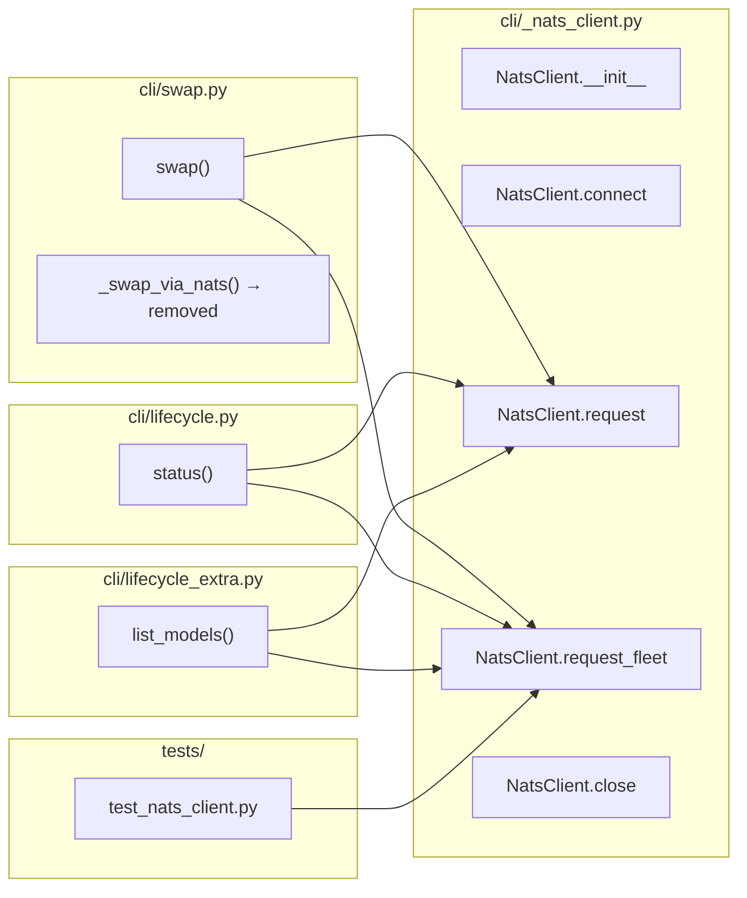

## Summary

Extract `cli/_nats_client.py` as a reusable NATS client with fleet broadcast + reply aggregation. Migrate `swap.py` from inline NATS to the helper. Add `--fleet` to `status`, `list`, and `swap`. Single-host default behaviour unchanged.

## Architecture

### Data flow

### File × Function map

## Bootstrap Context

v1 (#34) shipped single-host lifecycle via NATS. `_lifecycle_nats.py` (`lifecycle_nats_request`) handles single-host request/response for `stop`, `status`, `list`, `reload-catalog`. `swap.py` duplicates the connect/creds/drain pattern inline in `_swap_via_nats()`. The worker side (`nats/_lifecycle.py`) supports broadcast when `host=None` or `"*"` — all workers reply. The CLI has never sent broadcast requests.

## Agents

| Agent | Tasks | Files | Subject surface |
|-------|-------|-------|-----------------|
| backend-dev-A | T1, T2 | `_nats_client.py`, `swap.py` | nats-client, swap-migrate |
| backend-dev-B | T3, T4, T5 | `lifecycle.py`, `lifecycle_extra.py`, `swap.py` | status-fleet, list-fleet, swap-fleet |
| tester-A | T6 | `tests/test_nats_client.py`, `tests/test_cli_fleet.py` | nats-tests, fleet-tests |

## Wave Structure

3 waves, max 4 parallel agents. Elapsed ~1 session vs ~3 sequential.

| Wave | Trigger | Agents | Tasks |
|------|---------|--------|-------|
| 1 | start | backend-dev-A ∥ | T1 |
| 2 | T1 done | backend-dev-A ∥ backend-dev-B ∥ | T2 (dev-A) · T3,T4,T5 (dev-B) |
| 3 | Wave 2 done | tester-A ∥ | T6 |

### Budget — per task

| Task | Items | Class | Est. ops | Split? |
|------|-------|-------|----------|--------|
| T1 Write NatsClient | 4 methods + FleetResult | judgmental | 6 | — |
| T2 Migrate swap.py | replace inline block | bounded | 3 | — |
| T3 status --fleet | flag + table aggregation | bounded | 3 | — |
| T4 list --fleet | flag + merge aggregation | bounded | 3 | — |
| T5 swap --fleet | flag + broadcast acks | bounded | 3 | — |
| T6 Fleet tests | request_fleet + 3 command tests | judgmental | 6 | — |

**Total estimated ops: 24**

### Budget — per agent instance

| Instance | Tasks | Σ ops | Subjects | Split? |
|----------|-------|-------|----------|--------|
| backend-dev-A | T1, T2 | 9 | nats-client, swap-migrate | — |
| backend-dev-B | T3, T4, T5 | 9 | status-fleet, list-fleet, swap-fleet | — |
| tester-A | T6 | 6 | fleet-tests | — |

## Micro-Tasks

### V1 — Extract NatsClient + migrate swap

**T1 — Write `NatsClient` in `cli/_nats_client.py`**
- Description: Implement `NatsClient` class with `connect`, `request`, `request_fleet`, `close` plus `FleetResult` dataclass
- File path: `src/llmcli/cli/_nats_client.py`
- Code snippet: see spec § Data Model & Consumers
- Verify command: `python -c "from llmcli.cli._nats_client import NatsClient, FleetResult; print('import ok')"`
- Expected output: `import ok`
- Time estimate: 8–10 min
- [P] ✓
- Agent: backend-dev-A
- Subject: nats-client
- Spec trace: N1→N5
- Slice: V1
- Phase: GREEN
- Difficulty: 3

**T2 — Migrate `swap.py` to `NatsClient`**
- Description: Replace inline `_swap_via_nats` with `NatsClient.request()`
- File path: `src/llmcli/cli/swap.py`
- Code snippet: remove `_swap_via_nats`, import `NatsClient`, use `client = NatsClient(allow_anonymous=allow_anonymous); await client.connect(); resp = await client.request(...)`
- Verify command: `python -c "from llmcli.cli.swap import swap; print('import ok')"`
- Expected output: `import ok`
- Time estimate: 5 min
- [P] ✓
- Agent: backend-dev-A
- blockedBy: T1
- Subject: swap-migrate
- Spec trace: U1→N3
- Slice: V1
- Phase: GREEN
- Difficulty: 2

### V2 — status --fleet

**T3 — Add `--fleet` to `status`**
- Description: Add `--fleet` flag to `status()` command. When `--fleet`, use `NatsClient.request_fleet()` and render per-host table.
- File path: `src/llmcli/cli/lifecycle.py`
- Code snippet: `fleet: bool = typer.Option(False, "--fleet", help="Query all workers in the fleet.")`; branch on `fleet` → `request_fleet` with aggregation table
- Verify command: `grep -q "request_fleet" src/llmcli/cli/lifecycle.py && echo "found"`
- Expected output: `found`
- Time estimate: 5 min
- [P] ✓
- Agent: backend-dev-B
- blockedBy: T1
- Subject: status-fleet
- Spec trace: U4→N4
- Slice: V2
- Phase: GREEN
- Difficulty: 2

### V3 — list --fleet

**T4 — Add `--fleet` to `list`**
- Description: Add `--fleet` flag to `list_models()`. When `--fleet`, use `NatsClient.request_fleet()` and render merged model table with per-host running state.
- File path: `src/llmcli/cli/lifecycle_extra.py`
- Code snippet: same pattern as T3
- Verify command: `grep -q "request_fleet" src/llmcli/cli/lifecycle_extra.py && echo "found"`
- Expected output: `found`
- Time estimate: 5 min
- [P] ✓
- Agent: backend-dev-B
- blockedBy: T1
- Subject: list-fleet
- Spec trace: U6→N4
- Slice: V3
- Phase: GREEN
- Difficulty: 2

### V4 — swap --fleet

**T5 — Add `--fleet` to `swap`**
- Description: Add `--fleet` flag to `swap()`. When `--fleet`, use `NatsClient.request_fleet()` and render per-host OK/ERROR. Exit 1 if any host fails.
- File path: `src/llmcli/cli/swap.py`
- Code snippet: branch on `fleet` → `request_fleet`; iterate `FleetResult.responses/errors`; exit code logic
- Verify command: `grep -q "request_fleet" src/llmcli/cli/swap.py && echo "found"`
- Expected output: `found`
- Time estimate: 5 min
- [P] ✓
- Agent: backend-dev-B
- blockedBy: T1
- Subject: swap-fleet
- Spec trace: U2→N4
- Slice: V4
- Phase: GREEN
- Difficulty: 2

### Tests

**T6 — Write fleet tests**
- Description: RED tests for `NatsClient.request_fleet` (mock NATS replies), plus tests for `--fleet` on status/list/swap (mock `NatsClient`).
- File path: `tests/test_nats_client.py`, `tests/test_cli_fleet.py`
- Verify command: `uv run pytest tests/test_nats_client.py tests/test_cli_fleet.py -v`
- Expected output: `passed` for all tests
- Time estimate: 8–10 min
- [P] ✓
- Agent: tester-A
- blockedBy: T2,T3,T4,T5
- Subject: fleet-tests
- Spec trace: SC-1,SC-2,SC-3,SC-4,SC-5,SC-6,SC-7,SC-8,SC-9
- Slice: V1-V4
- Phase: GREEN
- Difficulty: 3

## Task Seeding Blueprint

### Wave 1 — no deps, 1 agent ∥

| Task | Agent instance | blockedBy | Subject |
|------|---------------|-----------|---------|
| T1 | backend-dev-A | — | nats-client |

### Wave 2 — after T1, 2 agents ∥

| Task | Agent instance | blockedBy | Subject |
|------|---------------|-----------|---------|
| T2 | backend-dev-A | T1 | swap-migrate |
| T3 | backend-dev-B | T1 | status-fleet |
| T4 | backend-dev-B | T1 | list-fleet |
| T5 | backend-dev-B | T1 | swap-fleet |

### Wave 3 — after Wave 2, 1 agent ∥

| Task | Agent instance | blockedBy | Subject |
|------|---------------|-----------|---------|
| T6 | tester-A | T2,T3,T4,T5 | fleet-tests |

## Task IDs

<!-- Generated by /plan. Used by /implement to resume tasks on session restart. -->
- T1: task-10 — nats-client
- T2: task-11 — swap-migrate
- T3: task-12 — status-fleet
- T4: task-13 — list-fleet
- T5: task-14 — swap-fleet
- T6: task-15 — fleet-tests
