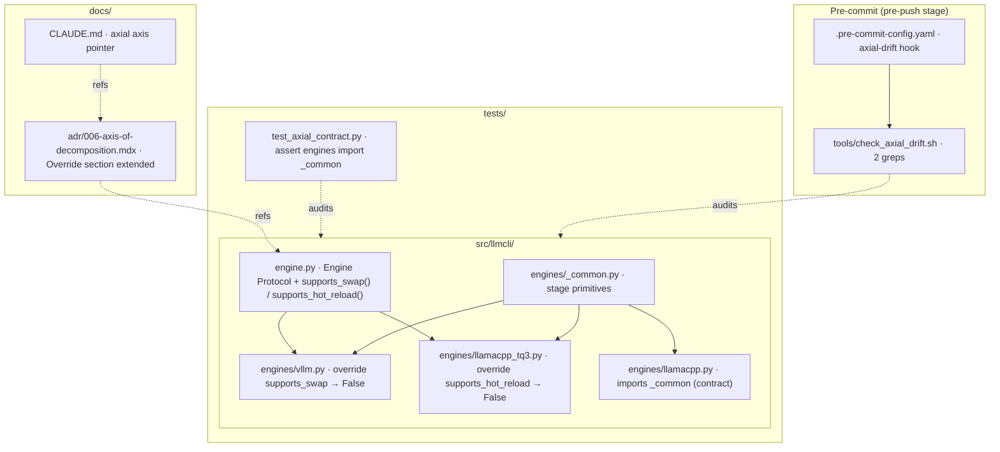
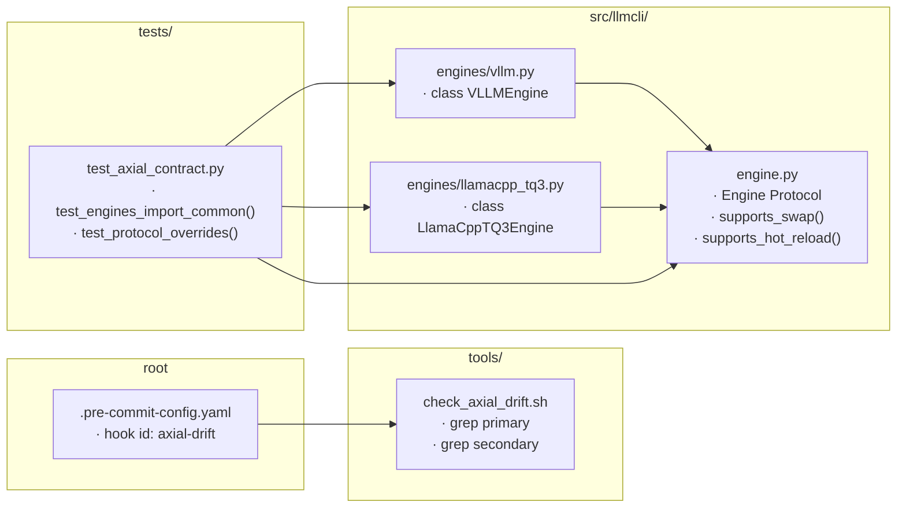

## Summary

Single PR, 3 waves, 6 micro-tasks. Wire the axial decomposition decision (ADR-006) into automation so future PRs cannot drift along the wrong axis silently. Code is already ~90% conformant — this is enforcement + documentation + test contract, not a refactor.

## Architecture

### Data flow



### File × function map



## Bootstrap Context

ADR-006 (commit `6d52b46`) defines the axial decomposition as `lifecycle_stages` primary. Current code already conforms — `engines/_common.py` provides `_wait_ready` / `default_health`; engine leaves delegate. NATS mixins (`LifecycleMixin + GenerationMixin + NatsAdapterBase`) follow the same pattern. The gap is **enforcement**: nothing prevents a future PR from re-implementing stage logic inside an engine leaf.

Predecessor issue #53 audited 5 pre-cascade risks. This issue closes the loop by automating the drift detection the ADR specifies.

## Agents

| Agent | Tasks | Files |
|---|---|---|
| devops | T1, T2 | `tools/check_axial_drift.sh`, `.pre-commit-config.yaml` |
| doc-writer-A | T3 | `docs/architecture/adr/006-axis-of-decomposition.mdx` (extend) |
| doc-writer-B | T6 | `CLAUDE.md` |
| backend-dev | T4 | `src/llmcli/engine.py`, `src/llmcli/engines/vllm.py`, `src/llmcli/engines/llamacpp_tq3.py` |
| tester | T5 | `tests/test_axial_contract.py` (new) |

## Wave Structure

3 waves, max 3 parallel agents. Elapsed ~3h vs ~5h sequential.

| Wave | Trigger | Agents | Tasks |
|---|---|---|---|
| 1 | start | 3 ∥ | devops: T1 · doc-writer-A: T3 · doc-writer-B: T6 |
| 2 | Wave 1 done | 2 ∥ | devops: T2 (needs T1 script ready) · backend-dev: T4 (needs T3 override spec) |
| 3 | Wave 2 done | 1 | tester: T5 (needs T4 Protocol shape) |

### Budget — per task

| Task | Items | Class | Est. ops | Split? |
|---|---|---|---|---|
| T1 drift script | 1 file, 2 greps | bounded | 3 | — |
| T2 pre-commit wire | 1 yaml block | trivial | 2 | — |
| T3 override protocol doc | 1 ADR section | judgmental | 4 | — |
| T4 Engine Protocol extension | 3 files | judgmental | 5 | — |
| T5 contract test | 1 test file, 2 cases | bounded | 3 | — |
| T6 CLAUDE.md note | 2 lines | trivial | 2 | — |

**Total estimated ops: 19**

### Budget — per agent instance

| Instance | Tasks | Σ ops | Subjects | Split? |
|---|---|---|---|---|
| devops | T1, T2 | 5 | hooks | — |
| doc-writer-A | T3 | 4 | architecture | — |
| doc-writer-B | T6 | 2 | onboarding | — |
| backend-dev | T4 | 5 | engine-protocol | — |
| tester | T5 | 3 | contract | — |

All instances ≤2 tasks ≤1 subject — no split required.

## Consistency Report

- **Acceptance criteria covered:** 5/5 (drift hook clean · drift hook fails on injected match · contract test green · CLAUDE.md mentions axial · CI green)
- **Uncovered:** none
- **Untraced tasks:** none
- **Exemptions:** none — out-of-scope items (#77 file split, Protocol `wait_ready`, ADR redirect banners) explicitly deferred

## Micro-Tasks

### T1 — Drift signal script [Wave 1, P]

- **File:** `tools/check_axial_drift.sh` (new)
- **Snippet:**
  ```bash
  #!/usr/bin/env bash
  set -euo pipefail
  PRIMARY='engines/(llamacpp|llamacpp_tq3|vllm).*def.*(wait|poll|ready)'
  SECONDARY='if.*engine_type.*(vllm|llamacpp)'
  fail=0
  grep -rE "$PRIMARY" src/llmcli/engines/ && { echo "✗ axial drift (primary): stage method redefined in engine leaf"; fail=1; } || true
  grep -rE "$SECONDARY" src/llmcli/nats/ src/llmcli/cli/ && { echo "✗ axial drift (secondary): dispatch-on-type"; fail=1; } || true
  exit $fail
  ```
- **Verify:** `bash tools/check_axial_drift.sh ; echo "exit=$?"`
- **Expected:** `exit=0` on current code
- **Time:** 5 min · **Agent:** devops · **Subject:** hooks · **Difficulty:** 2 · **Spec trace:** acceptance-1

### T2 — Wire axial-drift hook [Wave 2, depends T1]

- **File:** `.pre-commit-config.yaml`
- **Snippet:** insert into `repo: local` hooks block:
  ```yaml
  - id: axial-drift
    name: axial decomposition drift check
    entry: tools/check_axial_drift.sh
    language: system
    pass_filenames: false
    stages: [pre-push]
  ```
- **Verify:** `pre-commit run axial-drift --hook-stage pre-push --all-files`
- **Expected:** `axial-drift...Passed`
- **Time:** 3 min · **Agent:** devops · **Subject:** hooks · **Difficulty:** 1 · **Spec trace:** acceptance-1

### T3 — Override protocol documentation [Wave 1, P]

- **File:** `docs/architecture/adr/006-axis-of-decomposition.mdx` — extend the **Consequences > Negative** section with a new **Override Protocol** subsection
- **Content:**
  - Document the 2 known stage divergences: vllm `swap`=no-op (single model per process), llamacpp_tq3 `swap`=restart (no hot-swap)
  - Define the override contract: engines declare incapability via `supports_*()` methods returning `False`; default = `True`
  - When `supports_swap()` returns False, `_do_swap` in `nats/_lifecycle.py` MUST refuse the request with `ERR.UNSUPPORTED` (¬attempt fallback)
- **Verify:** `grep -A 5 "Override Protocol" docs/architecture/adr/006-axis-of-decomposition.mdx`
- **Expected:** new subsection present, ≥3 lines
- **Time:** 8 min · **Agent:** doc-writer-A · **Subject:** architecture · **Difficulty:** 2 · **Spec trace:** acceptance-3

### T4 — Engine Protocol extension [Wave 2, depends T3]

- **Files:** `src/llmcli/engine.py`, `src/llmcli/engines/vllm.py`, `src/llmcli/engines/llamacpp_tq3.py`
- **Snippet (engine.py):**
  ```python
  class Engine(Protocol):
      def start(self, spec: ModelSpec) -> EngineInstance: ...
      def stop(self, instance: EngineInstance) -> None: ...
      def health(self, instance: EngineInstance) -> bool: ...

      def supports_swap(self) -> bool:
          return True

      def supports_hot_reload(self) -> bool:
          return True
  ```
- **vllm.py override:** `def supports_swap(self) -> bool: return False`
- **llamacpp_tq3.py override:** `def supports_hot_reload(self) -> bool: return False`
- **Verify:** `uv run python -c "from llmcli.engines.vllm import VLLMEngine; assert VLLMEngine().supports_swap() is False"`
- **Expected:** no AssertionError
- **Time:** 12 min · **Agent:** backend-dev · **Subject:** engine-protocol · **Difficulty:** 3 · **Spec trace:** acceptance-3

### T5 — Axial contract test [Wave 3, depends T4]

- **File:** `tests/test_axial_contract.py` (new)
- **Snippet:**
  ```python
  from pathlib import Path
  import re

  ENGINES_DIR = Path(__file__).parent.parent / "src" / "llmcli" / "engines"
  LEAVES = {"llamacpp.py", "llamacpp_tq3.py", "vllm.py"}

  def test_engines_import_common():
      """Every engine leaf must import from _common — enforces stage primitive reuse (ADR-006)."""
      for leaf in LEAVES:
          src = (ENGINES_DIR / leaf).read_text()
          assert re.search(r"from \._common import|from \.\._common import|from llmcli\.engines\._common import", src), \
              f"{leaf} does not import from _common — stage logic must delegate (ADR-006 drift signal)"

  def test_protocol_overrides_present():
      """Engines with stage divergence must declare supports_* overrides (ADR-006 override protocol)."""
      from llmcli.engines.vllm import VLLMEngine
      from llmcli.engines.llamacpp_tq3 import LlamaCppTQ3Engine
      assert VLLMEngine().supports_swap() is False
      assert LlamaCppTQ3Engine().supports_hot_reload() is False
  ```
- **Verify:** `uv run pytest tests/test_axial_contract.py -v`
- **Expected:** 2 passed
- **Time:** 8 min · **Agent:** tester · **Subject:** contract · **Difficulty:** 2 · **Spec trace:** acceptance-3

### T6 — CLAUDE.md axial pointer [Wave 1, P]

- **File:** `CLAUDE.md`
- **Snippet:** add to the **Tech Stack** section (after the "Engines" table):
  ```markdown
  ### Architectural axis

  Primary axis of decomposition: **lifecycle_stages** (composition + stability).
  Engines are thin leaves composing stage primitives from `engines/_common.py` and NATS mixins. New engine = +1 file; do NOT re-implement stage logic. See [ADR-006](docs/architecture/adr/006-axis-of-decomposition.mdx).
  ```
- **Verify:** `grep -c "axial\|lifecycle_stages" CLAUDE.md`
- **Expected:** ≥2
- **Time:** 3 min · **Agent:** doc-writer-B · **Subject:** onboarding · **Difficulty:** 1 · **Spec trace:** acceptance-4

## Task Seeding Blueprint

<!-- Used by /implement to seed TaskCreate calls. Format: T{n} | agent-instance | blockedBy | subject -->

### Wave 1 — no deps, 3 agents ∥

| Task | Agent instance | blockedBy | Subject |
|---|---|---|---|
| T1 | devops | — | hooks |
| T3 | doc-writer-A | — | architecture |
| T6 | doc-writer-B | — | onboarding |

### Wave 2 — after Wave 1, 2 agents ∥

| Task | Agent instance | blockedBy | Subject |
|---|---|---|---|
| T2 | devops | T1 | hooks |
| T4 | backend-dev | T3 | engine-protocol |

### Wave 3 — after Wave 2, 1 agent

| Task | Agent instance | blockedBy | Subject |
|---|---|---|---|
| T5 | tester | T4 | contract |

## Task IDs

<!-- Generated by /plan. Used by /implement to resume tasks on session restart. -->
- T1: 1 — hooks (devops)
- T2: 2 — hooks (devops) — blockedBy: T1
- T3: 3 — architecture (doc-writer-A)
- T4: 4 — engine-protocol (backend-dev) — blockedBy: T3
- T5: 5 — contract (tester) — blockedBy: T4
- T6: 6 — onboarding (doc-writer-B)
