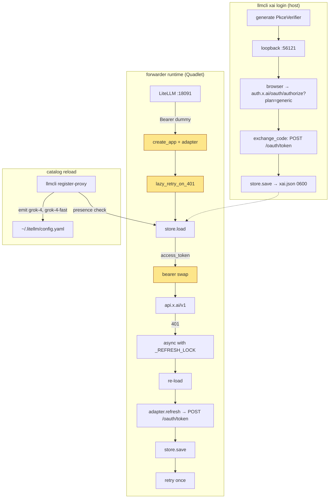
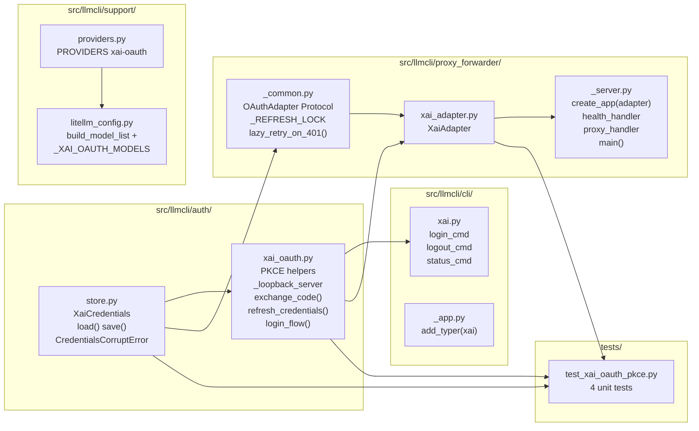

## Summary

Port Hermes' xAI OAuth + aiohttp forwarder pattern to llmCLI. 10 new files / 6 edits across `auth/`, `proxy_forwarder/`, `cli/xai.py`, `support/{providers,litellm_config}`, deploy, docs. 16 micro-tasks + 3 RED-GATE sentinels, 3 waves, 5 named agent instances + tester-A + doc-writer-A. DI'd `OAuthAdapter` Protocol + generic `lazy_retry_on_401` keep stage logic provider-agnostic; `_OAUTH_MANAGED` sentinel keeps PROVIDERS as single registry.

## Architecture

### Data flow



### File × Function map



## Agents

| Agent instance | Tasks | Files |
|---|---|---|
| backend-dev-A | T1, T2, T3 | `src/llmcli/auth/{__init__,store,xai_oauth}.py` |
| backend-dev-B | T7, T8, T9, T10 | `src/llmcli/proxy_forwarder/{__init__,_common,xai_adapter,_server}.py` |
| backend-dev-C | T5, T6, T11, T12 | `src/llmcli/cli/xai.py`, `cli/_app.py`, `support/{providers,litellm_config}.py` |
| devops-A | T13, T14, T15 | `deploy/quadlet/llmcli-xai-forwarder.container`, `deploy/quadlet.toml`, `deploy/install.sh` |
| tester-A | T4, T17 (RG1), T18 (RG2), T19 (RG3) | `tests/test_xai_oauth_pkce.py` + smoke verifications |
| doc-writer-A | T16 | `docs/QUADLET-DEPLOYMENT.md` |

→ `security-auditor` invoked at `/code-review` time (post-impl, advisory — not a build instance).

## Wave Structure

3 waves + 3 RED-GATE sentinels. Max 4 parallel agents (Wave 1). Elapsed ~1.5d vs ~3d sequential.

| Wave | Trigger | Agents | Tasks |
|------|---------|--------|-------|
| 1 | start | 4 ∥ | backend-dev-A: T1→T2→T3 · tester-A: T4 · *(backend-dev-B/C/devops-A idle)* |
| RG1 | Wave 1 done | tester-A | T17 (pytest exchange + corrupted PASS) |
| 2 | RG1 GREEN | 2 ∥ | backend-dev-B: T7→T8→T9→T10 · backend-dev-C: T5→T6→T11→T12 |
| RG2 | Wave 2 done | tester-A | T18 (pytest full + local forwarder curl smoke) |
| 3 | RG2 GREEN | 2 ∥ | devops-A: T13→T14→T15 · doc-writer-A: T16 |
| RG3 | Wave 3 done | tester-A | T19 (systemctl + LiteLLM end-to-end) |

### Budget — per task

| Task | Items | Class | Est. ops | Split? |
|------|-------|-------|----------|--------|
| T1 init | 1 file | trivial | 1 | — |
| T2 store.py | ~80 LOC, 5 fns | judgmental | 5 | — |
| T3 xai_oauth.py | ~250 LOC, port + PKCE | judgmental | 6 | — |
| T4 tests | 4 mocked tests | judgmental | 6 | — |
| T5 cli/xai.py | ~60 LOC, 3 Typer cmds | judgmental | 4 | — |
| T6 _app.py edit | 2 lines | trivial | 2 | — |
| T7 fwd init | 1 file | trivial | 1 | — |
| T8 _common.py | ~80 LOC, Protocol + lock | judgmental | 5 | — |
| T9 xai_adapter.py | ~60 LOC, impl Protocol | judgmental | 4 | — |
| T10 _server.py | ~180 LOC, aiohttp | judgmental | 6 | — |
| T11 providers.py | 1 line | trivial | 1 | — |
| T12 litellm_config | ~20 LOC, build_model_list ext | judgmental | 5 | — |
| T13 Quadlet | full unit | bounded | 3 | — |
| T14 quadlet.toml | 3 lines | trivial | 1 | — |
| T15 install.sh | unit + mkdir | bounded | 3 | — |
| T16 docs section | runbook ~50 LOC | judgmental | 4 | — |
| T17-T19 RED-GATEs | bash + curl | bounded | 2 each = 6 | — |

**Total estimated ops: ~63**

### Budget — per agent instance

| Instance | Tasks | Σ ops | Subjects | Split? |
|----------|-------|-------|----------|--------|
| backend-dev-A | T1, T2, T3 | 12 | auth, store | — |
| backend-dev-B | T7, T8, T9, T10 | 16 | forwarder, refresh | — |
| backend-dev-C | T5, T6, T11, T12 | 12 | cli, config | — |
| devops-A | T13, T14, T15 | 7 | quadlet, install | — |
| tester-A | T4, T17, T18, T19 | 12 | tests | — |
| doc-writer-A | T16 | 4 | docs | — |

All within caps (Σ ≤50 ops, |tasks| ≤4, subjects ≤2).

## Consistency Report

- **Spec ACs covered:** 19/19 (15 operator-observable + 4 test-only)
- **Affordances covered:** 13/13 (N1-N13, U1-U2, S1)
- **Uncovered:** none
- **Untraced micro-tasks:** none
- **Exemptions:** none

| AC# | Task(s) |
|---|---|
| AC1 `xai login` 0600 + plan=generic | T3, T5 |
| AC2 `xai logout` | T5 |
| AC3 `xai status` no token leak | T5 (impl), T2 (`__repr__` redact) |
| AC4 Quadlet install + start + roxabi.network | T13, T14, T15 |
| AC5 :18645 not host-published + path allowlist | T13 (¬PublishPort), T10 (ALLOWED_PATHS) |
| AC6 Bearer swap | T10 (proxy_handler) |
| AC7 401 → refresh → retry once + X-Llmcli-Reauth | T8 (lazy_retry_on_401) |
| AC8 Concurrent dedup (exactly 1 POST) | T8 (_REFRESH_LOCK) + T4 (test_concurrent_refresh_dedup) |
| AC9 /health post-restart | T10 (health_handler), T13 (HealthCmd) |
| AC10 register-proxy + WARNING stderr | T12 |
| AC11 LiteLLM end-to-end curl grok-4 | T19 (RG3) |
| AC12 `llmcli list` reflects creds presence | T12 (via build_model_list) |
| AC13 journalctl no JWT material | T2 (`__repr__`), T18 (RG2) |
| AC14 `XaiCredentials.__repr__` redact | T2 + T4 (covers) |
| AC15 docs section | T16 |
| Test AC: test_pkce_code_exchange | T4 |
| Test AC: test_lazy_refresh_on_401 | T4 |
| Test AC: test_concurrent_refresh_dedup | T4 |
| Test AC: test_credentials_corrupted | T4 |

## Micro-Tasks

> Each task: handler, file, code skeleton, verify command, expected output. Difficulty 1–5. Subject + spec trace + slice + phase.

---

### V1 — Auth core (Wave 1)

#### T1 — Create `auth/__init__.py`
- **Agent:** backend-dev-A · **Subject:** auth · **Difficulty:** 1 · **Phase:** GREEN · **[P]** with T4 · **Time:** 2min
- **File:** `src/llmcli/auth/__init__.py`
- **Skeleton:**
  ```python
  """OAuth credential management for llmCLI providers."""
  from .store import XaiCredentials, CredentialsCorruptError, load, save
  from .xai_oauth import login_flow, refresh_credentials

  __all__ = ["XaiCredentials", "CredentialsCorruptError", "load", "save",
             "login_flow", "refresh_credentials"]
  ```
- **Verify:** `python -c "from llmcli.auth import XaiCredentials, login_flow; print('ok')"`
- **Expected:** `ok`
- **Spec trace:** S1 setup · **Depends on:** —

#### T2 — Create `auth/store.py`
- **Agent:** backend-dev-A · **Subject:** store · **Difficulty:** 3 · **Phase:** GREEN · **Time:** 8min
- **File:** `src/llmcli/auth/store.py`
- **Skeleton:**
  ```python
  import fcntl, json, os
  from dataclasses import dataclass, field
  from pathlib import Path

  CREDENTIALS_DIR = Path.home() / ".roxabi" / "llmcli" / "credentials"
  XAI_CREDENTIALS_PATH = CREDENTIALS_DIR / "xai.json"

  class CredentialsCorruptError(RuntimeError): ...

  @dataclass(frozen=True)
  class XaiCredentials:
      access_token: str
      refresh_token: str
      id_token: str
      expires_at: int  # unix epoch seconds
      token_type: str = "Bearer"
      scope: str = ""

      def __repr__(self) -> str:
          return (f"XaiCredentials(access_token=***, refresh_token=***, "
                  f"id_token=***, expires_at={self.expires_at}, "
                  f"token_type={self.token_type!r}, scope={self.scope!r})")

  def load(path: Path = XAI_CREDENTIALS_PATH) -> XaiCredentials | None:
      if not path.exists():
          return None
      try:
          data = json.loads(path.read_text())
      except json.JSONDecodeError as exc:
          raise CredentialsCorruptError(
              f"credentials corrupted at {path} — re-run `llmcli xai login`"
          ) from exc
      return XaiCredentials(**data)

  def save(creds: XaiCredentials, path: Path = XAI_CREDENTIALS_PATH) -> None:
      path.parent.mkdir(parents=True, exist_ok=True, mode=0o700)
      tmp = path.with_suffix(".tmp")
      with open(tmp, "w") as f:
          fcntl.flock(f.fileno(), fcntl.LOCK_EX)
          json.dump({...}, f)
          fcntl.flock(f.fileno(), fcntl.LOCK_UN)
      os.chmod(tmp, 0o600)
      os.replace(tmp, path)  # atomic rename
  ```
- **Verify:** `python -c "from llmcli.auth.store import XaiCredentials; c = XaiCredentials('a','b','c',123); assert 'access_token=***' in repr(c); print('ok')"`
- **Expected:** `ok`
- **Spec trace:** S1, AC14 · **Depends on:** —

#### T3 — Create `auth/xai_oauth.py`
- **Agent:** backend-dev-A · **Subject:** auth · **Difficulty:** 4 · **Phase:** GREEN · **Time:** 20min
- **File:** `src/llmcli/auth/xai_oauth.py`
- **Skeleton:** Port from `hermes_cli/auth.py:97-203` (constants) + PKCE flow + token exchange. **MUST** include `plan=generic` in authorize URL. Constants:
  ```python
  XAI_OAUTH_ISSUER = "https://auth.x.ai"
  XAI_OAUTH_CLIENT_ID = "b1a00492-073a-47ea-816f-4c329264a828"
  XAI_OAUTH_SCOPE = "openid profile email offline_access grok-cli:access api:access"
  XAI_OAUTH_REDIRECT_PORT = 56121
  XAI_OAUTH_REDIRECT_PATH = "/callback"
  XAI_OAUTH_PLAN = "generic"  # load-bearing per Hermes

  def _build_authorize_url(challenge: str, state: str, nonce: str) -> str:
      # MUST include plan=generic
      ...

  def exchange_code(code: str, verifier: str) -> XaiCredentials: ...
  def refresh_credentials(creds: XaiCredentials) -> XaiCredentials: ...
  def login_flow() -> XaiCredentials: ...  # orchestrator
  ```
- **Verify:** `python -c "from llmcli.auth.xai_oauth import _build_authorize_url, XAI_OAUTH_PLAN; assert XAI_OAUTH_PLAN == 'generic'; u = _build_authorize_url('c','s','n'); assert 'plan=generic' in u; print('ok')"`
- **Expected:** `ok`
- **Spec trace:** U1, U2, N4, N5 · **Depends on:** T2 (uses XaiCredentials)

#### T4 — Create `tests/test_xai_oauth_pkce.py`
- **Agent:** tester-A · **Subject:** tests · **Difficulty:** 4 · **Phase:** RED · **[P]** with T1-T3 · **Time:** 25min
- **File:** `tests/test_xai_oauth_pkce.py`
- **Skeleton:**
  ```python
  import pytest
  from aioresponses import aioresponses
  from llmcli.auth.store import XaiCredentials, CredentialsCorruptError, load, save
  from llmcli.auth.xai_oauth import exchange_code, refresh_credentials, _build_authorize_url, XAI_OAUTH_PLAN

  def test_pkce_code_exchange(tmp_path, monkeypatch):
      # mock auth.x.ai /oauth/token; assert verifier + plan=generic in request
      ...

  @pytest.mark.asyncio
  async def test_lazy_refresh_on_401(tmp_path, monkeypatch):
      # mock api.x.ai 401 then 200; assert refresh POSTed + retry succeeded
      ...

  @pytest.mark.asyncio
  async def test_concurrent_refresh_dedup(tmp_path, monkeypatch):
      # 5 concurrent 401s; assert exactly 1 POST to /oauth/token
      ...

  def test_credentials_corrupted(tmp_path, monkeypatch):
      # write partial JSON; assert load() raises CredentialsCorruptError
      ...
  ```
- **Verify:** `uv run pytest tests/test_xai_oauth_pkce.py -v --collect-only`
- **Expected:** `4 tests collected`
- **Spec trace:** Test-only AC × 4 · **Depends on:** —

---

### RG1 — RED-GATE 1 (after Wave 1)

#### T17 — Verify Wave 1
- **Agent:** tester-A · **Subject:** tests · **Difficulty:** 1 · **Phase:** RED-GATE · **Time:** 2min
- **Verify:** `uv run pytest tests/test_xai_oauth_pkce.py::test_pkce_code_exchange tests/test_xai_oauth_pkce.py::test_credentials_corrupted -v`
- **Expected:** `2 passed`
- **Spec trace:** auth core unit gate · **Depends on:** T2, T3, T4

---

### V2 — CLI subcommand (Wave 2)

#### T5 — Create `cli/xai.py`
- **Agent:** backend-dev-C · **Subject:** cli · **Difficulty:** 3 · **Phase:** GREEN · **Time:** 10min
- **File:** `src/llmcli/cli/xai.py`
- **Skeleton:**
  ```python
  import typer
  from llmcli.auth import login_flow, store
  from llmcli.cli._app import console, err_console

  xai_app = typer.Typer(help="xAI / SuperGrok OAuth credentials")

  @xai_app.command("login")
  def login_cmd() -> None:
      creds = login_flow()
      console.print(f"✓ Logged in. expires_at={creds.expires_at}")

  @xai_app.command("logout")
  def logout_cmd() -> None:
      store.XAI_CREDENTIALS_PATH.unlink(missing_ok=True)

  @xai_app.command("status")
  def status_cmd() -> None:
      creds = store.load()
      if creds is None:
          console.print({"logged_in": False})
          raise typer.Exit(1)
      console.print({"logged_in": True, "expires_at": creds.expires_at,
                     "scope": creds.scope})
  ```
- **Verify:** `uv run llmcli xai --help`
- **Expected:** `login`, `logout`, `status` listed
- **Spec trace:** N1, N2, N3 · **Depends on:** T2, T3

#### T6 — Edit `cli/_app.py`
- **Agent:** backend-dev-C · **Subject:** cli · **Difficulty:** 1 · **Phase:** GREEN · **Time:** 1min
- **File:** `src/llmcli/cli/_app.py`
- **Edit:** Append at end:
  ```python
  from llmcli.cli.xai import xai_app  # noqa: E402
  app.add_typer(xai_app, name="xai")
  ```
- **Verify:** `uv run llmcli xai status` (with no creds)
- **Expected:** `{'logged_in': False}` + exit 1
- **Spec trace:** N1-N3 wiring · **Depends on:** T5

---

### V3 — Forwarder service (Wave 2, parallel with V2)

#### T7 — Create `proxy_forwarder/__init__.py`
- **Agent:** backend-dev-B · **Subject:** forwarder · **Difficulty:** 1 · **Phase:** GREEN · **Time:** 1min
- **File:** `src/llmcli/proxy_forwarder/__init__.py`
- **Skeleton:**
  ```python
  from ._common import OAuthAdapter, lazy_retry_on_401, ALLOWED_PATHS
  from ._server import create_app, main
  from .xai_adapter import XaiAdapter

  __all__ = ["OAuthAdapter", "lazy_retry_on_401", "ALLOWED_PATHS",
             "create_app", "main", "XaiAdapter"]
  ```
- **Verify:** `python -c "from llmcli.proxy_forwarder import create_app, XaiAdapter; print('ok')"`
- **Expected:** `ok`
- **Spec trace:** package setup · **Depends on:** T8, T9, T10 (for imports to work) — but file itself first

#### T8 — Create `proxy_forwarder/_common.py`
- **Agent:** backend-dev-B · **Subject:** refresh · **Difficulty:** 4 · **Phase:** GREEN · **Time:** 15min
- **File:** `src/llmcli/proxy_forwarder/_common.py`
- **Skeleton:**
  ```python
  import asyncio
  from pathlib import Path
  from typing import Protocol, Callable, Awaitable

  ALLOWED_PATHS = frozenset({
      "/v1/chat/completions", "/v1/completions", "/v1/responses",
      "/v1/embeddings", "/v1/models", "/health",
  })

  _REFRESH_LOCK = asyncio.Lock()

  class OAuthAdapter(Protocol):
      api_base: str
      credential_path: Path
      async def refresh(self, creds): ...

  async def lazy_retry_on_401(request_fn, refresh_fn, store_load, store_save):
      """Single-flight 401 retry: refresh-lock + re-read-on-entry."""
      creds = store_load()
      resp = await request_fn(creds.access_token)
      if resp.status != 401:
          return resp
      async with _REFRESH_LOCK:
          creds = store_load()  # may already be refreshed by another handler
          # check expires_at; if not expired, skip refresh, otherwise:
          new = await refresh_fn(creds)
          store_save(new)
          return await request_fn(new.access_token)
  ```
- **Verify:** `python -c "from llmcli.proxy_forwarder._common import OAuthAdapter, lazy_retry_on_401, ALLOWED_PATHS, _REFRESH_LOCK; assert '/v1/chat/completions' in ALLOWED_PATHS; print('ok')"`
- **Expected:** `ok`
- **Spec trace:** N8 · **Depends on:** T2

#### T9 — Create `proxy_forwarder/xai_adapter.py`
- **Agent:** backend-dev-B · **Subject:** forwarder · **Difficulty:** 2 · **Phase:** GREEN · **Time:** 7min
- **File:** `src/llmcli/proxy_forwarder/xai_adapter.py`
- **Skeleton:**
  ```python
  from llmcli.auth.store import XAI_CREDENTIALS_PATH, XaiCredentials
  from llmcli.auth.xai_oauth import refresh_credentials

  class XaiAdapter:
      api_base = "https://api.x.ai/v1"
      credential_path = XAI_CREDENTIALS_PATH

      async def refresh(self, creds: XaiCredentials) -> XaiCredentials:
          # delegates to sync auth.xai_oauth.refresh_credentials in executor
          loop = asyncio.get_running_loop()
          return await loop.run_in_executor(None, refresh_credentials, creds)
  ```
- **Verify:** `python -c "from llmcli.proxy_forwarder.xai_adapter import XaiAdapter; a = XaiAdapter(); assert a.api_base == 'https://api.x.ai/v1'; print('ok')"`
- **Expected:** `ok`
- **Spec trace:** N7 · **Depends on:** T2, T3, T8

#### T10 — Create `proxy_forwarder/_server.py`
- **Agent:** backend-dev-B · **Subject:** forwarder · **Difficulty:** 4 · **Phase:** GREEN · **Time:** 20min
- **File:** `src/llmcli/proxy_forwarder/_server.py`
- **Skeleton:** Port from `hermes_cli/proxy/server.py`. Provider-agnostic; adapter injected.
  ```python
  import os, time
  from aiohttp import web, ClientSession
  from llmcli.auth import store
  from ._common import OAuthAdapter, ALLOWED_PATHS, lazy_retry_on_401

  def create_app(adapter: OAuthAdapter) -> web.Application:
      app = web.Application()
      app.router.add_get("/health", _health(adapter))
      app.router.add_route("*", "/{path:.*}", _proxy(adapter))
      return app

  def _health(adapter):
      async def handler(req):
          try:
              creds = store.load(adapter.credential_path)
              return web.json_response({
                  "status": "ok",
                  "logged_in": creds is not None,
                  "expires_at": creds.expires_at if creds else None,
              })
          except store.CredentialsCorruptError:
              return web.json_response({"status": "ok", "logged_in": False}, status=200)
      return handler

  def _proxy(adapter):
      async def handler(req):
          if req.path not in ALLOWED_PATHS:
              return web.Response(status=404)
          body = await req.read()
          async def request_fn(token):
              # forward to adapter.api_base + req.path with token
              ...
          resp = await lazy_retry_on_401(request_fn, adapter.refresh,
                                          lambda: store.load(adapter.credential_path),
                                          lambda c: store.save(c, adapter.credential_path))
          if resp.status == 401:
              return web.Response(status=401, headers={"X-Llmcli-Reauth": "required"})
          return resp
      return handler

  def main():
      provider = os.environ.get("LLMCLI_FORWARDER_PROVIDER", "xai")
      if provider == "xai":
          from .xai_adapter import XaiAdapter
          adapter = XaiAdapter()
      web.run_app(create_app(adapter), host="0.0.0.0", port=18645)
  ```
- **Verify:** Start in background `python -m llmcli.proxy_forwarder._server & sleep 1 && curl -f http://localhost:18645/health`
- **Expected:** HTTP 200 with `{"status": "ok", "logged_in": ..., "expires_at": ...}`
- **Spec trace:** N6, N9 · **Depends on:** T8, T9

---

### V4 — LiteLLM integration (Wave 2)

#### T11 — Edit `support/providers.py`
- **Agent:** backend-dev-C · **Subject:** config · **Difficulty:** 1 · **Phase:** GREEN · **Time:** 1min
- **File:** `src/llmcli/support/providers.py`
- **Edit:** Add to `PROVIDERS` dict:
  ```python
  "xai-oauth": Provider("http://llmcli-xai-forwarder:18645/v1", "_OAUTH_MANAGED"),
  ```
- **Verify:** `python -c "from llmcli.support.providers import PROVIDERS; assert PROVIDERS['xai-oauth'].key_env == '_OAUTH_MANAGED'; print('ok')"`
- **Expected:** `ok`
- **Spec trace:** N12 · **Depends on:** —

#### T12 — Edit `support/litellm_config.py`
- **Agent:** backend-dev-C · **Subject:** config · **Difficulty:** 4 · **Phase:** GREEN · **Time:** 15min
- **File:** `src/llmcli/support/litellm_config.py`
- **Edit:** Add module-level constants + extend `build_model_list`:
  ```python
  _XAI_OAUTH_MODELS: list[str] = ["grok-4", "grok-4-fast"]
  _XAI_CREDENTIALS_PATH = Path.home() / ".roxabi" / "llmcli" / "credentials" / "xai.json"

  def build_model_list(catalog: dict, ...) -> list[dict]:
      models = []
      for name, spec in catalog.items():
          provider = PROVIDERS.get(spec["provider"])
          if provider is None: continue
          if provider.key_env == "_OAUTH_MANAGED":
              # OAuth-managed: gate on credentials presence; emit api_key="dummy"
              if not _XAI_CREDENTIALS_PATH.exists():
                  continue  # silently omit
              models.append({
                  "model_name": name,
                  "litellm_params": {"model": f"openai/{name}",
                                      "api_base": provider.api_base,
                                      "api_key": "dummy"},
              })
          else:
              models.append({"model_name": name, "litellm_params": {
                  "model": ..., "api_key": f"os.environ/{provider.key_env}"}})
      return models

  def emit_xai_oauth_warning_if_absent(stderr) -> None:
      """Called from cli/proxy.py:register_proxy."""
      if not _XAI_CREDENTIALS_PATH.exists():
          stderr.print("[yellow]WARNING:[/yellow] xAI credentials not found — "
                       "run `llmcli xai login` to enable Grok models")

  # Auto-extend catalog with hardcoded xAI-OAuth models when creds present:
  def _inject_xai_oauth_models(catalog: dict) -> None:
      if _XAI_CREDENTIALS_PATH.exists():
          for model in _XAI_OAUTH_MODELS:
              catalog.setdefault(model, {"provider": "xai-oauth"})
  ```
  Also call `emit_xai_oauth_warning_if_absent(err_console)` from `cli/proxy.py:register_proxy_cmd` (the call site — implementer adds the 1-line invocation).
- **Verify:** Without `xai.json`: `uv run llmcli register-proxy 2>&1 | grep WARNING` → contains warning; with creds present: `grep grok-4 ~/.litellm/config.yaml` → finds entry
- **Expected:** WARNING printed when absent; Grok block present when creds exist
- **Spec trace:** AC10, AC12 · **Depends on:** T11

---

### RG2 — RED-GATE 2 (after Wave 2)

#### T18 — Verify Wave 2
- **Agent:** tester-A · **Subject:** tests · **Difficulty:** 2 · **Phase:** RED-GATE · **Time:** 5min
- **Verify:**
  1. `uv run pytest tests/test_xai_oauth_pkce.py -v` (all 4 PASS — concurrent dedup + lazy retry now exercised)
  2. Start local forwarder: `python -m llmcli.proxy_forwarder._server &` then `curl -f http://localhost:18645/health` → 200
  3. Path allowlist: `curl -o /dev/null -w "%{http_code}" http://localhost:18645/wrong-path` → 404
- **Expected:** All 4 tests pass; health=200; wrong path=404
- **Spec trace:** AC5, AC6, AC7, AC8, AC9 (local pre-Quadlet) · **Depends on:** T10, T12

---

### V5 — Quadlet deploy (Wave 3)

#### T13 — Create `deploy/quadlet/llmcli-xai-forwarder.container`
- **Agent:** devops-A · **Subject:** quadlet · **Difficulty:** 3 · **Phase:** GREEN · **Time:** 10min
- **File:** `deploy/quadlet/llmcli-xai-forwarder.container`
- **Skeleton:**
  ```ini
  [Unit]
  Description=llmCLI xAI OAuth forwarder (:18645)
  StartLimitIntervalSec=60
  StartLimitBurst=5

  [Container]
  Image=ghcr.io/roxabi/llmcli:staging
  Label=io.containers.autoupdate=registry
  ContainerName=llmcli-xai-forwarder
  Network=roxabi.network
  # NO PublishPort — internal to roxabi.network only
  Volume=%h/.roxabi/llmcli/credentials:/home/llmcli/.roxabi/llmcli/credentials:rw,Z
  Environment=LLMCLI_FORWARDER_PROVIDER=xai
  Environment=LLMCLI_FORWARDER_PORT=18645
  UserNS=keep-id:uid=1502,gid=1502
  Exec=python -m llmcli.proxy_forwarder._server
  HealthCmd=curl -f http://localhost:18645/health || exit 1
  HealthInterval=30s
  HealthStartPeriod=15s
  NoNewPrivileges=true
  DropCapability=all

  [Service]
  Restart=on-failure
  RestartSec=10
  TimeoutStopSec=20s

  [Install]
  WantedBy=default.target
  ```
- **Verify:** `/usr/lib/systemd/system-generators/podman-user-generator --user --dryrun < deploy/quadlet/llmcli-xai-forwarder.container 2>&1` (or `quadlet -user -dryrun`)
- **Expected:** Valid systemd unit output without warnings; if quadlet binary unavailable, fall back to `podman quadlet --user list` post-install
- **Spec trace:** N10 · **Depends on:** T10

#### T14 — Edit `deploy/quadlet.toml`
- **Agent:** devops-A · **Subject:** quadlet · **Difficulty:** 1 · **Phase:** GREEN · **Time:** 2min
- **File:** `deploy/quadlet.toml`
- **Edit:** Add component entry:
  ```toml
  [component.xai-forwarder]
  unit = "llmcli-xai-forwarder.container"
  host_roles = ["lyra-hub"]  # M₁ only
  secrets = []  # credentials via bind-mount, not Podman secrets
  ```
- **Verify:** `grep -A3 "\[component.xai-forwarder\]" deploy/quadlet.toml`
- **Expected:** entry present with host_roles=["lyra-hub"]
- **Spec trace:** N13 · **Depends on:** —

#### T15 — Edit `deploy/install.sh`
- **Agent:** devops-A · **Subject:** install · **Difficulty:** 2 · **Phase:** GREEN · **Time:** 5min
- **File:** `deploy/install.sh`
- **Edits:**
  1. Add `llmcli-xai-forwarder.container` to the unit installation loop
  2. In the Directories section: `mkdir -p "${DATA_DIR}/credentials" && chmod 700 "${DATA_DIR}/credentials"`
- **Verify:** `bash -n deploy/install.sh && bash deploy/install.sh && ls -ld ~/.roxabi/llmcli/credentials`
- **Expected:** Syntax OK; idempotent re-run; `credentials/` dir exists with mode 700
- **Spec trace:** N13, AC1 (0700 dir) · **Depends on:** T13

---

### Wave 3 (parallel — V5 doc)

#### T16 — Edit `docs/QUADLET-DEPLOYMENT.md`
- **Agent:** doc-writer-A · **Subject:** docs · **Difficulty:** 2 · **Phase:** GREEN · **[P]** with T13-T15 · **Time:** 12min
- **File:** `docs/QUADLET-DEPLOYMENT.md`
- **Edit:** Add section "## xAI OAuth setup":
  - Subsection: One-time login (`llmcli xai login` flow, expected output, what to do if browser doesn't open)
  - Subsection: Status checks (`llmcli xai status` + `systemctl --user status llmcli-xai-forwarder` + `curl :18645/health`)
  - Subsection: Refresh expiry behavior (access_token ~1h auto-refresh; refresh_token expiry after ~30d offline → re-login)
  - Subsection: Logout / secret rotation (`llmcli xai logout` + `systemctl --user restart llmcli-xai-forwarder`)
- **Verify:** `grep -c "## xAI OAuth setup" docs/QUADLET-DEPLOYMENT.md`
- **Expected:** `1`
- **Spec trace:** AC15 · **Depends on:** T5, T13

---

### RG3 — RED-GATE 3 (after Wave 3) — final smoke

#### T19 — End-to-end verification
- **Agent:** tester-A · **Subject:** tests · **Difficulty:** 3 · **Phase:** RED-GATE · **Time:** 10min
- **Preconditions:** `llmcli xai login` was run with a real SuperGrok account (operator-provided, not automated in CI)
- **Verify:**
  1. `systemctl --user start llmcli-xai-forwarder && sleep 5 && systemctl --user status llmcli-xai-forwarder` → active (running) with HealthState=healthy
  2. `podman exec llmcli curl -f http://llmcli-xai-forwarder:18645/health` → 200, `logged_in: true`, `expires_at: <future int>`
  3. `ss -tlnp | grep 18645` (on host) → no output (¬PublishPort verified)
  4. `llmcli register-proxy` → block written, `grep -E '(grok-4|grok-4-fast)' ~/.litellm/config.yaml` returns 2 lines
  5. `curl -sf http://localhost:18091/v1/chat/completions -H "Authorization: Bearer dummy" -d '{"model":"grok-4","messages":[{"role":"user","content":"reply with the word pong"}]}' | jq -r '.choices[0].message.content'` → non-empty response containing "pong" (or any valid Grok reply)
  6. `journalctl --user -u llmcli-xai-forwarder --since "5 minutes ago" | grep -cE 'eyJ[A-Za-z0-9_-]+\.[A-Za-z0-9_-]+'` → 0
- **Expected:** Steps 1-6 all PASS
- **Spec trace:** AC4, AC5, AC9, AC10, AC11, AC13 · **Depends on:** T13, T14, T15, T16

---

## Task Seeding Blueprint

<!-- Used by /implement to seed TaskCreate calls on session start.
     Format: T{n} | agent-instance | blockedBy | subject
     blockedBy refs T-numbers within this list (not session task IDs).
     Wave 1 → RG1 → Wave 2 → RG2 → Wave 3 → RG3 -->

### Wave 1 — no deps, 4 agents ∥ (3 backend-dev-A serialized + 1 tester-A parallel)

| Task | Agent instance | blockedBy | Subject |
|------|---------------|-----------|---------|
| T1 | backend-dev-A | — | auth |
| T2 | backend-dev-A | T1 | store |
| T3 | backend-dev-A | T2 | auth |
| T4 | tester-A | — | tests |

### RG1 — after Wave 1

| Task | Agent instance | blockedBy | Subject |
|------|---------------|-----------|---------|
| T17 | tester-A | T2, T3, T4 | tests |

### Wave 2 — after RG1, 2 agents ∥ (backend-dev-B serial 4 tasks + backend-dev-C serial 4 tasks)

| Task | Agent instance | blockedBy | Subject |
|------|---------------|-----------|---------|
| T8 | backend-dev-B | T17 | refresh |
| T9 | backend-dev-B | T8 | forwarder |
| T10 | backend-dev-B | T9 | forwarder |
| T7 | backend-dev-B | T10 | forwarder |
| T5 | backend-dev-C | T17 | cli |
| T6 | backend-dev-C | T5 | cli |
| T11 | backend-dev-C | T17 | config |
| T12 | backend-dev-C | T11 | config |

### RG2 — after Wave 2

| Task | Agent instance | blockedBy | Subject |
|------|---------------|-----------|---------|
| T18 | tester-A | T7, T10, T12 | tests |

### Wave 3 — after RG2, 2 agents ∥

| Task | Agent instance | blockedBy | Subject |
|------|---------------|-----------|---------|
| T13 | devops-A | T18 | quadlet |
| T14 | devops-A | T13 | quadlet |
| T15 | devops-A | T14 | install |
| T16 | doc-writer-A | T18 | docs |

### RG3 — after Wave 3

| Task | Agent instance | blockedBy | Subject |
|------|---------------|-----------|---------|
| T19 | tester-A | T15, T16 | tests |

## Task IDs

<!-- Generated by /plan 2026-05-27. Used by /implement to resume tasks on session restart. -->

| T# | Task ID | Subject |
|----|---------|---------|
| T1 | 13 | auth |
| T2 | 14 | store |
| T3 | 15 | auth |
| T4 | 16 | tests |
| T17 (RG1) | 17 | tests |
| T5 | 18 | cli |
| T6 | 19 | cli |
| T7 | 20 | forwarder |
| T8 | 21 | refresh |
| T9 | 22 | forwarder |
| T10 | 23 | forwarder |
| T11 | 24 | config |
| T12 | 25 | config |
| T18 (RG2) | 26 | tests |
| T13 | 27 | quadlet |
| T14 | 28 | quadlet |
| T15 | 29 | install |
| T16 | 30 | docs |
| T19 (RG3) | 31 | tests |
