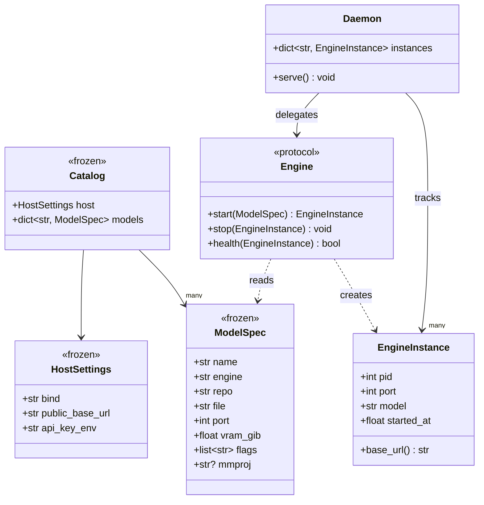
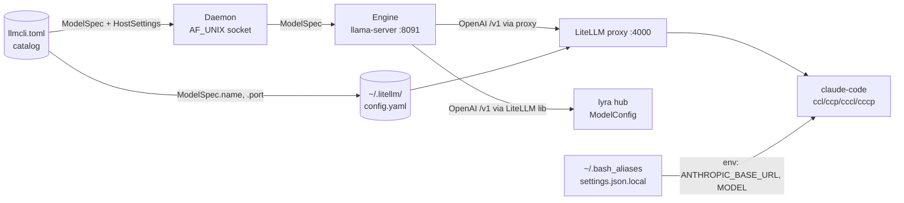

## Context

Source: [`artifacts/analyses/1-llmcli-v1-strategy-analysis.mdx`](../analyses/1-llmcli-v1-strategy-analysis.mdx).
Issue: [#1](https://github.com/Roxabi/llmCLI/issues/1).

Strategy decisions are frozen (analysis §3). P0 verification and P1 scaffold are already in the repo (commits `ac346e2`, `585c362`, `6985f66`). This spec covers the remaining phases **P2 → P6**; P7 (vLLM) is explicitly deferred.

The spec will be split into sub-issues via Gate 2.5 — one per phase — because each phase is independently demo-able and has its own gate in the analysis rollout plan.

---

## Non-goals (v1)

- **vLLM backend** (P7) — `engines/vllm.py` must NOT be created in v1. Deferred as `llmcli[vllm]` optional extra when demand materialises.
- **NATS adapter** — all consumption routes through LiteLLM (lib for lyra, proxy for claude-code).
- **Training, fine-tuning, RAG, embeddings** — serving only.
- **Cross-host `register-proxy` discovery** — each host registers its own local catalog into its own `~/.litellm/config.yaml`. No SSH, no shared mount, no remote catalog read. A `--hosts` flag is reserved but not implemented.
- **Concurrent multi-model serving** — `dict[str, EngineInstance]` is day-one state, but v1 CLI only exercises sequential swap (stop-old → start-new). Two engines active simultaneously is out of scope.
- **Fast model distinct from default** — v1 sets `ANTHROPIC_SMALL_FAST_MODEL` equal to the default (per analysis §5). `cccl` / `cccp` diverge from `ccl` / `ccp` only in env-var name, not value.

---

## Goal

Serve local LLMs on the Roxabi LAN with a single `make llm` / `llmcli` interface, registered into the shared LiteLLM proxy, consumable by lyra (per-agent `ModelConfig`) and claude-code (via `ccl` / `ccp` / `cccl` / `cccp` aliases).

---

## Users

| User | Surface | Interaction |
|---|---|---|
| **Mickael** (dev, `roxabitower`) | `make llm`, `llmcli` CLI, `ccl` / `cccl` aliases | On-demand heavy-model sessions; claude-code routed to local GPU |
| **Mickael** (ops, `roxabituwer`) | `make deploy`, `make remote status` | Deploy small always-on model; inspect supervisor state |
| **lyra hub** (prod, after #665) | LiteLLM lib via `ModelConfig(backend="litellm", base_url=...)` | Per-agent routing to local heavy model or prod small model; automatic fallback when local is off |
| **claude-code** (`ccl` / `cccl`) | Anthropic shim at LiteLLM proxy `:4000` | OpenAI-format requests forwarded to `llama-server` |

---

## Expected Behavior

**Cold start, local heavy model.** Mickael runs `make llm` on `roxabitower`. Supervisor starts `llmcli_serve`, which reads the default model from `~/.config/llmcli/llmcli.toml`, launches the TurboQuant `llama-server` binary with the catalog flags (`-ngl 99 -c 8192 -ctk q4_0 -ctv tq3_0 -fa on --jinja`), binds `0.0.0.0:8091`, and opens the AF_UNIX management socket. `llmcli status` reports PID, port, uptime, VRAM. `curl localhost:8091/v1/chat/completions` returns a valid OpenAI response.

**Claude-code routing.** Mickael runs `ccl` in a terminal. The alias exports `ANTHROPIC_BASE_URL=http://localhost:4000`, `ANTHROPIC_MODEL=qwen3.6-35b-a3b-tq3`, and `ANTHROPIC_API_KEY` from `~/.config/llmcli/api_key`. Claude-code talks to the LiteLLM proxy, which forwards to `roxabitower.lan:8091/v1` using the namespaced block `llmcli register-proxy` wrote into `~/.litellm/config.yaml`. Responses stream back. `ccp` / `cccp` work identically but point at prod. `cccl` / `cccp` select the fast model when distinct from the default.

**Hot-swap.** Mickael runs `llmcli swap qwen3-14b-q5`. The daemon stops the current engine instance, starts the new one with the new model's catalog-declared port and flags, and `llmcli status` reflects the new model + its port. No supervisor restart. If the new port differs from the old one, the daemon triggers `register-proxy` automatically so the LiteLLM block reflects the live port.

**Ad-hoc model trial.** Mickael adds a new entry to `~/.config/llmcli/llmcli.toml`, runs `llmcli pull <new-name>`, then `llmcli swap <new-name>` (if serve is already running) or `make llm` (if cold). The catalog is the single source of truth; no new flags or CLI args are required to register a model beyond the TOML entry. Direct `llmcli serve <name>` without supervisor is supported for debugging but is not the primary path — supervisor owns the long-lived process.

**Prod always-on.** On `roxabituwer`, `lyra.service` linger starts supervisord, which starts `llmcli_serve` with `autostart=true`. The prod catalog pins `qwen3-8b-q4` (fits 10 GB VRAM). `llmcli list` on prod shows it running. Crashes auto-restart via supervisor.

**Lyra consumption.** After lyra#665 lands, a lyra agent with `ModelConfig(backend="litellm", model="openai/qwen3.6-35b-a3b-tq3", base_url="http://roxabitower.lan:8091/v1", api_key=...)` gets valid chat completions. LiteLLM's native fallback list degrades to the prod small model when `roxabitower` is off.

**Edge cases.**

| Case | Strategy |
|---|---|
| Model file missing from HF cache on `serve` | `llmcli serve` calls `pull` transparently, blocks on download, logs progress |
| Model `vram_gib` > host budget | `llmcli serve` refuses with explicit error; no partial start |
| Port collision on catalog port | Daemon errors, supervisor reports start failure in `errlogs`; operator fixes catalog |
| `~/.litellm/config.yaml` has existing non-llmCLI blocks | `register-proxy` edits only the namespaced block; unit test asserts Fireworks block untouched |
| `llama-server` crashes mid-request | Supervisor `autorestart=true` on prod; local logs failure, operator re-runs `make llm` |
| `LLMCLI_API_KEY` env unset | `llmcli serve` starts without auth and logs a warning; LAN trust fallback per analysis R5 |
| Local off, lyra requests local model | LiteLLM native fallback routes to prod model per `ModelConfig.fallbacks` list |
| `register-proxy` run on host with unreachable sibling catalog | Skip unreachable host, emit block for reachable catalogs, log the skip |

---

## Data Model & Consumers

### Core types



### Consumer map



### Consumer summary

| Consumer | Fields consumed | When | Status |
|---|---|---|---|
| `Daemon` | `ModelSpec.*`, `HostSettings.bind`, `HostSettings.api_key_env` | On `serve` / `swap` | P2 |
| `Engine` (`llamacpp`, `llamacpp_tq3`) | `ModelSpec.repo`, `.file`, `.port`, `.flags`, `.mmproj` | On `start` | P2 |
| `litellm_config.build_block` | `ModelSpec.name`, `.port`, `HostSettings.public_base_url`, `HostSettings.api_key_env` | On `register-proxy` | P3 |
| `supervisor/conf.d/llmcli_serve.conf` | Wrapper script env, catalog default model | On `make llm` / linger boot | P2 (local), P5 (prod) |
| `~/.bash_aliases` (`ccl`/`ccp`/`cccl`/`cccp`) | `ModelSpec.name`, `HostSettings.public_base_url` → exported as `ANTHROPIC_BASE_URL` + `ANTHROPIC_MODEL` + `ANTHROPIC_SMALL_FAST_MODEL` | Every alias invocation | P4 |
| `claude-code settings.json.local` | `ModelSpec.name` (as `ANTHROPIC_MODEL`) | Every `ccl` / `cccl` launch | P4 |
| `lyra ModelConfig` | `ModelSpec.name`, `HostSettings.public_base_url`, API key | Per-agent init (after #665) | P6 |

---

## Breadboard

### CLI affordances

| ID | Affordance | Handler | Data in | Data out |
|---|---|---|---|---|
| `U1` | `llmcli list` | `cli.list` | Catalog + running state (via daemon socket) | Rich table: name, engine, port, VRAM, status |
| `U2` | `llmcli pull <name>` | `cli.pull` → `hf download` | `ModelSpec.repo`, `.file`, `.mmproj` | Local cache path |
| `U3` | `llmcli serve [name]` | `cli.serve` → `daemon.start` → `Engine.start` | `ModelSpec` | `EngineInstance` + socket listener |
| `U4` | `llmcli stop` | `cli.stop` → daemon socket `SHUTDOWN` | — | Engines stopped, socket closed |
| `U5` | `llmcli status` | `cli.status` → daemon socket `STATUS` | `dict[str, EngineInstance]` | Rich table |
| `U6` | `llmcli swap <name>` | `cli.swap` → daemon socket `SWAP name` | `ModelSpec` | New `EngineInstance` on same port |
| `U7` | `llmcli chat <name> "..."` | `cli.chat` → OpenAI client | Prompt, engine `base_url` | Completion text |
| `U8` | `llmcli register-proxy` | `cli.register_proxy` → `litellm_config.write_block` | Catalog (all reachable hosts) | Idempotent block in `~/.litellm/config.yaml` + `make litellm reload` |

### Make target affordances

| ID | Target | Delegates to |
|---|---|---|
| `N1` | `make llm [action]` | supervisor `llmcli_serve` (start/stop/reload/status/logs/errlogs) |
| `N2` | `make llm swap <name>` | `llmcli swap <name>` |
| `N3` | `make register` | `HUB_GEN_MK` + `hub-link-conf` (one-time supervisor wiring) |
| `N4` | `make deploy` | git pull → `uv sync` → `make llm reload` on `roxabituwer` |
| `N5` | `make remote [status\|logs\|reload]` | SSH to `roxabituwer` + `supervisorctl` |

### Socket / state affordances

| ID | Surface | Location | Payload |
|---|---|---|---|
| `S1` | Management socket | `~/.local/state/llmcli/llmcli.sock` (AF_UNIX) | Line-protocol: `STATUS`, `SWAP <name>`, `SHUTDOWN` |
| `S2` | Logs | `~/.local/state/llmcli/logs/llmcli_serve.{log,error.log}` | Supervisor stdout/stderr |
| `S3` | Catalog | `~/.config/llmcli/llmcli.toml` | TOML per `llmcli.example.toml` |
| `S4` | API key | `~/.config/llmcli/api_key` (0600) | Plain text; loaded via `LLMCLI_API_KEY` |
| `S5` | Proxy config block | `~/.litellm/config.yaml` between `# --- llmCLI managed block start/end ---` | YAML `model_list` entries per catalog model |
| `S6` | Shell alias file | `~/.bash_aliases` | `ccl` / `ccp` / `cccl` / `cccp` functions |
| `S7` | Claude-code profile | `~/.claude/settings.json.local` | `env`, `model`, `apiKeyHelper` |

### Wiring

```
                    U1 list ──┐
                    U5 status─┤     ┌── S1 socket ── daemon ── Engine ── llama-server
                    U6 swap ──┤     │                                         │
CLI (cli.py) ───────U4 stop ──┼─────┤                                         │ OpenAI /v1
                    U3 serve ─┤───► U2 pull (auto, if file absent)            ▼
                    U2 pull ──┤     │                                    ┌────────────┐
                    U7 chat ──┼─────┼─→ HF hub cache                     │            │
                    U8 reg  ──┴─────┼─→ S5 ── LiteLLM proxy :4000 ──────►│ ccl / ccp  │
                                    │       (S7 settings.json.local)     │ lyra agent │
make llm (N1) ──► supervisor ───────┘                                    └────────────┘
```

---

## Slices

Each slice is a vertical increment: independently demo-able, maps 1:1 to an analysis phase, maps 1:1 to a Gate 2.5 sub-issue.

| # | Slice | Phase | Affordances wired | Demo |
|---|---|---|---|---|
| **1** | First local serve | P2 | `U1`, `U2`, `U3`, `U4`, `U5`, `U7`, `N1`, `N3`, `S1`–`S4` | `make llm` on roxabitower serves Qwen3.6-35B-A3B-TQ3_4S; `curl :8091/v1/chat/completions` returns valid JSON; `llmcli chat <name> "hi"` prints a response |
| **2** | LiteLLM proxy registration | P3 | `U8`, `S5` | `llmcli register-proxy` adds namespaced block to `~/.litellm/config.yaml`; `curl :4000/v1/chat/completions` with `model=qwen3.6-35b-a3b-tq3` works; Fireworks pass-through unchanged |
| **3** | Claude-code aliases | P4 | `S6`, `S7` | `ccl` launches claude-code, responds to prompts via local model; `ccp` / `cccl` / `cccp` variants work as documented |
| **4** | Prod catalog + deploy | P5 | `N4`, `N5`, prod-variant `S3`, supervisor `autostart=true` | `make deploy` ships llmCLI to `roxabituwer`; `make remote status` shows `qwen3-8b-q4` running; lyra.service linger restarts it on reboot |
| **5** | Wire swap command (sequential swap only) | P2.5 | `U6`, `N2`; exercises existing daemon `dict[str, EngineInstance]` from slice 1 | `llmcli swap qwen3-14b-q5` (and `make llm swap qwen3-14b-q5`) stops the running engine and starts the new one; if ports differ, `register-proxy` is auto-triggered; `llmcli status` reflects the new model, port, and a fresh `started_at` |
| **6** | Lyra wire-up | P6 | Per-agent `ModelConfig` in lyra repo (consumer; external wiring only) | After lyra#665, a test agent with `backend=litellm`, `base_url=http://roxabitower.lan:8091/v1` gets a valid response; LiteLLM fallback to prod works when local is off |

Dependency graph:

- Slice 1 (P2) — no deps.
- Slice 2 (P3) — depends on slice 1 (needs a running engine to proxy).
- Slice 3 (P4) — depends on slice 2 (aliases route via the proxy).
- Slice 4 (P5) — depends on slice 1 (prod needs the same serve path); slice 2 optional but recommended for parity.
- Slice 5 (P2.5) — depends on slice 1 (reuses daemon + engine); can land in parallel with slices 2–4.
- Slice 6 (P6) — blocked on lyra#665 landing upstream AND on slice 2 (proxy entry used as fallback target).

---

## Success Criteria

- [ ] `make llm` on `roxabitower` serves `Qwen3.6-35B-A3B-TQ3_4S` on port `8091`; `curl http://localhost:8091/v1/chat/completions -d '{"model":"qwen3.6-35b-a3b-tq3","messages":[{"role":"user","content":"ping"}]}'` returns HTTP 200 with a valid OpenAI response body.
- [ ] `llmcli list` prints catalog rows with columns name, engine, port, vram_gib, status; the running model shows `status=running` and matches the `llama-server` PID.
- [ ] `llmcli status` reports PID, port, uptime, and memory for the running engine via the AF_UNIX socket (no HTTP roundtrip).
- [ ] `llmcli chat qwen3.6-35b-a3b-tq3 "ping"` prints a non-empty completion to stdout and exits 0.
- [ ] `llmcli swap qwen3-14b-q5` stops the running engine and starts the new one; `llmcli status` reports the new model name and a `started_at` timestamp strictly greater than the pre-swap value.
- [ ] `make llm swap qwen3-14b-q5` delegates to `llmcli swap` with identical observable effect as the previous criterion.
- [ ] `llmcli register-proxy` writes content only between `# --- llmCLI managed block start ---` and `# --- llmCLI managed block end ---` in `~/.litellm/config.yaml`; a unit test diffs before/after (line-based, not YAML-parsed) and asserts all lines outside the block are byte-identical, including comments, whitespace, and key order.
- [ ] `register-proxy` creates `~/.litellm/config.yaml.bak` before editing and, if `make litellm reload` exits non-zero, restores the backup and surfaces the reload error with exit code non-zero.
- [ ] `curl http://localhost:4000/v1/chat/completions -d '{"model":"qwen3.6-35b-a3b-tq3",...}'` against the LiteLLM proxy returns HTTP 200; the `llama-server` stdout log records a matching incoming request with the correct prompt (confirms the request was served by `llama-server`, not a Fireworks fallback).
- [ ] `ccl` launches claude-code with the exact env `ANTHROPIC_BASE_URL=http://localhost:4000`, `ANTHROPIC_MODEL=qwen3.6-35b-a3b-tq3`, `ANTHROPIC_SMALL_FAST_MODEL=qwen3.6-35b-a3b-tq3`; a prompt returns HTTP 200.
- [ ] `cccl` exports the same `ANTHROPIC_BASE_URL` and `ANTHROPIC_MODEL` as `ccl`; the only observable difference v1 is process-env naming (fast flag is a pass-through — same model, by design per Non-goals).
- [ ] `ccp` and `cccp` point `ANTHROPIC_BASE_URL` at the prod LiteLLM proxy with the prod default model; a prompt returns HTTP 200 when prod is reachable.
- [ ] On `roxabituwer`, `supervisorctl status llmcli_serve` shows `RUNNING` within 60 seconds of a fresh boot (lyra.service linger path); `llmcli list` on prod reports the small model online.
- [ ] `make deploy` completes on `roxabituwer`: git pull → `uv sync` → `make llm reload`; exit code 0 and `make remote status` reports `RUNNING`.
- [ ] `llmcli serve qwen3.6-35b-a3b-tq3` on `roxabituwer` exits non-zero with an error message naming the VRAM budget shortfall (hard block, per Non-goals); no `llama-server` process is started.
- [ ] After lyra#665 lands, a lyra agent configured with `ModelConfig(backend="litellm", model="openai/qwen3.6-35b-a3b-tq3", base_url="http://roxabitower.lan:8091/v1", api_key=os.environ["LLMCLI_API_KEY"])` returns a non-empty response string in the agent test harness.
- [ ] With `roxabitower` unreachable (local serve stopped or network blocked), the same lyra agent returns a valid completion from the prod fallback model; the agent test harness exits 0 and logs at `ERROR` level are empty.

_No open `[NEEDS CLARIFICATION]` items remain. The three originally flagged (VRAM enforcement, `cccl` model, cross-host discovery) are resolved in **Non-goals** and **Implementation constraints** below._

---

## Implementation constraints

These are contractual for the plan; they are not acceptance-testable on their own but rule out specific implementation paths.

| # | Constraint | Rationale | Slice |
|---|---|---|---|
| C1 | `litellm_config.write_block` uses **line-based text splicing** (string search for `BLOCK_START` / `BLOCK_END` sentinels, replace the region between). It MUST NOT parse and re-emit YAML via `ruamel.yaml` or `PyYAML`. | Preserves comments, quoting, key order, and blank lines in non-llmCLI entries (Fireworks pass-through, future entries). Enforced by the byte-identical criterion. | 2 |
| C2 | `register-proxy` is **local-catalog-only**. It reads `~/.config/llmcli/llmcli.toml` on the host it runs on and writes to that host's `~/.litellm/config.yaml`. No SSH, no remote catalog fetch. | Each host runs its own proxy; `HostSettings.public_base_url` carries the LAN URL so a remote consumer (e.g. lyra on prod) can still reach a local model. | 2 |
| C3 | Supervisor conf is **single-file** (`supervisor/conf.d/llmcli_serve.conf`) with `autostart=false` everywhere. Prod cold-start equivalence is achieved by `lyra.service` linger → `start.sh --all` (existing lyra pattern). No second conf file, no hostname branching, no sed-in-deploy. | Mirrors the established lyra supervisor pattern; eliminates prod conf drift. | 1, 4 |
| C4 | `run_serve.sh` must pass a readiness probe before supervisor considers the program `RUNNING`. Either raise `startsecs` to ≥60 OR wrap `exec llmcli serve` with a loop polling `curl -s http://localhost:$PORT/health` before `exec`. | TQ3 cold weight-load (12.4 GiB) can exceed the default 20 s window on first load; a premature `FATAL` after 3 retries would fail slice 1. | 1 |
| C5 | `llama-server` binary must be available on `$PATH` on every host. Presence is a **prod prereq**, not installed by `uv sync`. Prod setup runbook MUST include installing vanilla `llama.cpp` on `roxabituwer`; the TurboQuant fork is local-only. | `uv sync` installs Python only; the binary is a system-level dep that varies per-host (vanilla vs TurboQuant fork). | 1, 4 |
| C6 | `make register` must be run once on `roxabituwer` as a **manual prod setup step** (not part of `make deploy`). Document it in the prod runbook. | First-time supervisor wiring requires a `supervisorctl reread` + `update` under the lyra hub supervisor. | 4 |
| C7 | `make deploy` is **NOT** added to llmCLI's own Makefile. Instead, extend the existing `~/projects/lyra/scripts/deploy.sh` to sync llmCLI (parallel to the existing voiceCLI block). | voiceCLI already uses this path; duplicating SSH logic per-project drifts. | 4 |
| C8 | CI unit tests MUST NOT spawn `llama-server`. Use `@pytest.mark.no_gpu` for binary-free tests (config parse, block write, socket protocol, VRAM guard) and `@pytest.mark.gpu` for integration tests gated by `SKIP_GPU_TESTS=1` in `ci.yml`. | GitHub Actions has no GPU; `SKIP_GPU_TESTS=1` must default-skip GPU-bound tests while keeping the `no_gpu` subset green. | all |
| C9 | `Engine.base_url` lives on `EngineInstance`, not on the `Engine` Protocol. Rationale: different `ModelSpec.port` values mean the same `Engine` class may produce different URLs per instance. The existing scaffold `engine.py:23-25` will be refactored in slice 1. | Correctness for hot-swap and proxy registration. | 1 |
| C10 | Catalog TOML is the single source of truth for model port. No CLI flag overrides `ModelSpec.port`. `llmcli serve --model <name>` and hot-swap both read the port from the catalog and register it verbatim into the proxy block. | Eliminates port drift between serving and proxy config. | 1, 2, 5 |
