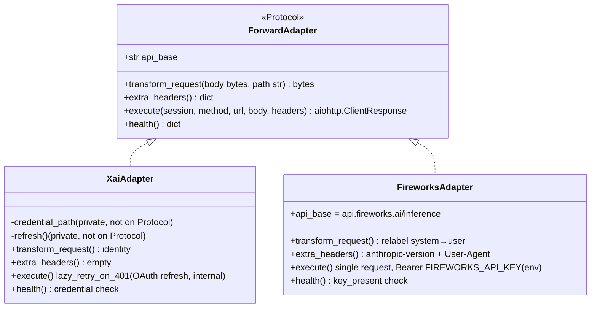
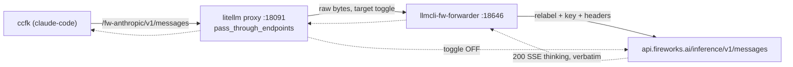

## Context

Source: [frame 103](../frames/103-fw-system-user-relabel-frame.mdx).

Claude Code 2.1.158 sends `role:"system"` **inline in `messages[]`** + `thinking:adaptive` + `stream:true` to `/v1/messages`. Fireworks' native Anthropic endpoint rejects inline system roles with **400 `invalid role "system"`**; the LiteLLM translation workaround (`use_chat_completions_url_for_anthropic_messages: true`) returns **403 Fire Pass** on `thinking`. Today `ccfk` routes through the hand-curated `pass_through_endpoints` `/fw-anthropic` (verbatim body) → FW native → 400.

**A-vs-B resolved → B.** Option A (LiteLLM `pre_call_hook` relabel) is falsified by upstream litellm **[#27518](https://github.com/BerriAI/litellm/issues/27518)** (OPEN bug — `async_pre_call_hook` is bypassed on `/v1/messages`); the candidate fix **[#27609](https://github.com/BerriAI/litellm/pull/27609)** is unmerged/REVIEW_REQUIRED/stale and absent from every release (latest v1.86.2; we pin `>=1.86`). Option B (relabel in our own forwarder) is proven (issue evidence: 200 + 147 SSE thinking deltas) and reuses the existing `proxy_forwarder` infra (#99 xAI OAuth).

## Goal

Native Claude Code traffic (thinking + stream) returns **200** through the prod `:18091` FW route, with the FW key kept server-side, no client change to `ccfk`, and a clean toggle to revert once Fireworks ships their upstream fix.

## Users

- **Primary:** `claude-code` via the `ccfk` alias → prod `llmcli` proxy `:18091` on M₁ (roxabituwer).
- **Secondary:** any consumer wanting native FW thinking blocks through the shared proxy without holding the FW key.

## Expected Behavior

`ccfk` (unchanged: `ANTHROPIC_BASE_URL=http://M₁:18091/fw-anthropic`) sends a native Anthropic request with inline system roles + thinking + stream. The litellm passthrough `/fw-anthropic` forwards the raw bytes to `http://llmcli-fw-forwarder:18646` instead of FW direct. The forwarder (a) relabels every `messages[*].role: "system" → "user"`, (b) injects `Authorization: Bearer $FIREWORKS_API_KEY` from `proxy.env`, (c) adds the headers FW native requires (`anthropic-version`, an accepted `User-Agent`), then forwards to `https://api.fireworks.ai/inference/v1/messages?beta=true`. FW returns 200; the SSE response (thinking deltas) streams back **verbatim** — the forwarder never parses the response, so thinking + stream are preserved for free.

Because `/fw-anthropic` is a raw passthrough (no model_list, no `/v1/messages` translation, no `pre_call_hook`), this path sidesteps litellm bugs #27518/#23841/#25172 entirely.

**Toggle off** (FW ships fix): repoint the passthrough `target` back to `https://api.fireworks.ai/inference` (restoring its `headers.Authorization` block), `systemctl --user restart llmcli` (proxy reads `proxy-base.yaml` only at startup), then stop the forwarder Quadlet. `ccfk` keeps working in both states.

## Data Model & Consumers

The change generalizes the forwarder's adapter contract: transport machinery (header filtering, SSE streaming, path allowlist, aiohttp session) stays shared in `_server.py`; provider specifics (auth strategy, body transform, extra headers, health) move into thin adapter leaves.

**Axis-critical contract decisions** (resolved from expert review — keep OAuth lifecycle inside the xai leaf, not in shared transport):

- The existing `OAuthAdapter` Protocol is **superseded** by `ForwardAdapter`. `credential_path` and `refresh()` are **removed from the shared Protocol** and become `XaiAdapter`-private attributes. `_common.py` exports only `ForwardAdapter` (with a back-compat re-export note in `__init__.py`).
- `lazy_retry_on_401` **stays in `_common.py`** as a module-level helper but is called **only from inside `XaiAdapter.execute()`** — never from `_server._proxy`. The shared `_proxy` handler calls exactly: `body = adapter.transform_request(raw_body, path)` → `resp = await adapter.execute(session, method, url, body, headers)`; the existing streaming loop (`iter_any()`) is unchanged.
- `execute(...)` returns a **live `aiohttp.ClientResponse`** (not a consumed body) so `_proxy` retains the verbatim SSE streaming loop. `XaiAdapter.execute` = single-flight OAuth lazy-retry; `FireworksAdapter.execute` = single request with the env bearer, no retry.
- `_health` becomes adapter-delegating: `ForwardAdapter` gains `async health() → dict`. `XaiAdapter.health()` = current credential check; `FireworksAdapter.health()` = `{"status":"ok","key_present": bool}` (no credential file). This unblocks the FW `/health` 200 criterion without a `credential_path` stub.

| Consumer | Reads/Writes | When | Status |
|---|---|---|---|
| `llmcli-fw-forwarder` `_proxy` | request body `messages[]`, `FIREWORKS_API_KEY` env | per request | this issue |
| `_server._proxy` (shared) | `adapter.transform_request`, `adapter.extra_headers`, `adapter.execute` | per request | this issue |
| litellm passthrough `/fw-anthropic` | `target` URL (toggle) | startup | this issue (repoint) |
| `_server.main()` provider dispatch | `LLMCLI_FORWARDER_PROVIDER=fireworks` | container start | this issue |
| litellm `/v1/messages` model_list | — | — | **not used** (avoids litellm translation bugs) |

## Breadboard

**Places:** `proxy_forwarder` package · `deploy/quadlet/` · `proxy-base.yaml` (hand-curated).

| ID | Affordance | Handler | Data |
|---|---|---|---|
| N1 | `ForwardAdapter` Protocol (supersedes `OAuthAdapter`) | `_common.py` | `api_base`, `transform_request`, `extra_headers`, `execute→ClientResponse`, `health`; `credential_path`/`refresh` removed from Protocol |
| N2 | `/v1/messages` allowed | `_common.ALLOWED_PATHS` | frozenset += `/v1/messages` |
| N3 | shared proxy: transform **then** delegate auth | `_server._proxy` | `body=adapter.transform_request(raw,path)` → `adapter.execute(...)`; streaming loop unchanged; **no** direct `lazy_retry_on_401` call |
| N3h | shared health delegates to adapter | `_server._health` | thin wrapper → `adapter.health()` |
| N4 | xai conforms — `execute` wraps `lazy_retry_on_401` + `health()`; `credential_path`/`refresh` become private | `xai_adapter.py`, `__init__.py` re-export | byte-identical behavior |
| N5 | FW adapter: relabel + env key + headers + health | `fireworks_adapter.py` (NEW) | system→user, `FIREWORKS_API_KEY`, anthropic-version, UA, `key_present` |
| N6 | provider dispatch `fireworks` + updated error string | `_server.main()` | `elif provider=="fireworks"`; `DEFAULT_PORT` stays 18645 (xai), FW port via env |
| S1 | FW forwarder Quadlet + installer | `llmcli-fw-forwarder.container` (NEW) + `install.sh` unit loop | provider=fireworks, port=18646, `EnvironmentFile=%h/.roxabi/llmcli/env/proxy.env`, internal, security flags copied from xai |
| S2 | deploy manifest component | `quadlet.toml` | `[component.fw-forwarder]` `host_roles=["lyra-hub"]`, `env_file="~/.roxabi/llmcli/env/proxy.env"`, `required_secrets=[]` |
| S3 | toggle (passthrough target) + proxy restart | `proxy-base.yaml` (hand-curated) | `target`: forwarder URL ⇄ FW direct; **remove `headers.Authorization` block when target=forwarder** (forwarder owns key); requires `systemctl --user restart llmcli` |

Wiring: N1→N3/N3h→N4/N5 (transport calls adapter); N5←S1 (Quadlet runs FW adapter via N6); S3 routes passthrough→S1; N2 admits the path. `install.sh` (S1) must add `llmcli-fw-forwarder.container` to its hardcoded unit loop or the unit is silently skipped.

## Slices

| # | Slice | Demo |
|---|---|---|
| 1 | Generalize contract (N1, N2, N3, N3h): `OAuthAdapter`→`ForwardAdapter`, drop `credential_path`/`refresh` from Protocol, add `health()`, `execute→ClientResponse`; `_proxy`/`_health` delegate; conform xai (N4) — `execute` wraps `lazy_retry_on_401`, `health()`, private creds; `__init__` re-export | xai forwarder tests green, **byte-identical** behavior |
| 2 | `FireworksAdapter` (N5) + dispatch + error string (N6) + relabel/header/health unit tests | unit: system→user relabel, no-op on non-JSON/no-messages, idempotent; provider dispatch selects FW adapter; `health()` returns key_present |
| 3 | Quadlet (S1) + `install.sh` unit loop + manifest (S2) + toggle doc + restart note (S3) | `./deploy/install.sh` installs the unit; `systemctl --user start llmcli-fw-forwarder`; `/health` 200 |
| 4 | Live validation on M₁ + docs | `ccfk` (thinking forcing overridden for the test) w/ thinking+stream → 200 streaming thinking deltas; toggle-off (target→FW, restart llmcli, stop forwarder) reverts cleanly |

## Success Criteria

- [ ] `_common.py` exports `ForwardAdapter` (supersedes `OAuthAdapter`) with `api_base`, `transform_request(body,path)`, `extra_headers()`, `execute(...)→aiohttp.ClientResponse`, `health()`; `credential_path`/`refresh` are **not** on the Protocol (private to `XaiAdapter`).
- [ ] `_server._proxy` calls `adapter.transform_request` then `adapter.execute`, and **never** calls `lazy_retry_on_401` directly; `_server._health` delegates to `adapter.health()`.
- [ ] `XaiAdapter` conforms with **byte-identical** behavior — existing forwarder tests pass unchanged.
- [ ] `/v1/messages` is in `ALLOWED_PATHS`.
- [ ] `FireworksAdapter.transform_request` relabels every `messages[*].role:"system"→"user"`; no-op on non-JSON body or absent `messages`; idempotent (unit tests cover all three).
- [ ] FW key is injected from `os.environ["FIREWORKS_API_KEY"]` only; inbound client `Authorization` is stripped/replaced (never trusted).
- [ ] `FireworksAdapter.extra_headers()` sets `anthropic-version` + an accepted `User-Agent`; the forwarder receives **200, not 403**, from the FW edge on M₁.
- [ ] `provider=fireworks` is dispatched in `_server.main()`; the unknown-provider error string lists `fireworks`; `DEFAULT_PORT` stays 18645.
- [ ] `llmcli-fw-forwarder` Quadlet: `Network=roxabi.network`, internal port 18646, **no** `PublishPort`, `EnvironmentFile=%h/.roxabi/llmcli/env/proxy.env`, security flags (`UserNS`, `NoNewPrivileges`, `DropCapability=all`) copied from xai; `/health` returns 200.
- [ ] `install.sh` installs `llmcli-fw-forwarder.container` (added to its unit loop — not silently skipped).
- [ ] `quadlet.toml` has `[component.fw-forwarder]` with `host_roles=["lyra-hub"]` and `env_file="~/.roxabi/llmcli/env/proxy.env"`.
- [ ] `proxy-base.yaml.example` documents: the toggle (`target` forwarder URL ⇄ FW direct), removing the passthrough `headers.Authorization` block in forwarder mode, and the revert sequence — (1) repoint `target`→FW, (2) `systemctl --user restart llmcli`, (3) stop `llmcli-fw-forwarder`, (4) only then remove `MAX_THINKING_TOKENS=0` from `ccfk` — each step independently safe.
- [ ] Toggle is **config-only**: effected by editing `proxy-base.yaml` `target` + a proxy restart — no container rebuild, no code change.
- [ ] **Live (M₁):** `ccfk` with `thinking:adaptive` + `stream:true` (client-side thinking forcing overridden for the test) returns 200 and streams ≥1 thinking delta; answer correct. Evidence: captured SSE/terminal output.
- [ ] **Toggle off:** `target`→FW direct + restart `llmcli` + stop forwarder leaves `ccfk` functional for non-system payloads (clean revert).

## Resolved Decisions (from expert review)

- **Toggle home → manual `proxy-base.yaml` edit** (no `llmcli` helper). Rationale: `proxy-base.yaml` is hand-curated, "yours alone, never touched by tooling" — a helper that templates it would violate that invariant. A CLI helper can be a future enhancement; not in scope.
- **Adapter contract → `ForwardAdapter` supersedes `OAuthAdapter`**; OAuth lifecycle (`credential_path`, `refresh`, `lazy_retry_on_401`) stays private to `XaiAdapter.execute()`; shared transport calls only `transform_request`/`execute`/`health`. (Resolves the N×M / target-axis-trap concern raised by axial review.)

## Ambiguities

- [NEEDS CLARIFICATION] **Exact FW-native headers:** the precise `anthropic-version` value and the accepted `User-Agent` string (mimic Anthropic SDK UA vs curl) — confirm against the proven 2026-05-31 live test before implementing N5. This is the one remaining unknown; everything else is resolved.

## Out of Scope

- Removing `MAX_THINKING_TOKENS=0` from `ccfk` — follow-up, **after** the relabel route is live (server relabel first, else `ccfk` 403s).
- Any litellm model_list / `/v1/messages` translation path (deliberately avoided — open upstream bugs).
- Migrating the xAI forwarder's behavior (only conformed to the generalized contract, byte-identical).
