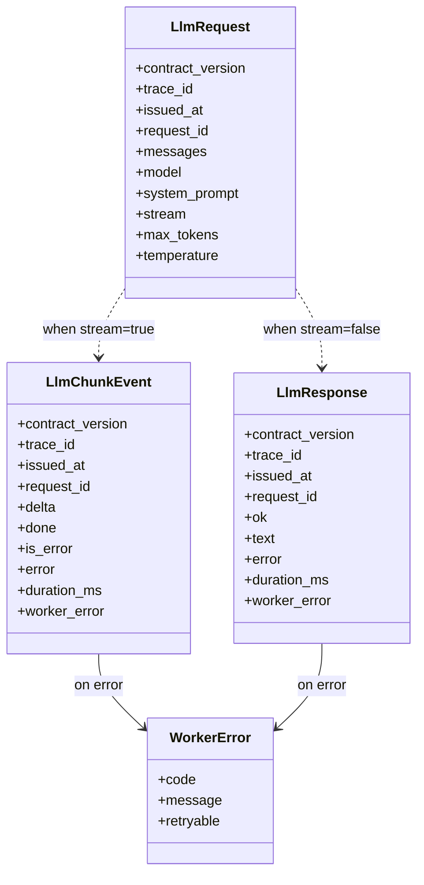
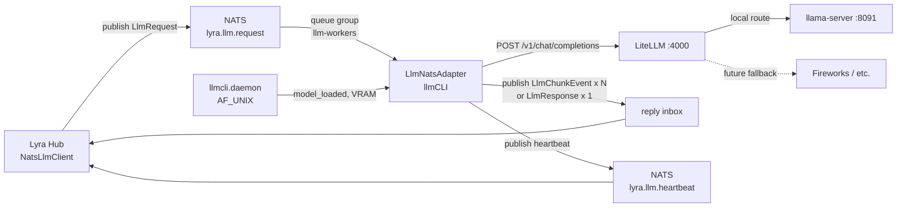

## Context

Promoted from [`12-nats-worker-frame.mdx`](../frames/12-nats-worker-frame.mdx).

Epic Roxabi/lyra#987 deprecates the Anthropic API. Path B routes inference through NATS. `lyra.llm.request` is the canonical entry point for all LLM calls in the lyra ecosystem. llmCLI ships a NATS adapter on the canonical satellite pattern (ADR-039 / 044 / 046 / 047), bridging NATS to the LiteLLM proxy (`:4000`) which owns catalog / aliasing / fallback. The adapter is co-located with `llama-server` so its heartbeats carry VRAM + loaded-model state.

Bundled with **Roxabi/lyra#1104** (sister PR — ACL canonical heartbeat subject + hub switch from legacy `NatsLlmDriver` to canonical `NatsLlmClient`). Both PRs reviewed independently, merged in same coordination window.

## Goal

Provide a horizontally-scalable NATS adapter that translates `LlmRequest` Pydantic envelopes into LiteLLM HTTP calls and streams `LlmChunkEvent` / `LlmResponse` replies back to the hub, with VRAM-aware heartbeats.

## Users

- **Lyra hub on M₁ / M₂** — uses `NatsLlmClient` (post lyra#1104) to dispatch any `backend=harness-cli` agent's inference. Without this adapter, Path B has no inference backend.
- **`roxabi-harness` subprocess** (separate epic-#987 issue) — depends on the adapter being live for its smoke test.
- **Future internal lyra services** — get LLM access via the same `lyra.llm.request` subject (no per-consumer integration).

## Expected Behavior

1. `llmcli nats-worker` boots → connects to NATS using `LLMCLI_NATS_NKEY_SEED` (or `_PATH`), subscribes `lyra.llm.request` with queue group `llm-workers`, opens `httpx.AsyncClient` to LiteLLM, starts heartbeat loop on `lyra.llm.heartbeat` (every 10 s).
2. Hub publishes an `LlmRequest` (Pydantic envelope) to `lyra.llm.request` with reply-inbox set.
3. NATS dispatches to one worker in the queue group. The adapter parses the envelope, validates `request_id` (`^[A-Za-z0-9_-]{1,128}$`), acquires the concurrency semaphore.
4. Adapter POSTs to `LLMCLI_LITELLM_URL/chat/completions` with bearer auth, body `{model, messages, system_prompt prepended as system role, stream, max_tokens, temperature}`.
5. **Streaming path** (`stream=True`): consume LiteLLM SSE → emit one `LlmChunkEvent(delta=chunk_text, done=False)` per token to reply inbox → terminator `LlmChunkEvent(delta=None, done=True, duration_ms=N)`.
6. **Non-streaming path** (`stream=False`): collect full response → single `LlmResponse(ok=True, text=..., duration_ms=N)` reply.
7. **Error path**: catch upstream timeouts / 5xx / parse failures → `WorkerError(code, message, retryable)` populated on the chunk (`done=True, is_error=True`) or response (`ok=False`).
8. Heartbeats include `worker_id`, `model_loaded` (from `llmcli.daemon.current_model()`), `vram_used_mb`, `vram_free_mb`, `active_requests` — feeds hub's worker-aliveness check.
9. SIGTERM → graceful drain (`NatsAdapterBase.drain_timeout`) → exit 0.

## Data Model & Consumers

### Data structure



All envelopes imported verbatim from `roxabi_contracts.llm` + `roxabi_contracts.errors`. **No vendored copies.**

### Consumer map



### Consumer summary

| Consumer | Fields consumed | When | Status |
|---|---|---|---|
| Lyra Hub `NatsLlmClient` | `LlmRequest` (full) | publish | this issue (post lyra#1104) |
| LlmNatsAdapter | `LlmRequest.{messages, model, system_prompt, stream, max_tokens, temperature}` | on subject | this issue |
| LiteLLM `:4000` | OpenAI request body translated from `LlmRequest` | HTTP POST | this issue |
| Lyra Hub `NatsLlmClient` | `LlmChunkEvent.{delta, done, duration_ms, worker_error}` | stream reply | this issue |
| Lyra Hub `NatsLlmClient` | `LlmResponse.{ok, text, duration_ms, worker_error}` | non-stream reply | this issue |
| Lyra Hub heartbeat watcher | heartbeat: `worker_id, model_loaded, vram_*, active_requests` | every 10 s | this issue |
| `llmcli.daemon` | served via existing AF_UNIX socket; adapter is a client | heartbeat tick | reuse existing |

## Breadboard

### Affordances

| ID | Affordance | Type | Handler | Data |
|---|---|---|---|---|
| C1 | `llmcli nats-worker [--max-concurrent N]` | CLI cmd | `cli.nats_worker` | starts `LlmNatsAdapter.run()` |
| N1 | NATS sub `lyra.llm.request` | NATS subject | `LlmNatsAdapter.handle(msg, payload)` | `LlmRequest` envelope |
| N2 | NATS pub `lyra.llm.heartbeat` | NATS subject | `NatsAdapterBase._heartbeat_loop` + override `heartbeat_payload()` | `{worker_id, model_loaded, vram_*, active_requests}` |
| N3 | NATS pub reply inbox `msg.reply` | NATS subject | `NatsAdapterBase.reply()` / publish chunk | `LlmChunkEvent` or `LlmResponse` |
| H1 | HTTP POST `<LITELLM_URL>/chat/completions` | HTTP egress | `httpx.AsyncClient` | OpenAI ChatCompletion request, SSE response |
| D1 | `llmcli.daemon.current_model()` | AF_UNIX call | heartbeat enrichment | model name string |
| D2 | `llmcli.daemon.vram_used_mb()` / `vram_free_mb()` | AF_UNIX call | heartbeat enrichment | VRAM ints |
| E1 | `LLMCLI_NATS_URL`, `LLMCLI_NATS_NKEY_SEED \| _PATH` | env | NATS connect | auth |
| E2 | `LLMCLI_WORKER_ID` | env | adapter init | worker identity |
| E3 | `LLMCLI_LITELLM_URL`, `LLMCLI_LITELLM_API_KEY` | env | httpx client | proxy URL + bearer |
| Q1 | `deploy/quadlet/llmcli-nats-worker.container` | systemd Quadlet | Podman | container spec |
| S1 | `src/llmcli/nats/adapter.py` | module | `LlmNatsAdapter(NatsAdapterBase)` | confines `lyra.llm.*` literals (ADR-047) |
| S2 | `src/llmcli/nats/__init__.py` | module | exports `LlmNatsAdapter` | — |
| T1 | `tests/nats/test_adapter.py` + `conftest.py` | pytest | mocked NATS + LiteLLM | unit + envelope shape |

### Wiring

```
C1 ──spawns──► S1 (LlmNatsAdapter)
              │
              ├──registers──► N1 (sub lyra.llm.request)
              ├──registers──► N2 (pub heartbeat — periodic)
              └──opens─────► H1 (httpx → LiteLLM)

N1 ──msg arrives──► handle(msg, payload):
                      ├─► parse LlmRequest
                      ├─► acquire sem
                      ├─► H1 POST
                      └─► N3 reply (LlmChunkEvent x N | LlmResponse)

N2 every 10s ──► heartbeat_payload():
                      ├─► super().heartbeat_payload()
                      ├─► D1 read model_loaded
                      ├─► D2 read VRAM
                      └─► merge {active_requests = max - sem._value}

E1, E2, E3 ──read at startup──► S1.__init__
Q1 ──exec──► C1 (with --max-concurrent from container env)
```

## Slices

| # | Slice | Affordances | Demo |
|---|---|---|---|
| 1 | **Skeleton + deps** | C1, S1 (empty), S2, E1, E2, E3, pyproject uv git sources | `llmcli nats-worker` boots, connects to NATS, subscribes empty handler, no heartbeat enrichment yet |
| 2 | **Request envelope handling (non-stream)** | N1, N3, H1, parse `LlmRequest`, reply `LlmResponse`, `WorkerError` errors, T1 (non-stream cases) | hub publishes 1 `LlmRequest(stream=False)` → adapter → LiteLLM (mocked) → 1 `LlmResponse(ok=True)` reply parsed |
| 3 | **Streaming + heartbeat enrichment + deploy** | N3 streaming SSE → `LlmChunkEvent` x N + terminator, N2 heartbeat with D1+D2 enrichment, Q1 quadlet unit, T1 (stream + error cases), M₁ smoke | hub publishes `LlmRequest(stream=True)` → N×`LlmChunkEvent(delta=...)` + terminator; heartbeat carries VRAM; quadlet starts on M₁ |

## Success Criteria

- [ ] `llmcli nats-worker` Typer command starts the adapter, connects to NATS via `LLMCLI_NATS_NKEY_SEED|_PATH`, subscribes `lyra.llm.request` with queue group `llm-workers`
- [ ] `LlmRequest` parsed; non-streaming reply is single `LlmResponse(ok=True, text, duration_ms)`; streaming reply is N×`LlmChunkEvent(delta)` + terminator `LlmChunkEvent(done=True, duration_ms)`
- [ ] Heartbeat published on `lyra.llm.heartbeat` every 10 s with `worker_id`, `model_loaded`, `vram_used_mb`, `vram_free_mb`, `active_requests`
- [ ] Errors emit `WorkerError(code, message, retryable)` with codes `worker.internal | worker.timeout | transport.parse | upstream.unavailable | upstream.5xx`
- [ ] Subject literals (`lyra.llm.*`) confined to `src/llmcli/nats/adapter.py` (no other file references them; ADR-047 conformant)
- [ ] Unit tests cover: request parse, non-stream reply, stream chunks + terminator, error → `WorkerError`, heartbeat shape — all with mocked NATS + mocked LiteLLM
- [ ] Quadlet unit at `deploy/quadlet/llmcli-nats-worker.container` declares Podman secrets for nkey + LiteLLM key, `Network=host`, `Restart=always`
- [ ] M₁ smoke test: hub `NatsLlmClient` → adapter → LiteLLM → `llama-server` returns text in <5 s for `qwen3-8b`, both streaming and non-streaming paths green
- [ ] Coordinated merge with Roxabi/lyra#1104 (both PRs marked ready, smoke test gates merge window)
