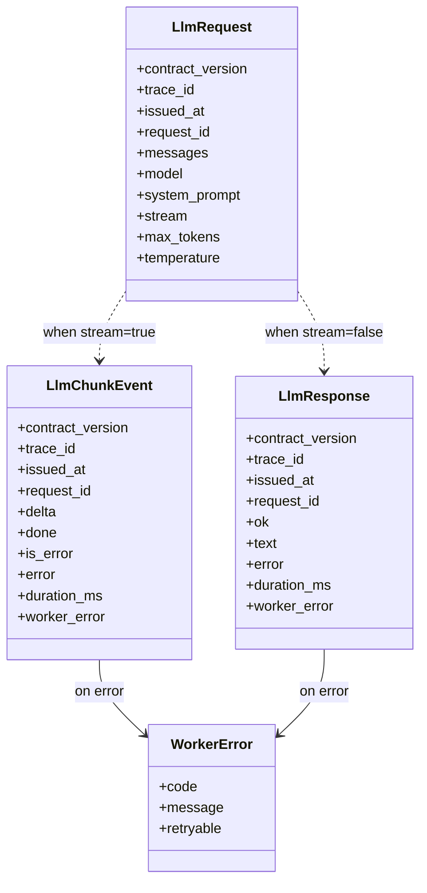
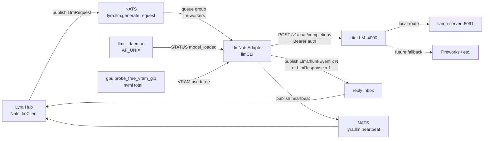

## Context

Promoted from [`12-nats-worker-frame.mdx`](../frames/12-nats-worker-frame.mdx).

Epic Roxabi/lyra#987 deprecates the Anthropic API. Path B routes inference through NATS. `lyra.llm.generate.request` (`SUBJECTS.generate_request` from `roxabi_contracts.llm`) is the canonical entry point for all LLM calls in the lyra ecosystem. llmCLI ships a NATS adapter on the canonical satellite pattern (ADR-039 / 044 / 046 / 047), bridging NATS to the LiteLLM proxy (`:4000`) which owns catalog / aliasing / fallback. The adapter is co-located with `llama-server` so its heartbeats carry VRAM + loaded-model state.

**Reality check (post code audit, 2026-05-07).** `src/llmcli/nats/llm_adapter.py` is partially implemented: extends `NatsAdapterBase`, uses canonical Pydantic envelope builders (`build_llm_chunk` / `build_llm_response`), subscribes `SUBJECTS.generate_request`, heartbeats on `SUBJECTS.heartbeat`, streams SSE to `LlmChunkEvent`. Divergences requiring this issue:

1. **Downstream HTTP target** — current code POSTs directly to `localhost:{daemon_port}/v1` (llama-server). Spec mandates LiteLLM proxy (`LLMCLI_LITELLM_URL`) so the proxy keeps catalog / aliasing / fallback ownership.
2. **Error envelope** — current uses bare strings (`error="malformed_request"` etc.). Spec mandates `WorkerError(code, message, retryable)` per ADR-066 with codes ⊆ `{worker.internal, worker.timeout, transport.parse, upstream.unavailable, upstream.5xx}`.
3. **Heartbeat enrichment** — missing `vram_used_mb` and `vram_free_mb` (only `model_loaded` + `active_requests` today).
4. **Env vars** — current reads only `NATS_URL`. Spec adds `LLMCLI_NATS_URL`, `LLMCLI_NATS_NKEY_SEED|_PATH`, `LLMCLI_LITELLM_URL`, `LLMCLI_LITELLM_API_KEY`.
5. **Tests** — `tests/nats/` directory does not exist.
6. **Quadlet** — `deploy/quadlet/llmcli-nats-worker.container` does not exist.
7. **ACL** — lyra `auth.conf` allows the legacy `lyra.llm.request` / `lyra.llm.health.*`. Both diverge from canonical (`lyra.llm.generate.request` / `lyra.llm.heartbeat`). lyra#1104 (expanded scope) updates the ACL on **both** subjects.

Bundled with **Roxabi/lyra#1104** (sister PR — full canonical ACL migration: request subject + heartbeat subject + hub switch from legacy `NatsLlmDriver` to canonical `NatsLlmClient`). Both PRs reviewed independently, merged in same coordination window.

## Goal

Rectify the existing NATS adapter to: (a) call **LiteLLM proxy** instead of llama-server directly, (b) emit canonical `WorkerError` envelopes, (c) enrich heartbeats with VRAM, (d) ship deploy unit + tests — so `lyra.llm.generate.request` is end-to-end canonical from hub through proxy to engine.

## Users

- **Lyra hub on M₁ / M₂** — via `NatsLlmClient` (post lyra#1104) for any `backend=harness-cli` agent. Current adapter would never receive traffic under the deployed ACL; this issue makes the wire end-to-end.
- **`roxabi-harness` subprocess** (separate epic-#987 issue) — depends on the adapter being live for its smoke test.
- **Future internal lyra services** — gain LLM access via `lyra.llm.generate.request` (no per-consumer integration).

## Expected Behavior

1. `llmcli nats-serve llm --model <name>` boots → connects to NATS via `LLMCLI_NATS_URL` + `LLMCLI_NATS_NKEY_SEED|_PATH`, subscribes `SUBJECTS.generate_request` (canonical `lyra.llm.generate.request`) with queue group `SUBJECTS.llm_workers` (canonical `llm-workers`), opens `httpx.AsyncClient` to **LiteLLM** at `LLMCLI_LITELLM_URL` with bearer auth, starts heartbeat loop on `SUBJECTS.heartbeat` (canonical `lyra.llm.heartbeat`, every `--heartbeat-interval` s).
2. Hub publishes an `LlmRequest` envelope to `lyra.llm.generate.request` with reply-inbox set.
3. NATS dispatches to one worker in the queue group. The adapter parses the envelope, validates `request_id` (`^[A-Za-z0-9_-]{1,128}$`), acquires the concurrency semaphore.
4. Adapter POSTs to `LLMCLI_LITELLM_URL/chat/completions` with `Authorization: Bearer $LLMCLI_LITELLM_API_KEY`, body `{model, messages, system_prompt prepended as system role, stream, max_tokens, temperature}`.
5. **Streaming path** (`stream=True`): consume LiteLLM SSE → emit one `LlmChunkEvent(delta=chunk_text, done=False)` per token to reply inbox → terminator `LlmChunkEvent(delta=None, done=True, duration_ms=N)`.
6. **Non-streaming path** (`stream=False`): collect full response → single `LlmResponse(ok=True, text=..., duration_ms=N)` reply.
7. **Error path**: catch upstream timeouts / 5xx / parse failures / capacity / model-unavailable → `WorkerError(code, message, retryable)` populated on the chunk (`done=True, is_error=True, worker_error=WE`) or response (`ok=False, error=msg, worker_error=WE`).
8. Heartbeats include `worker_id` (from base), `model_loaded` (current SWAP target), `vram_used_mb`, `vram_free_mb` (via `gpu.probe_free_vram_gib` + nvml total), `active_requests` (semaphore introspection) — feeds hub's worker-aliveness check.
9. SIGTERM → graceful drain (`NatsAdapterBase.drain_timeout`) → exit 0.

## Data Model & Consumers

### Data structure



All envelopes imported verbatim from `roxabi_contracts.llm` + `roxabi_contracts.errors`. **No vendored copies.**

### Consumer map



### Consumer summary

| Consumer | Fields consumed | When | Status |
|---|---|---|---|
| Lyra Hub `NatsLlmClient` | `LlmRequest` (full) | publish | this issue (post lyra#1104) |
| LlmNatsAdapter | `LlmRequest.{messages, model, system_prompt, stream, max_tokens, temperature}` | on subject | this issue |
| LiteLLM `:4000` | OpenAI request body translated from `LlmRequest` | HTTP POST | **this issue** (was direct llama-server) |
| Lyra Hub `NatsLlmClient` | `LlmChunkEvent.{delta, done, duration_ms, worker_error}` | stream reply | this issue |
| Lyra Hub `NatsLlmClient` | `LlmResponse.{ok, text, duration_ms, worker_error}` | non-stream reply | this issue |
| Lyra Hub heartbeat watcher | `worker_id, model_loaded, vram_used_mb, vram_free_mb, active_requests` | every `heartbeat_interval` s | this issue |
| `llmcli.daemon` (AF_UNIX) | served via existing socket; adapter is a client | startup + reused | reuse existing |
| `llmcli.gpu.probe_free_vram_gib` + nvml total | VRAM ints | heartbeat tick | reuse existing |

## Breadboard

### Affordances

| ID | Affordance | Type | Handler | Data |
|---|---|---|---|---|
| C1 | `llmcli nats-serve llm --model NAME [--max-concurrent N]` | CLI cmd (existing) | `cli_nats.nats_serve_llm` | starts `LlmNatsAdapter.run()` |
| N1 | NATS sub `SUBJECTS.generate_request` (= `lyra.llm.generate.request`) | NATS subject | `LlmNatsAdapter.handle(msg, payload)` | `LlmRequest` envelope |
| N2 | NATS pub `SUBJECTS.heartbeat` (= `lyra.llm.heartbeat`) | NATS subject | `NatsAdapterBase._heartbeat_loop` + override `heartbeat_payload()` | `{worker_id, model_loaded, vram_used_mb, vram_free_mb, active_requests}` |
| N3 | NATS pub reply inbox `msg.reply` | NATS subject | `NatsAdapterBase.reply()` / direct publish | `LlmChunkEvent` or `LlmResponse` |
| H1 | HTTP POST `<LITELLM_URL>/chat/completions` w/ `Authorization: Bearer` | HTTP egress (refactor) | `httpx.AsyncClient` | OpenAI ChatCompletion request, SSE response |
| D1 | `daemon_request("STATUS")` parse `model=` | AF_UNIX call (existing) | `_ensure_model` (existing) | model name string |
| D2 | `gpu.probe_free_vram_gib()` + nvml total | nvml | heartbeat enrichment (NEW) | VRAM ints |
| E1 | `LLMCLI_NATS_URL`, `LLMCLI_NATS_NKEY_SEED \| _PATH` | env (rename from `NATS_URL`) | NATS connect | auth |
| E2 | `LLMCLI_WORKER_ID` | env | adapter init (default `llmcli-<hostname>`, from `NatsAdapterBase`) | worker identity |
| E3 | `LLMCLI_LITELLM_URL`, `LLMCLI_LITELLM_API_KEY` | env (NEW) | httpx client | proxy URL + bearer |
| Q1 | `deploy/quadlet/llmcli-nats-worker.container` | systemd Quadlet (NEW) | Podman | container spec |
| S1 | `src/llmcli/nats/llm_adapter.py` | module (existing) | `LlmNatsAdapter(NatsAdapterBase)` | rectify per current spec |
| S2 | `src/llmcli/cli_nats.py` | module (existing) | `nats_serve_llm` | accept LiteLLM env, drop direct daemon-port flow |
| T1 | `tests/nats/test_adapter.py` + `conftest.py` | pytest (NEW) | mocked NATS + LiteLLM | unit + envelope shape |

### Wiring

```
C1 ──spawns──► S1 (LlmNatsAdapter)
              │
              ├──registers──► N1 (sub lyra.llm.generate.request)
              ├──registers──► N2 (pub heartbeat — periodic)
              └──opens─────► H1 (httpx → LiteLLM, Bearer)

N1 ──msg arrives──► handle(msg, payload):
                      ├─► parse LlmRequest
                      ├─► acquire sem
                      ├─► H1 POST LiteLLM
                      └─► N3 reply (LlmChunkEvent x N | LlmResponse | WorkerError)

N2 every interval ──► heartbeat_payload():
                      ├─► super().heartbeat_payload()
                      ├─► D1 model_loaded (cached at startup via SWAP)
                      ├─► D2 VRAM used/free (nvml)
                      └─► merge {active_requests = max - sem._value}

E1, E2, E3 ──read at startup──► S1.__init__
Q1 ──exec──► C1
```

## Slices

| # | Slice | Affordances | Demo |
|---|---|---|---|
| 1 | **LiteLLM downstream switch + env wiring** | H1 (refactor), E1+E3 (new env vars), C1+S2 (CLI accepts LiteLLM args) | `llmcli nats-serve llm --model qwen3-8b` boots and POSTs to LiteLLM (mocked) instead of llama-server; required env validated |
| 2 | **Canonical errors + heartbeat VRAM enrichment** | WorkerError refactor in S1 (handle + _err paths), heartbeat_payload override + D2 VRAM, T1 unit tests for both | unit tests prove all error paths emit `WorkerError(code,..)`; heartbeat carries VRAM ints |
| 3 | **Tests + Quadlet + smoke** | T1 full coverage (parse, non-stream, stream, error, heartbeat shape), Q1 quadlet, M₁ smoke | `pytest tests/nats` green; quadlet syntactically valid + starts on M₁; smoke harness→hub→adapter→LiteLLM→llama-server <5 s |

## Success Criteria

- [ ] `llmcli nats-serve llm` Typer command starts the adapter, connects to NATS via `LLMCLI_NATS_URL` + `LLMCLI_NATS_NKEY_SEED|_PATH`, subscribes `SUBJECTS.generate_request` (canonical `lyra.llm.generate.request`) with queue group `SUBJECTS.llm_workers` (`llm-workers`)
- [ ] Adapter POSTs to `LLMCLI_LITELLM_URL/chat/completions` with `Authorization: Bearer $LLMCLI_LITELLM_API_KEY`; the `localhost:{daemon_port}` direct path is removed
- [ ] `LlmRequest` parsed; non-streaming reply is single `LlmResponse(ok=True, text, duration_ms)`; streaming reply is N×`LlmChunkEvent(delta)` + terminator `LlmChunkEvent(done=True, duration_ms)`
- [ ] Heartbeat published on `SUBJECTS.heartbeat` (`lyra.llm.heartbeat`) every `heartbeat_interval` s with `worker_id`, `model_loaded`, `vram_used_mb`, `vram_free_mb`, `active_requests`
- [ ] All error paths emit `WorkerError(code, message, retryable)` populated on chunk/response with codes ⊆ `{worker.internal, worker.timeout, transport.parse, upstream.unavailable, upstream.5xx}` — no bare `error=` strings
- [ ] Subject literals confined to `roxabi_contracts.llm.subjects.SUBJECTS` (imported in `src/llmcli/nats/llm_adapter.py`); no other file in llmCLI declares `lyra.llm.*` literals (ADR-047 conformant)
- [ ] Unit tests in `tests/nats/test_adapter.py` cover: request parse, non-stream reply, stream chunks + terminator, error paths → `WorkerError`, heartbeat shape — all with mocked NATS + mocked LiteLLM (httpx mock)
- [ ] Quadlet at `deploy/quadlet/llmcli-nats-worker.container` declares Podman secrets for `LLMCLI_NATS_NKEY_SEED` + `LLMCLI_LITELLM_API_KEY`, `Network=host` (or `roxabi.network`), `Restart=on-failure`
- [ ] M₁ smoke test: hub `NatsLlmClient` → adapter → LiteLLM → `llama-server` returns text in <5 s for `qwen3-8b`, both streaming and non-streaming paths green
- [ ] Coordinated merge with Roxabi/lyra#1104 (full canonical ACL: request `lyra.llm.generate.request` + heartbeat `lyra.llm.heartbeat`); both PRs ready, smoke test gates merge window
