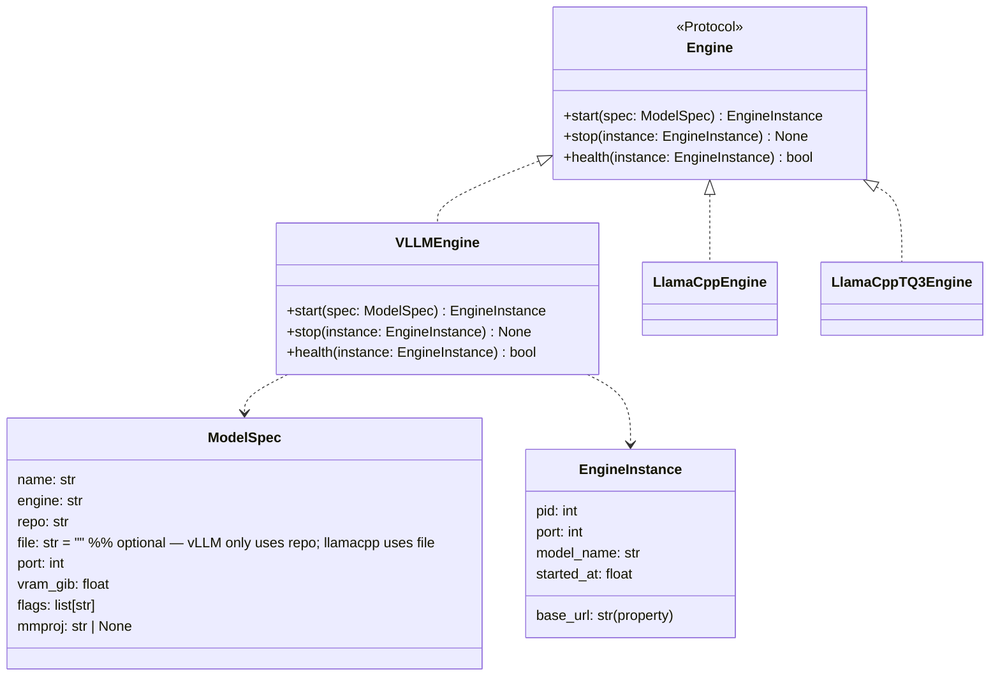

## Context

Source: [frame](../frames/13-vllm-engine-backend-frame.mdx)

llmCLI currently supports two llama-server-based engines (`llamacpp`, `llamacpp_tq3`), both requiring GGUF format. vLLM is needed to serve NVFP4/GPTQ safetensors models. The implementation is additive — a new engine class conforming to the existing `Engine` protocol, with minimal changes to factory dispatch and the config schema.

## Goal

Add a `VLLMEngine` that launches `vllm serve` as a subprocess, health-polls its `/health` endpoint, and integrates transparently with the existing daemon, swap, and status commands.

## Users

- **Primary:** operator (`llmcli serve qwen3-27b-nvfp4`) — same UX as llamacpp models
- **Secondary:** Lyra agents and Claude Code via LiteLLM proxy — consume `http://localhost:<port>/v1` unchanged

## Expected Behavior

1. Operator adds a vLLM entry to `~/.config/llmcli/llmcli.toml` with `engine = "vllm"` (no `file` key required).
2. `llmcli serve qwen3-27b-nvfp4` → daemon resolves `spec.engine == "vllm"` → dispatches `VLLMEngine.start()`.
3. `VLLMEngine.start()` spawns `vllm serve <repo> --port <port> --host 0.0.0.0 [flags...]` in a new process group (`start_new_session=True`), polls `/health` until a 2xx response (or timeout at 180s), returns `EngineInstance`.
4. During vLLM warmup the process serves HTTP (port open) but returns 503 until the model is loaded — polling continues on any non-2xx, not just connection-refused.
5. `llmcli status` / `llmcli swap` / `llmcli stop` work identically — no engine-specific branching in CLI layer.
6. `stop()` sends SIGTERM to the process group (`os.killpg`), waits up to 5s, then sends SIGKILL to the group. GPU worker subprocesses are reaped in full.
7. `import llmcli` and `from llmcli.engines.vllm import VLLMEngine` both succeed with no vllm package installed. The deferred `import vllm` lives inside `VLLMEngine.start()` body. When absent it raises `ImportError: vLLM not installed. Run: uv pip install vllm`.

## Data Model & Consumers



```mermaid
flowchart LR
    catalog[llmcli.toml]
    daemon[Daemon._engine_for_spec]
    vllm_eng[VLLMEngine]
    llamacpp_eng[LlamaCppEngine / TQ3]
    proc[vllm serve subprocess\nstart_new_session=True]
    health[/health endpoint\n2xx = ready, 503 = warming]
    consumers[Lyra / Claude Code / LiteLLM]

    catalog -->|spec.engine == vllm| daemon
    catalog -->|spec.engine == llamacpp*| daemon
    daemon -->|this issue| vllm_eng
    daemon -->|existing| llamacpp_eng
    vllm_eng --> proc
    proc --> health
    health -->|ready| consumers

    style vllm_eng fill:#d4edda
    style proc fill:#d4edda
    style health fill:#d4edda
```

| Consumer | Fields used | When | Status |
|----------|-------------|------|--------|
| `Daemon._engine_for_spec` | `spec.engine` | on serve/swap | this issue |
| `VLLMEngine.start` | `spec.repo`, `spec.port`, `spec.flags` | on start | this issue |
| `LlamaCppEngine._gguf_path` | `spec.file` | on start | existing (unchanged) |
| `check_vram_budget` | `spec.vram_gib` | pre-start | existing (unchanged) |
| LiteLLM proxy | `EngineInstance.base_url` | runtime | existing (unchanged) |

## Breadboard

| Affordance | Handler | Data |
|------------|---------|------|
| U1: `engine = "vllm"`, no `file` in TOML | `ModelSpec.file: str = ""` default; `_parse_model_spec` passes unchanged | `file` must be moved to after `flags` in dataclass field order so default trails required fields — or keep position and add explicit default |
| U2: `llmcli serve <name>` | `Daemon._engine_for_spec` dispatches on `spec.engine` field | replaces name-heuristic; existing llamacpp catalogs unaffected (already have `engine = "llamacpp"`) |
| N1: `VLLMEngine.start(spec)` | `_build_cmd` → `subprocess.Popen(..., start_new_session=True, stderr=PIPE)` | argv: `["vllm", "serve", spec.repo, "--port", str(spec.port), "--host", "0.0.0.0"] + spec.flags` |
| N2: health polling | `_wait_ready(base_url, proc, timeout=180)` polls `/health`; continues on any non-2xx (including 503 warmup) | same `_wait_ready` helper can be reused or duplicated in `vllm.py` |
| N3: early exit | `_wait_ready` `proc.poll()` check; raises `RuntimeError` with stderr tail | same pattern as llamacpp |
| N4: `VLLMEngine.stop(instance)` | `os.killpg(os.getpgid(instance.pid), SIGTERM)` → `time.sleep(5)` → `os.killpg(..., SIGKILL)` | reaps entire process group; GPU workers cannot become orphans |
| N5: `VLLMEngine.health(instance)` | GET `instance.base_url + "/health"` → 2xx | returns bool |
| S1: import guard | `try: import vllm` inside `start()` body | `ImportError: vLLM not installed. Run: uv pip install vllm` |
| S2: optional dep group | `[tool.uv.extras]` or `[dependency-groups]` in `pyproject.toml` | `uv sync --group vllm` installs; `uv sync` skips |

## Slices

| # | Slice | Affordances | Independently demo-able |
|---|-------|-------------|------------------------|
| 1 | Config schema fix | U1 | TOML without `file` parses to `ModelSpec(file="")` |
| 2 | Engine plumbing + dispatch | N1–N5, U2, S1 | `llmcli serve` with `engine=vllm` in test catalog (requires Slice 1) |
| 3 | Dep group + docs + tests | S2, all test coverage | `uv sync` clean; pytest passes |

## Success Criteria

### Functional
- [ ] `VLLMEngine.start()` subprocess argv contains `vllm`, `serve`, `<repo>`, `--port <P>`, `--host 0.0.0.0`, followed by any `spec.flags`
- [ ] `VLLMEngine.start()` uses `start_new_session=True` in `Popen`
- [ ] Health polling continues on both connection-refused and non-2xx (including 503) until a 2xx or timeout
- [ ] `VLLMEngine.start()` raises `RuntimeError` (with stderr tail) if subprocess exits before `/health` responds 2xx
- [ ] `VLLMEngine.stop()` sends SIGTERM to the process group (`os.killpg`); escalates to SIGKILL after 5s if not exited
- [ ] `VLLMEngine.health()` returns `True` iff `/health` endpoint responds 2xx, `False` otherwise
- [ ] `Daemon._engine_for_spec` dispatches on `spec.engine == "vllm"` via explicit field check (no name heuristics for vllm)
- [ ] `llmcli swap <vllm-model>` successfully stops the current engine and starts the vLLM engine via `_engine_for_spec`

### Config & Install
- [ ] `ModelSpec.file` defaults to `""` — TOML entry without `file` key parses to `ModelSpec(file="")` with no `TypeError`
- [ ] `import llmcli` and `from llmcli.engines.vllm import VLLMEngine` both succeed with vllm package absent
- [ ] `VLLMEngine.start()` raises `ImportError: vLLM not installed. Run: uv pip install vllm` when vllm is absent
- [ ] `uv sync` (no extras) completes with exit 0

### Docs
- [ ] `llmcli.example.toml` contains a commented `[models.qwen3-27b-nvfp4]` vLLM entry (no `file` key)
- [ ] CLAUDE.md engine table updated — `vllm` row no longer marked deferred

### Quality gates
- [ ] `uv run ruff check .` exits 0
- [ ] `uv run pytest` exits 0 — unit tests cover: `start` happy path (mock Popen), 503-then-2xx warmup, early exit, stop (SIGTERM+SIGKILL), health true/false, swap dispatch to VLLMEngine
