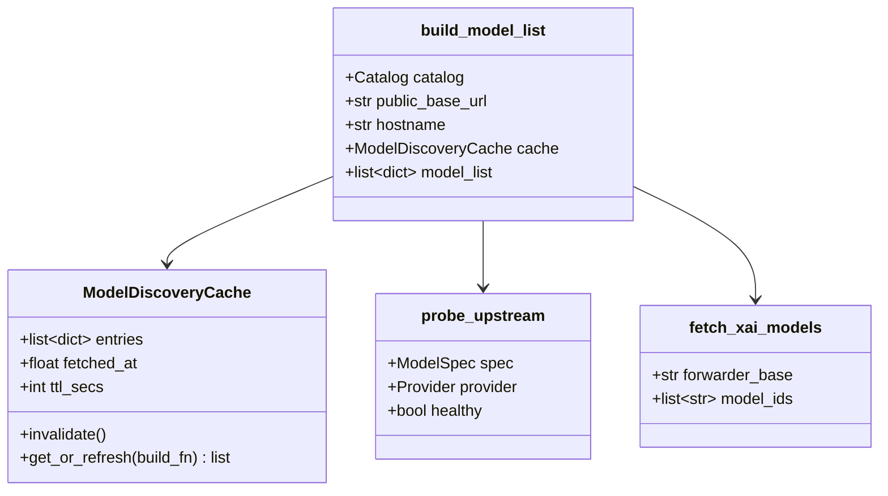
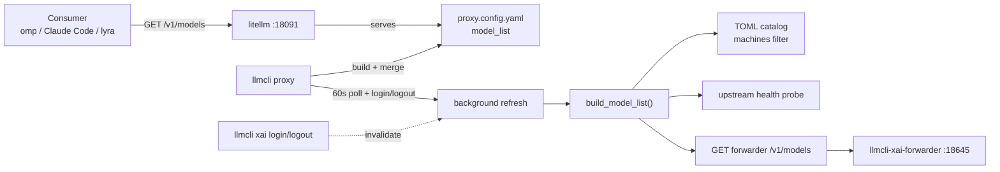

## Context

Source: [frame 130](../frames/130-unified-dynamic-v1-models-frame.mdx) (approved 2026-06-17). Analysis skipped (F-lite). Issue [#130](https://github.com/Roxabi/llmCLI/issues/130). Blocker [#129](https://github.com/Roxabi/llmCLI/issues/129) closed — `/xai` pass-through is live; this issue unifies discovery on the canonical `:18091/v1/models`.

Today `build_model_list()` (`src/llmcli/support/litellm_config.py`) emits static TOML entries (ADR-005 `machines` filter) plus hardcoded `_XAI_OAUTH_MODELS` (`grok-4`, `grok-4-fast`) when `xai.json` exists. The xAI forwarder exposes a live catalogue at `http://llmcli-xai-forwarder:18645/v1/models` that LiteLLM never sees. Consumers using standard OpenAI discovery (`GET /v1/models` on `:18091`) get stale Grok lists.

**Spike decision → Option A.** Extend `build_model_list()` to fetch forwarder models, merge with TOML, health-filter remotes, cache in-memory, and background-refresh the generated `proxy.config.yaml` + litellm child reload — no upstream LiteLLM blocker ([#20064](https://github.com/BerriAI/litellm/issues/20064)). Option B (wildcard `grok/*` + `check_provider_endpoint`) is deferred.

## Goal

`GET :18091/v1/models` returns a merged, host-filtered, health-aware catalogue (TOML + live Grok) that refreshes within ~60s and on `xai login`/`logout` — without `systemctl restart llmcli`.

## Users

- **Primary:** Roxabi consumers doing OpenAI-style model discovery on `:18091` — factory omp (`discovery: openai-models-list`), Claude Code, lyra agents.
- **Secondary:** Operators maintaining per-host TOML catalogs — expect ADR-005 `machines` parity and unhealthy upstreams omitted from listings.

## Expected Behavior

On proxy startup (`llmcli proxy` or Quadlet `llmcli` container), `build_model_list()`:

1. Iterates TOML `models/*.toml`, applies `machines` filter (unchanged ADR-005 semantics).
2. For each `engine="remote"` entry that passes the filter, runs a lightweight upstream probe (configurable timeout, default 3s). Entries whose probe returns 401/403/5xx or times out are **omitted** from `model_list` (not listed as unhealthy placeholders — absent is the signal).
3. When `xai.json` exists, `GET http://llmcli-xai-forwarder:18645/v1/models` fetches live Grok IDs. Models matching `grok-imagine-*` are excluded. Each surviving ID becomes a `model_list` entry routed through the xAI forwarder (`openai/responses/{id}` pattern, same as today).
4. When `xai.json` is absent, Grok entries are omitted (no hardcoded fallback list).

A background refresh loop (default 60s, overridable via `LLMCLI_MODEL_REFRESH_SECS`) re-runs steps 1–3, writes `~/.local/state/llmcli/proxy.config.yaml`, and reloads the litellm child process (SIGHUP if supported, else terminate+respawn within `proxy.py` — **no Podman/container restart**).

`llmcli xai login` and `llmcli xai logout` invalidate the cache immediately and trigger one refresh cycle (so Grok models appear/disappear without waiting for the poll interval).

`llmcli register-proxy` uses the same `build_model_list()` path — merged catalogue parity for legacy `:4000` supervisor setups.

The `/xai` pass-through (#129) remains; this issue does not remove it.

## Data Model & Consumers

| Consumer | Reads/Writes | When | Status |
|---|---|---|---|
| `llmcli proxy` | `ModelDiscoveryCache`, `proxy.config.yaml`, litellm child PID | startup + poll + invalidation | this issue |
| `llmcli register-proxy` | `build_block()` → same `build_model_list()` | on-demand | this issue |
| `llmcli xai login/logout` | cache invalidation hook | credential change | this issue |
| LiteLLM `/v1/models` | merged `model_list` | per request (static until reload) | this issue |
| `/xai` pass-through | forwarder live catalogue | per request | existing (#129, unchanged) |

## Breadboard

**Places:** `support/litellm_config.py` · `cli/proxy.py` · `cli/xai.py` · `tests/test_litellm_config.py`

| ID | Affordance | Handler | Data |
|---|---|---|---|
| N1 | `fetch_xai_models(forwarder_base)` | `litellm_config.py` | HTTP GET `/v1/models` → `data[].id`; filter `grok-imagine-*`; empty list on unreachable forwarder |
| N2 | `probe_remote_model(spec, provider)` | `litellm_config.py` | HEAD or minimal GET to provider; return healthy iff 2xx; skip OAuth-managed (`_OAUTH_MANAGED`) |
| N3 | `ModelDiscoveryCache` | `litellm_config.py` | `entries`, `fetched_at`, `ttl_secs`; `invalidate()`; thread-safe `get_or_refresh(fn)` |
| N4 | extended `build_model_list(..., *, cache=None)` | `litellm_config.py` | TOML loop + N2 probe + N1 merge; **remove** `_XAI_OAUTH_MODELS` hardcoded injection |
| N5 | background refresh loop | `proxy.py` | daemon thread: sleep `LLMCLI_MODEL_REFRESH_SECS` (default 60) → rebuild YAML → reload litellm child |
| N6 | litellm child reload | `proxy.py` | SIGHUP to child if litellm accepts; else graceful terminate + `_spawn_litellm` respawn |
| N7 | cache invalidation on auth change | `cli/xai.py` | `login_cmd` / `logout_cmd` call `invalidate_model_cache()` after credential write/delete |
| N8 | `register-proxy` parity | `cli/proxy.py:register_proxy` | unchanged call site — benefits automatically via N4 |
| S1 | unit tests: fetch filter, probe omit, cache TTL, merge shape | `tests/test_litellm_config.py` | mocked HTTP; no live forwarder required |

Wiring: N4←N1,N2,N3; N5→N4→cfg write→N6; N7→N3.invalidate; N8→N4.

## Slices

| # | Slice | Demo |
|---|---|---|
| 1 | Discovery primitives (N1, N2, N3, N4): fetch forwarder models, probe remotes, cache, merge; remove `_XAI_OAUTH_MODELS` | `pytest tests/test_litellm_config.py -k xai` green; `build_model_list` with mocked forwarder returns `grok-4.3` entry |
| 2 | Background refresh + litellm reload (N5, N6) | `llmcli proxy` running; change mock forwarder response; within 60s `curl :PORT/v1/models` reflects new ID without container restart |
| 3 | Auth invalidation (N7) + register-proxy parity smoke (N8) | `llmcli xai logout` → immediate Grok absence on next `/v1/models`; `register-proxy` block includes live Grok IDs |
| 4 | Docs + operator notes | `docs/guides/deployment.md` — unified catalogue behavior, `LLMCLI_MODEL_REFRESH_SECS`, health-filter semantics |

## Success Criteria

- [ ] SC-1: With forwarder healthy and `xai.json` present, generated `model_list` includes a live forwarder ID (e.g. `grok-4.3`) **and** TOML entries (e.g. `deepseek-v4-pro`) when both are configured for the host.
- [ ] SC-2: Models matching `grok-imagine-*` never appear in merged `model_list`.
- [ ] SC-3: When upstream probe for a remote TOML model returns 401 (simulated in tests; e.g. `kimi-k2.6`), that model is **absent** from `model_list`.
- [ ] SC-4: ADR-005 `machines` filter unchanged — model with `machines = ["host-a"]` absent when `hostname="host-b"`.
- [ ] SC-5: When `xai.json` is absent, no Grok entries in `model_list` (hardcoded `_XAI_OAUTH_MODELS` removed).
- [ ] SC-6: Background refresh updates `proxy.config.yaml` and litellm serves new forwarder model IDs within `LLMCLI_MODEL_REFRESH_SECS` (default 60) without `systemctl restart llmcli`.
- [ ] SC-7: `llmcli xai login` and `llmcli xai logout` trigger immediate cache invalidation + config regen (Grok entries appear/disappear without waiting for poll).
- [ ] SC-8: Forwarder unreachable at build time → Grok entries omitted, TOML entries still present; no proxy startup failure.
- [ ] SC-9: `llmcli register-proxy` emitted block uses the same merged `build_model_list()` output (parity with `llmcli proxy`).
- [ ] SC-10: Tests in `tests/test_litellm_config.py` cover forwarder fetch, `grok-imagine-*` filter, health probe omission, cache TTL, and `machines` parity (no live network in CI).

## Edge Cases

| Scenario | Handling |
|---|---|
| Forwarder down at startup | Omit Grok entries; log warning; proxy starts normally |
| Forwarder recovers mid-run | Next poll adds Grok entries |
| All remote models unhealthy | `model_list` may be Grok-only or empty; LiteLLM still starts |
| `LLMCLI_MODEL_REFRESH_SECS=0` or unset invalid | Treat as default 60; reject negative values at parse |
| Duplicate ID (TOML name == forwarder ID) | TOML entry wins; forwarder ID skipped (dedup by `model_name`) |
| litellm child reload fails | Log error; retry next poll; do not crash parent `llmcli proxy` |