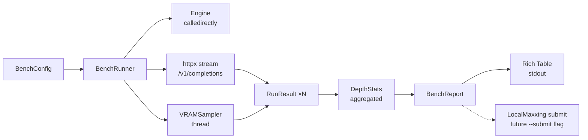

## Context

Promoted from `artifacts/analyses/16-llmcli-bench-analysis.mdx`.
Shape selected: **Shape 1 — API-based** (OpenAI endpoint timing). `llama-bench` binary absent; both llamacpp and vllm serve OpenAI-compatible endpoints, so a unified HTTP timing approach covers both engines with zero new binary dependencies.

## Goal

Add `llmcli bench [model] [options]` that starts an engine, sends timed OpenAI streaming requests, measures pp t/s, tg t/s, TTFT, and VRAM peak, then prints a Rich table — without requiring any binary beyond what is already installed.

## Users

- **Primary:** Mickael — comparing quant variants, context configs, and engine flags before promoting a model to the catalog.

## Expected Behavior

```
$ llmcli bench qwen3_6-35b-a3b-tq3 --pp 512 --tg 128 --depth 0,8192 --runs 3

Benchmarking qwen3_6-35b-a3b-tq3 ...
  Engine: llamacpp_tq3  Port: 8091
  Runs: 3  PP: 512  TG: 128  Depths: 0, 8192

  depth       pp t/s     tg t/s    TTFT (ms)   VRAM (GiB)
  ──────────────────────────────────────────────────────
      0       1842        47.3        210           13.1
   8192       1621        44.1        238           13.4

Done in 47s
```

1. Resolve model spec from catalog. Unknown model → error with available list.
2. Resolve engine (llamacpp / llamacpp_tq3 / vllm) from spec.
3. Start engine directly (bypass daemon — bench is ephemeral, no daemon registration).
4. For each depth in `--depth`:
   a. Build synthetic prompt: `"a " × depth` (≈1 token/word, no tokenizer needed).
   b. For each run: POST `/v1/completions` with `stream=True`, `max_tokens=tg`, prompt = synthetic_prefix + pp_tokens.
   c. Time from request start → first chunk = TTFT.
   d. Count streamed tokens / elapsed = tg t/s.
   e. Estimate pp t/s = pp_tokens / (TTFT / 1000).
5. VRAM sampler thread: hold `nvmlInit()` open, poll every 200 ms, record peak. Shutdown on engine stop.
6. Stop engine.
7. Print Rich table: one row per depth, averaged over runs with stddev.

If engine already running on the port → error: "Port {port} in use. Run `llmcli stop` first."
If vllm not installed → error: "vLLM not installed. Run: uv sync --group vllm".

## Data Model & Consumers

```classDiagram
    class BenchConfig {
        +str model_name
        +int pp_tokens
        +int tg_tokens
        +list[int] depths
        +int runs
    }

    class RunResult {
        +int depth
        +str engine
        +float ttft_ms
        +float tg_tok_per_s
        +float pp_tok_per_s
        +float vram_peak_gib  "optional: None if no GPU"
    }

    class BenchReport {
        +str model_name
        +str engine
        +list[DepthStats] rows
        +render_table() Table
    }

    class DepthStats {
        +int depth
        +float pp_mean
        +float pp_std
        +float tg_mean
        +float tg_std
        +float ttft_mean
        +float vram_peak
    }

    BenchConfig --> RunResult : produces N×
    RunResult --> DepthStats : aggregated into
    DepthStats --> BenchReport : rows
```



| Consumer | Fields | When | Status |
|----------|--------|------|--------|
| Rich table renderer | all DepthStats fields | bench run end | this issue |
| LocalMaxxing submit | model_name, engine, tg_mean, ttft_mean, vram_peak | future `--submit` | future |

## Breadboard

### U1 — CLI Entry

| Affordance | Handler | Data |
|------------|---------|------|
| `llmcli bench <model>` | `bench_cmd()` in `cli/bench.py` | `BenchConfig` built from args |
| `--pp INT` (default 512) | Typer option | `BenchConfig.pp_tokens` |
| `--tg INT` (default 128) | Typer option | `BenchConfig.tg_tokens` |
| `--depth TEXT` (default "0", comma-sep) | Typer option, parsed to `list[int]` | `BenchConfig.depths` |
| `--runs INT` (default 3) | Typer option | `BenchConfig.runs` |

### N1 — Engine Lifecycle

| Affordance | Handler | Data |
|------------|---------|------|
| Resolve spec | `config.load().models[name]` | `ModelSpec` |
| Resolve engine class | `engines.__init__.get_engine(spec.engine)` | `Engine` instance |
| Start engine (direct) | `engine.start(spec)` | `EngineInstance` |
| Stop engine | `engine.stop(instance)` in `finally` block | — |

### N2 — Benchmark Loop

| Affordance | Handler | Data |
|------------|---------|------|
| Synthetic prefix | `"a " × depth` (≈1 token/word, nominal) | `str` |
| PP prompt | `"x " × pp_tokens` appended to prefix (nominal token count, not exact) | `str` |
| Streaming request | `httpx.stream("POST", base_url+"/v1/completions", ...)` | chunks |
| TTFT | `time.perf_counter()` at first chunk | `float` ms |
| tg t/s | `token_count / elapsed_s` | `float` |
| pp t/s (estimated) | `pp_tokens / (ttft_ms / 1000)` — reliable for llamacpp; includes scheduler for vLLM (annotated in table) | `float` |

### N3 — VRAM Sampler

| Affordance | Handler | Data |
|------------|---------|------|
| Init NVML | `pynvml.nvmlInit()` — once at sampler start | handle |
| Poll loop | `threading.Thread`, sleep 200 ms | `float` GiB per sample |
| Peak tracking | `max(samples)` | `float` GiB |
| Shutdown | `pynvml.nvmlShutdown()` on `stop()` | — |
| Fallback | `nvidia-smi` subprocess if pynvml unavailable | `float` GiB |

### S1 — Output

| Affordance | Handler | Data |
|------------|---------|------|
| Progress | `rich.progress.Progress` during runs | — |
| Result table | `rich.table.Table` | `BenchReport` |
| Error display | `err_console.print(Panel(...))` | str |

## Slices

| # | Slice | Affordances | Acceptance criteria |
|---|-------|-------------|---------------------|
| 1 | Engine start/stop + port check | N1 | Engine starts, port-in-use error works |
| 2 | Single run measurement (depth=0) | N2, S1 | TTFT, tg t/s, pp t/s populated; Rich table printed with VRAM column = `—` |
| 3 | VRAM sampler | N3 | Peak VRAM captured and shown; pynvml fallback to nvidia-smi; no GPU → `N/A` |
| 4 | Context sweep (multi-depth) | N2 | Multiple rows in table, one per depth |
| 5 | Multi-run aggregation + stddev | N2, S1 | Mean and stddev correct across N runs |

## Success Criteria

- [ ] `llmcli bench <model>` starts engine, runs benchmark, stops engine, prints Rich table
- [ ] `--depth 0,4096,8192` produces one result row per depth value
- [ ] `--runs N` runs each depth N times and shows mean values in table
- [ ] TTFT measured from request start to first streamed token
- [ ] tg t/s = generated tokens / elapsed seconds (post-first-token)
- [ ] pp t/s = pp_tokens / (TTFT / 1000)
- [ ] VRAM peak captured via pynvml; falls back to nvidia-smi when pynvml unavailable
- [ ] VRAM sampler holds single `nvmlInit()` open for its lifetime (thread-safe)
- [ ] No GPU present (pynvml absent + nvidia-smi absent) → VRAM column shows `N/A`, no crash
- [ ] Slice 2 table renders with VRAM column `—` before sampler is active (vram_peak_gib is None)
- [ ] Engine started directly (no daemon registration); stopped in `finally` block
- [ ] Port-in-use detected before engine start → clear error message
- [ ] vllm engine: guard `shutil.which("vllm")` before starting
- [ ] Unknown model name → error listing available models
- [ ] pp t/s column labeled "pp t/s (est.)" with footnote for vLLM runs
- [ ] `--runs N > 1` shows stddev alongside mean in table
- [ ] `cli/__init__.py` imports `bench` submodule
- [ ] Tests cover: single run, multi-depth, VRAM sampler, port error, unknown model, no-GPU fallback
