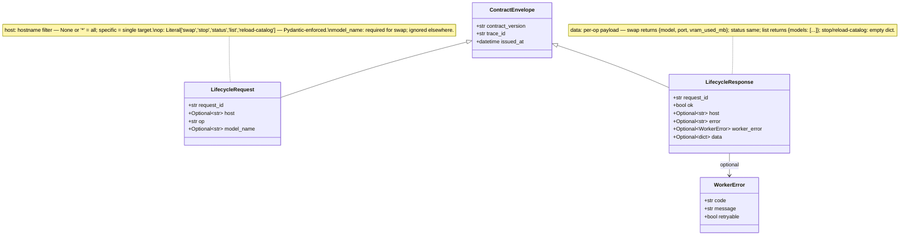
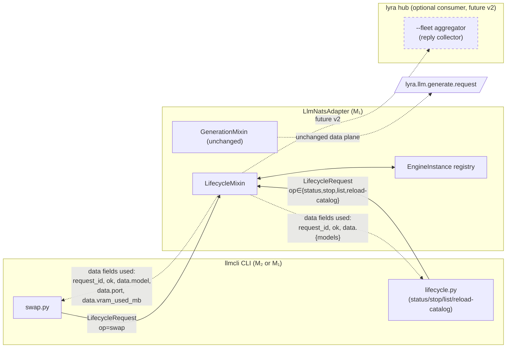

## Context

Promoted from `artifacts/analyses/34-nats-lifecycle-fold-analysis.mdx` (analysis approved 2026-05-21). Frame: `artifacts/frames/34-nats-lifecycle-fold-frame.mdx`. Consensus: `artifacts/analyses/34-nats-lifecycle-fold-consensus.mdx` — appetite 4-5d, Shape A (broadcast + host filter), inline NATS in CLI, `--fleet` deferred to v2.
Upstream: ADR-004 (`docs/architecture/adr/004-lifecycle-control-plane-nats-over-af-unix.mdx`) status → Accepted on this issue's merge. roxabi-nats 0.4.1+ (provides `wait_ready` kwarg). Supersedes closed #33.

## Goal

Migrate llmCLI's 5 lifecycle operations (`swap`, `stop`, `status`, `list`, `reload-catalog`) from an AF_UNIX socket on the host to NATS-native broadcast subjects served by the existing `LlmNatsAdapter`, enabling `llmcli <op> --host <hostname>` from any tailnet member with a valid operator nkey.

## Users

- **Primary:** Mickael (operator on M₂) wanting to manage M₁'s loaded model without SSH. Today: `ssh roxabituwer; llmcli swap qwen3-4b`. After: `llmcli swap --host roxabituwer qwen3-4b` from M₂.
- **Secondary:**
  - **lyra agents** (consume llmCLI via `LlmNatsAdapter`): unaffected functionally; gain unified audit trail.
  - **claude-code (`ccl`/`ccp` aliases)**: fully unaffected. LiteLLM `:4000` and quadlet proxy `:18091` remain untouched.
  - **Future GPU host (3rd)**: pays only quadlet deploy cost; no daemon / supervisor wiring.

## Expected Behavior

After this work merges (PR 1 + cutover PR), the following invariants hold:

1. **No AF_UNIX socket.** `src/llmcli/daemon.py` is deleted. `~/.local/state/llmcli/llmcli.sock` is no longer created on worker startup. `LLMCLI_SOCKET` env var is removed.
2. **Single transport for lifecycle.** `llmcli swap`, `stop`, `status`, `list`, `reload-catalog` all publish on `lyra.llm.lifecycle.<op>` and await an inbox reply. No CLI command writes to a socket.
3. **Host targeting via hostname.** `--host <hostname>` flag maps directly to `socket.gethostname()` on the worker — application-layer filter in `LifecycleMixin`. Omitting `--host` defaults to local hostname (parity with current behavior).
4. **Drain on swap.** A `lifecycle.swap` arriving while `lyra.llm.generate.request` streams are in flight sets `_draining: asyncio.Event`, waits up to `drain_timeout` (default 30s) for the semaphore to clear, then executes the swap. New generations during drain get `worker.capacity` retryable.
5. **Auth split.** Operator nkey gets `pub lyra.llm.lifecycle.>` + `sub _inbox.<operator>.>`. Worker nkey adds `sub lyra.llm.lifecycle.>` to existing grants. Both regenerated via `lyra-acl genkeys`; manual `auth.conf` edits forbidden.
6. **MRO-safe composition.** `LifecycleMixin._extra_subjects()` and `heartbeat_payload()` call `super()` and extend — verified by a regression test that inserts a third mixin and asserts all 3 contribute to subject and heartbeat outputs.
7. **`wait_ready=False`.** `LlmNatsAdapter.__init__` passes `wait_ready=False` to `NatsAdapterBase.__init__` (per C2 in frame). Worker boots without probing JetStream KV.
8. **CI gate.** `pytest -m nats` runs against a `nats:latest` service container in `.github/workflows/ci.yml`. Unit tests outside the marker stay broker-free.
9. **Audit trail.** Lifecycle subjects emit JetStream records — replayable via `nats sub lyra.llm.lifecycle.>` on the broker.
10. **ADR-004 Accepted.** `docs/architecture/adr/004-lifecycle-control-plane-nats-over-af-unix.mdx` status flipped from "Proposed" to "Accepted" in the cutover PR.

## Data Model & Consumers

### Lifecycle payload types (Pydantic v2)



### Consumer map



### Consumer summary

| Consumer | Fields consumed | When | Status |
|---|---|---|---|
| `swap.py` (CLI) | `request_id`, `ok`, `data.model`, `data.port`, `data.vram_used_mb`, `error`, `worker_error` | On every swap request | **This issue** |
| `lifecycle.py` (CLI status/stop/list/reload-catalog) | `request_id`, `ok`, `data.{model,port,vram_used_mb,models[]}`, `error`, `worker_error` | On every non-swap lifecycle op | **This issue** |
| `LifecycleMixin.handle_lifecycle` (worker) | `host` (filter), `op` (dispatch), `model_name` (swap-only) | On every received `LifecycleRequest` | **This issue** |
| Hub `--fleet` aggregator | `request_id`, `host`, `ok`, `data.*` | Per-host reply collection | **v2** (deferred) |
| JetStream consumer (audit replay) | Entire envelope | On demand | **This issue** (audit grant on operator nkey) |

## Breadboard

### CLI affordances

| ID | Affordance | Handler | Data (in) | Data (out) | Notes |
|---|---|---|---|---|---|
| U1 | `llmcli swap [name] [--host HOST] [--timeout SEC]` | `cli/swap.py::swap()` | `name` (cat. lookup), `host` (default `gethostname()`), `timeout` (default 300s) | stdout: `OK swapped to <name>` / `ERR <code>: <msg>` | Inline NATS publish (no `_nats_client.py`). |
| U2 | `llmcli status [--host HOST]` | `cli/lifecycle.py::status()` | `host` | Rich `Table` of `(model, port, uptime_s, vram_used_mb)` | Existing JSON-dict parsing already in place; reuse. |
| U3 | `llmcli stop [--host HOST]` | `cli/lifecycle.py::stop()` | `host` | stdout: `OK stopped` / `ERR ...` | Drains then stops engine. |
| U4 | `llmcli list [--host HOST]` | `cli/lifecycle.py::list_models()` | `host` | Rich `Table` of catalog + running flag | New command — currently catalog-only. |
| U5 | `llmcli reload-catalog [--host HOST]` | `cli/lifecycle.py::reload_catalog()` | `host` | stdout: `OK reloaded N models` / `ERR ...` | Triggers worker-side `config.load()` re-read. Broadcast (no target). |

### NATS subjects (in `roxabi-contracts.llm.subjects.SUBJECTS`)

| ID | Subject | Pub by | Sub by | Atomic? |
|---|---|---|---|---|
| N1 | `lyra.llm.lifecycle.swap` | operator nkey | worker nkey (via `_extra_subjects()`, no queue group) | App-layer host filter + `asyncio.Event` drain |
| N2 | `lyra.llm.lifecycle.stop` | operator nkey | worker nkey | App-layer filter |
| N3 | `lyra.llm.lifecycle.status` | operator nkey | worker nkey | App-layer filter |
| N4 | `lyra.llm.lifecycle.list` | operator nkey | worker nkey | App-layer filter |
| N5 | `lyra.llm.lifecycle.reload-catalog` | operator nkey | worker nkey | Broadcast (no host filter) |

### Worker dispatch wiring

| ID | Component | Calls | Implements |
|---|---|---|---|
| S1 | `LifecycleMixin._extra_subjects()` | `super()._extra_subjects()` | Returns `[*LIFECYCLE_SUBJECTS, *super()._extra_subjects()]` (A3) |
| S2 | `LifecycleMixin.handle_lifecycle(msg, payload)` | `socket.gethostname()`, then `_dispatch_lifecycle_op(op, msg, payload)` | Host filter + op router |
| S3 | `LifecycleMixin._dispatch_lifecycle_op(op, msg, payload)` | `_do_swap()`, `_do_stop()`, `_do_status()`, `_do_list()`, `_do_reload_catalog()` | Op-to-handler map |
| S4 | `LifecycleMixin._do_swap(model_name)` | `_draining.set()`, await semaphore drain, `EngineInstance.stop` + `EngineInstance.start`, `_draining.clear()` | A2 drain pattern |
| S5 | `LlmNatsAdapter.handle(msg, payload)` (override) | If `msg.subject ∈ LIFECYCLE_SUBJECTS` → `self.handle_lifecycle(...)`; else → `super().handle(msg, payload)` (preserves MRO chain for future mixins → eventually `GenerationMixin._run_generation`) | Top-level router |
| S6 | `LifecycleMixin.heartbeat_payload()` | `super().heartbeat_payload()` | Adds `lifecycle_draining: bool` (A3) |
| S7 | `LlmNatsAdapter.__init__` | `super().__init__(..., wait_ready=False)` | C2 |

### ACL grants (Slice 0)

| ID | Identity | Grant | File |
|---|---|---|---|
| A1 | `LLM_OPERATOR` (new) | `pub lyra.llm.lifecycle.>`, `sub _inbox.llm-operator.>` | `auth.conf` (regen via `lyra-acl genkeys`) |
| A2 | `LLM_WORKER` (existing, augment) | + `sub lyra.llm.lifecycle.>` | `auth.conf` |
| A3 | `acl-matrix.json` audit | Both grants reflected | `~/projects/lyra/deploy/nats/acl-matrix.json` |

**Slice 0 execution procedure (concrete):**

1. `cd ~/projects/lyra && lyra-acl genkeys --add-identity LLM_OPERATOR --pub "lyra.llm.lifecycle.>" --sub "_inbox.llm-operator.>"` (consult `~/projects/lyra/docs/nats/acl-tooling.md` for exact subcommand syntax)
2. `lyra-acl genkeys --augment-identity LLM_WORKER --add-sub "lyra.llm.lifecycle.>"` — extend existing worker grants
3. Operator nkey seed lands at `~/.config/llmcli/nkeys/operator.seed` on M₂ (manual `scp` from M₁ generation host *or* Podman secret mount)
4. Worker nkey seed already at `/home/llmcli/.config/llmcli/nkeys/seed.seed` (Podman secret per quadlet line 18) — regenerated in place by `lyra-acl genkeys`
5. `nats-server` reload on M₁: `systemctl --user reload nats-server` (or per-hub deploy convention — verify in lyra hub README)
6. Verification: from M₂, `nats sub "lyra.llm.lifecycle.>" --creds ~/.config/llmcli/nkeys/operator.creds` succeeds; publishing from any tailnet member with the operator nkey shows on M₂; same `nats sub` *without* `--creds` fails with permission error.

## Slices

Vertical increments. Slices 0-5 ship in **PR 1**; Slice 6 ships as **PR 2 (cutover)** per consensus PL2 named-deliverable rule.

| # | Slice | Demo (binary observable) | Affordances | Depends on | Effort |
|---|---|---|---|---|---|
| 0 | **ACL provisioning** | `nats sub` from M₂ with operator nkey succeeds on `lyra.llm.lifecycle.>`; without grant, fails. | A1, A2, A3 | — | 0.5 d |
| 1 | **Contracts** (cross-repo on `Roxabi/lyra:staging`) | `pip install roxabi-contracts` from staging exposes `LifecycleRequest`, `LifecycleResponse`, `SUBJECTS.lifecycle_*`, `llm.lifecycle_rejected` error code. | N1-N5 schemas, error codes | — (parallel with Slice 0) | 0.5-1.0 d |
| 2 | **LifecycleMixin** | Worker accepts `lifecycle.status` from M₂ and returns the loaded model; existing `generate.request` still works under same MRO. | S1-S7 | Slice 1 (`uv.lock` bump after contracts merged) | 1.0 d |
| 3 | **CLI rewire** | All 5 `llmcli <op> --host roxabituwer` commands from M₂ return correct results (against running M₁ worker behind the feature flag). | U1-U5 | Slice 2 | 0.75 d |
| 4 | **Quadlet + flag bundle** | M₂ `worker.env` has `LLMCLI_LIFECYCLE_VIA_NATS=1`; `wait_ready=False` confirmed; `Restart=on-failure` round-trip works. **Exec/HealthCmd verification (D2 outcome):** `Exec=llm` → `deploy/entrypoint.sh` sets `MODE=llm` → `exec llmcli nats-serve llm "$@"`; `HealthCmd=pgrep -f "llmcli nats-serve"` correctly matches the resolved process. **No realignment change needed** — paper-only mismatch resolved by the entrypoint shim. Slice 4 documents the resolution path as a comment in the quadlet header. | (quadlet edits) | Slice 2 | 0.5 d |
| 5 | **Tests + docs** | `pytest -m nats` green in CI (with `nats:latest` service); coverage of host filter + drain + error codes + MRO; CLAUDE.md tables updated. | (test files) | Slices 2, 3 | 0.75-1.0 d |
| 6 | **Cutover PR** (named, separate PR) | `git ls-files src/llmcli/daemon.py` returns empty; flag default flipped; feature flag env var removed; M₁ + M₂ smoke green for 1 cycle. | (deletions) | All above + 1-cycle PR-1 validation window | 0.5 d |

**Total v1 appetite:** 4.5-5.25 d (consensus envelope).
**v2 follow-up** (separate child issue, filed at end of `/spec`): `--fleet` flag + `cli/_nats_client.py` extraction. Sized independently (~2d).

## Success Criteria

Each item is binary (pass/fail at PR-merge time, except where noted).

- [ ] **AC-1** Local default: from M₁ host with `LLMCLI_LIFECYCLE_VIA_NATS=1`, `llmcli swap qwen3-8b` (no `--host` flag) prints `OK swapped to qwen3-8b` on stdout; `llmcli status` then reports `model=qwen3-8b` with non-zero `port` and non-zero `vram_used_mb`. Same observable shape as today's AF_UNIX path.
- [ ] **AC-1b** Contracts gate (Slice 1): after `roxabi-contracts` PR merges on `Roxabi/lyra:staging` and `uv.lock` is bumped, `python -c "from roxabi_contracts.llm import LifecycleRequest, LifecycleResponse; from roxabi_contracts.llm.subjects import SUBJECTS; print(SUBJECTS.lifecycle_swap)"` prints `lyra.llm.lifecycle.swap`; `python -c "from roxabi_contracts.errors import KNOWN_CODES; assert 'llm.lifecycle_rejected' in KNOWN_CODES"` exits 0.
- [ ] **AC-2** Remote target: `llmcli swap --host roxabituwer qwen3-4b` from M₂ swaps the model on M₁; `llmcli status --host roxabituwer` confirms `model=qwen3-4b`.
- [ ] **AC-3** All 5 ops (`swap`, `stop`, `status`, `list`, `reload-catalog`) succeed against M₁ from M₂ with `--host`.
- [ ] **AC-4** `LlmNatsAdapter.__init__` passes `wait_ready=False`; worker boots without `$JS.API.>` ACL grant.
- [ ] **AC-5 (CI test-only — `@pytest.mark.nats`)** Drain test: while a `lyra.llm.generate.request` stream is in flight, publishing `lifecycle.swap` causes the stream to complete fully (within `drain_timeout=30s`); subsequent new generations during drain receive `worker.capacity` retryable error. Verified by integration test against the `nats:latest` service container; no human demo step.
- [ ] **AC-6 (CI test-only — pure unit)** MRO composition: unit test inserts `LifecycleMixin` + `GenerationMixin` + a third stub mixin into a subclass of `NatsAdapterBase`; asserts `_extra_subjects()` returns all contributions in MRO order and `heartbeat_payload()` merges all keys without collision. No human demo step.
- [ ] **AC-7** **ACL negative:** publisher without `pub lyra.llm.lifecycle.>` grant receives NATS permission error; subscriber without `sub lyra.llm.lifecycle.>` doesn't receive lifecycle messages.
- [ ] **AC-8** Feature flag `LLMCLI_LIFECYCLE_VIA_NATS` toggles CLI between AF_UNIX path (false/unset) and NATS path (true) during pre-cutover window — verified by integration test with both states.
- [ ] **AC-9** **Cutover PR (Slice 6):** `src/llmcli/daemon.py` + `tests/test_daemon.py` deleted; flag default removed from `worker.env`; feature flag env var no longer read by `cli/`; ADR-004 status → "Accepted".
- [ ] **AC-10** **CI:** `.github/workflows/ci.yml` gains a `services:` block running `nats:2.11-alpine` on `:4222` with a health probe; the existing `Test` step splits into `pytest` (non-marker) + `pytest -m nats` (against the broker). `@pytest.mark.nats` registered in `tests/nats/conftest.py`; non-marker tests stay broker-free. PR green with both steps passing.
- [ ] **AC-11** **Audit trail:** `nats sub "lyra.llm.lifecycle.>"` on the broker yields every published lifecycle request (verified by replay test).
- [ ] **AC-12** Docs: `CLAUDE.md` Consumers + CLI Commands tables updated; ADR-004 has banner pointing at this issue's PR.

## Edge Cases & Error Handling

| # | Scenario | Strategy |
|---|---|---|
| E1 | NATS unavailable (broker down) | CLI: connect with 5s timeout → on failure, print `[red]NATS unreachable: <reason>[/red]` + exit 1. No fallback to AF_UNIX in PR 1 (cleaner cutover). **Rollback during PR-1-validation window:** `sed -i 's/LLMCLI_LIFECYCLE_VIA_NATS=1/LLMCLI_LIFECYCLE_VIA_NATS=0/' ~/.roxabi/llmcli/worker.env && systemctl --user restart llmcli-nats-worker` — CLI then uses AF_UNIX path. After Slice 6 (cutover PR), no rollback path remains. |
| E2 | `host` filter mismatch (typo) | All workers silently drop; operator sees inbox reply timeout (default 10s in CLI) → prints `[yellow]No worker responded for host=<value>. Check hostname.[/yellow]` |
| E3 | `swap` to model exceeding VRAM budget | `LifecycleMixin._do_swap` calls existing `check_vram_budget(spec, host)` before stopping current engine — same guard as `daemon._cmd_swap`. Returns `LifecycleResponse(ok=False, worker_error=WorkerError(code="llm.lifecycle_rejected", message="vram budget exceeded: ...", retryable=False))`. |
| E4 | `swap` to `engine="remote"` (cloud-passthrough) | Mirror `daemon._engine_for_spec` rejection (lines 166-171). Return `worker_error=WorkerError(code="llm.lifecycle_rejected", message="model uses engine='remote' — managed by LiteLLM proxy, not the worker", retryable=False)`. |
| E5 | Drain timeout exceeded (long-running generation > 30s) | After `drain_timeout`, force-stop the in-flight generation (current behavior under `daemon._cmd_swap` — old engine killed). Streamer receives the connection drop as `upstream.unavailable` retryable. Document in spec; do not change drain semantics. |
| E6 | Malformed payload (validation fails) | Existing `NatsAdapterBase._validate_envelope` drops + increments `_drop_count`; reply not sent. Operator sees inbox timeout. |
| E7 | Concurrent swap requests | First swap acquires `LifecycleMixin._lock: asyncio.Lock`; second waits up to `cli` timeout. Idempotent semantics: same-model swap is a fast-path `OK already running`. |
| E8 | Heartbeat during drain | `heartbeat_payload()` exposes `lifecycle_draining: bool`. Lyra hub can use this to back off auto-routing during drain windows. |
| E9 | Cross-repo PR ordering: llmCLI merged first, then contracts | CI catches via `uv sync --frozen` — `LifecycleRequest` import fails at import-time → test collection error → PR red. Merge-checklist line in PR-1 body: "☐ Confirm `roxabi-contracts` PR merged on `Roxabi/lyra:staging` and `uv.lock` bumped to that SHA." |
| E10 | Worker process crashes mid-swap (old engine stopped, new not yet started) | Quadlet `Restart=on-failure` + `RestartSec=10` brings the worker back. On restart, no engine is loaded; `status` returns `model=None`. Recovery: operator re-issues `swap`. Document in `CLAUDE.md` Gotchas section + add an integration test that kills the worker between `EngineInstance.stop()` and `EngineInstance.start()` to verify recovery semantics. |
| E11 | `reload-catalog` fails (TOML parse error in `llmcli.toml`) | `LifecycleMixin._do_reload_catalog` catches `tomllib.TOMLDecodeError` and returns `LifecycleResponse(ok=False, worker_error=WorkerError(code="llm.lifecycle_rejected", message="catalog parse error: <detail>", retryable=False))`. Existing in-memory catalog remains loaded — no partial state, no service interruption. Unit-tested with a malformed TOML fixture. |

## v2 Follow-up Scope (separate child issue)

To be filed via `/issue-triage` at spec-approval time. Draft body:

```
Title: feat(cli): --fleet lifecycle ops + extract cli/_nats_client.py helper

Body:
## Goal

Add `--fleet` flag to llmCLI lifecycle commands (`status`, `list`, `swap` with broadcast target) and extract the NATS publish/reply pattern from the v1 inline form into `src/llmcli/cli/_nats_client.py` as a shared helper.

## Why

v1 (#34) deferred --fleet aggregation per consensus DP1 (separates primary blowup vector from cutover-PR critical path). With v1 shipped and the routing topology proven, the second concrete use site (reply collection across N workers with timeout) makes _nats_client.py earn its abstraction.

## Scope

- `cli/_nats_client.py`: NATS publish + reply collection with timeout, per-host reply aggregation.
- `cli/swap.py`, `cli/lifecycle.py`: replace inline NATS blocks with helper.
- New `--fleet` flag on `status`/`list` (broadcast-then-aggregate); on `swap` (fanout to all workers).

## Out of scope

Anything not strictly --fleet or extraction. The 5 v1 ops keep their inline pattern until they move to the helper.

## Tier

F-lite — single domain (CLI Python), clear scope, ~5 files.

Blocked-by: #34
```

## Pre-implementation checklist

- [x] Frame approved
- [x] Recheck: confirmatory drift only
- [x] Analysis: Shape A picked + 4-reviewer pass absorbed
- [x] Consensus reached on DP1 (4-5d hybrid) + DP2 (inline)
- [x] Open questions O1-O5 resolved
- [x] Spec drafted with 7 slices + 13 ACs + 11 edge cases
- [x] Pre-check pass: 5/5 (binary criteria ✓, no dangling refs ✓, |χ|=0 ✓, slice coverage ✓, edge completeness ✓)
- [x] Expert review: 4-agent pass (architect/devops/doc-writer/product-lead) — REVISE verdicts absorbed in this revision
- [ ] User approval (Step 5)
- [ ] v2 child issue filed via `/issue-triage` (gating step before `/plan`)
