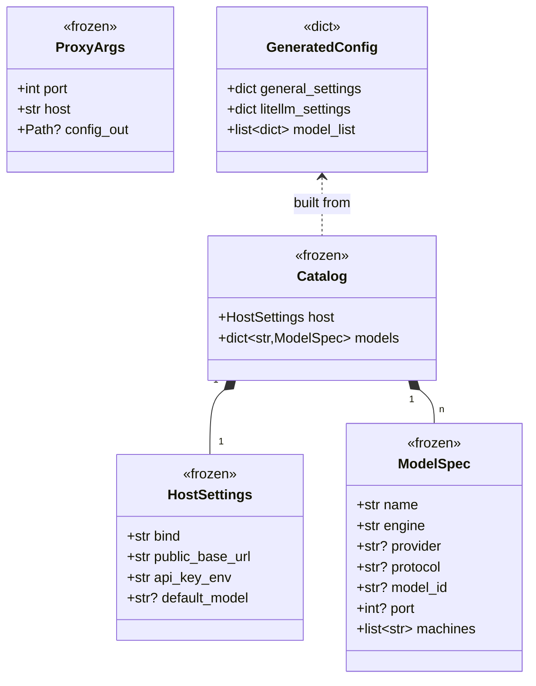
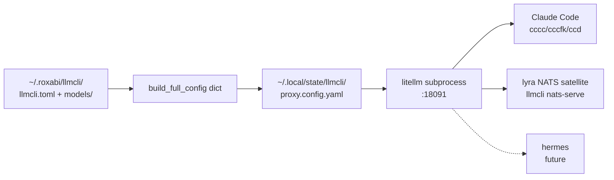

## Context

Promoted from [`40-llmcli-proxy-portal-frame.mdx`](../frames/40-llmcli-proxy-portal-frame.mdx).

Step 3 of the **llmcli central-portal** plan. Phases 1 (`#36/#37`, cloud-passthrough catalog with `engine="remote"`) and 2 (`#38/#39`, `~/.roxabi/llmcli/` data-dir migration) are merged. With the catalog now the source of truth for both local and remote models, the LiteLLM proxy that exposes them should be owned end-to-end by llmcli — config generation **and** process lifecycle — so it composes cleanly into a Podman Quadlet (Step 4 of the plan, separate issue).

Today's state:
- `~/.litellm/config.yaml` is a hybrid: hand-written `general_settings` + `pass_through_endpoints` + `model_list` (NVIDIA deepseek), plus a sentinel-managed `# --- llmCLI managed block ---` rewritten by `llmcli register-proxy`.
- The proxy process is owned by **lyra supervisor** (`~/projects/lyra/deploy/supervisor/conf.d/litellm.conf`, port `:4000`).
- M₁ has no GPU and no lyra-supervisor reason-to-exist beyond hosting this proxy. M₂ requires two-repo coordination for every catalog change.

This spec adds `llmcli proxy` — a sibling command of `llmcli serve` and `llmcli nats-serve` — that reads the catalog, emits a complete LiteLLM config to a managed tempfile, spawns `litellm` as a foreground subprocess, and forwards signals. **Strategy: Replace** (per `/frame` decision) — the existing `:4000` instance is retired in a follow-up ops task after Quadlet ships.

Existing `llmcli register-proxy` stays functional this cycle (manual sentinel-block management for users who want to keep the `:4000` instance during migration); deprecation is a later issue.

## Goal

A single command — `llmcli proxy` — that owns the LiteLLM proxy lifecycle on a host: generates a complete, self-contained config from the catalog, spawns `litellm` on `:18091` by default, validates provider-key environment up front, and forwards SIGTERM/SIGINT cleanly to the child so systemd/Quadlet (Step 4) and supervisord (transition) can supervise it as any other long-running process.

## Users

**Current beneficiary (this issue alone):**
- **Mickael (ops + dev)** — runs `llmcli proxy` on M₁ (cloud-only) and M₂ (mixed local + cloud), uses `--config-out` for debugging catalog → YAML mapping. Foreground run under supervisord during the migration window also works.

**Deferred beneficiaries (require follow-up ops tasks):**
- **systemd / Quadlet (Step 4)** — supervises `llmcli proxy` as a foreground unit; receives exit code from the child to drive restart policy
- **lyra NATS satellite** (`llmcli nats-serve llm`) — points `LLMCLI_LITELLM_URL` at this proxy via the worker.env file
- **Claude Code (`cccc/cccfk/ccd` aliases)** — current `:4000` consumers; migrate to `:18091` after Quadlet ships

Not in scope: virtual keys, RBAC, hot-reload (catalog change → restart).

## Expected Behavior

### Happy path: `llmcli proxy`

1. User runs `llmcli proxy` (no args) on a host that has `~/.roxabi/llmcli/llmcli.toml` + `models/*.toml` and `LLMCLI_API_KEY` exported.
2. llmcli loads the catalog, applies the `machines = [...]` filter against `socket.gethostname()`, and computes the effective model set for this host.
3. For each `engine="remote"` model in the effective set, llmcli looks up the provider in the registry (`fireworks` → `FIREWORKS_API_KEY`, `nvidia-nim` → `NVIDIA_API_KEY`, `anthropic` → `ANTHROPIC_API_KEY`, etc.) and checks the env var is present. Missing key → exit `1` with one-line actionable error per missing provider.
4. llmcli writes the complete config YAML to `~/.local/state/llmcli/proxy.config.yaml` (overwriting any prior run), with file mode `0600`.
5. llmcli `Popen`s `litellm --config <path> --port 18091 --host 0.0.0.0`, inheriting stdout/stderr.
6. llmcli installs SIGTERM and SIGINT handlers that forward the signal to the child, wait up to 10s (`drain_timeout`), then send SIGKILL if the child is still alive.
7. llmcli blocks on the child until it exits, then propagates the child's exit code as its own.

### `--config-out PATH`

Same as happy path through step 4, but instead of writing to the default state path and spawning litellm, write to `PATH` and exit `0` immediately. Used for debugging and dry runs. **No subprocess spawned, no signal handlers installed.**

### `--port` / `--host`

Override defaults (env vars `LLMCLI_PROXY_PORT` / `LLMCLI_PROXY_HOST` honored). No other behavioral change.

### Failure modes

| Failure | Exit code | User-facing output |
|---|---|---|
| Catalog missing/malformed | `2` | Existing `config.load()` error path (no change) |
| Missing provider env var (e.g. `FIREWORKS_API_KEY`) | `1` | `Missing provider key for 'kimi-k2.6': set FIREWORKS_API_KEY (in environment or ~/.litellm/.env)` |
| `litellm` binary missing on PATH | `127` | `litellm binary not found on PATH. Install with: uv tool install litellm` |
| Port already in use | child's exit code | litellm's native stderr passes through |
| SIGTERM during startup (before child spawn) | `143` | Clean exit, no temp file leaked |
| Child exits non-zero | child's exit code | Passes through |

### Catalog → LiteLLM YAML mapping

Each model spec in the filtered catalog produces one `model_list` entry. Mapping is identical to the existing `build_block()` (PR #37) — this spec **reuses** that function, refactored to return a `dict` so the proxy command can wrap it in the larger config envelope. For `engine="llamacpp"` / `"llamacpp_tq3"` / `"vllm"` local specs, `api_base` is derived from `host.public_base_url` + `:{spec.port}/v1` (see `litellm_config.build_block` for the canonical formula; `build_full_config` inherits identical semantics).

**Empty catalog invariant:** when the filtered catalog yields zero models, `build_full_config` returns `{"general_settings": {...}, "litellm_settings": {...}, "model_list": []}` (empty list, not `null`). `build_block` (the YAML-string wrapper) still emits `model_list: null` to preserve backwards compatibility with `register-proxy` and its existing tests.

```yaml
general_settings:
  master_key: os.environ/LLMCLI_API_KEY       # from host.api_key_env
litellm_settings:
  drop_params: true                            # preserved from current behavior
model_list:
  - model_name: kimi-k2.6                      # engine=remote, provider=fireworks
    litellm_params:
      model: openai/accounts/fireworks/.../kimi-k2p6-turbo
      api_base: https://api.fireworks.ai/inference/v1
      api_key: os.environ/FIREWORKS_API_KEY
  - model_name: claude-sonnet-4-6              # engine=remote, provider=anthropic
    litellm_params:
      model: anthropic/claude-sonnet-4-5
      api_key: os.environ/ANTHROPIC_API_KEY
  - model_name: qwen3-8b                       # engine=llamacpp, local
    litellm_params:
      model: openai/qwen3-8b
      api_base: http://roxabitower.lan:8091/v1 # from host.public_base_url + spec.port
      api_key: os.environ/LLMCLI_API_KEY
```

No `pass_through_endpoints` in the generated config — these stay catalog-unaware this cycle (separate follow-up issue).

## Data Model & Consumers

### Data structure



`HostSettings`, `ModelSpec`, `Catalog` are pre-existing and unchanged. `ProxyArgs` is just the Typer command's parameter set — there is no separate dataclass at runtime. `GeneratedConfig` is a plain `dict[str, Any]` (no Pydantic) — it gets serialized to YAML and never round-trips. **Note:** `port` and `host` from `ProxyArgs` are passed to `litellm` via CLI flags (`--port`, `--host`); they do not appear in `GeneratedConfig`.

### Consumers



### Consumer summary

| Consumer | Field/Path consumed | When | Status |
|---|---|---|---|
| `build_full_config` | `catalog.host.api_key_env`, `host.public_base_url`, every `ModelSpec` | Each `llmcli proxy` invocation | This issue |
| `litellm` subprocess | `proxy.config.yaml` (read-once at startup) | `--config` flag | This issue |
| Signal handler | Child PID + exit code | On SIGTERM/SIGINT | This issue |
| Claude Code | HTTP `:18091/v1/chat/completions`, `:18091/v1/messages` | At alias invocation | Future ops (replace `:4000` aliases) |
| lyra NATS satellite | `LLMCLI_LITELLM_URL=http://M.lan:18091/v1` | Each NATS request | Future ops (worker.env update) |

## Breadboard

### Affordances (CLI)

| ID | Element | Handler | Data in / out |
|---|---|---|---|
| U1 | `llmcli proxy` (no args) | `proxy.proxy_cmd` | Reads catalog + env → spawns `litellm`, blocks |
| U2 | `--port N` / `LLMCLI_PROXY_PORT` | `proxy.proxy_cmd` | Overrides default `18091` |
| U3 | `--host H` / `LLMCLI_PROXY_HOST` | `proxy.proxy_cmd` | Overrides default `0.0.0.0` |
| U4 | `--config-out PATH` | `proxy.proxy_cmd` (dry-run branch) | Writes generated YAML to PATH, exits `0` |
| U5 | SIGTERM / SIGINT to parent | `proxy._install_signal_handlers` | Forwards to child, waits 10s, SIGKILL |

### Internals

| ID | Node | Function | Owner module |
|---|---|---|---|
| N1 | Catalog loader | `config.load()` (existing, reused) | `llmcli.config` |
| N2 | Provider-key validator | `proxy._validate_provider_keys(catalog)` | `llmcli.cli.proxy` |
| N3 | Config dict builder | `litellm_config.build_full_config(catalog, public_base_url, hostname=None)` | `llmcli.litellm_config` |
| N4 | YAML writer | `proxy._write_config(path, cfg)` (mode `0600`, parent mkdir) | `llmcli.cli.proxy` |
| N5 | Process spawner | `proxy._spawn_litellm(config_path, port, host)` → `Popen` | `llmcli.cli.proxy` |
| N6 | Signal forwarder | `proxy._install_signal_handlers(child, drain_timeout=10.0)` — uses `Popen.poll()` in a timed loop during drain (not blocking `wait()`) so a second SIGINT during the drain window is catchable | `llmcli.cli.proxy` |
| N7 | Existing `build_block` (returns YAML string) | Now a thin wrapper over N3 — preserves `model_list: null` on empty for `register-proxy` backwards compat. **Exercised by existing `tests/test_litellm_config.py`** (no new wiring entry needed in slices). | `llmcli.litellm_config` |

**File-placement note:** the new `proxy` Typer command is added to the **existing** `src/llmcli/cli/proxy.py` (which currently hosts `register-proxy`). Both commands coexist in the same file under the same `app`. No new module file is created.

### Wiring

- `U1` (+ `U2`, `U3` override defaults) → `N1` → `N2` → `N3` → `N4` → `N5(config_path, port, host)` → `N6` → blocks on child
- `U4` → `N1` → `N2` → `N3` → `N4(PATH)` → exit
- `U5` → `N6` → child SIGTERM → poll-loop drain → SIGKILL → propagate exit
- `register-proxy` (existing, unchanged) → `N7` → writes sentinel block in `~/.litellm/config.yaml`

## Slices

| # | Slice | Demo-able outcome |
|---|---|---|
| 1 | **Refactor `build_block` → `build_full_config`** | `pytest tests/test_litellm_config.py` green; `build_full_config(catalog, url)` returns a complete dict with `general_settings`, `litellm_settings`, `model_list`. Existing `build_block` reduced to a wrapper that YAML-serializes the dict in sentinel-block form (no behavior change for `register-proxy`). |
| 2 | **`llmcli proxy --config-out PATH` (dry-run only)** | `llmcli proxy --config-out /tmp/out.yaml` exits `0` and writes a valid LiteLLM config. Provider-key validation runs and fails fast on missing env. No subprocess spawned in this slice. |
| 3 | **`llmcli proxy` full lifecycle (Popen + signals + exit-code)** | `llmcli proxy --port 18091` spawns litellm; `curl :18091/health/liveliness` returns 200; SIGTERM stops cleanly within 10s; orphan child after `SIGKILL` path tested via subprocess mocks. |

Each slice is independently mergeable; slices 2 and 3 depend on slice 1's refactor.

## Success Criteria

- [ ] `build_full_config(catalog, public_base_url, hostname=None)` exists and returns a dict with exactly the keys `{"general_settings", "litellm_settings", "model_list"}` for a non-empty catalog
- [ ] `build_block(catalog, public_base_url, hostname=None)` still returns the sentinel-wrapped YAML string (backwards compatible — `register-proxy` keeps working without code change in its own module)
- [ ] `llmcli proxy --config-out /tmp/out.yaml` writes a YAML file that `yaml.safe_load`s to a dict matching `build_full_config(...)` for the active catalog
- [ ] `llmcli proxy --config-out /tmp/out.yaml` exits `1` and prints a one-line actionable error when at least one `engine="remote"` model on the active host references an unset provider env var
- [ ] `llmcli proxy` (no args) spawns a `litellm` child process bound to `0.0.0.0:18091` (unit test asserts on `Popen` argv via mock)
- [ ] Sending `SIGTERM` to `llmcli proxy`'s PID causes the signal handler to call `proc.terminate()` then poll up to 10s, then `proc.kill()` if still alive — verified via subprocess mock (no real `litellm` needed)
- [ ] `llmcli proxy` exits with the child's exit code (mock: child exits `0` → parent `0`; child exits `42` → parent `42`)
- [ ] Missing `litellm` binary on `PATH` → `llmcli proxy` exits `127` with `litellm binary not found on PATH.` in stderr
- [ ] `uv run pytest tests/test_litellm_config.py tests/test_proxy_cmd.py` is green
- [ ] `uv run ruff check .` and `uv run ruff format --check .` are clean
- [ ] `uv run lint-imports` is green (no new layer violation; `cli.proxy` imports only from `cli._app`, `litellm_config`, `config`, stdlib)
- [ ] File-length quality gate passes (`src/llmcli/cli/proxy.py` ≤ 300 LOC)

### Out-of-band smoke (manual, not blocking PR merge)

- `llmcli proxy --port 18091` and `curl -s http://localhost:18091/health/liveliness` returns HTTP `200`
- `pgrep -f litellm` shows no orphaned process after `SIGTERM` of `llmcli proxy`
- One `engine="remote"` model and one local model (M₂ only) both respond on `:18091/v1/chat/completions`

These smokes require an actual `litellm` binary + reachable backends; documented in `docs/guides/deployment.md` but **not** asserted by `pytest`.

## Edge Cases

| Case | Handling |
|---|---|
| Active catalog has zero models on this host (after `machines` filter) | Generate config with `model_list: []` — litellm starts and serves a working `/health/liveliness` for ops parity, even though `/v1/models` is empty. Log a one-line warning at startup. |
| Both `--config-out` and `--port` passed | `--config-out` wins (dry-run path), `--port` ignored, info-level log notes the override |
| User Ctrl-C twice in rapid succession during shutdown | First SIGINT → forward + start drain timer. Second SIGINT within drain window → immediate SIGKILL of child + exit `130`. |
| Child crashes before signal handler installed (race) | Wait on child PID; if `Popen.poll()` returns non-None before handler install completes, propagate exit code as-is. |
| `~/.local/state/llmcli/` doesn't exist | `mkdir -p` with mode `0700` before writing config file |
| `~/.local/state/llmcli/proxy.config.yaml` from previous run is stale | Always overwrite (`open(path, "w")`); no merge or backup — config is fully derived from catalog |
| Catalog has `engine="remote"` model but provider not in registry | Existing `litellm_config.build_block` raises `ValueError` — surface to user as exit `2` with the error message |
| `LLMCLI_API_KEY` is unset | Not validated by `llmcli proxy` itself (litellm receives the `os.environ/LLMCLI_API_KEY` reference and fails at first auth attempt). Documented in `--help` and the README. **Deliberate non-goal:** parent-side validation would re-implement litellm's own startup check. |
| Child killed by OOM (`returncode == -9` / `137`) | `Popen.wait()` returns the negative signal number; parent maps `-9 → 137` (POSIX convention) and exits with that code. Same path as any other non-zero child exit — no special handling. |
| `litellm` binary on PATH but wrong/incompatible CLI version (`--host` flag rejected, etc.) | No version gate. Child's stderr passes through; parent exits with child's exit code. Documented under troubleshooting in the README, not enforced. |
