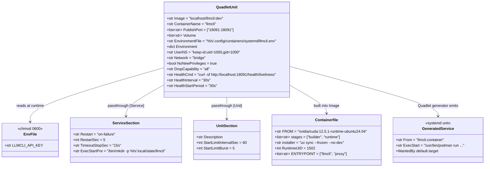
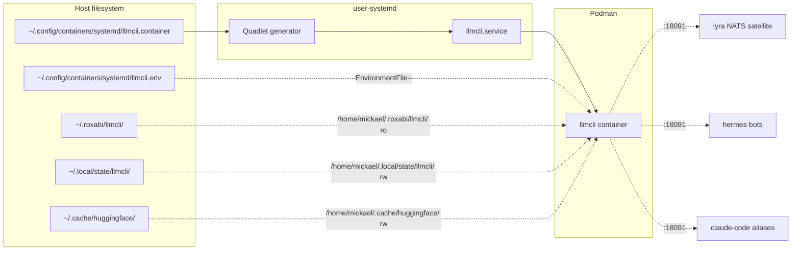

## Context

Promoted from [`44-llmcli-quadlet-frame.mdx`](../frames/44-llmcli-quadlet-frame.mdx).

Step 4 of the **llmcli central-portal** plan. Step 3 (#40) shipped `llmcli proxy` as a foreground binary owning both config generation and process lifecycle. This spec packages it as a Podman Quadlet — `llmcli.container` — so user-systemd supervises it directly on both hosts, with the same `systemctl --user …` grammar lyra and voiceCLI already use.

Today's state:
- `llmcli proxy` runs as a foreground binary — started by `make llm` on M₂ or supervised by the lyra-supervisor `litellm` conf on `:4000` on M₁.
- M₁ would prefer to drop the lyra-supervisor dependency entirely (`:4000` retirement is Step 6, blocked by this).
- M₂ has no clean restart story — `make llm` blocks the shell.

After this spec ships:
- One `llmcli.container` Quadlet unit lives in the repo at `deploy/quadlet/llmcli.container`.
- One `Containerfile` (deferred decision D-1) lives at `deploy/quadlet/Containerfile`.
- Both hosts run `llmcli proxy` via `systemctl --user start llmcli`. M₁ adds reboot-survival via user-linger (no `enable` needed — `WantedBy=default.target` is auto-symlinked by the Quadlet generator on `daemon-reload`; running `systemctl --user enable` on a Quadlet-generated unit is a no-op per project memory `feedback_quadlet_enable_is_noop.md`).
- The container mounts `~/.roxabi/llmcli/` (catalog, **RO** — proxy only reads), `~/.local/state/llmcli/` (state, RW), `~/.cache/huggingface/` (model cache, RW), reads `LLMCLI_API_KEY` from an env file, and publishes `:18091`.

## Goal

A single Quadlet `.container` unit, committed to the repo at `deploy/quadlet/llmcli.container`, installed to `~/.config/containers/systemd/llmcli.container` on each host by a `make install-quadlet` target, that supervises `llmcli proxy` on `:18091` under user-systemd with identical config across M₁ and M₂ — differing only via a per-host env file (`~/.config/containers/systemd/llmcli.env`) for the API key.

## Users

**Current beneficiary (this issue alone):**
- **Mickael (ops)** — runs `systemctl --user start/restart/status llmcli` on both hosts; reads logs via `journalctl --user -u llmcli`; verifies `curl http://localhost:18091/health/liveliness` returns 200.

**Deferred beneficiaries (require follow-up tasks):**
- **lyra / hermes / claude-code consumers** — once both hosts have a stable `:18091`, Step 6 retires `:4000` and Step 7 retargets aliases
- **Future Roxabi tools** — `llmcli.container` becomes the reference Quadlet pattern in the fleet (alongside lyra's and voiceCLI's existing units), which is why hardening directives (`NoNewPrivileges=true`, `DropCapability=all`) are required, not optional, in this spec

Not in scope: registry image pipeline, virtual keys / multi-tenant, hot reload (catalog change → `systemctl --user restart llmcli`).

## Expected Behavior

### Happy path: M₂ (dev, on-demand)

1. Operator runs `make build-quadlet-image` once (or after llmcli source change) on M₂. This builds `localhost/llmcli:dev` from `deploy/quadlet/Containerfile`.
2. Operator runs `make install-quadlet` once. The target:
   - copies `deploy/quadlet/llmcli.container` → `~/.config/containers/systemd/llmcli.container`,
   - creates a chmod-600 `~/.config/containers/systemd/llmcli.env` stub (only if absent — never overwrites an existing env file),
   - runs `systemctl --user daemon-reload` (this is what triggers the Quadlet generator to materialize `llmcli.service` and auto-symlink it into `default.target.wants/`).
3. Operator edits `~/.config/containers/systemd/llmcli.env` to populate `LLMCLI_API_KEY=…` (only secret in the file; port + host stay as `Environment=` defaults in the unit).
4. Operator runs `systemctl --user start llmcli`. Within ~3s the unit is `active (running)`. **Do not run `systemctl --user enable llmcli.service`** — for Quadlet-generated units this is a no-op at best and produces a misleading "Created symlink … → /dev/null" message; the generator already wired the unit via `WantedBy=default.target`.
5. Smoke: `curl http://localhost:18091/health/liveliness` returns `{"status": "ok"}`.
6. Operator runs `systemctl --user stop llmcli` to shut down — `TimeoutStopSec=15s` accommodates the in-container `llmcli proxy` 10s signal-drain (from #40) plus a 5s safety margin, then SIGKILL.

### Happy path: M₁ (prod, autostart)

1. One-time setup: `loginctl enable-linger mickael` (already done — lyra service depends on it).
2. Operator runs the same M₂ V1 flow: `make build-quadlet-image && make install-quadlet`, edits env file, `systemctl --user start llmcli`. The single `.container` file produces identical behavior on both hosts; only the env file differs.
3. M₁ reboots (planned or unplanned). After boot, `mickael`'s user-systemd starts under lingered session; `llmcli.service` (generated from `.container`) starts automatically because the unit declares `[Install] WantedBy=default.target` (Quadlet's default — already symlinked at step 2 by `daemon-reload`).
4. If the container crashes, `Restart=on-failure` + `RestartSec=5s` brings it back within ~5s. `StartLimitIntervalSec=60s` + `StartLimitBurst=5` (fleet standard) means 5 consecutive crashes within 60s park the unit in `failed`. `journalctl --user -u llmcli` shows the restart cycle.

### `--config-out` smoke (one-shot, container-internal)

Existing `llmcli proxy --config-out /tmp/x.yaml` behavior is preserved. Operator can run `podman exec llmcli llmcli proxy --config-out /dev/stdout` to dump the rendered LiteLLM config — `llmcli` is the **fixed** container name set by `ContainerName=llmcli` in the unit (not deferred).

### Failure modes

| Failure | Symptom | Recovery |
|---|---|---|
| `~/.config/containers/systemd/llmcli.env` missing | `daemon-reload` warns; `start` fails with `EnvironmentFile not found` | `make install-quadlet` to create stub; populate |
| `LLMCLI_API_KEY` empty in env file | container starts; `llmcli proxy` exits 1 (provider-key error from #40); `Restart=on-failure` retries within 60s/5-burst window then `failed` | populate env file, `systemctl --user reset-failed llmcli && start` |
| Image not present locally (M₁ with no network) | `podman` run fails (no pull source) | `make build-quadlet-image` on host first (no registry round-trip needed — image is built locally per D-1) |
| Port 18091 already bound | container fails to publish port; unit `failed` | identify conflict, free port, restart unit |
| User-linger off on M₁ | service stops after logout | `loginctl enable-linger mickael` |
| Operator runs `systemctl --user enable llmcli.service` | "Created symlink … → /dev/null" — Quadlet generator masks the unit name to prevent double-management | ignore the message; nothing is broken |
| Bridge published port unreachable | `curl localhost:18091` connects but no response | confirm `LLMCLI_PROXY_HOST=0.0.0.0` inside the container (Environment= default in the unit) — bind to `127.0.0.1` inside the container silently breaks PublishPort forwarding |

## Data Model & Consumers

### Quadlet unit shape (resolved — no longer deferred)



Volume bind-mounts (host path → container path, mode):

| Host | Container (under `UserNS=keep-id:uid=1000`) | Mode |
|---|---|---|
| `%h/.roxabi/llmcli/` | `/home/mickael/.roxabi/llmcli/` | `ro` |
| `%h/.local/state/llmcli/` | `/home/mickael/.local/state/llmcli/` | `rw` |
| `%h/.cache/huggingface/` | `/home/mickael/.cache/huggingface/` | `rw` |

With `UserNS=keep-id:uid=1000,gid=1000`, the container's effective UID maps to host UID 1000 (mickael); container `$HOME` is `/home/mickael`. **Not** `/root/`.

### Consumer map



Dashed = consumer wiring lands in Steps 6 / 7 / 8 (separate issues).

### Consumer summary

| Consumer | Reads | When | This issue? |
|---|---|---|---|
| user-systemd | unit file | on `daemon-reload` + start | this issue |
| Quadlet generator | `.container` + `Containerfile`-built image | on `daemon-reload` + on `podman build` | this issue |
| Container runtime | env file, mounts, image | on container start | this issue |
| lyra NATS satellite | `:18091` over HTTP | Step 6 retires `:4000` | future |
| hermes bots | `:18091` over HTTP | Step 8 | future |
| Claude Code aliases | `:18091` over HTTP | Step 7 | future |

## Breadboard

### Affordances

| ID | Surface | Trigger | Handler | Notes |
|---|---|---|---|---|
| U1 | `make build-quadlet-image` | operator runs target | `podman build -t localhost/llmcli:dev -f deploy/quadlet/Containerfile .` | idempotent; reuses Podman layer cache |
| U2 | `make install-quadlet` | operator runs target | `install -m 644 deploy/quadlet/llmcli.container ~/.config/containers/systemd/` → stub-env-file (chmod 600) if absent → `systemctl --user daemon-reload` | idempotent; preserves existing env file |
| U3 | `systemctl --user start llmcli` | operator runs (after U2 daemon-reload) | user-systemd → Quadlet generator → `podman run …` | exit 0 within ~3s |
| U4 | `systemctl --user restart llmcli` | operator runs after edit | systemd sends SIGTERM to container → `llmcli proxy` (#40) drains up to 10s → SIGKILL after `TimeoutStopSec=15s` → re-spawn | drains via N1 internals |
| U5 | `systemctl --user status llmcli` | operator runs | reports unit state + last 10 log lines | full journal via `journalctl --user -u llmcli` |
| U6 | `curl http://localhost:18091/health/liveliness` | operator runs | LiteLLM HTTP — returns `{"status": "ok"}` | sub-second when healthy; also wired as `HealthCmd=` |
| U7 | M₁ host reboot | infra event | user-linger keeps session alive → Quadlet unit auto-starts via `WantedBy=default.target` | observable: `systemctl --user is-active llmcli` returns `active` post-boot |
| N1 | Crash inside container | `llmcli proxy` exits non-zero | `Restart=on-failure` + `RestartSec=5s` re-spawns; `StartLimitIntervalSec=60`/`StartLimitBurst=5` parks at `failed` after 5 fast restarts | journal shows restart cycle |
| N2 | Missing `LLMCLI_API_KEY` | env file empty/missing var | `llmcli proxy` exits 1 → retry → exhaust burst → unit `failed` | operator runs `systemctl --user reset-failed llmcli` after fix |
| N3 | Quadlet generator | reads `.container` on `daemon-reload` | emits `llmcli.service` into `XDG_RUNTIME_DIR/systemd/generator.user/`; symlinks into `default.target.wants/` | not user-editable — drop-ins go via `~/.config/systemd/user/llmcli.service.d/*.conf` |
| S1 | `deploy/quadlet/llmcli.container` | unit file in repo | committed source-of-truth | identical content on M₁ and M₂; only env file differs |
| S2 | `deploy/quadlet/Containerfile` | image recipe in repo | committed source-of-truth | base `nvidia/cuda:12.5.1-runtime-ubuntu24.04`, two-stage builder, non-root UID 1502 |
| S3 | `~/.config/containers/systemd/llmcli.env` | per-host secret | chmod 600; not in repo; created by U2 stub | sole host-specific input |

### Wiring

```
U1 build → image localhost/llmcli:dev in podman storage
U2 install-quadlet → S1 .container in user dir + S2 env-file stub + daemon-reload
                   → N3 Quadlet generator emits llmcli.service + symlinks default.target.wants/
U3 start → systemd starts service → podman run (reads S3, mounts host dirs ro/rw per table, publishes :18091)
         → llmcli proxy bootstraps (#40 logic unchanged)
U4 restart → SIGTERM in → 10s drain (per #40) → TimeoutStopSec=15s → SIGKILL → re-spawn
U5 status → systemd unit state + journal tail
U6 curl 18091/health/liveliness → in-container LiteLLM responds (also N3 health probe)
U7 M₁ reboot → user-linger → default.target → Quadlet unit auto-starts (WantedBy symlink from N3)
N1 crash → Restart=on-failure → RestartSec=5s wait → re-spawn (max StartLimitBurst=5 per 60s window)
N2 missing key → exit 1 → N1 loop → unit goes failed → operator reset-failed
```

## Slices

| # | Slice | Includes | Demo | Independently shippable? |
|---|---|---|---|---|
| V1 | **Unit + image + Makefile + dev host (M₂)** | `deploy/quadlet/llmcli.container` (with all hardening + healthcheck), `deploy/quadlet/Containerfile` (CUDA 12.5.1 base, two-stage builder, UID 1502 entrypoint), `make build-quadlet-image`, `make install-quadlet` (idempotent + daemon-reload), docs section in `docs/guides/deployment.md` | M₂ runs `make build-quadlet-image && make install-quadlet`, edits env file, `systemctl --user start llmcli`; smoke commands per Success Criteria | yes — M₁ keeps existing `make llm` + supervisor until V2 lands |
| V2 | **Prod host (M₁) + autostart + crash smoke** | M₁ image build + install + start; observed reboot survival (real reboot OR documented next-planned-reboot acceptance); induced crash smoke | M₁ runs V1 commands; we record a journal-entry timestamp; on next planned reboot (or simulated kill-session) we verify the unit auto-restarts | yes — V1 already valuable on M₂ |
| V3 | **Docs polish** | Update top-level `README.md` repo table to mention the Quadlet, add troubleshooting subsection to deployment guide (covers env-file missing, `enable` no-op message, port conflict, bridge `0.0.0.0` requirement, `reset-failed` after exhausted burst) | docs build green (no broken links) | yes — pure docs |

## Success Criteria

- [ ] **SC-1:** `deploy/quadlet/llmcli.container` and `deploy/quadlet/Containerfile` are committed to the repo (V1).
- [ ] **SC-2:** The `.container` unit declares: `ContainerName=llmcli`, `Image=localhost/llmcli:dev`, `PublishPort=18091:18091`, `UserNS=keep-id:uid=1000,gid=1000`, `NoNewPrivileges=true`, `DropCapability=all`, `HealthCmd=curl -sf http://localhost:18091/health/liveliness`, `HealthInterval=30s`, `HealthStartPeriod=30s`, `EnvironmentFile=%h/.config/containers/systemd/llmcli.env`, `Environment=LLMCLI_PROXY_PORT=18091 LLMCLI_PROXY_HOST=0.0.0.0`, the 3 volume mounts at the modes given in the data-model table, and `[Service] Restart=on-failure RestartSec=5 TimeoutStopSec=15s ExecStartPre=/bin/mkdir -p %h/.local/state/llmcli`, and `[Unit] StartLimitIntervalSec=60 StartLimitBurst=5` (V1).
- [ ] **SC-3:** `make build-quadlet-image` target exists and produces `localhost/llmcli:dev` from `deploy/quadlet/Containerfile`; the image runs `llmcli proxy` as UID 1502 by default (V1). Verify: `podman run --rm localhost/llmcli:dev id -u` returns `1502` (or, for tests that inject a fake entrypoint, `podman inspect localhost/llmcli:dev --format '{{.Config.User}}'` includes `1502`).
- [ ] **SC-4:** `make install-quadlet` target is idempotent: re-running it does not overwrite an existing `llmcli.env`; on second run, `git status` (in repo) is clean and `~/.config/containers/systemd/llmcli.env` mtime is unchanged (V1).
- [ ] **SC-5:** After `make build-quadlet-image && make install-quadlet`, populating env file, and `systemctl --user start llmcli`, `systemctl --user is-active llmcli` returns `active` within 10s on M₂ (V1).
- [ ] **SC-6:** While the unit is active, `curl http://localhost:18091/health/liveliness` returns HTTP 200 with body `{"status": "ok"}` on M₂ (V1).
- [ ] **SC-7:** Volume mounts function correctly on M₂ (V1). Verify:
  - `podman exec llmcli test -r /home/mickael/.roxabi/llmcli/llmcli.toml` → exit 0 (RO catalog readable);
  - `podman exec llmcli touch /home/mickael/.local/state/llmcli/probe-$(date +%s)` followed by host `ls ~/.local/state/llmcli/probe-*` shows the file (RW state works, ownership preserved by `keep-id`);
  - `podman exec llmcli test -d /home/mickael/.cache/huggingface/hub` → exit 0 (HF cache visible).
- [ ] **SC-8:** From outside the container on M₂, an authenticated request to a non-health endpoint succeeds: `curl -H "Authorization: Bearer $LLMCLI_API_KEY" http://localhost:18091/v1/models` returns HTTP 200 with a non-empty `data` array. Same call without the header returns HTTP 401. This validates `LLMCLI_API_KEY` from the env file reaches the in-container proxy and that auth is wired (V1).
- [ ] **SC-9:** `docs/guides/deployment.md` has a "Running `llmcli proxy` as a Quadlet" section covering install, env file, smoke, troubleshooting (≥ the failure modes listed in Expected Behavior) (V1).
- [ ] **SC-10:** On M₁, the V1 flow lands; `loginctl show-user mickael | grep Linger=yes` confirms user-linger; `systemctl --user is-active llmcli` returns `active` (V2).
- [ ] **SC-11:** Reboot autostart is verified on M₁ by **either** (a) a real planned reboot followed by `systemctl --user is-active llmcli` returning `active` post-boot with a journal entry showing the unit started under PID 1 of the lingered user session, **or** (b) if no reboot is feasible during the implementation window, the unit is left running and the verification deferred — an explicit comment is added to the deployment guide noting "reboot autostart was last verified on $DATE" with the date filled in at the next observed reboot. Option (b) marks SC-11 partial; the criterion is fully closed only by option (a) (V2).
- [ ] **SC-12:** Inducing a crash on M₁ via `podman kill llmcli` is followed by an automatic restart within ~10s per `Restart=on-failure + RestartSec=5s`; `systemctl --user status llmcli` shows the restart count incremented and current state `active` (V2).
- [ ] **SC-13:** Top-level `README.md` repo table mentions the Quadlet unit (V3).

## Open Questions

All questions below are **defer-to-/plan** — implementer reads the recommendation, confirms or pushes back, then proceeds. None require user input before `/plan` starts.

- **D-1 (image build details — base + extras + entrypoint):** Strategy is local build (no registry push) via `deploy/quadlet/Containerfile`. Recommended Containerfile constraints:
  - **Base:** `nvidia/cuda:12.5.1-runtime-ubuntu24.04` (matches voiceCLI; supports both sm_86 / RTX 3080 on M₁ and sm_120 / RTX 5070 Ti on M₂ — runtime image, no driver inside container).
  - **Two-stage:** builder stage installs `git` (needed for `roxabi-*` deps sourced from GitHub) + `uv`, copies lockfile, runs `uv sync --frozen --no-dev` (the proxy does **not** need the `nats` extra). Runtime stage copies the venv and source.
  - **Non-root UID:** create container user `llmcli` with UID/GID **1502** (consistent with the existing `llmcli-nats-worker.container` UID convention).
  - **Entrypoint:** `ENTRYPOINT ["llmcli", "proxy"]`. The proxy reads `LLMCLI_PROXY_HOST` / `LLMCLI_PROXY_PORT` from environment.
  - **Cross-arch caveat:** The image is built per-host; both must produce a CUDA-12.x-compatible image without embedding sm-specific binaries (no `llama-server` build inside the image — the proxy is pure Python + LiteLLM).
- **D-2 (network mode + host-side bind):** Recommended: `Network=bridge` (rootless default — `pasta` on Podman 4.9.3+) with `PublishPort=18091:18091`. Constraints: `LLMCLI_PROXY_HOST=0.0.0.0` must be set inside the container (binding `127.0.0.1` inside silently breaks PublishPort forwarding). Host-side bind decision: leave as `18091:18091` (all interfaces) so Tailnet-routed access from M₁→M₂ keeps working; do not restrict to `127.0.0.1:18091:18091` until Step 7 finalizes alias topology. `roxabi.network` membership decision: defer — current consumers are all on localhost or Tailnet; joining `roxabi.network` is only required if a future Quadlet on the same host needs container-to-container DNS (`http://llmcli:18091`). When that lands, add `Network=roxabi.network` line to this unit at that time.
- **D-3 (UserNS form):** `UserNS=keep-id:uid=1000,gid=1000` (anchored form — explicit UID match host's `mickael`). Matches lyra-hub's `keep-id:uid=1500,gid=1500` pattern (just a different UID).
- **D-4 (env file scope):** `~/.config/containers/systemd/llmcli.env` carries `LLMCLI_API_KEY` only. `LLMCLI_PROXY_PORT` and `LLMCLI_PROXY_HOST` stay as `Environment=` defaults in the unit. Rationale: env file is for secrets; tuning lives in the unit so changes are git-tracked.
- **D-5 (hardening — resolved here, not deferred):** `NoNewPrivileges=true` and `DropCapability=all` are required in the unit file. `llmcli proxy` is a Python HTTP process needing no Linux capabilities. This sets the floor for future Roxabi Quadlets that copy this pattern. ReadOnly root filesystem is **not** required (Python + LiteLLM write to `/tmp` and `/home/mickael/.local/state/llmcli/`; locking the root FS down requires tmpfs overlay tuning that adds complexity for no proportional security gain in this trust boundary).
- **D-6 (healthcheck — resolved here, not deferred):** `HealthCmd=curl -sf http://localhost:18091/health/liveliness`, `HealthInterval=30s`, `HealthStartPeriod=30s`. No `HealthOnFailure=` (avoid auto-kill loops; let `Restart=on-failure` handle process death; `podman healthcheck run llmcli` remains a manual debug primitive).
- **D-7 (M₁/M₂ restart-on-crash delta — resolved here, not deferred):** Frame originally specified "no auto-restart on M₂". Spec relaxes this — `Restart=on-failure` applies on both hosts because (a) the single-unit-file goal demands it, and (b) auto-restart on M₂ is a feature not a bug for the dev experience (a manual crash during testing won't leave the shell holding a dead `make llm`). This delta is intentional; the frame's success/failure criteria do not depend on M₂ being restart-less. Documented in the deployment guide.

## Edge cases

| Edge case | Handling |
|---|---|
| First-time `daemon-reload` after dropping `.container` doesn't auto-start the unit | by design — `daemon-reload` only generates the unit file + symlink; first `start` is manual. Documented in deployment guide. |
| `~/.cache/huggingface/` permission mismatch | `UserNS=keep-id:uid=1000,gid=1000` resolves this since host user owns the cache. If a specific host shows ownership-related EPERM, switch the bind to `:Z` (no-op on non-SELinux); flagged in troubleshooting. |
| `~/.local/state/llmcli/` doesn't exist yet | `ExecStartPre=/bin/mkdir -p %h/.local/state/llmcli` in `[Service]` creates it unconditionally on every start. |
| Operator forgets `daemon-reload` after manual edit | `make install-quadlet` always ends with `systemctl --user daemon-reload`, so the only path that misses it is a manual `cp` (documented to avoid). |
| Operator runs `systemctl --user enable llmcli` | "Created symlink … → /dev/null" appears — Quadlet generator masks the user-facing unit name to prevent double-management; ignore it. Documented in troubleshooting. |
| Concurrent edit of `llmcli.env` while unit is active | env file is re-read on next `restart`; not hot-reloaded. Operators run `systemctl --user restart llmcli` after edits. |
| Container image stale after llmcli code change | `make build-quadlet-image && systemctl --user restart llmcli` — documented. The `Image=` line in the unit pins `localhost/llmcli:dev`; rebuild updates the same tag in place. |
| `failed` state after exhausted `StartLimitBurst` | `systemctl --user reset-failed llmcli && systemctl --user start llmcli` — documented in troubleshooting (and in the deployment-guide failure-mode table). No automated notification in this issue (deferred to a separate monitoring story; the frame's "1 incident/month" budget is observable via `systemctl --user is-failed llmcli` from any cron / lyra watchdog later). |
| Bridge mode + `LLMCLI_PROXY_HOST` accidentally set to `127.0.0.1` inside container | container starts, `:18091` answers nothing — `Environment=LLMCLI_PROXY_HOST=0.0.0.0` default in the unit prevents this unless explicitly overridden in the env file. Documented in troubleshooting. |
