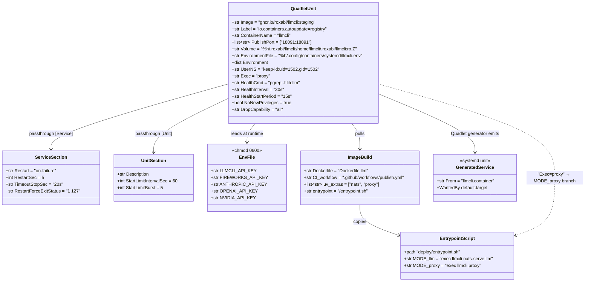
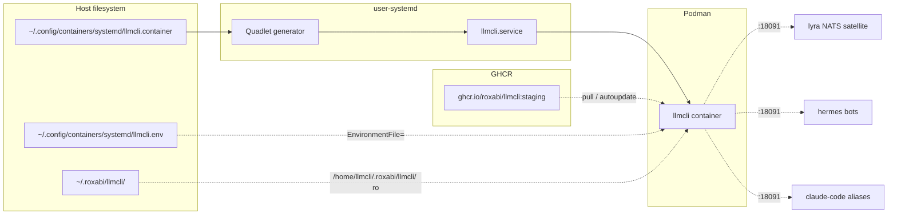

## Context

Promoted from [`44-llmcli-quadlet-frame.mdx`](../frames/44-llmcli-quadlet-frame.mdx).

Step 4 of the **llmcli central-portal** plan. Step 3 (#40) shipped `llmcli proxy` as a foreground binary owning both config generation and process lifecycle. This spec packages it as a Podman Quadlet — `llmcli.container` — so user-systemd supervises it directly on both hosts, with the same `systemctl --user …` grammar lyra and voiceCLI already use.

**Image strategy (resolved this revision):** Single fleet image `ghcr.io/roxabi/llmcli:staging` (already built by `.github/workflows/publish.yml` via `Dockerfile.llm`) serves both the existing NATS worker (`llmcli-nats-worker.container`) and the new proxy (`llmcli.container`). The image's entrypoint script dispatches on first arg (`llm` → nats-serve, `proxy` → llmcli proxy). The PR therefore touches three concerns:
1. **Image build** — `Dockerfile.llm` + `pyproject.toml` so the image contains `litellm`.
2. **Entrypoint** — `deploy/entrypoint-nats.sh` is renamed to `deploy/entrypoint.sh` and learns a `proxy` mode (the existing `llm` mode is preserved — worker unit is untouched).
3. **Quadlet unit** — `deploy/quadlet/llmcli.container` + Makefile install target + docs.

These three concerns ship together because splitting them is not viable: the Quadlet needs `litellm` in the image, which only exists after the build-pipeline change merges and CI rebuilds. A "build PR first, Quadlet PR second" sequence would leave the build PR with no observable validation (the image gains a dep that nothing uses).

The frame's "simplest alternative" (raw `.service` unit) remains rejected, and strategy A strengthens that rejection: there's no per-repo Containerfile diff to maintain (the fleet image is shared with the worker), `Label=io.containers.autoupdate=registry` handles image refresh declaratively, and the dispatched-entrypoint pattern is already in production (worker). A bare `.service` would re-invent all three.

Today's state:
- `llmcli proxy` runs as a foreground binary — started by `make llm` on M₂ or supervised by the lyra-supervisor `litellm` conf on `:4000` on M₁.
- The image at `ghcr.io/roxabi/llmcli:staging` (11.4 GB on disk; ml-base + CUDA inheritance from the worker case) currently does **not** include `litellm` — this PR adds it via a new `[proxy]` extra in `pyproject.toml`.

After this spec ships:
- `Dockerfile.llm` builds with `--extra nats --extra proxy`, so the published image has both `nats-py` (worker) and `litellm` (proxy).
- `deploy/entrypoint.sh` (renamed from `entrypoint-nats.sh`) dispatches `MODE=llm` → `exec llmcli nats-serve llm "$@"` (existing behavior) and `MODE=proxy` → `exec llmcli proxy "$@"` (new). Worker Quadlet continues to work without modification because its `Exec=llm --model qwen3-8b` line still routes through the `llm` branch.
- `deploy/quadlet/llmcli.container` invokes the new branch via `Exec=proxy` and binds `:18091`.
- Both hosts run `llmcli proxy` via `systemctl --user start llmcli`. M₁ adds reboot-survival via user-linger (no `enable` needed — `WantedBy=default.target` is auto-symlinked by the Quadlet generator on `daemon-reload`; per project memory `feedback_quadlet_enable_is_noop.md`).
- The container mounts **only the catalog** `~/.roxabi/llmcli/` read-only at `/home/llmcli/.roxabi/llmcli/`. State (`proxy.config.yaml`) is written to the container's internal `/home/llmcli/.local/state/llmcli/` (ephemeral, regenerated each start). No HF cache mount — the proxy never touches GGUF files (those are served by `llmcli serve` running on the host outside any container).

## Goal

A single Quadlet `.container` unit pointing at the existing fleet image, installed via `make install-quadlet`, supervising `llmcli proxy` on `:18091` under user-systemd on both M₁ and M₂, with identical config across hosts — differing only via a per-host env file (`~/.config/containers/systemd/llmcli.env`) for the API key and provider keys.

## Users

**Current beneficiary (this issue alone):**
- **Mickael (ops)** — runs `systemctl --user start/restart/status llmcli` on both hosts; reads logs via `journalctl --user -u llmcli`; verifies `curl http://localhost:18091/health/liveliness` returns 200 from outside the container.

**Deferred beneficiaries (require follow-up tasks):**
- **lyra / hermes / claude-code consumers** — once both hosts have a stable `:18091`, Step 6 retires `:4000` and Step 7 retargets aliases
- **Future Roxabi tools** — `llmcli.container` becomes the reference Quadlet pattern for HTTP-only services in the fleet (registry-pulled image, no Containerfile in repo, dispatched entrypoint)

Not in scope: registry image pipeline changes beyond adding `--extra proxy` to the existing build; virtual keys / multi-tenant; hot reload (catalog change → `systemctl --user restart llmcli`); retiring the `make llm` Makefile target on M₂ (kept as a fallback path during the transition — adoption signal is tracked via Step 6's `:4000` retirement, which depends on this issue but is its own follow-up).

## Expected Behavior

### Pre-merge dev validation flow (M₂)

The published image at `ghcr.io/roxabi/llmcli:staging` doesn't have `litellm` until this PR merges and CI rebuilds. For pre-merge validation on M₂, the dev builds the image locally with the same tag:

```bash
podman build -t ghcr.io/roxabi/llmcli:staging -f Dockerfile.llm .
make install-quadlet
$EDITOR ~/.config/containers/systemd/llmcli.env   # populate LLMCLI_API_KEY + provider keys
systemctl --user start llmcli
curl http://localhost:18091/health/liveliness     # expect 200
```

After PR merges to staging and CI re-runs publish.yml, `podman` will auto-update on the `Label=io.containers.autoupdate=registry` cycle, picking up the canonical image.

### Happy path: M₂ (dev, on-demand)

1. Operator runs `make install-quadlet`. The target:
   - copies `deploy/quadlet/llmcli.container` → `~/.config/containers/systemd/llmcli.container`,
   - creates a chmod-600 `~/.config/containers/systemd/llmcli.env` stub (only if absent — never overwrites),
   - runs `systemctl --user daemon-reload` (triggers the Quadlet generator to emit `llmcli.service` and auto-symlink it into `default.target.wants/`).
2. Operator edits `~/.config/containers/systemd/llmcli.env` to populate `LLMCLI_API_KEY=…` and each provider key the catalog needs (`FIREWORKS_API_KEY`, `ANTHROPIC_API_KEY`, `OPENAI_API_KEY`, `NVIDIA_API_KEY`, …). All secrets in one file, chmod 600.
3. Operator runs `systemctl --user start llmcli`. Within ~5s the unit is `active (running)` (podman first pulls the image if not cached). **Do not run `systemctl --user enable llmcli.service`** — for Quadlet-generated units this is a no-op at best.
4. Smoke: `curl http://localhost:18091/health/liveliness` returns `{"status": "ok"}`.
5. Authenticated smoke: `curl -H "Authorization: Bearer $LLMCLI_API_KEY" http://localhost:18091/v1/models` returns 200 with non-empty `data` array; same request without the header returns 401.
6. `systemctl --user stop llmcli` — `TimeoutStopSec=20s` accommodates the in-container `llmcli proxy` 10s signal-drain (from #40) plus a 10s safety margin for `podman`'s wrapper (`conmon`) to finish signalling the container before systemd SIGKILLs the wrapper itself, then SIGKILL.

### Happy path: M₁ (prod, autostart)

1. One-time setup: `loginctl enable-linger mickael` (already done — lyra service depends on it).
2. Operator runs same M₂ V1 flow.
3. M₁ reboots. After boot, `mickael`'s user-systemd starts under lingered session; `llmcli.service` auto-starts via `WantedBy=default.target`.
4. If the container crashes, `Restart=on-failure` + `RestartSec=5s` brings it back. `StartLimitIntervalSec=60` + `StartLimitBurst=5` parks the unit in `failed` after 5 crashes within 60s.

### `--config-out` smoke (one-shot, container-internal)

`podman exec llmcli llmcli proxy --config-out /dev/stdout` dumps the rendered LiteLLM config from inside the running container (resolves `llmcli` via the image's `PATH=/app/.venv/bin:$PATH`). The container name `llmcli` is fixed by `ContainerName=llmcli`.

### Failure modes

| Failure | Symptom | Recovery |
|---|---|---|
| `~/.config/containers/systemd/llmcli.env` missing | `daemon-reload` warns; `start` fails with `EnvironmentFile not found` | `make install-quadlet` recreates stub |
| `LLMCLI_API_KEY` or provider key empty | `llmcli proxy` exits 1 (provider-key error from #40). `RestartForceExitStatus=1` suppresses restart — unit enters `failed` immediately with no retry burn-up | populate env file, `systemctl --user reset-failed llmcli && start` |
| `litellm` missing in image | `llmcli proxy` exits 127 ("litellm binary not found"). `RestartForceExitStatus=127` suppresses restart — unit `failed` immediately | rebuild image locally with this PR's `Dockerfile.llm` OR wait for CI rebuild |
| Image not present + no network on M₁ | `podman` run fails (no pull source) | `podman pull ghcr.io/roxabi/llmcli:staging` on host first, OR local `podman build` from this repo |
| Port 18091 already bound | container fails to publish port; unit `failed` | identify conflict, free port, restart |
| User-linger off on M₁ | service stops after logout | `loginctl enable-linger mickael` |
| Operator runs `systemctl --user enable llmcli.service` | "Created symlink … → /dev/null" — Quadlet generator masks the unit name | ignore; nothing is broken |
| Container binds 127.0.0.1 inside (PROXY_HOST override accident) | `:18091` answers nothing externally | `Environment=LLMCLI_PROXY_HOST=0.0.0.0` default in unit prevents this unless explicitly overridden in env file |

## Data Model & Consumers

### Quadlet unit shape (resolved — concrete directives)



### Mounts (final — 1 mount)

| Host | Container path (under `UserNS=keep-id:uid=1502`) | Mode | Rationale |
|---|---|---|---|
| `%h/.roxabi/llmcli/` | `/home/llmcli/.roxabi/llmcli/` | `ro,Z` | catalog source-of-truth; proxy only reads. RO + cross-UID read works because host files have 644/755 perms. |

Not mounted (intentional changes from earlier spec draft):
- **State dir** (`~/.local/state/llmcli/`) — proxy writes `proxy.config.yaml` to its container-internal `/home/llmcli/.local/state/llmcli/` (writable by the container's UID 1502 because it owns its home). The file is regenerated from the catalog on every start; persistence buys nothing.
- **HF cache** (`~/.cache/huggingface/`) — proxy never downloads or reads model files. GGUF files are served by `llama-server` running on the host (via `llmcli serve`), not by the proxy container.

### Consumer map



Dashed = consumer wiring lands in Steps 6 / 7 / 8 (separate issues).

### Consumer summary

| Consumer | Reads | When | This issue? |
|---|---|---|---|
| user-systemd | unit file | on `daemon-reload` + start | this issue |
| Quadlet generator | `.container` | on `daemon-reload` | this issue |
| GHCR | image | on `podman` pull (first start) + on `autoupdate=registry` cycle | this issue |
| Container runtime | env file, catalog mount, image | on container start | this issue |
| lyra NATS satellite | `:18091` over HTTP | Step 6 retires `:4000` | future |
| hermes bots | `:18091` over HTTP | Step 8 | future |
| Claude Code aliases | `:18091` over HTTP | Step 7 | future |

## Breadboard

### Affordances

| ID | Surface | Trigger | Handler | Notes |
|---|---|---|---|---|
| U1 | `make install-quadlet` | operator runs | `install -m 644 deploy/quadlet/llmcli.container ~/.config/containers/systemd/` → stub-env-file (chmod 600) if absent → `systemctl --user daemon-reload` | idempotent; preserves existing env file |
| U2 | `systemctl --user start llmcli` | operator runs (after U1 daemon-reload) | user-systemd → Quadlet generator → `podman run …` (pulls image if not cached) | exit 0 within ~5s; ~10-30s on first pull from GHCR |
| U3 | `systemctl --user restart llmcli` | operator runs after edit | systemd sends SIGTERM → `llmcli proxy` (#40) drains up to 10s → SIGKILL after `TimeoutStopSec=15s` → re-spawn | drains via N1 internals |
| U4 | `systemctl --user status llmcli` | operator runs | reports unit state + last 10 log lines; journal via `journalctl --user -u llmcli` | — |
| U5 | `curl http://localhost:18091/health/liveliness` | operator runs | LiteLLM HTTP — returns `{"status": "ok"}` | sub-second when healthy |
| U6 | `curl -H "Authorization: Bearer $K" http://localhost:18091/v1/models` | operator runs | proxy returns 200 with model list; without `Authorization` returns 401 | validates env-file → proxy → litellm wiring |
| U7 | M₁ host reboot | infra event | user-linger keeps session → Quadlet unit auto-starts via `WantedBy=default.target` | observable: `systemctl --user is-active llmcli` post-boot |
| U8 | Pre-merge dev validation | dev runs locally before merging | `podman build -t ghcr.io/roxabi/llmcli:staging -f Dockerfile.llm .` overrides the registry image locally → V1 smoke works pre-merge | documented; not committed to Makefile |
| N1 | Crash inside container | `llmcli proxy` (or `litellm` subprocess) exits non-zero | `Restart=on-failure` + `RestartSec=5s` re-spawn; `StartLimitIntervalSec=60`/`StartLimitBurst=5` parks at `failed` after 5 fast restarts | journal shows restart cycle |
| N2 | Missing `LLMCLI_API_KEY` or provider key | env file empty/missing var | `llmcli proxy` exits 1 (provider-key error from #40) → retry → exhaust burst → unit `failed` | `systemctl --user reset-failed llmcli` after fix |
| N3 | Quadlet generator | reads `.container` on `daemon-reload` | emits `llmcli.service` into `XDG_RUNTIME_DIR/systemd/generator.user/`; symlinks into `default.target.wants/` | not user-editable — drop-ins via `~/.config/systemd/user/llmcli.service.d/*.conf` |
| N4 | Entrypoint dispatch | `Exec=proxy` reaches `/entrypoint.sh proxy` inside container | script's `case MODE` matches `proxy` branch → `exec llmcli proxy "$@"` | preserves `llm` branch for worker Quadlet (no worker change) |
| S1 | `deploy/quadlet/llmcli.container` | unit file in repo | committed source-of-truth | identical on M₁ and M₂; only env file differs |
| S2 | `deploy/entrypoint.sh` (renamed from `entrypoint-nats.sh`) | dispatch script in image | bash case on first arg → `llm` (legacy nats worker) ∨ `proxy` (new) | rename is transparent to worker Quadlet (worker uses `Exec=llm …`, unchanged) |
| S3 | `Dockerfile.llm` | image build recipe | `uv sync --extra nats --extra proxy` ensures both deps in venv | one-line addition (`--extra proxy`) plus copy of renamed entrypoint |
| S4 | `pyproject.toml` `[proxy]` extra | declares `litellm>=1.0` dependency | `uv sync --extra proxy` resolves | new optional-dependency group |
| S5 | `~/.config/containers/systemd/llmcli.env` | per-host secrets | chmod 600; not in repo; created by U1 stub | sole host-specific input |

### Wiring

```
S3 Dockerfile.llm + S4 pyproject [proxy] → CI publish.yml → image ghcr.io/roxabi/llmcli:staging
                                                                  ↓
                                                              S2 /entrypoint.sh baked in
S1 .container declares Exec=proxy → loads image → entrypoint → S2 dispatch → llmcli proxy
                                                                                ↓
                                                                          reads CATALOG (ro mount)
                                                                                ↓
                                                                          generates /home/llmcli/.local/state/llmcli/proxy.config.yaml
                                                                                ↓
                                                                          spawn litellm subprocess → :18091

U1 install-quadlet → S1 + S5 + daemon-reload → N3 generator → llmcli.service + symlink
U2 start → N3 service → podman run (reads S5 env, mounts S1's catalog ro, publishes :18091)
U3 restart → SIGTERM in → 10s drain (#40) → TimeoutStopSec=15s → SIGKILL → re-spawn
U5 health → LiteLLM HTTP responds; HealthCmd uses pgrep on litellm process (curl absent from image)
U7 M₁ reboot → user-linger → default.target → Quadlet unit auto-starts (WantedBy symlink from N3)
N1 crash → Restart=on-failure → RestartSec=5s → re-spawn (StartLimitBurst=5 per 60s window)
N2 missing key → exit 1 → N1 loop → failed → operator reset-failed
```

## Slices

| # | Slice | Includes | Demo | Independently shippable? |
|---|---|---|---|---|
| V1 | **Build pipeline + Quadlet + dev host (M₂) + docs** | `pyproject.toml` (new `[proxy]` extra with litellm), `Dockerfile.llm` (add `--extra proxy` + copy renamed entrypoint), `deploy/entrypoint-nats.sh` → `deploy/entrypoint.sh` (rename + dispatch on MODE), `deploy/quadlet/llmcli.container` (final shape per data model), `Makefile` `install-quadlet` target, `docs/guides/deployment.md` Quadlet section (covers pre-merge local build + post-merge registry pull + failure modes), top-level `README.md` table mention | M₂ runs `podman build -t ghcr.io/roxabi/llmcli:staging -f Dockerfile.llm . && make install-quadlet && systemctl --user start llmcli` → health + authenticated smokes per Success Criteria | yes — M₁ keeps existing `make llm` + supervisor until V2 lands |
| V2 | **Prod host (M₁) + autostart + crash smoke** | M₁ image pull (or local build) + install + start; observed reboot survival (real reboot OR documented next-planned-reboot acceptance per SC-9); induced crash smoke | M₁ runs V1 commands; we record `systemctl --user is-active` and a `journalctl --user -u llmcli --since today` snippet; on next planned reboot we verify auto-restart | yes — V1 already valuable on M₂ |

## Success Criteria

- [ ] **SC-1:** `pyproject.toml` declares an `[project.optional-dependencies] proxy = ["litellm>=1.0"]` block, AND `uv.lock` is refreshed (`uv lock` run as part of the PR) to include `litellm` and its transitive deps. `git diff` shows both files modified in the same commit (V1).
- [ ] **SC-2:** `Dockerfile.llm` `uv sync` lines use `--extra nats --extra proxy` (V1).
- [ ] **SC-3:** `deploy/entrypoint.sh` exists, dispatches on `$MODE` first arg with cases `llm` (`exec llmcli nats-serve llm "$@"`) and `proxy` (`exec llmcli proxy "$@"`); any other value writes `Unknown mode: <arg>` to stderr and exits `1` (V1).
- [ ] **SC-4:** `deploy/entrypoint-nats.sh` is removed from the repo (renamed/replaced by `entrypoint.sh`) and `Dockerfile.llm` `COPY` of the entrypoint reflects the new path (V1).
- [ ] **SC-5:** `deploy/quadlet/llmcli.container` contains all directives shown in the Data Model section's class diagram, including specifically `RestartForceExitStatus=1 127` (suppresses restart on the proxy's two known non-retryable exit codes — provider-key missing and litellm-binary missing) and `TimeoutStopSec=20s` (10s drain + 10s podman/conmon margin). Verification: `diff -u <(grep -E '^(Image|Label|ContainerName|PublishPort|Volume|EnvironmentFile|Environment|UserNS|Exec|HealthCmd|HealthInterval|HealthStartPeriod|NoNewPrivileges|DropCapability|Restart|RestartSec|TimeoutStopSec|RestartForceExitStatus|StartLimitIntervalSec|StartLimitBurst|Description|WantedBy)=' deploy/quadlet/llmcli.container | sort)` returns the same multiset of directives as the data-model table (V1).
- [ ] **SC-6:** `make install-quadlet` is idempotent: re-running it does not overwrite an existing `llmcli.env` (verify by populating it with a sentinel value, re-running, then `grep SENTINEL ~/.config/containers/systemd/llmcli.env`); it also runs `systemctl --user daemon-reload` (V1).
- [ ] **SC-7:** Local image build on M₂ succeeds: `podman build -t ghcr.io/roxabi/llmcli:staging -f Dockerfile.llm .` returns exit 0, AND `podman run --rm --entrypoint="" ghcr.io/roxabi/llmcli:staging /app/.venv/bin/litellm --version` returns a non-empty version string (V1).
- [ ] **SC-8:** After local build + install + populated env file + `systemctl --user start llmcli`, `systemctl --user is-active llmcli` returns `active` within 30s on M₂ (V1).
- [ ] **SC-9:** From M₂ host: `curl -s -o /dev/null -w "%{http_code}" http://localhost:18091/health/liveliness` returns `200` (V1).
- [ ] **SC-10:** Authenticated round-trip on M₂: `curl -s -H "Authorization: Bearer $(grep ^LLMCLI_API_KEY ~/.config/containers/systemd/llmcli.env | cut -d= -f2)" http://localhost:18091/v1/models` returns HTTP 200 with a JSON body containing a non-empty `data` array; same request without the `Authorization` header returns HTTP 401 (V1).
- [ ] **SC-11:** Catalog mount works: `podman exec llmcli test -r /home/llmcli/.roxabi/llmcli/llmcli.toml` returns exit 0 (V1).
- [ ] **SC-12:** `docs/guides/deployment.md` has a "Running `llmcli proxy` as a Quadlet" section covering: pre-merge local-build flow, post-merge registry-pull behavior, env-file template (with all expected provider key names), `systemctl --user` lifecycle commands, failure-mode table mirroring the Expected Behavior section, and a `reset-failed` note (V1).
- [ ] **SC-13:** Top-level `README.md` repo table mentions the Quadlet unit (V1).
- [ ] **SC-14:** On M₁: image present in podman storage (either pulled from registry or built locally), `loginctl show-user mickael | grep Linger=yes` confirms user-linger, `systemctl --user is-active llmcli` returns `active` (V2).
- [ ] **SC-15:** Reboot-equivalent autostart on M₁ is verified by **either** (a) a real planned/unplanned reboot followed by `systemctl --user is-active llmcli` returning `active` post-boot, **or** (b) a root-side simulation that terminates and re-creates the lingered user session: `sudo systemctl stop user@$(id -u mickael).service` (kills mickael's user-systemd including `llmcli.service`) → wait 5s → `sudo systemctl start user@$(id -u mickael).service` (re-creates the lingered session under default.target) → `systemctl --user is-active llmcli` returns `active` within 30s. Path (b) exercises the same `WantedBy=default.target` + linger path as a real cold-boot. Either path satisfies the SC binary (active / not-active) — no doc-comment deferral (V2).
- [ ] **SC-16:** Induced crash on M₁: `podman kill llmcli` followed by automatic restart within ~10s; `systemctl --user status llmcli` shows the restart count incremented and current state `active` (V2).

## Open Questions

All questions resolved or explicitly deferred. None block `/plan`.

- **D-1 (image source — RESOLVED):** Use the existing fleet image `ghcr.io/roxabi/llmcli:staging` built by `.github/workflows/publish.yml` from `Dockerfile.llm`. The PR adds `--extra proxy` so the image includes `litellm`. No `Containerfile` in `deploy/quadlet/`; no `make build-quadlet-image` target — the existing build pipeline is the source of truth.
- **D-2 (network — RESOLVED):** Omit `Network=` line (rootless default = bridge via `pasta`). `PublishPort=18091:18091` exposes the port on all host interfaces (so Tailnet-routed access from cross-machine consumers works). `LLMCLI_PROXY_HOST=0.0.0.0` inside the container is required and set via `Environment=` in the unit. `roxabi.network` membership is **deferred** — none of the current/Step-6/7/8 consumers run as Podman containers on the same host; if a future Quadlet on the same host needs container-to-container DNS to llmcli, add `Network=roxabi.network` then.
- **D-3 (UserNS — RESOLVED):** `keep-id:uid=1502,gid=1502` to match the image's internal `llmcli` user (UID 1502, set in `Dockerfile.llm`). Catalog bind-mount works because host-side perms are 644/755 (cross-UID read OK).
- **D-4 (env file scope — RESOLVED):** `LLMCLI_API_KEY` + all provider keys (`FIREWORKS_API_KEY`, `ANTHROPIC_API_KEY`, `OPENAI_API_KEY`, `NVIDIA_API_KEY`, …) in `~/.config/containers/systemd/llmcli.env` (chmod 600). One file, all secrets. `LLMCLI_PROXY_PORT` / `LLMCLI_PROXY_HOST` stay as `Environment=` defaults in the unit.
- **D-5 (hardening — RESOLVED):** `NoNewPrivileges=true` + `DropCapability=all`. ReadOnly root FS not adopted (proxy writes `proxy.config.yaml` to `/home/llmcli/.local/state/llmcli/`).
- **D-6 (healthcheck — RESOLVED):** `HealthCmd=pgrep -f litellm` + `HealthInterval=30s` + `HealthStartPeriod=15s`. Reason: `curl` is not in the image (verified). `pgrep` on the `litellm` subprocess name confirms the HTTP server process is alive — stronger than `pgrep -f "llmcli proxy"` (which would pass even if the wrapper hadn't successfully spawned litellm). **Accepted limitation:** `pgrep` passes if the process is alive even when the HTTP listener is hung or returning 5xx for all requests. SC-9 (`curl :18091/health/liveliness` from outside) catches this at smoke time, but the Quadlet's runtime health probe does not. Adding `curl` to the image (so a true HTTP healthcheck becomes possible) is a deliberate follow-up — not blocking this PR.
- **D-7 (M₁/M₂ Restart delta — RESOLVED):** Single unit with `Restart=on-failure` applies to both hosts. The frame's "no auto-restart on M₂" is relaxed — auto-restart on M₂ is dev-friendly (no orphan crash leaving a dead shell). Documented.
- **D-8 (entrypoint dispatch — RESOLVED):** Rename `deploy/entrypoint-nats.sh` → `deploy/entrypoint.sh`; extend with `proxy` MODE branch (preserve `llm` branch verbatim). Worker Quadlet's `Exec=llm --model qwen3-8b` continues to work without modification because the new script's `llm` case is the same as the old script's only case. The new proxy Quadlet uses `Exec=proxy`.

## Edge cases

| Edge case | Handling |
|---|---|
| First-time `daemon-reload` doesn't auto-start the unit | by design — `daemon-reload` only generates + symlinks; first `start` is manual. Documented. |
| Catalog mount permission mismatch on a specific host | host catalog files must be world-readable (644/755). If `chmod` is tighter, `podman exec llmcli cat /home/llmcli/.roxabi/llmcli/llmcli.toml` reproduces the issue. Documented as `chmod a+r` fix. |
| Proxy writes to `/home/llmcli/.local/state/` inside container | this is the container's UID-1502 home — always writable. No mount needed; file is regenerated each start. |
| `LLMCLI_API_KEY` empty + restart loop | exits exhaust `StartLimitBurst=5`/`60s` → unit `failed` → `systemctl --user reset-failed llmcli` after fix. Documented. |
| Operator runs `systemctl --user enable llmcli` | "Created symlink → /dev/null" message — ignore. Documented. |
| Image stale (e.g., new llmcli code merged) | `podman pull ghcr.io/roxabi/llmcli:staging && systemctl --user restart llmcli`. `autoupdate=registry` label also drives `podman auto-update.timer` cycles when enabled at the system level. Documented. |
| Worker Quadlet broken by entrypoint rename | impossible — the script is COPY'd into the image at `/entrypoint.sh` (target path unchanged); the source filename in the repo (`deploy/entrypoint.sh` vs `deploy/entrypoint-nats.sh`) only matters at build time. Worker Quadlet continues to work after image rebuild. |
| Bridge default + `LLMCLI_PROXY_HOST` accidentally set to `127.0.0.1` in env file | container starts, `:18091` answers nothing externally. `Environment=LLMCLI_PROXY_HOST=0.0.0.0` default in unit prevents this unless explicitly overridden in env file. Documented. |
