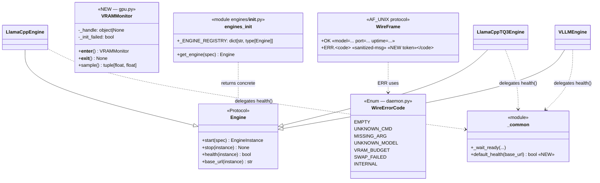
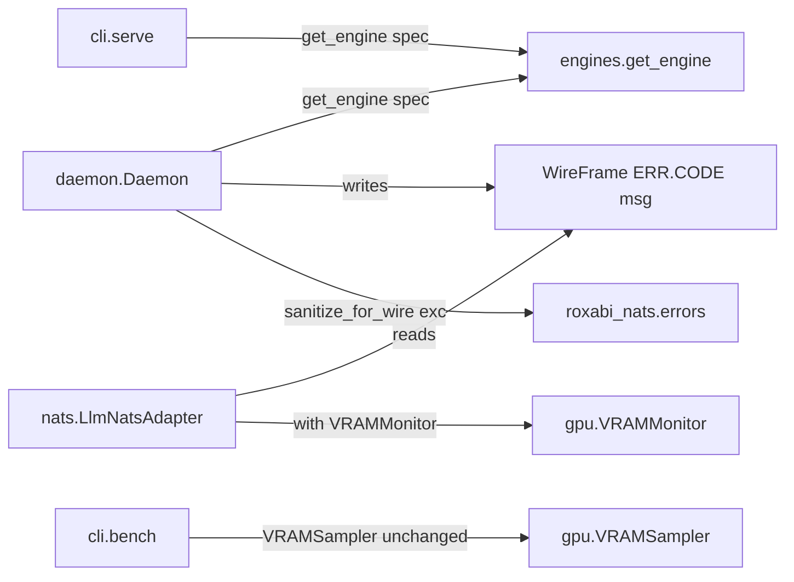

## Context

Promoted from `artifacts/frames/53-stage-axis-findings-frame.mdx` (frame approved 2026-05-21). Source audit: `artifacts/analyses/stage-axis-audit-2026-05-20.md`. Upstream dependency lyra #1291 closed 2026-05-20 (shipped `roxabi_nats.errors.sanitize_for_wire` on `staging`).

## Goal

Drain 5 pre-cascade duplication / protocol-fragility triggers in `src/llmcli/` so that adding engine #4 (or chasing any cross-engine bug) requires a single edit instead of N parallel edits.

## Users

- **Primary:** llmCLI maintainer adding an engine, debugging a wire-protocol issue, or hitting the folder-size gate on a new module.
- **Secondary:** lyra (`LlmNatsAdapter`) — gains structured `ERR.<code>` token to dispatch on and a reusable VRAM probe.

## Expected Behavior

After this work merges, the following invariants hold:

1. `def health(self, instance)` body appears **once** in `src/llmcli/engines/` (in `_common.py`). Each engine class delegates.
2. The engine-name → class dict appears **once** (in `engines/__init__.py`). `daemon._engine_for_spec` delegates to `engines.get_engine(spec)` after a `remote`-guard.
3. Every error frame written to the AF_UNIX socket follows the `ERR.<code> <msg>` shape. `<msg>` is `sanitize_for_wire(exc)` whenever it derives from an exception. Legacy `ERR ` prefix is migrated, not dual-emitted.
4. `pynvml` lifecycle (init / handle / shutdown) is implemented **once** in `gpu.py` as a context-managed `VRAMMonitor` exposing `(free_mb, used_mb)`. `nats/llm_adapter.py` consumes it; no inline `pynvml.nvmlInit()` outside `gpu.py`.
5. `src/llmcli/` contains ≤ 10 top-level module/package entries (excluding `__pycache__`). `providers.py` + `litellm_config.py` live under `src/llmcli/support/`.
6. AF_UNIX clients (in-tree `cli/`, `nats/llm_adapter.py`) continue to function — `OK` prefix unchanged; `ERR.<code>` parses for callers that opt in; daemon-internal handlers updated atomically.

## Data Model & Consumers

### Data structure diagram

### Consumer map

### Consumer summary

| Consumer | Field/API consumed | When | Status |
|---|---|---|---|
| `daemon.Daemon` | `engines.get_engine(spec)` | command dispatch (`swap`, etc.) | this issue |
| `daemon.Daemon` | `sanitize_for_wire(exc)` | any `except` writing `ERR.<code>` | this issue |
| `nats.LlmNatsAdapter` | `gpu.VRAMMonitor` | `heartbeat_payload()` | this issue |
| `nats.LlmNatsAdapter` | `ERR.<code>` token | future — dispatch on code, ¬substring | dashed / future |
| `cli.bench` | `gpu.VRAMSampler` (unchanged) | bench runs | unchanged |
| voiceCLI / imageCLI | `ERR.<code>` precedent | future — propagation in audit follow-ups | out of scope |

## Breadboard

### Affordance: engine health probe

| ID | Element | Handler | Data |
|---|---|---|---|
| N1 | `engines/_common.py:default_health(base_url)` | new free function — 5 LOC | reads `httpx.get("{base}/health", timeout=2)` |
| N2 | `LlamaCppEngine.health` | delegate → `default_health(self.base_url(instance))` | — |
| N3 | `VLLMEngine.health` | delegate → `default_health(self.base_url(instance))` | — |
| N4 | `LlamaCppTQ3Engine.health` | delegate (inherits from llamacpp) | — |

### Affordance: engine registry

| ID | Element | Handler | Data |
|---|---|---|---|
| N5 | `engines/__init__.py:get_engine(spec)` | unchanged; canonical lookup | `_ENGINE_REGISTRY` (3 entries today) |
| N6 | `daemon._engine_for_spec(spec)` | rewritten — guards `remote`, delegates to `engines.get_engine(spec)` | removes local dict + duplicate imports |

### Affordance: AF_UNIX wire-error frame

| ID | Element | Handler | Data |
|---|---|---|---|
| N7 | `daemon._WireErr` (StrEnum or constants) | new — codes `EMPTY`, `UNKNOWN_CMD`, `MISSING_ARG`, `UNKNOWN_MODEL`, `VRAM_BUDGET`, `SWAP_FAILED`, `INTERNAL` | tokens |
| N8 | `daemon._format_err(code, msg, exc=None)` | helper — returns `f"ERR.{code} {sanitize_for_wire(exc) if exc else msg}"` | applies sanitization centrally |
| N9 | Existing ERR sites (lines 121, 136, 183, 187, 197, 215, 105) | updated to use `_format_err` | one call site each |
| N10 | `nats/llm_adapter.py:_ensure_model` | unchanged behavior — `startswith("OK")` check still works (ERR.* is non-OK) | no caller change required |

### Affordance: VRAM monitor (cached handle)

| ID | Element | Handler | Data |
|---|---|---|---|
| N11 | `gpu.VRAMMonitor` context manager | `__enter__` does `pynvml.nvmlInit()` + `nvmlDeviceGetHandleByIndex(0)`; `__exit__` does `nvmlShutdown()` | caches handle on self |
| N12 | `VRAMMonitor.sample() -> tuple[float, float]` | returns `(free_mb, used_mb)` from cached handle; falls back to `(0.0, 0.0)` on failure | — |
| N13 | `nats/llm_adapter.py` heartbeat | use `VRAMMonitor` instead of inline `_get_nvml_handle` + manual init/shutdown | removes `_nvml_handle`, `_nvml_init_failed`, `_get_nvml_handle` |

### Affordance: folder reshape

| ID | Element | Handler | Data |
|---|---|---|---|
| N14 | `src/llmcli/support/__init__.py` | new package | empty / re-exports if helpful |
| N15 | `src/llmcli/support/providers.py` | moved from `src/llmcli/providers.py` | unchanged content |
| N16 | `src/llmcli/support/litellm_config.py` | moved from `src/llmcli/litellm_config.py` | unchanged content |
| N17 | Imports updated wherever `providers` / `litellm_config` are imported | `from llmcli.support.providers import ...` | grep callers, batch-edit |

## Slices

| # | Name | Affordances | Demo-able outcome | Files |
|---|---|---|---|---|
| 1 | **Engines hygiene** (Findings 1 + 2) | N1–N6 | `pytest tests/test_engines.py` green; `def health` body count = 1; `_ENGINE_REGISTRY` definition count = 1 | `engines/_common.py`, `engines/llamacpp.py`, `engines/llamacpp_tq3.py`, `engines/vllm.py`, `daemon.py` |
| 2 | **Wire protocol + VRAM monitor** (Findings 3 + 4) | N7–N13 | `llmcli swap <bad>` returns `ERR.VRAM_BUDGET …`; heartbeat payload has `vram_used_mb`>0 via `VRAMMonitor`; `daemon.py` has 0 `f"ERR ...{exc}"` raw interpolations | `daemon.py`, `nats/llm_adapter.py`, `gpu.py`, `pyproject.toml` (uv lock refresh), tests |
| 3 | **Folder reshape** (Finding 5) | N14–N17 | `ls src/llmcli/ \| grep -v __pycache__ \| wc -l` ≤ 10; `from llmcli.support.providers import ...` works; `llmcli register-proxy` runs | `support/__init__.py`, `support/providers.py`, `support/litellm_config.py`, and any importers |

Slice ordering: **1 → 2 → 3**. Slice 1 has zero protocol impact (lowest risk, can land first). Slice 2 has the upstream-dep migration (`uv lock --upgrade-package roxabi-nats`) and one cross-module change (adapter + gpu) — wants a clean baseline. Slice 3 is mechanical but touches many import sites; cleanest at the end to avoid mid-stack rebases.

PR strategy: **single PR with 3 commits** (one per slice). Rationale — issue body declares "epic"; sequencing is short; single PR keeps review continuous; rollback granularity is preserved via the commit boundaries. Multi-PR option preserved in `## Open Questions` for /plan to revisit if review surfaces concerns.

## Success Criteria

- [ ] **AC1 — health() deduplicated**: `default_health` defined once in `engines/_common.py`; `LlamaCppEngine.health` / `VLLMEngine.health` / `LlamaCppTQ3Engine.health` each ≤ 3 LOC delegating to it; no duplicate `httpx.get(f"{base}/health", ...)` outside `_common.py`.
- [ ] **AC2 — engine registry deduplicated**: `_ENGINE_REGISTRY` is defined exactly once (`grep -rn "_ENGINE_REGISTRY: dict" src/` returns 1 line); `daemon._engine_for_spec` calls `engines.get_engine(spec)` after a `remote`-guard and contains no engine-class imports.
- [ ] **AC3 — typed wire errors with sanitization**: every error frame from `daemon._handle_*`/`_cmd_*` matches `^ERR\.[A-Z_]+( .+)?$`; every `{exc}` interpolation goes through `roxabi_nats.errors.sanitize_for_wire`; no raw `f"ERR ...: {exc}"` patterns remain (`grep -nE 'ERR.*\{exc' src/llmcli/daemon.py` returns 0 matches).
- [ ] **AC4 — VRAMMonitor consolidated**: `gpu.py` exposes a `VRAMMonitor` context manager that owns `pynvml.nvmlInit/Shutdown`; `nats/llm_adapter.py` heartbeat uses it and `_get_nvml_handle` / `_nvml_handle` / `_nvml_init_failed` attributes are removed; `pynvml.nvmlInit()` appears only in `gpu.py` (`grep -rn "pynvml.nvmlInit" src/` returns matches only in `gpu.py`).
- [ ] **AC5 — folder gate headroom**: `find src/llmcli -maxdepth 1 -mindepth 1 -not -name __pycache__ \| wc -l` ≤ 10; `from llmcli.support.providers import ...` and `from llmcli.support.litellm_config import ...` resolve; `llmcli register-proxy` succeeds.
- [ ] **AC6 — full test suite green**: `uv run pytest` exits 0; new unit tests cover `default_health` (success + timeout), `sanitize_for_wire` integration at `daemon._format_err`, `VRAMMonitor` context lifecycle (no leak on exception).
- [ ] **AC7 — quality gates green**: `uv run ruff check .` exits 0; file-length gate green (no file > 300 LOC); folder-size gate green; import-linter green.
- [ ] **AC8 — net LOC reduction**: `git diff --stat staging...HEAD -- src/llmcli` shows `insertions <= deletions` (net ≤ 0; audit predicted ~-30; bar is ≤ -20).

## Open Questions

1. **PR granularity** — single PR with 3 commits (default) vs 3 sequential PRs (one per slice). Deferred to `/plan` decision after slice ordering is confirmed.

## Pre-check

| Check | Result |
|---|---|
| Testable criteria — each AC binary | ✓ |
| No dangling refs — every N* appears in ≥1 slice | ✓ (N1–N6 in S1, N7–N13 in S2, N14–N17 in S3) |
| Ambiguity budget ≤ 5 | ✓ (0 `[NEEDS CLARIFICATION]`; 1 Open Question, deferred to /plan, not blocking) |
| Slice coverage — every affordance in ≥1 slice | ✓ |
| Edge completeness — error paths have handling | ✓ (VRAMMonitor falls back to (0,0); sanitize_for_wire defaults to max_len=200; ERR.<code> tolerated by existing `startswith("OK")` callers) |
