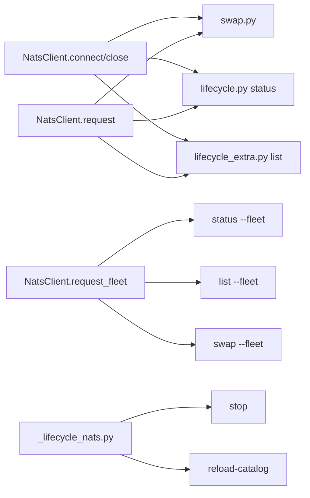

## Context

Derives from [frame #61](../frames/61-fleet-lifecycle-ops-frame.mdx). v1 (#34) shipped single-host lifecycle commands via NATS. `_lifecycle_nats.py` handles single request/response for `stop`, `status`, `list`, `reload-catalog`. `swap.py` duplicates the NATS connect/creds/drain pattern inline in `_swap_via_nats()`. The worker side (`nats/_lifecycle.py`) already supports broadcast — `host=None` or `"*"` causes all workers to reply. The CLI has never sent broadcast requests.

## Goal

Extract `cli/_nats_client.py` as a reusable NATS client helper with fleet broadcast + reply aggregation, then add `--fleet` to `status`, `list`, and `swap`. Single-host default behaviour remains unchanged.

## Users

- **Primary:** llmCLI operators running lifecycle commands across M₁+M₂
- **Secondary:** Future CLI authors adding NATS-backed commands

## Expected Behaviour

### Default (single-host, unchanged)

`llmcli status`, `llmcli list`, `llmcli swap <name>` continue to target `host or socket.gethostname()` via the existing request/reply pattern.

### Fleet mode (new)

| Command | `--fleet` behaviour |
|---------|---------------------|
| `status --fleet` | Broadcast `lyra.llm.lifecycle.status` with `host="*"`. Collect all replies within timeout. Render a Rich table with columns: **host**, **model**, **port**, **vram_used_mb**. Hosts that error are shown in a separate section with `code: message`. |
| `list --fleet` | Broadcast `lyra.llm.lifecycle.list` with `host="*"`. Collect all replies. Merge model lists; each row shows: **name**, **engine**, **vram_gib**, and a per-host running map (host → yes/no). |
| `swap <name> --fleet` | Broadcast `lyra.llm.lifecycle.swap` with `host="*"`. Collect per-host acks. Render per-host results: OK (model, port, vram) or ERROR (code, message). Exit code = 1 if **any** host fails. |

All fleet commands use the same default timeout as their single-host counterparts. The `--timeout` flag controls the **per-request** timeout (how long to wait for the fleet collective reply window).

## Data Model & Consumers

### Core types

```python
class NatsClient:
    """NATS connection + single-host request + fleet broadcast helper."""

    def __init__(self, *, allow_anonymous: bool = False) -> None: ...
    async def connect(self) -> None: ...
    async def request(
        self,
        subject: str,
        op: str,
        host: str | None,
        timeout: float,
        *,
        model_name: str | None = None,
    ) -> LifecycleResponse: ...
    async def request_fleet(
        self,
        subject: str,
        op: str,
        timeout: float,
        *,
        model_name: str | None = None,
    ) -> FleetResult: ...
    async def close(self) -> None: ...

@dataclass
class FleetResult:
    """Aggregated replies from a fleet broadcast."""
    responses: list[LifecycleResponse]   # successful replies
    errors: list[tuple[str, WorkerError]]  # (host, error) pairs
    timeout_reached: bool                # True if we stopped waiting due to timeout
    elapsed_ms: float
```

### Consumer map



| Consumer | Fields consumed | When | Status |
|----------|-----------------|------|--------|
| `swap.py` | `NatsClient` (replaces inline `_swap_via_nats`) | Slice 1 | this issue |
| `lifecycle.py` — `status` | `NatsClient.request` + `request_fleet` | Slice 2 | this issue |
| `lifecycle_extra.py` — `list` | `NatsClient.request` + `request_fleet` | Slice 3 | this issue |
| `lifecycle.py` — `stop` | `_lifecycle_nats.py` (unchanged) | — | out of scope |
| `lifecycle_extra.py` — `reload-catalog` | `_lifecycle_nats.py` (unchanged) | — | out of scope |

## Breadboard

| ID | Affordance | Handler | Data |
|----|------------|---------|------|
| N1 | `NatsClient.__init__(allow_anonymous=False)` | Store flag | — |
| N2 | `NatsClient.connect()` | Read `~/.roxabi/llmcli/nkeys/operator.creds`, `LLMCLI_NATS_URL`, `apply_nats_env_from_config()`, connect with `nkeys_seed_str` + `_inbox.llm-operator` | NATS connection |
| N3 | `NatsClient.request(subject, op, host, timeout, model_name=None)` | Build `LifecycleRequest` with `host=host or socket.gethostname()`, `nc.request()` | `LifecycleResponse` |
| N4 | `NatsClient.request_fleet(subject, op, timeout, model_name=None)` | Build `LifecycleRequest` with `host="*"`, create inbox, subscribe, publish, collect replies until timeout or idle, return `FleetResult` | `FleetResult` |
| N5 | `NatsClient.close()` | `nc.drain()` | — |
| U1 | `swap <name> [--host]` | `NatsClient.request()` | single-host swap |
| U2 | `swap <name> --fleet` | `NatsClient.request_fleet()` | fleet broadcast swap |
| U3 | `status [--host]` | `NatsClient.request()` | single-host status |
| U4 | `status --fleet` | `NatsClient.request_fleet()` → aggregate table | fleet status |
| U5 | `list [--host]` | `NatsClient.request()` | single-host list |
| U6 | `list --fleet` | `NatsClient.request_fleet()` → merge model lists | fleet list |

## Slices

| # | Slice | Files | Demo-able? |
|---|-------|-------|------------|
| 1 | Extract `NatsClient` + migrate `swap.py` | `cli/_nats_client.py` (new), `cli/swap.py` | `swap <name>` still works |
| 2 | `--fleet` on `status` | `cli/lifecycle.py`, `cli/_nats_client.py` | `status --fleet` shows multi-host table |
| 3 | `--fleet` on `list` | `cli/lifecycle_extra.py`, `cli/_nats_client.py` | `list --fleet` shows merged model table |
| 4 | `--fleet` on `swap` | `cli/swap.py`, `cli/_nats_client.py` | `swap <name> --fleet` broadcasts |

## Success Criteria

- [ ] `cli/_nats_client.py` exists with `NatsClient` class providing `connect`, `request`, `request_fleet`, `close`
- [ ] `swap.py` uses `NatsClient` instead of inline `_swap_via_nats`
- [ ] `status --fleet` broadcasts, collects replies, renders per-host table with model/port/vram
- [ ] `list --fleet` broadcasts, collects replies, renders merged model table with per-host running state
- [ ] `swap --fleet` broadcasts, collects per-host acks, renders OK/ERROR per host, exits 1 if any fail
- [ ] Single-host `status`, `list`, `swap` continue to work unchanged (backward-compatible)
- [ ] `stop` and `reload-catalog` remain on `_lifecycle_nats.py` (out of scope, untouched)
- [ ] `--timeout` controls the fleet reply window, not per-worker
- [ ] `--allow-anonymous` flows through `NatsClient` to NATS connect
