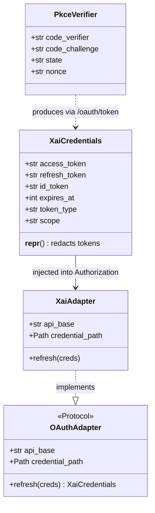
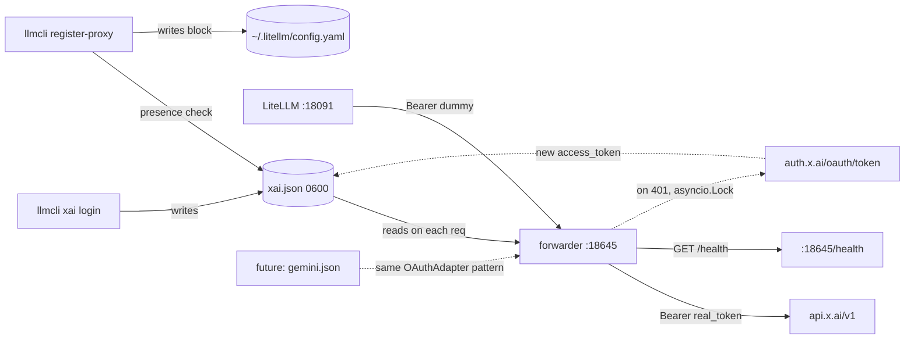

## Context

Source: [frame 99](../frames/99-xai-oauth-proxy-frame.mdx) (approved 2026-05-27). Analysis skipped (F-lite). Issue [#99](https://github.com/Roxabi/llmCLI/issues/99).

Frame conclusions carried in:
- LiteLLM ¬supports OAuth bearer rotation → need sibling forwarder that swaps `Authorization` per request
- Lazy refresh on 401 (¬eager timer)
- M₁ only (24/7 cloud relay)
- Port subset of Hermes (`hermes_cli/auth.py:97-203` + `hermes_cli/proxy/`) — ¬`credential_pool` (single-account)
- New `auth/` + `proxy_forwarder/` packages; the pattern is the **substrate** for future OAuth providers (Gemini, Anthropic Console, Qwen)

### Tier risk note

Computed κ = 5.45 → F-lite (borderline). If `/plan` surfaces unexpected constraints around Podman `rw` credential-mount semantics OR aiohttp streaming behavior under SSE/concurrent-401 load, **escalate to F-full and run `/analyze` before implementation**. Hermes serves as reference but its multi-account `credential_pool` is *not* being ported, so its corresponding test coverage doesn't transfer directly.

## Goal

Add Grok-4 to the llmCLI mesh via SuperGrok OAuth credentials, routed transparently through the existing LiteLLM proxy (`:18091`) using a sibling aiohttp forwarder (`:18645`) that handles lazy token refresh.

## Users

- **Primary:** sole operator consuming Grok-4 from lyra agents + claude-code aliases (`ccl`/`ccp`) through M₁'s LiteLLM proxy.
- **Secondary:** future Roxabi consumers of any OAuth-issued LLM credential — `auth/` and `proxy_forwarder/` are the reusable substrate.

## Expected Behavior

### One-time setup (host-side)

```
$ llmcli xai login
→ Opening browser at https://auth.x.ai/oauth/authorize?...&code_challenge=…&plan=generic
  (loopback listener on 127.0.0.1:56121)
→ [user logs into auth.x.ai with SuperGrok account]
→ Authorization code received, exchanging for tokens…
✓ Logged in. Credentials stored at ~/.roxabi/llmcli/credentials/xai.json
  expires_at: 2026-05-27T15:42:11Z (in 1h)
  refresh_token: stored (long-lived)
```

### Runtime (M₁, always-on)

1. `llmcli-xai-forwarder` Quadlet starts → joins `roxabi.network` → listens on `:18645` (¬published on host LAN)
2. lyra agent / claude-code → `litellm:18091` (`model: grok-4`, `Authorization: Bearer dummy`)
3. LiteLLM routes to `http://llmcli-xai-forwarder:18645/v1/chat/completions`
4. Forwarder: read `xai.json` → swap `Authorization: Bearer <real_token>` → forward body to `api.x.ai/v1/chat/completions`
5. Stream response back through LiteLLM to caller

### Token expiry edges

- **`access_token` expired (~1h):** api.x.ai responds 401 → `lazy_retry_on_401` acquires `_REFRESH_LOCK` → POSTs `auth.x.ai/oauth/token` with `refresh_token` → writes new `access_token` to `xai.json` → retries original request once.
- **Concurrent requests both 401:** module-level `asyncio.Lock` ensures only ONE refresh POST is in-flight; the second handler enters the lock and discovers the refreshed token already on disk (skip POST, retry directly).
- **`refresh_token` expired (>30d offline):** refresh POST fails (4xx) → forwarder propagates 401 + header `X-Llmcli-Reauth: required` → operator re-runs `llmcli xai login`.
- **Credentials file corrupted (mid-write crash):** `store.load()` catches `json.JSONDecodeError` → raises `CredentialsCorruptError` → forwarder `/health` reports `logged_in: false`; request handlers return 503 with `X-Llmcli-Reauth: required`.

### Catalog registration

`llmcli register-proxy` checks `xai.json` presence:
- ∃ → emits Grok models in the managed LiteLLM block pointing at `http://llmcli-xai-forwarder:18645/v1`
- ¬∃ → omits Grok models AND prints `WARNING: xAI credentials not found — run 'llmcli xai login' to enable Grok models` to stderr (discoverability hint)

## Data Model & Consumers

### Data structure



### Consumer map



### Consumer summary

| Consumer | Fields consumed | When | Status |
|---|---|---|---|
| `cli/xai.py:login_cmd` | (writes) XaiCredentials | one-time / on re-auth | this issue |
| `cli/xai.py:status_cmd` | expires_at, scope | on-demand | this issue |
| `proxy_forwarder/_server` health | logged_in, expires_at | systemd HealthCmd + curl | this issue |
| `proxy_forwarder/xai_adapter` | access_token | every forwarded request (re-read per call) | this issue |
| `proxy_forwarder/_common.lazy_retry_on_401` | refresh_token | on 401 from api.x.ai | this issue |
| `cli/proxy.py:register-proxy` | presence (file exists) | catalog reload | this issue |
| Future: Gemini OAuth | analogous fields, different file | next issue | dashed |

## Breadboard

### Affordances

| ID | Element | Handler | Behavior |
|---|---|---|---|
| **N1** | `llmcli xai login` CLI | `cli/xai.py:login_cmd` | Spawns loopback server, opens browser w/ `plan=generic`, exchanges code → writes XaiCredentials |
| **N2** | `llmcli xai logout` CLI | `cli/xai.py:logout_cmd` | Deletes `xai.json` (silent no-op if absent) |
| **N3** | `llmcli xai status` CLI | `cli/xai.py:status_cmd` | Reads `xai.json`; prints `logged_in`, `expires_at`, `scope` — **never prints token material** |
| **U1** | Browser OAuth flow | `auth.x.ai/oauth/authorize` (external) | Redirects to `127.0.0.1:56121/callback?code=…` |
| **U2** | Loopback HTTP listener | `auth/xai_oauth.py:_loopback_server` | `http.server` on `:56121`, single-request, timeout 120s |
| **N4** | Token exchange | `auth/xai_oauth.py:exchange_code` | POST `auth.x.ai/oauth/token` (code + verifier) → XaiCredentials |
| **N5** | Token refresh | `auth/xai_oauth.py:refresh_credentials` | POST `auth.x.ai/oauth/token` (refresh_token) → new access_token |
| **S1** | Credentials store | `auth/store.py:load`, `save` | `~/.roxabi/llmcli/credentials/xai.json` (0600); fcntl flock on save; `load()` raises `CredentialsCorruptError` on `JSONDecodeError` |
| **N6** | Forwarder app (generic) | `proxy_forwarder/_server.py:create_app(adapter)` | aiohttp `web.Application`; accepts an `OAuthAdapter` instance via DI; mounts path allowlist only — unknown paths → 404 |
| **N7** | xAI adapter | `proxy_forwarder/xai_adapter.py:XaiAdapter` | Implements `OAuthAdapter` Protocol: `api_base`, `credential_path`, `refresh(creds)`. Provider-specific endpoint config; **no stage logic** |
| **N8** | Lazy retry-on-401 (generic) | `proxy_forwarder/_common.py:lazy_retry_on_401(request_fn, refresh_fn)` | Async coroutine. Acquires module-level `_REFRESH_LOCK` (asyncio.Lock); on 401 → refresh → store.save → retry once → propagate if still 401 |
| **N9** | Health endpoint | `proxy_forwarder/_server.py:health_handler` | `GET /health` → `{status, logged_in, expires_at}`. Wired to systemd `HealthCmd` |
| **N10** | Quadlet unit | `deploy/quadlet/llmcli-xai-forwarder.container` | `Network=roxabi.network` (no PublishPort); `Volume=…/credentials:rw,Z`; `UserNS=keep-id:uid=1502,gid=1502`; `Image=ghcr.io/roxabi/llmcli:staging` (reuse); `HealthCmd=curl -f http://localhost:18645/health` |
| **N11** | LiteLLM block emission | `support/litellm_config.py:build_model_list` (extended) | Detects `provider.key_env == "_OAUTH_MANAGED"` → gates `api_key` emission, points at `api_base`; single emission path for static + OAuth |
| **N12** | Provider registry entry | `support/providers.py:PROVIDERS["xai-oauth"]` | Sentinel: `Provider("http://llmcli-xai-forwarder:18645/v1", "_OAUTH_MANAGED")` |
| **N13** | install.sh / quadlet.toml | `deploy/install.sh`, `deploy/quadlet.toml` | Adds new unit; `mkdir -p ~/.roxabi/llmcli/credentials && chmod 700`; `[component.xai-forwarder] host_roles=["lyra-hub"]` |

### Wiring (forwarder request path)

```
LiteLLM /v1/chat/completions
  → N6 (_server.create_app handler, dispatched via OAuthAdapter)
    → N8 (lazy_retry_on_401)
      → S1.load() — read XaiCredentials (raises CredentialsCorruptError on bad JSON → 503)
      → swap Authorization header (Bearer <real>)
      → request_fn(adapter.api_base + path) — aiohttp ClientSession.request
      ↳ if response.status == 401:
          → async with _REFRESH_LOCK:
              → S1.load() AGAIN (another handler may have already refreshed)
              → if still expired → adapter.refresh(creds) → S1.save(new) — flock + atomic-ish write
          → retry once
      ↳ return response (or propagated 401 + X-Llmcli-Reauth: required)
```

### Wiring (login flow)

```
llmcli xai login
  → N1 (login_cmd)
    → generate PkceVerifier (verifier, challenge, state, nonce)
    → spawn U2 (_loopback_server on :56121)
    → open browser → U1 (auth.x.ai/oauth/authorize?... &plan=generic &code_challenge=…)
    ↳ wait for /callback?code=...&state=… (timeout 120s)
    → verify state match
    → N4 (exchange_code) — POST auth.x.ai/oauth/token (code + verifier)
    → S1.save(XaiCredentials) — fcntl flock + chmod 0600
    → print expires_at + redacted summary
```

## Slices

> **Split decision:** Evaluated smart-split trigger (15 AC, 5 slices). Slices are sequential with tight state dependencies (each slice consumes artifacts from prior). Single PR retained. **Trigger to split** = if PR review exceeds 3 days, cut at Slice 3/4 boundary.

| # | Goal | Files | Demo |
|---|---|---|---|
| **1. Auth core** | PKCE + token exchange + refresh + store work end-to-end on host (no forwarder) | `src/llmcli/auth/__init__.py`, `auth/xai_oauth.py`, `auth/store.py`, `tests/test_xai_oauth_pkce.py` | `python -c "from llmcli.auth.xai_oauth import login_flow; login_flow()"` → browser → `xai.json` written 0600; pytest green |
| **2. CLI subcommand** | `llmcli xai login`/`logout`/`status` exposed via Typer; reuses slice 1 | `cli/xai.py`, `cli/_app.py` (+2) | `llmcli xai login` → token stored. `llmcli xai status` → `logged_in: true, expires_at: …` |
| **3. Forwarder service** | aiohttp DI'd service forwards `/v1/*` with bearer swap + lazy 401 refresh + concurrent-safe refresh | `proxy_forwarder/__init__.py`, `_server.py`, `_common.py`, `xai_adapter.py` | `curl :18645/v1/chat/completions -H "Authorization: Bearer dummy" -d '{"model":"grok-4",…}'` → Grok response |
| **4. LiteLLM integration** | `build_model_list` extended for `_OAUTH_MANAGED` sentinel; `register-proxy` emits xAI block + WARNING hint | `support/providers.py` (+1), `support/litellm_config.py` (~+10) | `llmcli register-proxy` adds managed Grok block; `curl :18091/v1/chat/completions -d '{"model":"grok-4",…}'` works end-to-end |
| **5. Quadlet deploy** | Forwarder runs as Quadlet on M₁; survives restart; reachable on `roxabi.network` | `deploy/quadlet/llmcli-xai-forwarder.container`, `deploy/quadlet.toml` (+component), `deploy/install.sh` (+unit, +mkdir creds), `docs/QUADLET-DEPLOYMENT.md` (+section) | `systemctl --user start llmcli-xai-forwarder`; from inside `llmcli` container: `curl http://llmcli-xai-forwarder:18645/health` → 200 |

## Success Criteria

> **Operator-observable** — each item is binary AND visible without reading source.

- [ ] `llmcli xai login` opens browser, completes PKCE flow on `127.0.0.1:56121` (authorize URL includes `plan=generic`), stores credentials at `~/.roxabi/llmcli/credentials/xai.json` with mode `0600` and dir mode `0700`
- [ ] `llmcli xai logout` deletes `xai.json` (silent no-op if absent)
- [ ] `llmcli xai status` reports `logged_in: true` + `expires_at` (ISO 8601) + `scope` when credentials exist; `logged_in: false` otherwise — **stdout contains no `eyJ` (JWT prefix) or `xai-` token substring**
- [ ] `llmcli-xai-forwarder` Quadlet installs via `deploy/install.sh` (idempotent), starts via `systemctl --user start llmcli-xai-forwarder`, joins `roxabi.network`
- [ ] Forwarder listens on `:18645` (¬published on host LAN — `ss -tlnp | grep 18645` returns nothing on host) and accepts allowed paths only: `/v1/chat/completions`, `/v1/completions`, `/v1/responses`, `/v1/embeddings`, `/v1/models`, `/health` (any other path → 404)
- [ ] Forwarder replaces incoming `Authorization: Bearer *` with real OAuth token from `xai.json` and forwards body verbatim
- [ ] On 401 from `api.x.ai`, forwarder calls `auth.x.ai/oauth/token` with `refresh_token`, persists new `access_token` to `xai.json`, retries the original request **once**; if retry still 401, propagates 401 + header `X-Llmcli-Reauth: required`
- [ ] Concurrent 401s on the same expired token result in **exactly one** refresh POST to `auth.x.ai` (verified by counting POSTs in test with `aioresponses`)
- [ ] `GET http://llmcli-xai-forwarder:18645/health` returns 200 with body `{status:"ok", logged_in:bool, expires_at:int}` after Quadlet restart (`systemctl --user restart llmcli-xai-forwarder` → `curl /health` within 15s succeeds)
- [ ] `llmcli register-proxy` emits a managed LiteLLM block containing Grok models (`grok-4`, `grok-4-fast` — hardcoded `_XAI_OAUTH_MODELS` constant) pointing at `http://llmcli-xai-forwarder:18645/v1` when `xai.json` exists; **removes** the block when absent AND prints `WARNING: xAI credentials not found — run 'llmcli xai login' to enable Grok models` to stderr
- [ ] LiteLLM at `:18091` routes `grok-4` end-to-end: `curl http://localhost:18091/v1/chat/completions -H "Authorization: Bearer dummy" -d '{"model":"grok-4","messages":[{"role":"user","content":"ping"}]}'` returns a 200 with a non-empty `choices[0].message.content`
- [ ] `llmcli list` shows Grok models when `xai.json` exists, hides them when absent
- [ ] After 100 forwarded requests + 1 refresh, `journalctl --user -u llmcli-xai-forwarder --since "1 hour ago" | grep -E 'eyJ[A-Za-z0-9_-]+\.[A-Za-z0-9_-]+'` returns 0 matches (no JWT material logged)
- [ ] `XaiCredentials.__repr__()` returns `XaiCredentials(access_token=***, refresh_token=***, expires_at=…, scope=…)` — covered by unit test
- [ ] `docs/QUADLET-DEPLOYMENT.md` includes a "xAI OAuth setup" runbook (login, status, logout, refresh expiry, secret rotation)

### Test-only (not operator-observable)

- [ ] Unit `tests/test_xai_oauth_pkce.py::test_pkce_code_exchange` — mocks `auth.x.ai`, asserts verifier/challenge/state/nonce + `plan=generic` in request
- [ ] Unit `tests/test_xai_oauth_pkce.py::test_lazy_refresh_on_401` — mocked `api.x.ai`; asserts retry-once semantics + X-Llmcli-Reauth header on second 401
- [ ] Unit `tests/test_xai_oauth_pkce.py::test_concurrent_refresh_dedup` — 5 concurrent 401 handlers → asserts exactly 1 refresh POST
- [ ] Unit `tests/test_xai_oauth_pkce.py::test_credentials_corrupted` — write partial JSON to `xai.json` → `store.load()` raises `CredentialsCorruptError`; forwarder `/health` shows `logged_in: false`

## Implementation Notes (carry forward to /plan)

- **PKCE authorize URL:** `plan=generic` parameter is **load-bearing** (Hermes `auth.py:6383-6392`); without it `accounts.x.ai` rejects loopback OAuth from non-allowlisted clients.
- **`store.load()` corrupt-creds:** catch `json.JSONDecodeError`, raise domain-specific `CredentialsCorruptError("credentials corrupted, re-run llmcli xai login")`. Forwarder maps it to 503 + `X-Llmcli-Reauth: required`.
- **Refresh mutex:** module-level `_REFRESH_LOCK = asyncio.Lock()` in `proxy_forwarder/_common.py`. Pattern: `async with _REFRESH_LOCK:` → re-read creds → only refresh if still expired (other handler may have already refreshed). Protects single-use refresh tokens.
- **Logging redaction:** `XaiCredentials.__repr__` and `__str__` mask `access_token` + `refresh_token` + `id_token` to `***`. The journalctl AC is the operator-observable enforcement; the `__repr__` AC is the architectural enforcement.
- **`build_model_list` extension:** detect `provider.key_env == "_OAUTH_MANAGED"` → emit `api_base` + `api_key: "dummy"` (LiteLLM requires some value; the forwarder ignores it). Single emission path; no parallel `_xai_oauth_block` function.

## Revisit Triggers (axial discipline)

**When a 2nd OAuth provider arrives (Gemini, Anthropic Console, Qwen) — BEFORE shipping it:**

1. Extract `auth/_common.py` with 5 OAuth primitives (`pkce_generate`, `loopback_callback`, `exchange_code`, `refresh_credentials`, parameterized by a `ProviderConfig` dataclass). `auth/xai_oauth.py` then becomes ≤30 LOC supplying only xAI-specific endpoints + PKCE params.
2. Consider collapsing per-provider Quadlets into a single `llmcli-oauth-forwarder` mounting adapters on path prefixes (`/xai/v1/*`, `/gemini/v1/*`, …). Single port, single Quadlet, single install.sh entry. LiteLLM `api_base` changes to `http://llmcli-oauth-forwarder:18645/xai/v1`.
3. Update ADR-006 with the OAuth-providers sub-axis decision.

**Why now (not in #99):** for 1 provider the abstraction is premature. The DI'd `OAuthAdapter` Protocol in N6/N7/N8 already keeps stage logic (`_server.py`, `_common.py`) provider-agnostic — the second provider only needs to add its adapter file. The `_common.py` extraction in `auth/` becomes payoff-positive at N=2.
