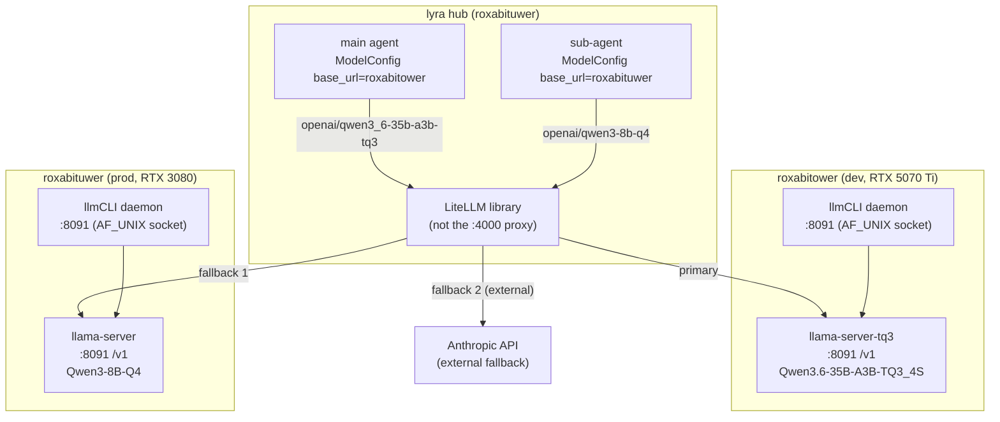

# Lyra Integration via LiteLLM

## Status

The llmCLI side of this integration is complete (Slice V6, T6.1). The lyra-side changes —
`ModelConfig` support for OpenAI-compatible backends — are tracked in
[Roxabi/lyra#665](https://github.com/Roxabi/lyra/issues/665). **This integration is
blocked on that PR landing.** The validation section at the bottom of this document will be
filled in once lyra#665 ships.

---

## Architecture



lyra uses LiteLLM **as a library** (`import litellm`), not via the `:4000` LiteLLM proxy
that claude-code uses. Each agent receives a `ModelConfig` at init time. LiteLLM's native
`fallbacks` list handles automatic degrade when a host is unreachable — no custom retry
logic needed in lyra.

---

## What llmCLI Is (and Is Not) to Lyra

lyra does **not** import llmCLI as a Python package. There is no `pip install llmcli`
or `uv` source dep in lyra's `pyproject.toml`. llmCLI is a **service** — lyra talks to it
over HTTP (OpenAI-compatible `/v1` endpoint). The relationship is the same as lyra's
relationship to voiceCLI's TTS server: a long-running process on the LAN that lyra calls
via an HTTP client.

Other lyra dependencies (`voicecli`, `roxabi-vault`) are installed from GitHub sources in
`lyra/pyproject.toml` — llmCLI does not follow this pattern.

---

## Environment Setup

### 1. LLMCLI_API_KEY

`LLMCLI_API_KEY` must be present in lyra's runtime environment. It is the bearer token
that `llama-server` validates on each request.

**Local dev (`roxabitower`):** add to `~/projects/lyra/.env`:

```bash
# ~/projects/lyra/.env
LLMCLI_API_KEY=$(cat ~/.roxabi/llmcli/api_key)
```

**Prod (`roxabituwer`):** add to the supervisor env block in
`~/projects/lyra/deploy/supervisor/conf.d/lyra_hub.conf`:

```ini
environment =
    LLMCLI_API_KEY="%(ENV_LLMCLI_API_KEY)s",
    ...other vars...
```

Then set the var in `~/projects/lyra/.env` on prod (sourced by `run_*.sh` wrappers):

```bash
LLMCLI_API_KEY=<the-same-key-in-~/.roxabi/llmcli/api_key>
```

The key value on both hosts must match the key that `llmcli serve` is configured to
accept (`LLMCLI_API_KEY` in the llmCLI catalog's `api_key_env` field).

### 2. llmCLI must be running

lyra makes no attempt to start llmCLI. Ensure the daemon is up before starting lyra:

```bash
# Local
make llm          # starts llmcli_serve via supervisor

# Prod — started automatically by lyra.service linger (autostart=true)
make remote status
```

---

## Per-Agent Routing

Each lyra agent specifies its preferred model via `ModelConfig`. The `base_url` field
selects which host serves the request. `model` uses the `openai/` prefix so LiteLLM
treats the endpoint as an OpenAI-compatible server.

### Example 1: main agent on local (heavy model)

```python
# lyra/.../agents/main_agent.py
from lyra.config import ModelConfig

config = ModelConfig(
    backend="litellm",
    model="openai/qwen3_6-35b-a3b-tq3",
    base_url="http://roxabitower.lan:8091/v1",
    api_key=os.environ["LLMCLI_API_KEY"],
)
```

This routes to the TurboQuant `llama-server-tq3` instance on `roxabitower` serving
`Qwen3.6-35B-A3B-TQ3_4S` (12.4 GiB VRAM). Use for tasks that benefit from the larger
reasoning budget — code, planning, multi-step chains.

### Example 2: lightweight sub-agent on prod

```python
# lyra/.../agents/classifier.py
config = ModelConfig(
    backend="litellm",
    model="openai/qwen3-8b-q4",
    base_url="http://roxabituwer.lan:8091/v1",
    api_key=os.environ["LLMCLI_API_KEY"],
)
```

This routes to the vanilla `llama-server` on `roxabituwer` serving `Qwen3-8B-Q4` (6 GiB
VRAM). Use for classification, intent detection, and fast routing tasks that do not need
the 35B model.

### Example 3: fallback chain (local → prod → Anthropic)

```python
# lyra/.../agents/resilient_agent.py
config = ModelConfig(
    backend="litellm",
    model="openai/qwen3_6-35b-a3b-tq3",
    base_url="http://roxabitower.lan:8091/v1",
    api_key=os.environ["LLMCLI_API_KEY"],
    fallbacks=[
        {
            "model": "openai/qwen3-8b-q4",
            "base_url": "http://roxabituwer.lan:8091/v1",
            "api_key": os.environ["LLMCLI_API_KEY"],
        },
        {
            "model": "claude-3-5-haiku-20241022",
            "api_key": os.environ["ANTHROPIC_API_KEY"],
        },
    ],
)
```

LiteLLM's native fallback list activates when the primary returns a connection error or
5xx. The order is: local heavy model → prod small model → Anthropic hosted (external).
No lyra code changes are needed when the local host is off — LiteLLM handles degrade
transparently.

---

## Fallback Configuration

The `fallbacks` parameter follows LiteLLM's standard format. Each entry is a dict with
the same fields as the primary `ModelConfig`. LiteLLM retries in order on:

- `openai.APIConnectionError` (host unreachable)
- `openai.APIStatusError` with status 5xx

It does **not** fall back on 4xx errors (bad request, auth failure) — those surface
immediately.

Pattern for prod-always-on lyra deployments:

```python
fallbacks=[
    # Fallback 1: prod small model (always-on, auto-restart via supervisor)
    {
        "model": "openai/qwen3-8b-q4",
        "base_url": "http://roxabituwer.lan:8091/v1",
        "api_key": os.environ["LLMCLI_API_KEY"],
    },
    # Fallback 2: Anthropic external (billing, but never unreachable)
    {
        "model": "claude-3-5-haiku-20241022",
        "api_key": os.environ["ANTHROPIC_API_KEY"],
    },
]
```

Remove the Anthropic fallback if you want hard failures when both local hosts are off
(useful during testing to detect misconfiguration early).

---

## Agent Routing Table

| Agent | Primary model | Primary host | Fallback 1 | Fallback 2 |
|---|---|---|---|---|
| `main` (planning, code) | `qwen3_6-35b-a3b-tq3` | `roxabitower.lan:8091` | `qwen3-8b-q4` (prod) | Anthropic |
| `telegram_adapter` | `qwen3-8b-q4` | `roxabituwer.lan:8091` | Anthropic | — |
| `discord_adapter` | `qwen3-8b-q4` | `roxabituwer.lan:8091` | Anthropic | — |
| `classifier` / routing | `qwen3-8b-q4` | `roxabituwer.lan:8091` | — | — |
| `memory_writer` | `qwen3_6-35b-a3b-tq3` | `roxabitower.lan:8091` | `qwen3-8b-q4` (prod) | — |

The table above reflects the intended routing once lyra#665 lands. Adapter agents run on
prod and are served by the always-on prod model; the main reasoning agent prefers the
local heavy model with a prod fallback.

---

## Environment Variables Reference

| Variable | Required | Where set | Description |
|---|---|---|---|
| `LLMCLI_API_KEY` | Yes | `lyra/.env`, supervisor env | Bearer token for llama-server auth |
| `ANTHROPIC_API_KEY` | Yes (if Anthropic fallback) | `lyra/.env`, supervisor env | Anthropic hosted fallback |

Both vars are loaded by the supervisor wrapper (`run_hub.sh` sources `~/projects/lyra/.env`).
Neither is committed to the repo — managed via `.env` files and supervisor env blocks.

---

## Validation (TODO: fill in after lyra#665)

> This section is a placeholder. It will be filled in when [lyra#665](https://github.com/Roxabi/lyra/issues/665) ships and the
> integration can be demonstrated end-to-end.

Expected test sequence (T6.2 sentinel):

```bash
# With roxabitower serving:
cd ~/projects/lyra
uv run pytest tests/test_llmcli_agent.py -v

# With roxabitower offline (local serve stopped):
make llm stop     # on roxabitower
uv run pytest tests/test_llmcli_agent.py -v   # expect fallback path to prod
```

Both runs should exit 0 with no ERROR-level log lines.

---

## Cross-References

- [Deployment runbook](./deployment.md) — bring up llmCLI on prod, register with supervisor
- [Claude Code aliases](./claude-code-aliases.md) — the proxy-based path used by claude-code (distinct from this library path)
